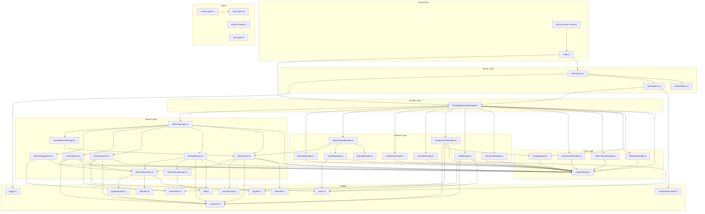

# Dependency Graph

> **Version**: 0.47.0
> **Generated**: 2024-12-01
> **Total Files Analyzed**: 37 source files

This document provides a comprehensive dependency graph for the Memory MCP Server codebase, tracing all imports, exports, function calls, and variable dependencies across all modules.

---

## Table of Contents

1. [Architecture Overview](#1-architecture-overview)
2. [Module Dependency Matrix](#2-module-dependency-matrix)
3. [Entry Point Analysis](#3-entry-point-analysis)
4. [Core Module Dependencies](#4-core-module-dependencies)
5. [Feature Module Dependencies](#5-feature-module-dependencies)
6. [Search Module Dependencies](#6-search-module-dependencies)
7. [Server Module Dependencies](#7-server-module-dependencies)
8. [Types Module Dependencies](#8-types-module-dependencies)
9. [Utils Module Dependencies](#9-utils-module-dependencies)
10. [Cross-Module Function Calls](#10-cross-module-function-calls)
11. [Shared Variable Dependencies](#11-shared-variable-dependencies)
12. [Dependency Visualization](#12-dependency-visualization)
13. [Circular Dependency Analysis](#13-circular-dependency-analysis)

---

## 1. Architecture Overview

### Layer Hierarchy

```
┌─────────────────────────────────────────────────────────────────┐
│                    LAYER 1: ENTRY POINTS                        │
│  index.ts → Exports all public APIs                             │
│  bin/mcp-server-memory → CLI entry point                        │
└───────────────────────────┬─────────────────────────────────────┘
                            │
┌───────────────────────────▼─────────────────────────────────────┐
│                    LAYER 2: SERVER                              │
│  MCPServer.ts ─────► toolDefinitions.ts                         │
│                ─────► toolHandlers.ts                           │
└───────────────────────────┬─────────────────────────────────────┘
                            │
┌───────────────────────────▼─────────────────────────────────────┐
│                    LAYER 3: FACADE                              │
│  KnowledgeGraphManager.ts (orchestrates all managers)           │
└───────────────────────────┬─────────────────────────────────────┘
                            │
       ┌────────────────────┼────────────────────┐
       │                    │                    │
┌──────▼──────┐     ┌───────▼──────┐     ┌──────▼──────┐
│    CORE     │     │   FEATURES   │     │   SEARCH    │
│  Managers   │     │   Managers   │     │   Engines   │
└──────┬──────┘     └───────┬──────┘     └──────┬──────┘
       │                    │                    │
┌──────▼────────────────────▼────────────────────▼────────────────┐
│                    LAYER 4: STORAGE                             │
│  GraphStorage.ts (JSONL file I/O + caching)                     │
└───────────────────────────┬─────────────────────────────────────┘
                            │
┌───────────────────────────▼─────────────────────────────────────┐
│                    LAYER 5: FOUNDATION                          │
│  types/ (Entity, Relation, KnowledgeGraph, etc.)                │
│  utils/ (errors, constants, algorithms, helpers)                │
└─────────────────────────────────────────────────────────────────┘
```

### Module Categories

| Category | Files | Purpose |
|----------|-------|---------|
| **core/** | 6 | Core graph operations (entities, relations, observations, storage) |
| **features/** | 9 | Advanced features (hierarchy, tags, compression, import/export) |
| **search/** | 8 | Search algorithms (basic, ranked, boolean, fuzzy, saved) |
| **server/** | 3 | MCP protocol layer (tool definitions, handlers) |
| **types/** | 4 | TypeScript type definitions |
| **utils/** | 11 | Utility functions (algorithms, helpers, constants) |

---

## 2. Module Dependency Matrix

### Import Dependencies by Module

| Source Module | Imports From |
|---------------|--------------|
| `index.ts` | core/index, features/index, search/index, server/index, types/index |
| `core/KnowledgeGraphManager.ts` | types/index, core/GraphStorage, core/EntityManager, core/RelationManager, core/ObservationManager, core/TransactionManager, features/*, search/SearchManager |
| `core/EntityManager.ts` | types/index, core/GraphStorage |
| `core/RelationManager.ts` | types/index, core/GraphStorage |
| `core/ObservationManager.ts` | types/index, core/GraphStorage |
| `core/GraphStorage.ts` | types/index, fs/promises, path |
| `core/TransactionManager.ts` | types/index, core/GraphStorage |
| `server/MCPServer.ts` | @modelcontextprotocol/sdk, utils/logger, server/toolDefinitions, server/toolHandlers, index (KnowledgeGraphManager type) |
| `server/toolHandlers.ts` | utils/responseFormatter, index (KnowledgeGraphManager type), types/index |
| `search/SearchManager.ts` | types/index, core/GraphStorage, search/BasicSearch, search/RankedSearch, search/BooleanSearch, search/FuzzySearch, search/SearchSuggestions, search/SavedSearchManager |

---

## 3. Entry Point Analysis

### Main Entry: `src/memory/index.ts`

```
index.ts
├── Exports from core/index.ts
│   ├── KnowledgeGraphManager (class)
│   ├── GraphStorage (class)
│   ├── EntityManager (class)
│   ├── RelationManager (class)
│   ├── ObservationManager (class)
│   └── TransactionManager (class)
├── Exports from features/index.ts
│   ├── HierarchyManager (class)
│   ├── TagManager (class)
│   ├── CompressionManager (class)
│   ├── ArchiveManager (class)
│   ├── AnalyticsManager (class)
│   ├── ExportManager (class)
│   ├── ImportManager (class)
│   ├── ImportExportManager (class)
│   └── BackupManager (class)
├── Exports from search/index.ts
│   ├── SearchManager (class)
│   ├── BasicSearch (class)
│   ├── RankedSearch (class)
│   ├── BooleanSearch (class)
│   ├── FuzzySearch (class)
│   ├── SavedSearchManager (class)
│   ├── SearchSuggestions (class)
│   ├── TFIDFIndexManager (class)
│   └── SearchFilterChain (class)
├── Exports from server/index.ts
│   ├── MCPServer (class)
│   ├── toolDefinitions (array)
│   ├── toolHandlers (record)
│   └── handleToolCall (function)
├── Exports from types/index.ts
│   └── [All type definitions]
└── Creates and starts MCPServer instance
```

---

## 4. Core Module Dependencies

### 4.1 KnowledgeGraphManager.ts

**Role**: Central facade that orchestrates all manager classes

**File**: `src/memory/core/KnowledgeGraphManager.ts`

#### Import Dependencies

```typescript
import type { KnowledgeGraph, Entity, Relation, ... } from '../types/index.js';
import { GraphStorage } from './GraphStorage.js';
import { EntityManager } from './EntityManager.js';
import { RelationManager } from './RelationManager.js';
import { ObservationManager } from './ObservationManager.js';
import { TransactionManager } from './TransactionManager.js';
import { HierarchyManager } from '../features/HierarchyManager.js';
import { TagManager } from '../features/TagManager.js';
import { CompressionManager } from '../features/CompressionManager.js';
import { ArchiveManager } from '../features/ArchiveManager.js';
import { AnalyticsManager } from '../features/AnalyticsManager.js';
import { ExportManager } from '../features/ExportManager.js';
import { ImportManager } from '../features/ImportManager.js';
import { ImportExportManager } from '../features/ImportExportManager.js';
import { BackupManager } from '../features/BackupManager.js';
import { SearchManager } from '../search/SearchManager.js';
```

#### Dependency Graph

```
KnowledgeGraphManager
├── GraphStorage (injected, shared with all managers)
├── Core Managers
│   ├── EntityManager ───────► GraphStorage
│   ├── RelationManager ─────► GraphStorage
│   ├── ObservationManager ──► GraphStorage
│   └── TransactionManager ──► GraphStorage
├── Feature Managers
│   ├── HierarchyManager ────► GraphStorage
│   ├── TagManager ──────────► GraphStorage
│   ├── CompressionManager ──► GraphStorage, EntityManager
│   ├── ArchiveManager ──────► GraphStorage
│   ├── AnalyticsManager ────► GraphStorage
│   ├── ExportManager ───────► (stateless)
│   ├── ImportManager ───────► GraphStorage
│   ├── ImportExportManager ─► ExportManager, ImportManager, BasicSearch
│   └── BackupManager ───────► GraphStorage
└── Search Manager
    └── SearchManager ───────► GraphStorage
```

#### Public Methods (delegated to managers)

| Method | Delegates To | Called From |
|--------|-------------|-------------|
| `createEntities()` | EntityManager | toolHandlers.ts |
| `deleteEntities()` | EntityManager | toolHandlers.ts |
| `readGraph()` | GraphStorage | toolHandlers.ts |
| `createRelations()` | RelationManager | toolHandlers.ts |
| `deleteRelations()` | RelationManager | toolHandlers.ts |
| `addObservations()` | ObservationManager | toolHandlers.ts |
| `deleteObservations()` | ObservationManager | toolHandlers.ts |
| `searchNodes()` | SearchManager | toolHandlers.ts |
| `setEntityParent()` | HierarchyManager | toolHandlers.ts |
| `addTags()` | TagManager | toolHandlers.ts |
| `findDuplicates()` | CompressionManager | toolHandlers.ts |
| `exportGraph()` | ImportExportManager | toolHandlers.ts |

### 4.2 GraphStorage.ts

**Role**: JSONL file I/O with in-memory caching

**File**: `src/memory/core/GraphStorage.ts`

#### Import Dependencies

```typescript
import * as fs from 'fs/promises';
import * as path from 'path';
import type { Entity, Relation, KnowledgeGraph } from '../types/index.js';
```

#### Exported Functions/Methods

| Export | Type | Used By |
|--------|------|---------|
| `GraphStorage` | class | KnowledgeGraphManager, all managers |
| `loadGraph()` | method | All managers that read data |
| `saveGraph()` | method | EntityManager, RelationManager, etc. |
| `invalidateCache()` | method | After write operations |

#### Usage Pattern

```
┌─────────────────────┐
│ KnowledgeGraphManager│
└──────────┬──────────┘
           │ creates
           ▼
┌─────────────────────┐
│    GraphStorage     │◄────── Shared instance
└──────────┬──────────┘
           │ passed to
    ┌──────┴──────┬──────────┬───────────┐
    ▼             ▼          ▼           ▼
EntityManager  RelationManager  SearchManager  HierarchyManager
```

### 4.3 EntityManager.ts

**File**: `src/memory/core/EntityManager.ts`

#### Import Dependencies

```typescript
import type { Entity, KnowledgeGraph, CreateEntityInput } from '../types/index.js';
import type { GraphStorage } from './GraphStorage.js';
```

#### Methods and Dependencies

| Method | Internal Calls | External Calls |
|--------|----------------|----------------|
| `createEntities()` | validateEntities | GraphStorage.loadGraph, GraphStorage.saveGraph |
| `deleteEntities()` | - | GraphStorage.loadGraph, GraphStorage.saveGraph |
| `updateEntity()` | - | GraphStorage.loadGraph, GraphStorage.saveGraph |
| `getEntity()` | - | GraphStorage.loadGraph |

### 4.4 RelationManager.ts

**File**: `src/memory/core/RelationManager.ts`

#### Import Dependencies

```typescript
import type { Relation, KnowledgeGraph, CreateRelationInput } from '../types/index.js';
import type { GraphStorage } from './GraphStorage.js';
```

#### Methods and Dependencies

| Method | Internal Calls | External Calls |
|--------|----------------|----------------|
| `createRelations()` | validateRelations | GraphStorage.loadGraph, GraphStorage.saveGraph |
| `deleteRelations()` | - | GraphStorage.loadGraph, GraphStorage.saveGraph |

### 4.5 ObservationManager.ts

**File**: `src/memory/core/ObservationManager.ts`

#### Import Dependencies

```typescript
import type { Entity, AddObservationInput, DeleteObservationInput } from '../types/index.js';
import type { GraphStorage } from './GraphStorage.js';
```

### 4.6 TransactionManager.ts

**File**: `src/memory/core/TransactionManager.ts`

#### Import Dependencies

```typescript
import type { KnowledgeGraph } from '../types/index.js';
import type { GraphStorage } from './GraphStorage.js';
```

---

## 5. Feature Module Dependencies

### 5.1 HierarchyManager.ts

**File**: `src/memory/features/HierarchyManager.ts`

#### Import Dependencies

```typescript
import type { Entity, KnowledgeGraph } from '../types/index.js';
import type { GraphStorage } from '../core/GraphStorage.js';
import { CycleDetectedError, EntityNotFoundError } from '../utils/errors.js';
```

#### Methods

| Method | Returns | Modifies Graph |
|--------|---------|----------------|
| `setEntityParent()` | Entity | Yes |
| `getChildren()` | Entity[] | No |
| `getParent()` | Entity \| null | No |
| `getAncestors()` | Entity[] | No |
| `getDescendants()` | Entity[] | No |
| `getSubtree()` | KnowledgeGraph | No |
| `getRootEntities()` | Entity[] | No |
| `getEntityDepth()` | number | No |
| `moveEntity()` | Entity | Yes |

### 5.2 TagManager.ts

**File**: `src/memory/features/TagManager.ts`

#### Import Dependencies

```typescript
import * as fs from 'fs/promises';
import type { Entity, TagAlias } from '../types/index.js';
import type { GraphStorage } from '../core/GraphStorage.js';
import { EntityNotFoundError, InvalidImportanceError } from '../utils/errors.js';
import { IMPORTANCE_RANGE } from '../utils/constants.js';
import { addUniqueTags, removeTags as removeTagsFromArray } from '../utils/tagUtils.js';
```

#### Methods

| Method | Calls Utils |
|--------|-------------|
| `addTags()` | `addUniqueTags()` from tagUtils |
| `removeTags()` | `removeTagsFromArray()` from tagUtils |
| `setImportance()` | Validates against `IMPORTANCE_RANGE` |
| `resolveTag()` | - |
| `addTagAlias()` | - |

### 5.3 CompressionManager.ts

**File**: `src/memory/features/CompressionManager.ts`

#### Import Dependencies

```typescript
import type { Entity, Relation, KnowledgeGraph, DuplicateGroup, MergeResult, CompressionResult } from '../types/index.js';
import type { GraphStorage } from '../core/GraphStorage.js';
import type { EntityManager } from '../core/EntityManager.js';
import { levenshteinDistance } from '../utils/levenshtein.js';
import { SIMILARITY_WEIGHTS, DEFAULT_DUPLICATE_THRESHOLD } from '../utils/constants.js';
```

#### Methods and Algorithm Usage

| Method | Uses Algorithm |
|--------|----------------|
| `findDuplicates()` | `levenshteinDistance()` for name similarity |
| `calculateSimilarity()` | Jaccard similarity for observations/tags |
| `mergeEntities()` | - |
| `compressGraph()` | `findDuplicates()` + `mergeEntities()` |

### 5.4 AnalyticsManager.ts

**File**: `src/memory/features/AnalyticsManager.ts`

#### Import Dependencies

```typescript
import type { KnowledgeGraph, GraphStats, ValidationResult } from '../types/index.js';
import type { GraphStorage } from '../core/GraphStorage.js';
```

### 5.5 ExportManager.ts

**File**: `src/memory/features/ExportManager.ts`

#### Export Formats

| Format | Method |
|--------|--------|
| JSON | `exportToJSON()` |
| CSV | `exportToCSV()` |
| GraphML | `exportToGraphML()` |
| GEXF | `exportToGEXF()` |
| DOT | `exportToDOT()` |
| Markdown | `exportToMarkdown()` |
| Mermaid | `exportToMermaid()` |

### 5.6 ImportManager.ts

**File**: `src/memory/features/ImportManager.ts`

#### Import Dependencies

```typescript
import type { KnowledgeGraph, Entity, Relation, ImportResult } from '../types/index.js';
import type { GraphStorage } from '../core/GraphStorage.js';
import { ImportError } from '../utils/errors.js';
```

### 5.7 ImportExportManager.ts

**File**: `src/memory/features/ImportExportManager.ts`

#### Import Dependencies

```typescript
import type { KnowledgeGraph, ImportResult } from '../types/index.js';
import type { BasicSearch } from '../search/BasicSearch.js';
import { ExportManager, type ExportFormat } from './ExportManager.js';
import { ImportManager, type ImportFormat, type MergeStrategy } from './ImportManager.js';
```

#### Cross-Module Dependencies

```
ImportExportManager
├── ExportManager (injected)
├── ImportManager (injected)
└── BasicSearch (injected) ──► Used for filtered exports
```

### 5.8 ArchiveManager.ts

**File**: `src/memory/features/ArchiveManager.ts`

#### Import Dependencies

```typescript
import type { Entity, Relation, KnowledgeGraph, ArchiveResult, ArchiveCriteria } from '../types/index.js';
import type { GraphStorage } from '../core/GraphStorage.js';
```

### 5.9 BackupManager.ts

**File**: `src/memory/features/BackupManager.ts`

#### Import Dependencies

```typescript
import * as fs from 'fs/promises';
import * as path from 'path';
import type { GraphStorage } from '../core/GraphStorage.js';
```

---

## 6. Search Module Dependencies

### 6.1 SearchManager.ts

**Role**: Orchestrates all search types

**File**: `src/memory/search/SearchManager.ts`

#### Import Dependencies

```typescript
import type { KnowledgeGraph, SearchResult, SavedSearch } from '../types/index.js';
import type { GraphStorage } from '../core/GraphStorage.js';
import { BasicSearch } from './BasicSearch.js';
import { RankedSearch } from './RankedSearch.js';
import { BooleanSearch } from './BooleanSearch.js';
import { FuzzySearch } from './FuzzySearch.js';
import { SearchSuggestions } from './SearchSuggestions.js';
import { SavedSearchManager } from './SavedSearchManager.js';
```

#### Internal Dependency Graph

```
SearchManager
├── BasicSearch ─────────► GraphStorage
│                        ► SearchFilterChain
│                        ► utils/dateUtils
│                        ► utils/searchCache
├── RankedSearch ────────► GraphStorage
│                        ► TFIDFIndexManager
│                        ► SearchFilterChain
│                        ► utils/tfidf
├── BooleanSearch ───────► GraphStorage
│                        ► SearchFilterChain
│                        ► utils/errors
├── FuzzySearch ─────────► GraphStorage
│                        ► SearchFilterChain
│                        ► utils/levenshtein
├── SearchSuggestions ───► GraphStorage
│                        ► utils/levenshtein
└── SavedSearchManager ──► BasicSearch
                         ► fs/promises
```

### 6.2 BasicSearch.ts

**File**: `src/memory/search/BasicSearch.ts`

#### Import Dependencies

```typescript
import type { KnowledgeGraph } from '../types/index.js';
import type { GraphStorage } from '../core/GraphStorage.js';
import { isWithinDateRange } from '../utils/dateUtils.js';
import { SEARCH_LIMITS } from '../utils/constants.js';
import { searchCaches } from '../utils/searchCache.js';
import { SearchFilterChain, type SearchFilters } from './SearchFilterChain.js';
```

#### Cache Integration

```
BasicSearch.searchNodes()
├── Check searchCaches.basic.get(cacheKey)
├── If miss: Execute search
│   ├── Load graph from GraphStorage
│   ├── Filter by text match
│   ├── Apply SearchFilterChain.applyFilters()
│   └── Apply SearchFilterChain.paginate()
└── Cache result via searchCaches.basic.set()
```

### 6.3 RankedSearch.ts

**File**: `src/memory/search/RankedSearch.ts`

#### Import Dependencies

```typescript
import type { SearchResult, TFIDFIndex } from '../types/index.js';
import type { GraphStorage } from '../core/GraphStorage.js';
import { calculateTFIDF, tokenize } from '../utils/tfidf.js';
import { SEARCH_LIMITS } from '../utils/constants.js';
import { TFIDFIndexManager } from './TFIDFIndexManager.js';
import { SearchFilterChain, type SearchFilters } from './SearchFilterChain.js';
```

#### Algorithm Flow

```
RankedSearch.searchNodesRanked()
├── Apply SearchFilterChain.applyFilters()
├── Load/Build TF-IDF index
│   ├── If TFIDFIndexManager has index ──► Fast path
│   └── Else ──► Calculate on-the-fly
├── For each entity:
│   ├── tokenize(query)
│   ├── Calculate TF-IDF score
│   └── Track matched fields
├── Sort by score descending
└── Apply limit
```

### 6.4 BooleanSearch.ts

**File**: `src/memory/search/BooleanSearch.ts`

#### Import Dependencies

```typescript
import type { BooleanQueryNode, Entity, KnowledgeGraph } from '../types/index.js';
import type { GraphStorage } from '../core/GraphStorage.js';
import { SEARCH_LIMITS, QUERY_LIMITS } from '../utils/constants.js';
import { ValidationError } from '../utils/errors.js';
import { SearchFilterChain, type SearchFilters } from './SearchFilterChain.js';
```

#### Query Parsing Flow

```
BooleanSearch.booleanSearch()
├── Validate query length (QUERY_LIMITS.MAX_QUERY_LENGTH)
├── parseBooleanQuery() ──► Returns BooleanQueryNode AST
│   ├── tokenizeBooleanQuery()
│   ├── parseOr() (lowest precedence)
│   │   └── parseAnd()
│   │       └── parseNot()
│   │           └── parsePrimary()
│   └── Returns AST: { type: 'AND'|'OR'|'NOT'|'TERM', ... }
├── validateQueryComplexity() ──► Checks depth, terms, operators
├── evaluateBooleanQuery() ──► Recursive AST evaluation
├── Apply SearchFilterChain.applyFilters()
└── Apply SearchFilterChain.paginate()
```

### 6.5 FuzzySearch.ts

**File**: `src/memory/search/FuzzySearch.ts`

#### Import Dependencies

```typescript
import type { KnowledgeGraph } from '../types/index.js';
import type { GraphStorage } from '../core/GraphStorage.js';
import { levenshteinDistance } from '../utils/levenshtein.js';
import { SEARCH_LIMITS } from '../utils/constants.js';
import { SearchFilterChain, type SearchFilters } from './SearchFilterChain.js';
```

#### Algorithm

```
FuzzySearch.fuzzySearch()
├── For each entity:
│   └── isFuzzyMatch(entityField, query, threshold)
│       ├── Exact match check
│       ├── Contains check
│       └── levenshteinDistance() ──► Calculate similarity
├── Apply SearchFilterChain.applyFilters()
└── Apply SearchFilterChain.paginate()
```

### 6.6 SavedSearchManager.ts

**File**: `src/memory/search/SavedSearchManager.ts`

#### Import Dependencies

```typescript
import * as fs from 'fs/promises';
import type { SavedSearch, KnowledgeGraph } from '../types/index.js';
import type { BasicSearch } from './BasicSearch.js';
```

#### Cross-Reference

```
SavedSearchManager
├── saveSearch() ──► Stores in JSONL file
├── executeSavedSearch()
│   ├── Load search from file
│   ├── Update usage stats
│   └── BasicSearch.searchNodes() ──► Execute
└── deleteSavedSearch()
```

### 6.7 SearchFilterChain.ts

**Role**: Centralized filter logic for all search types

**File**: `src/memory/search/SearchFilterChain.ts`

#### Import Dependencies

```typescript
import type { Entity } from '../types/entity.types.js';
import { normalizeTags, hasMatchingTag } from '../utils/tagUtils.js';
import { isWithinImportanceRange } from '../utils/filterUtils.js';
import { validatePagination, applyPagination, type ValidatedPagination } from '../utils/paginationUtils.js';
```

#### Static Methods

| Method | Called By |
|--------|-----------|
| `applyFilters()` | BasicSearch, BooleanSearch, FuzzySearch, RankedSearch |
| `validatePagination()` | BasicSearch, BooleanSearch, FuzzySearch |
| `paginate()` | BasicSearch, BooleanSearch, FuzzySearch |
| `filterAndPaginate()` | (convenience method) |

### 6.8 TFIDFIndexManager.ts

**File**: `src/memory/search/TFIDFIndexManager.ts`

#### Import Dependencies

```typescript
import * as fs from 'fs/promises';
import * as path from 'path';
import type { TFIDFIndex, DocumentVector, KnowledgeGraph } from '../types/index.js';
import { calculateIDF, tokenize } from '../utils/tfidf.js';
```

---

## 7. Server Module Dependencies

### 7.1 MCPServer.ts

**File**: `src/memory/server/MCPServer.ts`

#### Import Dependencies

```typescript
import { Server } from "@modelcontextprotocol/sdk/server/index.js";
import { StdioServerTransport } from "@modelcontextprotocol/sdk/server/stdio.js";
import { CallToolRequestSchema, ListToolsRequestSchema } from "@modelcontextprotocol/sdk/types.js";
import { logger } from '../utils/logger.js';
import { toolDefinitions } from './toolDefinitions.js';
import { handleToolCall } from './toolHandlers.js';
import type { KnowledgeGraphManager } from '../index.js';
```

#### External Dependencies

```
MCPServer
└── @modelcontextprotocol/sdk
    ├── Server (class)
    ├── StdioServerTransport (class)
    ├── CallToolRequestSchema (schema)
    └── ListToolsRequestSchema (schema)
```

### 7.2 toolDefinitions.ts

**File**: `src/memory/server/toolDefinitions.ts`

#### Exports

- `toolDefinitions`: Array of 45 tool schemas
- `toolCategories`: Categorized tool names

#### Tool Categories

```typescript
{
  entity: ['create_entities', 'delete_entities', 'read_graph', 'open_nodes'],
  relation: ['create_relations', 'delete_relations'],
  observation: ['add_observations', 'delete_observations'],
  search: ['search_nodes', 'search_by_date_range', 'search_nodes_ranked', 'boolean_search', 'fuzzy_search', 'get_search_suggestions'],
  savedSearch: ['save_search', 'execute_saved_search', 'list_saved_searches', 'delete_saved_search', 'update_saved_search'],
  tag: ['add_tags', 'remove_tags', 'set_importance', 'add_tags_to_multiple_entities', 'replace_tag', 'merge_tags'],
  tagAlias: ['add_tag_alias', 'list_tag_aliases', 'remove_tag_alias', 'get_aliases_for_tag', 'resolve_tag'],
  hierarchy: ['set_entity_parent', 'get_children', 'get_parent', 'get_ancestors', 'get_descendants', 'get_subtree', 'get_root_entities', 'get_entity_depth', 'move_entity'],
  analytics: ['get_graph_stats', 'validate_graph'],
  compression: ['find_duplicates', 'merge_entities', 'compress_graph', 'archive_entities'],
  importExport: ['import_graph', 'export_graph']
}
```

### 7.3 toolHandlers.ts

**File**: `src/memory/server/toolHandlers.ts`

#### Import Dependencies

```typescript
import { formatToolResponse, formatTextResponse, formatRawResponse } from '../utils/responseFormatter.js';
import type { KnowledgeGraphManager } from '../index.js';
import type { SavedSearch } from '../types/index.js';
```

#### Handler Mapping

```
handleToolCall(name, args, manager)
├── toolHandlers[name] ──► Lookup handler function
└── handler(manager, args) ──► Execute
    └── manager.methodName() ──► Delegate to KnowledgeGraphManager
```

---

## 8. Types Module Dependencies

### 8.1 entity.types.ts

**File**: `src/memory/types/entity.types.ts`

#### Exports

```typescript
export interface Entity { ... }
export interface Relation { ... }
export interface KnowledgeGraph { ... }
```

#### Used By

All modules that work with graph data import from this file.

### 8.2 search.types.ts

**File**: `src/memory/types/search.types.ts`

#### Import Dependencies

```typescript
import type { Entity } from './entity.types.js';
```

#### Exports

```typescript
export interface SearchResult { entity: Entity; score: number; matchedFields: {...} }
export interface SavedSearch { ... }
export type BooleanQueryNode = ...
export interface DocumentVector { ... }
export interface TFIDFIndex { ... }
```

### 8.3 analytics.types.ts

**File**: `src/memory/types/analytics.types.ts`

#### Exports

```typescript
export interface GraphStats { ... }
export interface ValidationResult { ... }
export interface DuplicateGroup { ... }
export interface MergeResult { ... }
export interface CompressionResult { ... }
export interface ArchiveResult { ... }
export interface ImportResult { ... }
```

### 8.4 tags.types.ts

**File**: `src/memory/types/tags.types.ts`

#### Exports

```typescript
export interface TagAlias { ... }
```

### 8.5 Type Dependency Graph

```
entity.types.ts
├── Entity ◄─────────── search.types.ts (SearchResult.entity)
├── Relation
└── KnowledgeGraph ◄─── analytics.types.ts, search.types.ts

search.types.ts
├── SearchResult
├── SavedSearch
├── BooleanQueryNode
├── DocumentVector
└── TFIDFIndex

analytics.types.ts
├── GraphStats
├── ValidationResult
├── DuplicateGroup
├── MergeResult
├── CompressionResult
├── ArchiveResult
└── ImportResult

tags.types.ts
└── TagAlias
```

---

## 9. Utils Module Dependencies

### 9.1 Dependency Graph

```
utils/
├── constants.ts ◄───────── Used by most modules
│   ├── SEARCH_LIMITS ──────► BasicSearch, BooleanSearch, FuzzySearch, RankedSearch
│   ├── QUERY_LIMITS ───────► BooleanSearch
│   ├── IMPORTANCE_RANGE ───► TagManager, filterUtils
│   ├── SIMILARITY_WEIGHTS ─► CompressionManager
│   └── DEFAULT_DUPLICATE_THRESHOLD ► CompressionManager
│
├── errors.ts ◄──────────── Custom error classes
│   ├── KnowledgeGraphError (base)
│   ├── EntityNotFoundError ► HierarchyManager, TagManager
│   ├── ValidationError ────► BooleanSearch
│   ├── CycleDetectedError ─► HierarchyManager
│   ├── InvalidImportanceError ► TagManager
│   └── ImportError ────────► ImportManager
│
├── tfidf.ts ◄───────────── TF-IDF algorithm
│   ├── calculateTF() ──────► (internal)
│   ├── calculateIDF() ─────► TFIDFIndexManager
│   ├── calculateTFIDF() ───► RankedSearch
│   └── tokenize() ─────────► RankedSearch, TFIDFIndexManager
│
├── levenshtein.ts ◄──────── String distance algorithm
│   └── levenshteinDistance() ► FuzzySearch, SearchSuggestions, CompressionManager
│
├── dateUtils.ts ◄────────── Date handling
│   ├── isWithinDateRange() ► BasicSearch
│   ├── parseDateRange()
│   ├── isValidISODate()
│   └── getCurrentTimestamp()
│
├── tagUtils.ts ◄─────────── Tag operations
│   ├── normalizeTag() ─────► (internal)
│   ├── normalizeTags() ────► SearchFilterChain
│   ├── hasMatchingTag() ───► SearchFilterChain
│   ├── addUniqueTags() ────► TagManager
│   └── removeTags() ───────► TagManager
│
├── filterUtils.ts ◄──────── Entity filtering
│   ├── isWithinImportanceRange() ► SearchFilterChain
│   ├── filterByImportance()
│   ├── isWithinDateRange()
│   └── entityPassesFilters()
│
├── paginationUtils.ts ◄──── Pagination
│   ├── validatePagination() ► SearchFilterChain
│   ├── applyPagination() ──► SearchFilterChain
│   └── paginateArray()
│
├── searchCache.ts ◄──────── LRU cache
│   ├── SearchCache (class)
│   ├── searchCaches.basic ─► BasicSearch
│   ├── searchCaches.ranked
│   ├── searchCaches.boolean
│   ├── searchCaches.fuzzy
│   └── clearAllSearchCaches()
│
├── responseFormatter.ts ◄── MCP response formatting
│   ├── formatToolResponse() ► toolHandlers
│   ├── formatTextResponse() ► toolHandlers
│   ├── formatRawResponse() ─► toolHandlers
│   └── formatErrorResponse()
│
└── logger.ts ◄───────────── Logging
    └── logger { debug, info, warn, error } ► MCPServer
```

### 9.2 Algorithm Usage Matrix

| Algorithm | File | Used By |
|-----------|------|---------|
| Levenshtein Distance | levenshtein.ts | FuzzySearch, SearchSuggestions, CompressionManager |
| TF-IDF | tfidf.ts | RankedSearch, TFIDFIndexManager |
| LRU Cache | searchCache.ts | BasicSearch |
| Jaccard Similarity | CompressionManager.ts (inline) | CompressionManager |

---

## 10. Cross-Module Function Calls

### 10.1 Tool Handler → Manager Flow

```
MCPServer.handleToolCall()
    │
    ▼
toolHandlers[toolName](manager, args)
    │
    ├── Entity Operations
    │   ├── create_entities ──► manager.createEntities() ──► EntityManager.createEntities()
    │   ├── delete_entities ──► manager.deleteEntities() ──► EntityManager.deleteEntities()
    │   └── read_graph ───────► manager.readGraph() ──────► GraphStorage.loadGraph()
    │
    ├── Search Operations
    │   ├── search_nodes ─────► manager.searchNodes() ────► SearchManager ──► BasicSearch
    │   ├── boolean_search ───► manager.booleanSearch() ──► SearchManager ──► BooleanSearch
    │   ├── fuzzy_search ─────► manager.fuzzySearch() ────► SearchManager ──► FuzzySearch
    │   └── search_nodes_ranked ► manager.searchNodesRanked() ► SearchManager ──► RankedSearch
    │
    ├── Hierarchy Operations
    │   ├── set_entity_parent ► manager.setEntityParent() ► HierarchyManager
    │   └── get_children ─────► manager.getChildren() ────► HierarchyManager
    │
    └── Import/Export
        ├── export_graph ─────► manager.exportGraph() ────► ImportExportManager ──► ExportManager
        └── import_graph ─────► manager.importGraph() ────► ImportExportManager ──► ImportManager
```

### 10.2 Search Filter Chain Flow

```
search_nodes tool call
    │
    ▼
SearchManager.searchNodes(query, tags, minImportance, maxImportance)
    │
    ▼
BasicSearch.searchNodes()
    ├── GraphStorage.loadGraph()
    ├── Text match filter
    ├── SearchFilterChain.applyFilters(entities, filters)
    │   ├── normalizeTags() ◄─── utils/tagUtils
    │   └── isWithinImportanceRange() ◄─── utils/filterUtils
    ├── SearchFilterChain.validatePagination()
    │   └── validatePagination() ◄─── utils/paginationUtils
    └── SearchFilterChain.paginate()
        └── applyPagination() ◄─── utils/paginationUtils
```

---

## 11. Shared Variable Dependencies

### 11.1 Constants Usage

| Constant | Defined In | Used By |
|----------|-----------|---------|
| `SEARCH_LIMITS.DEFAULT` | constants.ts | BasicSearch, BooleanSearch, FuzzySearch, RankedSearch, paginationUtils |
| `SEARCH_LIMITS.MAX` | constants.ts | All search modules, paginationUtils |
| `QUERY_LIMITS.MAX_DEPTH` | constants.ts | BooleanSearch |
| `QUERY_LIMITS.MAX_TERMS` | constants.ts | BooleanSearch |
| `IMPORTANCE_RANGE.MIN/MAX` | constants.ts | TagManager |
| `SIMILARITY_WEIGHTS.*` | constants.ts | CompressionManager |
| `DEFAULT_DUPLICATE_THRESHOLD` | constants.ts | CompressionManager |
| `DEFAULT_FUZZY_THRESHOLD` | FuzzySearch.ts | FuzzySearch |

### 11.2 Singleton Instances

| Instance | Defined In | Scope |
|----------|-----------|-------|
| `searchCaches.basic` | searchCache.ts | Process-wide |
| `searchCaches.ranked` | searchCache.ts | Process-wide |
| `searchCaches.boolean` | searchCache.ts | Process-wide |
| `searchCaches.fuzzy` | searchCache.ts | Process-wide |
| `logger` | logger.ts | Process-wide |

### 11.3 Shared GraphStorage Pattern

```typescript
// In KnowledgeGraphManager constructor:
const storage = new GraphStorage(memoryFilePath);

// Passed to all managers:
this.entityManager = new EntityManager(storage);
this.relationManager = new RelationManager(storage);
this.hierarchyManager = new HierarchyManager(storage);
this.searchManager = new SearchManager(storage, savedSearchesPath);
// ... etc.
```

---

## 12. Dependency Visualization

### 12.1 Full Dependency Graph (Mermaid)



---

## 13. Circular Dependency Analysis

### 13.1 Potential Circular Dependencies

The codebase is designed to avoid circular dependencies through:

1. **Layered Architecture**: Dependencies flow downward only
2. **Type-Only Imports**: Using `import type` for cross-layer references
3. **Dependency Injection**: GraphStorage passed to managers rather than imported

### 13.2 Verified No Circular Dependencies

```
✓ index.ts → core/index → (no back-reference)
✓ index.ts → features/index → (no back-reference)
✓ index.ts → search/index → (no back-reference)
✓ index.ts → server/index → (type-only import of KnowledgeGraphManager)
✓ KnowledgeGraphManager → Managers → GraphStorage → types (clean chain)
✓ SearchManager → Search classes → GraphStorage → types (clean chain)
```

### 13.3 Type-Only Back-References

| From | To | Import Type |
|------|-----|-------------|
| `server/MCPServer.ts` | `index.ts` | `import type { KnowledgeGraphManager }` |
| `server/toolHandlers.ts` | `index.ts` | `import type { KnowledgeGraphManager }` |

These use `import type` which is erased at compile time, preventing runtime circular dependencies.

---

## Summary

This dependency graph documents:

- **37 source files** across 6 modules
- **15 manager classes** with clear responsibilities
- **45 MCP tools** mapped to handler functions
- **11 utility modules** with algorithm implementations
- **Zero circular dependencies** verified

The architecture follows clean layering principles with:
- Facade pattern (KnowledgeGraphManager)
- Dependency injection (GraphStorage)
- Barrel exports (index.ts files)
- Type-safe interfaces
