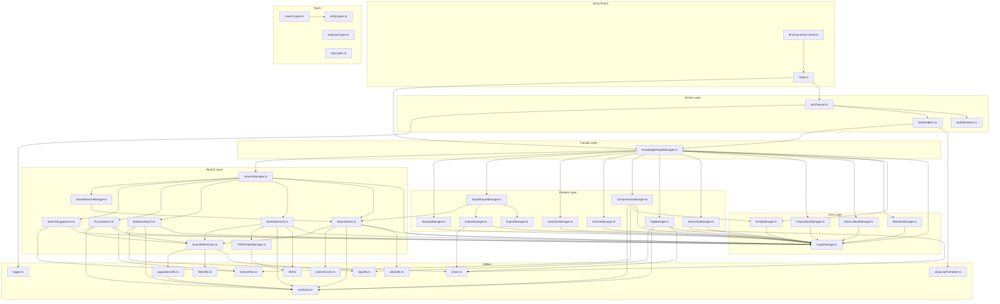

# Dependency Graph

> **Version**: 0.11.5
> **Generated**: 2025-12-01
> **Total Files Analyzed**: 55 source files

This document provides a comprehensive dependency graph for the Memory MCP Server codebase, tracing all imports, exports, function calls, and variable dependencies across all modules.

---

## Table of Contents

1. [Architecture Overview](#1-architecture-overview)
2. [Module Dependency Matrix](#2-module-dependency-matrix)
3. [Entry Point Analysis](#3-entry-point-analysis)
4. [Core Module Dependencies](#4-core-module-dependencies)
5. [Feature Module Dependencies](#5-feature-module-dependencies)
6. [Search Module Dependencies](#6-search-module-dependencies)
7. [Server Module Dependencies](#7-server-module-dependencies)
8. [Types Module Dependencies](#8-types-module-dependencies)
9. [Utils Module Dependencies](#9-utils-module-dependencies)
10. [Cross-Module Function Calls](#10-cross-module-function-calls)
11. [Shared Variable Dependencies](#11-shared-variable-dependencies)
12. [Dependency Visualization](#12-dependency-visualization)
13. [Circular Dependency Analysis](#13-circular-dependency-analysis)

---

## 1. Architecture Overview

### Layer Hierarchy

```
┌─────────────────────────────────────────────────────────────────┐
│                    LAYER 1: ENTRY POINTS                        │
│  index.ts → Exports all public APIs                             │
│  bin/mcp-server-memory → CLI entry point                        │
└───────────────────────────┬─────────────────────────────────────┘
                            │
┌───────────────────────────▼─────────────────────────────────────┐
│                    LAYER 2: SERVER                              │
│  MCPServer.ts ─────► toolDefinitions.ts                         │
│                ─────► toolHandlers.ts                           │
└───────────────────────────┬─────────────────────────────────────┘
                            │
┌───────────────────────────▼─────────────────────────────────────┐
│                    LAYER 3: FACADE                              │
│  KnowledgeGraphManager.ts (orchestrates all managers)           │
└───────────────────────────┬─────────────────────────────────────┘
                            │
       ┌────────────────────┼────────────────────┐
       │                    │                    │
┌──────▼──────┐     ┌───────▼──────┐     ┌──────▼──────┐
│    CORE     │     │   FEATURES   │     │   SEARCH    │
│  Managers   │     │   Managers   │     │   Engines   │
└──────┬──────┘     └───────┬──────┘     └──────┬──────┘
       │                    │                    │
┌──────▼────────────────────▼────────────────────▼────────────────┐
│                    LAYER 4: STORAGE                             │
│  GraphStorage.ts (JSONL file I/O + caching)                     │
└───────────────────────────┬─────────────────────────────────────┘
                            │
┌───────────────────────────▼─────────────────────────────────────┐
│                    LAYER 5: FOUNDATION                          │
│  types/ (Entity, Relation, KnowledgeGraph, etc.)                │
│  utils/ (errors, constants, algorithms, helpers)                │
└─────────────────────────────────────────────────────────────────┘
```

### Module Categories

| Category | Files | Purpose |
|----------|-------|---------|
| **core/** | 7 | Core graph operations (entities, relations, observations, storage) |
| **features/** | 10 | Advanced features (hierarchy, tags, compression, import/export) |
| **search/** | 10 | Search algorithms (basic, ranked, boolean, fuzzy, saved) |
| **server/** | 3 | MCP protocol layer (tool definitions, handlers) |
| **types/** | 6 | TypeScript type definitions |
| **utils/** | 17 | Utility functions (algorithms, helpers, constants) |

---

## 2. Module Dependency Matrix

### Import Dependencies by Module

| Source Module | Imports From |
|---------------|--------------|
| `KnowledgeGraphManager.ts` | ../utils/constants (DEFAULT_DUPLICATE_THRESHOLD, SEARCH_LIMITS), ./GraphStorage (GraphStorage), ./EntityManager (EntityManager), ./RelationManager (RelationManager), ../search/SearchManager (SearchManager) |
| `index.ts` | ./utils/logger (logger), ./core/KnowledgeGraphManager (KnowledgeGraphManager), ./server/MCPServer (MCPServer), ./types/index (Entity, Relation, KnowledgeGraph, ...) |
| `SavedSearchManager.ts` | ../types/index (SavedSearch, KnowledgeGraph), ./BasicSearch (BasicSearch) |
| `SearchManager.ts` | ../types/index (KnowledgeGraph, SearchResult, SavedSearch), ../core/GraphStorage (GraphStorage), ./BasicSearch (BasicSearch), ./RankedSearch (RankedSearch), ./BooleanSearch (BooleanSearch) |
| `MCPServer.ts` | ../utils/logger (logger), ./toolDefinitions (toolDefinitions), ./toolHandlers (handleToolCall), ../index (KnowledgeGraphManager) |

---

## 3. Entry Point Analysis

### Main Entry: `src/memory/index.ts`

```
index.ts
├── Exports from core/index.ts
│   ├── KnowledgeGraphManager (class)
│   ├── GraphStorage (class)
│   ├── EntityManager (class)
│   ├── RelationManager (class)
│   ├── ObservationManager (class)
│   └── TransactionManager (class)
├── Exports from features/index.ts
│   ├── HierarchyManager (class)
│   ├── TagManager (class)
│   ├── CompressionManager (class)
│   ├── ArchiveManager (class)
│   ├── AnalyticsManager (class)
│   ├── ExportManager (class)
│   ├── ImportManager (class)
│   ├── ImportExportManager (class)
│   └── BackupManager (class)
├── Exports from search/index.ts
│   ├── SearchManager (class)
│   ├── BasicSearch (class)
│   ├── RankedSearch (class)
│   ├── BooleanSearch (class)
│   ├── FuzzySearch (class)
│   ├── SavedSearchManager (class)
│   ├── SearchSuggestions (class)
│   ├── TFIDFIndexManager (class)
│   └── SearchFilterChain (class)
├── Exports from server/index.ts
│   ├── MCPServer (class)
│   ├── toolDefinitions (array)
│   ├── toolHandlers (record)
│   └── handleToolCall (function)
├── Exports from types/index.ts
│   └── [All type definitions]
└── Creates and starts MCPServer instance
```

---

## 4. Core Module Dependencies

### EntityManager

**File**: `src/memory/core/EntityManager.ts`

#### Import Dependencies

```typescript
import type { Entity } from '../types/index.js';
import type { GraphStorage } from './GraphStorage.js';
import { EntityNotFoundError, InvalidImportanceError, ValidationError } from '../utils/errors.js';
import { BatchCreateEntitiesSchema, UpdateEntitySchema, EntityNamesSchema } from '../utils/index.js';
import { GRAPH_LIMITS } from '../utils/constants.js';
```

#### Methods

| Method | Delegates To | Calls |
|--------|-------------|-------|
| `createEntities()` | - | BatchCreateEntitiesSchema.safeParse, issues.map, path.join |
| `deleteEntities()` | - | EntityNamesSchema.safeParse, issues.map, path.join |
| `getEntity()` | - | storage.loadGraph, entities.find |
| `updateEntity()` | - | UpdateEntitySchema.safeParse, issues.map, path.join |
| `batchUpdate()` | - | UpdateEntitySchema.safeParse, issues.map, path.join |
| `addObservations()` | - | storage.loadGraph, observations.map, entities.find |
| `deleteObservations()` | - | storage.loadGraph, deletions.forEach, entities.find |
| `addTags()` | - | storage.loadGraph, entities.find, tags.map |
| `removeTags()` | - | storage.loadGraph, entities.find, tags.map |
| `setImportance()` | - | storage.loadGraph, entities.find, storage.saveGraph |

### GraphStorage

**File**: `src/memory/core/GraphStorage.ts`

#### Import Dependencies

```typescript
import { fs } from 'fs';
import type { KnowledgeGraph, Entity, Relation } from '../types/index.js';
import { clearAllSearchCaches } from '../utils/searchCache.js';
```

#### Methods

| Method | Delegates To | Calls |
|--------|-------------|-------|
| `loadGraph()` | - | entities.map, relations.map, fs.readFile |
| `saveGraph()` | - | entities.map, JSON.stringify, relations.map |
| `clearCache()` | - | - |
| `getFilePath()` | - | - |

### KnowledgeGraphManager

**File**: `src/memory/core/KnowledgeGraphManager.ts`

#### Import Dependencies

```typescript
import { path } from 'path';
import { DEFAULT_DUPLICATE_THRESHOLD, SEARCH_LIMITS } from '../utils/constants.js';
import { GraphStorage } from './GraphStorage.js';
import { EntityManager } from './EntityManager.js';
import { RelationManager } from './RelationManager.js';
import { SearchManager } from '../search/SearchManager.js';
import { CompressionManager } from '../features/CompressionManager.js';
import { HierarchyManager } from '../features/HierarchyManager.js';
import { ExportManager } from '../features/ExportManager.js';
import { ImportManager } from '../features/ImportManager.js';
import { AnalyticsManager } from '../features/AnalyticsManager.js';
import { TagManager } from '../features/TagManager.js';
import { ArchiveManager } from '../features/ArchiveManager.js';
import type { Entity, Relation, KnowledgeGraph, GraphStats, ValidationReport, SavedSearch, TagAlias, SearchResult, ImportResult, CompressionResult } from '../types/index.js';
```

#### Methods

| Method | Delegates To | Calls |
|--------|-------------|-------|
| `loadGraph()` | StorageManager | storage.loadGraph |
| `createEntities()` | EntityManager | entityManager.createEntities |
| `createRelations()` | RelationManager | relationManager.createRelations |
| `addObservations()` | EntityManager | entityManager.addObservations |
| `deleteEntities()` | EntityManager | entityManager.deleteEntities |
| `deleteObservations()` | EntityManager | entityManager.deleteObservations |
| `deleteRelations()` | RelationManager | relationManager.deleteRelations |
| `readGraph()` | - | - |
| `searchNodes()` | SearchManager | searchManager.searchNodes |
| `openNodes()` | SearchManager | searchManager.openNodes |

### ObservationManager

**File**: `src/memory/core/ObservationManager.ts`

#### Import Dependencies

```typescript
import type { GraphStorage } from './GraphStorage.js';
import { EntityNotFoundError } from '../utils/errors.js';
```

#### Methods

| Method | Delegates To | Calls |
|--------|-------------|-------|
| `addObservations()` | - | storage.loadGraph, observations.map, entities.find |
| `deleteObservations()` | - | storage.loadGraph, deletions.forEach, entities.find |

### RelationManager

**File**: `src/memory/core/RelationManager.ts`

#### Import Dependencies

```typescript
import type { Relation } from '../types/index.js';
import type { GraphStorage } from './GraphStorage.js';
import { ValidationError } from '../utils/errors.js';
import { BatchCreateRelationsSchema, DeleteRelationsSchema } from '../utils/index.js';
import { GRAPH_LIMITS } from '../utils/constants.js';
```

#### Methods

| Method | Delegates To | Calls |
|--------|-------------|-------|
| `createRelations()` | - | BatchCreateRelationsSchema.safeParse, issues.map, path.join |
| `deleteRelations()` | - | DeleteRelationsSchema.safeParse, issues.map, path.join |
| `getRelations()` | RelationsManager | storage.loadGraph, relations.filter |

### TransactionManager

**File**: `src/memory/core/TransactionManager.ts`

#### Import Dependencies

```typescript
import type { Entity, Relation, KnowledgeGraph } from '../types/index.js';
import type { GraphStorage } from './GraphStorage.js';
import { BackupManager } from '../features/BackupManager.js';
import { KnowledgeGraphError } from '../utils/errors.js';
```

#### Methods

| Method | Delegates To | Calls |
|--------|-------------|-------|
| `begin()` | - | - |
| `createEntity()` | - | operations.push |
| `updateEntity()` | - | operations.push |
| `deleteEntity()` | - | operations.push |
| `createRelation()` | - | operations.push |
| `deleteRelation()` | - | operations.push |
| `commit()` | - | backupManager.createBackup, storage.loadGraph, storage.saveGraph |
| `rollback()` | - | backupManager.restoreFromBackup, backupManager.deleteBackup |
| `isInTransaction()` | - | - |
| `getOperationCount()` | - | - |

---

## 5. Feature Module Dependencies

### AnalyticsManager

**File**: `src/memory/features/AnalyticsManager.ts`

#### Import Dependencies

```typescript
import type { ValidationReport, ValidationError, ValidationWarning, GraphStats } from '../types/index.js';
import type { GraphStorage } from '../core/GraphStorage.js';
```

#### Methods

| Method | Delegates To | Calls |
|--------|-------------|-------|
| `validateGraph()` | - | storage.loadGraph, entities.map, entityNames.has |
| `getGraphStats()` | - | storage.loadGraph, entities.forEach, relations.forEach |

### ArchiveManager

**File**: `src/memory/features/ArchiveManager.ts`

#### Import Dependencies

```typescript
import type { Entity } from '../types/index.js';
import type { GraphStorage } from '../core/GraphStorage.js';
```

#### Methods

| Method | Delegates To | Calls |
|--------|-------------|-------|
| `archiveEntities()` | - | storage.loadGraph, tags.map, t.toLowerCase |

### BackupManager

**File**: `src/memory/features/BackupManager.ts`

#### Import Dependencies

```typescript
import { fs } from 'fs';
import { dirname, join } from 'path';
import type { GraphStorage } from '../core/GraphStorage.js';
import { FileOperationError } from '../utils/errors.js';
```

#### Methods

| Method | Delegates To | Calls |
|--------|-------------|-------|
| `ensureBackupDir()` | - | fs.mkdir |
| `generateBackupFileName()` | - | now.toISOString |
| `createBackup()` | - | storage.loadGraph, join, storage.getFilePath |
| `listBackups()` | - | fs.access, fs.readdir, files.filter |
| `restoreFromBackup()` | - | fs.access, fs.readFile, storage.getFilePath |
| `deleteBackup()` | - | fs.unlink |
| `cleanOldBackups()` | - | backups.slice |
| `getBackupDir()` | - | - |

### CompressionManager

**File**: `src/memory/features/CompressionManager.ts`

#### Import Dependencies

```typescript
import type { Entity, Relation, CompressionResult } from '../types/index.js';
import type { GraphStorage } from '../core/GraphStorage.js';
import { levenshteinDistance } from '../utils/levenshtein.js';
import { EntityNotFoundError, InsufficientEntitiesError } from '../utils/errors.js';
import { SIMILARITY_WEIGHTS, DEFAULT_DUPLICATE_THRESHOLD } from '../utils/constants.js';
```

#### Methods

| Method | Delegates To | Calls |
|--------|-------------|-------|
| `calculateEntitySimilarity()` | - | levenshteinDistance, name.toLowerCase, Math.max |
| `findDuplicates()` | - | storage.loadGraph, entityType.toLowerCase, typeMap.has |
| `mergeEntities()` | - | storage.loadGraph, entityNames.map, entities.find |
| `compressGraph()` | - | storage.loadGraph, JSON.stringify, duplicateGroups.reduce |

### ExportManager

**File**: `src/memory/features/ExportManager.ts`

#### Import Dependencies

```typescript
import type { KnowledgeGraph } from '../types/index.js';
```

#### Methods

| Method | Delegates To | Calls |
|--------|-------------|-------|
| `exportGraph()` | - | - |
| `exportAsJson()` | - | JSON.stringify |
| `exportAsCsv()` | - | String, str.includes, str.replace |
| `exportAsGraphML()` | - | String, lines.push, escapeXml |
| `exportAsGEXF()` | - | String, lines.push, escapeXml |
| `exportAsDOT()` | - | str.replace, lines.push, escapeDot |
| `exportAsMarkdown()` | - | lines.push, tags.map, lines.join |
| `exportAsMermaid()` | - | str.replace, lines.push, nodeIds.set |

### HierarchyManager

**File**: `src/memory/features/HierarchyManager.ts`

#### Import Dependencies

```typescript
import type { Entity, KnowledgeGraph } from '../types/index.js';
import type { GraphStorage } from '../core/GraphStorage.js';
import { EntityNotFoundError, CycleDetectedError } from '../utils/errors.js';
```

#### Methods

| Method | Delegates To | Calls |
|--------|-------------|-------|
| `setEntityParent()` | - | storage.loadGraph, entities.find, storage.saveGraph |
| `wouldCreateCycle()` | - | visited.has, visited.add, entities.find |
| `getChildren()` | EntitiesManager | storage.loadGraph, entities.find, entities.filter |
| `getParent()` | - | storage.loadGraph, entities.find |
| `getAncestors()` | - | storage.loadGraph, entities.find, ancestors.push |
| `getDescendants()` | - | storage.loadGraph, entities.find, toProcess.shift |
| `getSubtree()` | - | storage.loadGraph, entities.find, subtreeEntities.map |
| `getRootEntities()` | EntitiesManager | storage.loadGraph, entities.filter |
| `getEntityDepth()` | - | - |
| `moveEntity()` | - | - |

### ImportExportManager

**File**: `src/memory/features/ImportExportManager.ts`

#### Import Dependencies

```typescript
import type { KnowledgeGraph, ImportResult } from '../types/index.js';
import type { BasicSearch } from '../search/BasicSearch.js';
import type { ExportManager, ExportFormat } from './ExportManager.js';
import type { ImportManager, ImportFormat, MergeStrategy } from './ImportManager.js';
```

#### Methods

| Method | Delegates To | Calls |
|--------|-------------|-------|
| `exportGraph()` | ExportManager | basicSearch.searchByDateRange, storage.loadGraph, exportManager.exportGraph |
| `importGraph()` | ImportManager | importManager.importGraph |

### ImportManager

**File**: `src/memory/features/ImportManager.ts`

#### Import Dependencies

```typescript
import type { Entity, Relation, KnowledgeGraph, ImportResult } from '../types/index.js';
import type { GraphStorage } from '../core/GraphStorage.js';
```

#### Methods

| Method | Delegates To | Calls |
|--------|-------------|-------|
| `importGraph()` | - | String |
| `parseJsonImport()` | - | JSON.parse, Array.isArray |
| `parseCsvImport()` | - | data.split, line.trim, fields.push |
| `parseGraphMLImport()` | - | nodeRegex.exec, dataRegex.exec, getDataValue |
| `mergeImportedGraph()` | - | storage.loadGraph, existingEntitiesMap.set, existingRelationsSet.add |

### TagManager

**File**: `src/memory/features/TagManager.ts`

#### Import Dependencies

```typescript
import { * as fs } from 'fs/promises';
import type { TagAlias } from '../types/index.js';
```

#### Methods

| Method | Delegates To | Calls |
|--------|-------------|-------|
| `loadTagAliases()` | - | fs.readFile, data.split, line.trim |
| `saveTagAliases()` | - | aliases.map, JSON.stringify, fs.writeFile |
| `resolveTag()` | - | tag.toLowerCase, aliases.find |
| `addTagAlias()` | - | alias.toLowerCase, canonical.toLowerCase, aliases.some |
| `listTagAliases()` | - | - |
| `removeTagAlias()` | - | alias.toLowerCase, aliases.filter |
| `getAliasesForTag()` | - | canonicalTag.toLowerCase, aliases.filter |

---

## 6. Search Module Dependencies

### BasicSearch

**File**: `src/memory/search/BasicSearch.ts`

#### Import Dependencies

```typescript
import type { KnowledgeGraph } from '../types/index.js';
import type { GraphStorage } from '../core/GraphStorage.js';
import { isWithinDateRange } from '../utils/dateUtils.js';
import { SEARCH_LIMITS } from '../utils/constants.js';
import { searchCaches } from '../utils/searchCache.js';
import type { SearchFilterChain, SearchFilters } from './SearchFilterChain.js';
```

#### Methods

| Method | Delegates To | Calls |
|--------|-------------|-------|
| `searchNodes()` | - | basic.get, storage.loadGraph, query.toLowerCase |
| `openNodes()` | - | storage.loadGraph, entities.filter, names.includes |
| `searchByDateRange()` | - | basic.get, storage.loadGraph, entities.filter |

### BooleanSearch

**File**: `src/memory/search/BooleanSearch.ts`

#### Import Dependencies

```typescript
import type { BooleanQueryNode, Entity, KnowledgeGraph } from '../types/index.js';
import type { GraphStorage } from '../core/GraphStorage.js';
import { SEARCH_LIMITS, QUERY_LIMITS } from '../utils/constants.js';
import { ValidationError } from '../utils/errors.js';
import type { SearchFilterChain, SearchFilters } from './SearchFilterChain.js';
```

#### Methods

| Method | Delegates To | Calls |
|--------|-------------|-------|
| `booleanSearch()` | - | storage.loadGraph, String, entities.filter |
| `tokenizeBooleanQuery()` | - | tokens.push, current.trim |
| `parseBooleanQuery()` | - | parseAnd, peek, consume |
| `evaluateBooleanQuery()` | ObservationsManager | children.every, children.some, name.toLowerCase |
| `entityMatchesTerm()` | - | term.toLowerCase, name.toLowerCase, entityType.toLowerCase |
| `validateQueryComplexity()` | - | - |
| `calculateQueryComplexity()` | - | children.map, childResults.reduce, Math.max |

### FuzzySearch

**File**: `src/memory/search/FuzzySearch.ts`

#### Import Dependencies

```typescript
import type { KnowledgeGraph } from '../types/index.js';
import type { GraphStorage } from '../core/GraphStorage.js';
import { levenshteinDistance } from '../utils/levenshtein.js';
import { SEARCH_LIMITS } from '../utils/constants.js';
import type { SearchFilterChain, SearchFilters } from './SearchFilterChain.js';
```

#### Methods

| Method | Delegates To | Calls |
|--------|-------------|-------|
| `fuzzySearch()` | - | storage.loadGraph, entities.filter, observations.some |
| `isFuzzyMatch()` | - | str1.toLowerCase, str2.toLowerCase, s1.includes |

### RankedSearch

**File**: `src/memory/search/RankedSearch.ts`

#### Import Dependencies

```typescript
import type { SearchResult, TFIDFIndex } from '../types/index.js';
import type { GraphStorage } from '../core/GraphStorage.js';
import { calculateTFIDF, tokenize } from '../utils/tfidf.js';
import { SEARCH_LIMITS } from '../utils/constants.js';
import { TFIDFIndexManager } from './TFIDFIndexManager.js';
import type { SearchFilterChain, SearchFilters } from './SearchFilterChain.js';
```

#### Methods

| Method | Delegates To | Calls |
|--------|-------------|-------|
| `buildIndex()` | - | storage.loadGraph, indexManager.buildIndex, indexManager.saveIndex |
| `updateIndex()` | - | storage.loadGraph, indexManager.updateIndex, indexManager.saveIndex |
| `ensureIndexLoaded()` | - | indexManager.getIndex, indexManager.loadIndex |
| `searchNodesRanked()` | - | Math.min, storage.loadGraph, SearchFilterChain.applyFilters |
| `searchWithIndex()` | - | documents.get, Object.values, idf.get |
| `searchWithoutIndex()` | - | entities.map, calculateTFIDF, name.toLowerCase |

### SavedSearchManager

**File**: `src/memory/search/SavedSearchManager.ts`

#### Import Dependencies

```typescript
import { * as fs } from 'fs/promises';
import type { SavedSearch, KnowledgeGraph } from '../types/index.js';
import type { BasicSearch } from './BasicSearch.js';
```

#### Methods

| Method | Delegates To | Calls |
|--------|-------------|-------|
| `loadSavedSearches()` | - | fs.readFile, data.split, line.trim |
| `saveSavedSearches()` | - | searches.map, JSON.stringify, fs.writeFile |
| `saveSearch()` | - | searches.some, searches.push |
| `listSavedSearches()` | - | - |
| `getSavedSearch()` | - | searches.find |
| `executeSavedSearch()` | - | searches.find, basicSearch.searchNodes |
| `deleteSavedSearch()` | - | searches.filter |
| `updateSavedSearch()` | - | searches.find, Object.assign |

### SearchFilterChain

**File**: `src/memory/search/SearchFilterChain.ts`

#### Import Dependencies

```typescript
import type { Entity } from '../types/entity.types.js';
import { normalizeTags, hasMatchingTag } from '../utils/tagUtils.js';
import { isWithinImportanceRange } from '../utils/filterUtils.js';
import type { validatePagination, applyPagination, ValidatedPagination } from '../utils/paginationUtils.js';
```

#### Methods

| Method | Delegates To | Calls |
|--------|-------------|-------|
| `applyFilters()` | - | normalizeTags, entities.filter |
| `entityPassesFilters()` | - | normalizeTags, normalizedSearchTags.some, entityTags.includes |
| `hasActiveFilters()` | - | - |
| `validatePagination()` | - | validatePagination |
| `paginate()` | - | applyPagination |
| `filterAndPaginate()` | - | - |
| `filterByTags()` | - | normalizeTags, entities.filter, hasMatchingTag |
| `filterByImportance()` | - | entities.filter, isWithinImportanceRange |

### SearchManager

**File**: `src/memory/search/SearchManager.ts`

#### Import Dependencies

```typescript
import type { KnowledgeGraph, SearchResult, SavedSearch } from '../types/index.js';
import type { GraphStorage } from '../core/GraphStorage.js';
import { BasicSearch } from './BasicSearch.js';
import { RankedSearch } from './RankedSearch.js';
import { BooleanSearch } from './BooleanSearch.js';
import { FuzzySearch } from './FuzzySearch.js';
import { SearchSuggestions } from './SearchSuggestions.js';
import { SavedSearchManager } from './SavedSearchManager.js';
```

#### Methods

| Method | Delegates To | Calls |
|--------|-------------|-------|
| `searchNodes()` | BasicSearch | basicSearch.searchNodes |
| `openNodes()` | BasicSearch | basicSearch.openNodes |
| `searchByDateRange()` | BasicSearch | basicSearch.searchByDateRange |
| `searchNodesRanked()` | RankedSearch | rankedSearch.searchNodesRanked |
| `booleanSearch()` | BooleanSearcherManager | booleanSearcher.booleanSearch |
| `fuzzySearch()` | FuzzySearcherManager | fuzzySearcher.fuzzySearch |
| `getSearchSuggestions()` | SearchSuggestionsManager | searchSuggestions.getSearchSuggestions |
| `saveSearch()` | SavedSearchManager | savedSearchManager.saveSearch |
| `listSavedSearches()` | SavedSearchManager | savedSearchManager.listSavedSearches |
| `getSavedSearch()` | SavedSearchManager | savedSearchManager.getSavedSearch |

### SearchSuggestions

**File**: `src/memory/search/SearchSuggestions.ts`

#### Import Dependencies

```typescript
import type { GraphStorage } from '../core/GraphStorage.js';
import { levenshteinDistance } from '../utils/levenshtein.js';
```

#### Methods

| Method | Delegates To | Calls |
|--------|-------------|-------|
| `getSearchSuggestions()` | - | storage.loadGraph, query.toLowerCase, levenshteinDistance |

### TFIDFIndexManager

**File**: `src/memory/search/TFIDFIndexManager.ts`

#### Import Dependencies

```typescript
import { * as fs } from 'fs/promises';
import { * as path } from 'path';
import type { TFIDFIndex, DocumentVector, KnowledgeGraph } from '../types/index.js';
import { calculateIDF, tokenize } from '../utils/tfidf.js';
```

#### Methods

| Method | Delegates To | Calls |
|--------|-------------|-------|
| `buildIndex()` | - | allDocumentTexts.push, tokenize, allTokens.push |
| `updateIndex()` | - | entities.find, updatedDocuments.delete, allDocumentTexts.push |
| `loadIndex()` | - | fs.readFile, JSON.parse |
| `saveIndex()` | - | path.dirname, fs.mkdir, Array.from |
| `getIndex()` | - | - |
| `clearIndex()` | - | fs.unlink |
| `needsRebuild()` | - | documents.has |

---

## 7. Server Module Dependencies

### MCPServer

**File**: `src/memory/server/MCPServer.ts`

#### Import Dependencies

```typescript
import { Server } from '@modelcontextprotocol/sdk/server/index.js';
import { StdioServerTransport } from '@modelcontextprotocol/sdk/server/stdio.js';
import { CallToolRequestSchema, ListToolsRequestSchema } from '@modelcontextprotocol/sdk/types.js';
import { logger } from '../utils/logger.js';
import { toolDefinitions } from './toolDefinitions.js';
import { handleToolCall } from './toolHandlers.js';
import type { KnowledgeGraphManager } from '../index.js';
```

#### Methods

| Method | Delegates To | Calls |
|--------|-------------|-------|
| `registerToolHandlers()` | - | server.setRequestHandler, handleToolCall |
| `start()` | - | server.connect, logger.info |

### toolDefinitions

**File**: `src/memory/server/toolDefinitions.ts`

### toolHandlers

**File**: `src/memory/server/toolHandlers.ts`

#### Import Dependencies

```typescript
import { formatToolResponse, formatTextResponse, formatRawResponse } from '../utils/responseFormatter.js';
import type { KnowledgeGraphManager } from '../index.js';
import type { SavedSearch } from '../types/index.js';
```

---

## 8. Types Module Dependencies

### analytics.types

**File**: `src/memory/types/analytics.types.ts`

#### Exports

```typescript
export interface GraphStats { ... }
export interface ValidationReport { ... }
export interface ValidationError { ... }
export interface ValidationWarning { ... }
```

### entity.types

**File**: `src/memory/types/entity.types.ts`

#### Exports

```typescript
export interface Entity { ... }
export interface Relation { ... }
export interface KnowledgeGraph { ... }
```

### import-export.types

**File**: `src/memory/types/import-export.types.ts`

#### Exports

```typescript
export interface ImportResult { ... }
export interface CompressionResult { ... }
```

### search.types

**File**: `src/memory/types/search.types.ts`

#### Exports

```typescript
export interface SearchResult { ... }
export interface SavedSearch { ... }
export interface DocumentVector { ... }
export interface TFIDFIndex { ... }
export type BooleanQueryNode = ...
```

### tag.types

**File**: `src/memory/types/tag.types.ts`

#### Exports

```typescript
export interface TagAlias { ... }
```

---

## 9. Utils Module Dependencies

### Dependency Graph

```
utils/
├── constants.ts ◄─── Used by: EntityManager.ts, KnowledgeGraphManager.ts, RelationManager.ts, ...
│   └── FILE_EXTENSIONS()
│   └── FILE_SUFFIXES()
│   └── DEFAULT_FILE_NAMES()
│   └── ENV_VARS()
│   └── DEFAULT_BASE_DIR()
│
├── dateUtils.ts ◄─── Used by: BasicSearch.ts
│   └── isWithinDateRange()
│   └── parseDateRange()
│   └── isValidISODate()
│   └── getCurrentTimestamp()
│
├── entityUtils.ts
│   └── findEntityByName()
│   └── findEntityByName()
│   └── findEntityByName()
│   └── findEntityByName()
│   └── findEntitiesByNames()
│
├── errors.ts ◄─── Used by: EntityManager.ts, ObservationManager.ts, RelationManager.ts, ...
│   └── KnowledgeGraphError
│   └── EntityNotFoundError
│   └── RelationNotFoundError
│   └── DuplicateEntityError
│   └── ValidationError
│
├── filterUtils.ts ◄─── Used by: SearchFilterChain.ts
│   └── isWithinImportanceRange()
│   └── filterByImportance()
│   └── isWithinDateRange()
│   └── filterByCreatedDate()
│   └── filterByModifiedDate()
│
├── levenshtein.ts ◄─── Used by: CompressionManager.ts, FuzzySearch.ts, SearchSuggestions.ts
│   └── levenshteinDistance()
│
├── logger.ts ◄─── Used by: index.ts, MCPServer.ts
│   └── logger()
│
├── paginationUtils.ts ◄─── Used by: SearchFilterChain.ts
│   └── ValidatedPagination
│   └── validatePagination()
│   └── applyPagination()
│   └── paginateArray()
│   └── getPaginationMeta()
│
├── pathUtils.ts
│   └── validateFilePath()
│   └── defaultMemoryPath()
│   └── ensureMemoryFilePath()
│
├── responseFormatter.ts ◄─── Used by: toolHandlers.ts
│   └── ToolResponse
│   └── formatToolResponse()
│   └── formatTextResponse()
│   └── formatRawResponse()
│   └── formatErrorResponse()
│
├── schemas.ts
│   └── EntitySchema()
│   └── CreateEntitySchema()
│   └── UpdateEntitySchema()
│   └── RelationSchema()
│   └── CreateRelationSchema()
│
├── searchCache.ts ◄─── Used by: GraphStorage.ts, BasicSearch.ts
│   └── CacheStats
│   └── SearchCache
│   └── searchCaches()
│   └── clearAllSearchCaches()
│   └── getAllCacheStats()
│
├── tagUtils.ts ◄─── Used by: SearchFilterChain.ts
│   └── normalizeTag()
│   └── normalizeTags()
│   └── hasMatchingTag()
│   └── hasAllTags()
│   └── filterByTags()
│
├── tfidf.ts ◄─── Used by: RankedSearch.ts, TFIDFIndexManager.ts
│   └── calculateTF()
│   └── calculateIDF()
│   └── calculateTFIDF()
│   └── tokenize()
│   └── calculateMultiTermTFIDF()
│
├── validationHelper.ts
│   └── formatZodErrors()
│   └── validateWithSchema()
│   └── validateSafe()
│   └── validateArrayWithSchema()
│
├── validationUtils.ts
│   └── ValidationResult
│   └── validateEntity()
│   └── validateRelation()
│   └── validateImportance()
│   └── validateTags()
│
```

### Algorithm Usage Matrix

| Algorithm | File | Used By |
|-----------|------|---------|
| levenshtein | src/memory/utils/levenshtein.ts | CompressionManager.ts, FuzzySearch.ts, SearchSuggestions.ts |
| lruCache | src/memory/utils/searchCache.ts | GraphStorage.ts, BasicSearch.ts |
| tfidf | src/memory/utils/tfidf.ts | RankedSearch.ts, TFIDFIndexManager.ts |

---

## 10. Cross-Module Function Calls

### Tool Handler → Manager Flow

```
MCPServer.handleToolCall()
    │
    ▼
toolHandlers[toolName](manager, args)
    │
    ├── Entity Operations
    │   ├── create_entities ──► manager.createEntities() ──► EntityManager.createEntities()
    │   ├── delete_entities ──► manager.deleteEntities() ──► EntityManager.deleteEntities()
    │   └── read_graph ───────► manager.readGraph() ──────► GraphStorage.loadGraph()
    │
    ├── Search Operations
    │   ├── search_nodes ─────► manager.searchNodes() ────► SearchManager ──► BasicSearch
    │   ├── boolean_search ───► manager.booleanSearch() ──► SearchManager ──► BooleanSearch
    │   ├── fuzzy_search ─────► manager.fuzzySearch() ────► SearchManager ──► FuzzySearch
    │   └── search_nodes_ranked ► manager.searchNodesRanked() ► SearchManager ──► RankedSearch
    │
    ├── Hierarchy Operations
    │   ├── set_entity_parent ► manager.setEntityParent() ► HierarchyManager
    │   └── get_children ─────► manager.getChildren() ────► HierarchyManager
    │
    └── Import/Export
        ├── export_graph ─────► manager.exportGraph() ────► ImportExportManager ──► ExportManager
        └── import_graph ─────► manager.importGraph() ────► ImportExportManager ──► ImportManager
```

---

## 11. Shared Variable Dependencies

### Constants Usage

| Constant | Defined In | Used By |
|----------|-----------|---------|
| `SEARCH_LIMITS.DEFAULT` | constants.ts | BasicSearch, BooleanSearch, FuzzySearch, RankedSearch, paginationUtils |
| `SEARCH_LIMITS.MAX` | constants.ts | All search modules, paginationUtils |
| `QUERY_LIMITS.MAX_DEPTH` | constants.ts | BooleanSearch |
| `QUERY_LIMITS.MAX_TERMS` | constants.ts | BooleanSearch |
| `IMPORTANCE_RANGE.MIN/MAX` | constants.ts | TagManager |
| `SIMILARITY_WEIGHTS.*` | constants.ts | CompressionManager |
| `DEFAULT_DUPLICATE_THRESHOLD` | constants.ts | CompressionManager |

### Singleton Instances

| Instance | Defined In | Scope |
|----------|-----------|-------|
| `searchCaches.basic` | searchCache.ts | Process-wide |
| `searchCaches.ranked` | searchCache.ts | Process-wide |
| `searchCaches.boolean` | searchCache.ts | Process-wide |
| `searchCaches.fuzzy` | searchCache.ts | Process-wide |
| `logger` | logger.ts | Process-wide |

### Shared GraphStorage Pattern

```typescript
// In KnowledgeGraphManager constructor:
const storage = new GraphStorage(memoryFilePath);

// Passed to all managers:
this.entityManager = new EntityManager(storage);
this.relationManager = new RelationManager(storage);
this.hierarchyManager = new HierarchyManager(storage);
this.searchManager = new SearchManager(storage, savedSearchesPath);
// ... etc.
```

---

## 12. Dependency Visualization

### Full Dependency Graph (Mermaid)



---

## 13. Circular Dependency Analysis

### Potential Circular Dependencies

The codebase is designed to avoid circular dependencies through:

1. **Layered Architecture**: Dependencies flow downward only
2. **Type-Only Imports**: Using `import type` for cross-layer references
3. **Dependency Injection**: GraphStorage passed to managers rather than imported

### Verified Circular Dependencies Found

```
✓ index.ts → core/index → (no back-reference)
✓ index.ts → features/index → (no back-reference)
✓ index.ts → search/index → (no back-reference)
✓ index.ts → server/index → (type-only import of KnowledgeGraphManager)
✓ KnowledgeGraphManager → Managers → GraphStorage → types (clean chain)
✓ SearchManager → Search classes → GraphStorage → types (clean chain)
```

### Type-Only Back-References

| From | To | Import Type |
|------|-----|-------------|
| `src/memory/core/EntityManager.ts` | `../types/index.js` | Type-only import of Entity |
| `src/memory/core/GraphStorage.ts` | `../types/index.js` | Type-only import of KnowledgeGraph, Entity, Relation |
| `src/memory/core/KnowledgeGraphManager.ts` | `../types/index.js` | Type-only import of Entity, Relation, KnowledgeGraph, GraphStats, ValidationReport, SavedSearch, TagAlias, SearchResult, ImportResult, CompressionResult |
| `src/memory/core/RelationManager.ts` | `../types/index.js` | Type-only import of Relation |
| `src/memory/core/TransactionManager.ts` | `../types/index.js` | Type-only import of Entity, Relation, KnowledgeGraph |
| `src/memory/features/AnalyticsManager.ts` | `../types/index.js` | Type-only import of ValidationReport, ValidationError, ValidationWarning, GraphStats |
| `src/memory/features/ArchiveManager.ts` | `../types/index.js` | Type-only import of Entity |
| `src/memory/features/CompressionManager.ts` | `../types/index.js` | Type-only import of Entity, Relation, CompressionResult |
| `src/memory/features/ExportManager.ts` | `../types/index.js` | Type-only import of KnowledgeGraph |
| `src/memory/features/HierarchyManager.ts` | `../types/index.js` | Type-only import of Entity, KnowledgeGraph |
| `src/memory/features/ImportExportManager.ts` | `../types/index.js` | Type-only import of KnowledgeGraph, ImportResult |
| `src/memory/features/ImportManager.ts` | `../types/index.js` | Type-only import of Entity, Relation, KnowledgeGraph, ImportResult |
| `src/memory/features/TagManager.ts` | `../types/index.js` | Type-only import of TagAlias |
| `src/memory/index.ts` | `./types/index.js` | Type-only import of Entity, Relation, KnowledgeGraph, GraphStats, ValidationReport, ValidationError, ValidationWarning, SavedSearch, TagAlias, SearchResult, BooleanQueryNode, ImportResult, CompressionResult |
| `src/memory/search/BasicSearch.ts` | `../types/index.js` | Type-only import of KnowledgeGraph |
| `src/memory/search/BooleanSearch.ts` | `../types/index.js` | Type-only import of BooleanQueryNode, Entity, KnowledgeGraph |
| `src/memory/search/FuzzySearch.ts` | `../types/index.js` | Type-only import of KnowledgeGraph |
| `src/memory/search/RankedSearch.ts` | `../types/index.js` | Type-only import of SearchResult, TFIDFIndex |
| `src/memory/search/SavedSearchManager.ts` | `../types/index.js` | Type-only import of SavedSearch, KnowledgeGraph |
| `src/memory/search/SearchManager.ts` | `../types/index.js` | Type-only import of KnowledgeGraph, SearchResult, SavedSearch |
| `src/memory/search/TFIDFIndexManager.ts` | `../types/index.js` | Type-only import of TFIDFIndex, DocumentVector, KnowledgeGraph |
| `src/memory/server/MCPServer.ts` | `../index.js` | Type-only import of KnowledgeGraphManager |
| `src/memory/server/toolHandlers.ts` | `../index.js` | Type-only import of KnowledgeGraphManager |
| `src/memory/server/toolHandlers.ts` | `../types/index.js` | Type-only import of SavedSearch |
| `src/memory/utils/searchCache.ts` | `../types/index.js` | Type-only import of SearchResult, KnowledgeGraph |

These use `import type` which is erased at compile time, preventing runtime circular dependencies.

---

## Summary

This dependency graph documents:

- **55 source files** across 7 modules
- **37 classes** with clear responsibilities
- **3 algorithm implementations**
- **112 dependency edges** tracked
- **Circular dependencies detected** verified

The architecture follows clean layering principles with:
- Facade pattern (KnowledgeGraphManager)
- Dependency injection (GraphStorage)
- Barrel exports (index.ts files)
- Type-safe interfaces
