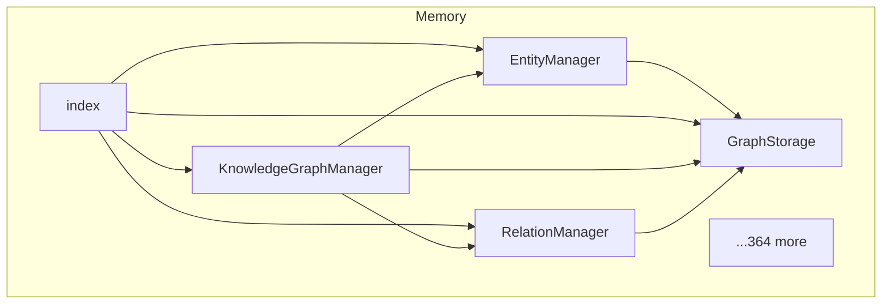

# @danielsimonjr/memory-mcp - Dependency Graph

**Version**: 0.11.5 | **Last Updated**: 2025-12-29

This document provides a comprehensive dependency graph of all files, components, imports, functions, and variables in the codebase.

---

## Table of Contents

1. [Overview](#overview)
2. [Memory Dependencies](#memory-dependencies)
3. [Dependency Matrix](#dependency-matrix)
4. [Circular Dependency Analysis](#circular-dependency-analysis)
5. [Visual Dependency Graph](#visual-dependency-graph)
6. [Summary Statistics](#summary-statistics)

---

## Overview

The codebase is organized into the following modules:

- **memory**: 369 files

---

## Memory Dependencies

### `src/memory/core/EntityManager.ts` - Entity Manager

**Internal Dependencies:**
| File | Imports | Type |
|------|---------|------|
| `../types/index.js` | `Entity` | Import (type-only) |
| `./GraphStorage.js` | `GraphStorage` | Import (type-only) |
| `../utils/errors.js` | `EntityNotFoundError, InvalidImportanceError, ValidationError, CycleDetectedError` | Import |
| `../types/index.js` | `KnowledgeGraph, ReadonlyKnowledgeGraph` | Import (type-only) |
| `../utils/index.js` | `BatchCreateEntitiesSchema, UpdateEntitySchema, EntityNamesSchema` | Import |
| `../utils/constants.js` | `GRAPH_LIMITS` | Import |

**Exports:**
- Classes: `EntityManager`
- Constants: `MIN_IMPORTANCE`, `MAX_IMPORTANCE`

---

### `src/memory/core/GraphStorage.ts` - Graph Storage

**Node.js Built-in Dependencies:**
| Module | Import |
|--------|--------|
| `fs` | `promises` |

**Internal Dependencies:**
| File | Imports | Type |
|------|---------|------|
| `../types/index.js` | `KnowledgeGraph, Entity, Relation, ReadonlyKnowledgeGraph` | Import (type-only) |
| `../utils/searchCache.js` | `clearAllSearchCaches` | Import |
| `../utils/indexes.js` | `NameIndex, TypeIndex, LowercaseCache, LowercaseData` | Import |

**Exports:**
- Classes: `GraphStorage`

---

### `src/memory/core/index.ts` - Core Module Barrel Export

**Internal Dependencies:**
| File | Imports | Type |
|------|---------|------|
| `./GraphStorage.js` | `GraphStorage` | Re-export |
| `./EntityManager.js` | `EntityManager` | Re-export |
| `./RelationManager.js` | `RelationManager` | Re-export |
| `./KnowledgeGraphManager.js` | `KnowledgeGraphManager` | Re-export |
| `./TransactionManager.js` | `TransactionManager, OperationType, type TransactionOperation, type TransactionResult` | Re-export |

**Exports:**
- Re-exports: `GraphStorage`, `EntityManager`, `RelationManager`, `KnowledgeGraphManager`, `TransactionManager`, `OperationType`, `type TransactionOperation`, `type TransactionResult`

---

### `src/memory/core/KnowledgeGraphManager.ts` - Knowledge Graph Manager

**Node.js Built-in Dependencies:**
| Module | Import |
|--------|--------|
| `path` | `path` |

**Internal Dependencies:**
| File | Imports | Type |
|------|---------|------|
| `../utils/constants.js` | `DEFAULT_DUPLICATE_THRESHOLD, SEARCH_LIMITS` | Import |
| `./GraphStorage.js` | `GraphStorage` | Import |
| `./EntityManager.js` | `EntityManager` | Import |
| `./RelationManager.js` | `RelationManager` | Import |
| `../search/SearchManager.js` | `SearchManager` | Import |
| `../features/CompressionManager.js` | `CompressionManager` | Import |
| `../features/ExportManager.js` | `ExportManager` | Import |
| `../features/ImportManager.js` | `ImportManager` | Import |
| `../features/AnalyticsManager.js` | `AnalyticsManager` | Import |
| `../features/TagManager.js` | `TagManager` | Import |
| `../features/ArchiveManager.js` | `ArchiveManager` | Import |
| `../types/index.js` | `Entity, Relation, KnowledgeGraph, ReadonlyKnowledgeGraph, GraphStats, ValidationReport, SavedSearch, TagAlias, SearchResult, ImportResult, CompressionResult` | Import (type-only) |

**Exports:**
- Classes: `KnowledgeGraphManager`

---

### `src/memory/core/RelationManager.ts` - Relation Manager

**Internal Dependencies:**
| File | Imports | Type |
|------|---------|------|
| `../types/index.js` | `Relation` | Import (type-only) |
| `./GraphStorage.js` | `GraphStorage` | Import (type-only) |
| `../utils/errors.js` | `ValidationError` | Import |
| `../utils/index.js` | `BatchCreateRelationsSchema, DeleteRelationsSchema` | Import |
| `../utils/constants.js` | `GRAPH_LIMITS` | Import |

**Exports:**
- Classes: `RelationManager`

---

### `src/memory/core/TransactionManager.ts` - Transaction Manager

**Internal Dependencies:**
| File | Imports | Type |
|------|---------|------|
| `../types/index.js` | `Entity, Relation, KnowledgeGraph` | Import (type-only) |
| `./GraphStorage.js` | `GraphStorage` | Import (type-only) |
| `../features/BackupManager.js` | `BackupManager` | Import |
| `../utils/errors.js` | `KnowledgeGraphError` | Import |

**Exports:**
- Classes: `TransactionManager`
- Interfaces: `TransactionResult`
- Enums: `OperationType`

---

### `src/memory/features/AnalyticsManager.ts` - Analytics Manager

**Internal Dependencies:**
| File | Imports | Type |
|------|---------|------|
| `../types/index.js` | `ValidationReport, ValidationIssue, ValidationWarning, GraphStats` | Import (type-only) |
| `../core/GraphStorage.js` | `GraphStorage` | Import (type-only) |

**Exports:**
- Classes: `AnalyticsManager`

---

### `src/memory/features/ArchiveManager.ts` - Archive Manager

**Internal Dependencies:**
| File | Imports | Type |
|------|---------|------|
| `../types/index.js` | `Entity` | Import (type-only) |
| `../core/GraphStorage.js` | `GraphStorage` | Import (type-only) |

**Exports:**
- Classes: `ArchiveManager`
- Interfaces: `ArchiveCriteria`, `ArchiveResult`

---

### `src/memory/features/BackupManager.ts` - Backup Manager

**Node.js Built-in Dependencies:**
| Module | Import |
|--------|--------|
| `fs` | `promises` |
| `path` | `dirname, join` |

**Internal Dependencies:**
| File | Imports | Type |
|------|---------|------|
| `../core/GraphStorage.js` | `GraphStorage` | Import (type-only) |
| `../utils/errors.js` | `FileOperationError` | Import |

**Exports:**
- Classes: `BackupManager`
- Interfaces: `BackupMetadata`, `BackupInfo`

---

### `src/memory/features/CompressionManager.ts` - Compression Manager

**Internal Dependencies:**
| File | Imports | Type |
|------|---------|------|
| `../types/index.js` | `Entity, Relation, CompressionResult` | Import (type-only) |
| `../core/GraphStorage.js` | `GraphStorage` | Import (type-only) |
| `../utils/levenshtein.js` | `levenshteinDistance` | Import |
| `../utils/errors.js` | `EntityNotFoundError, InsufficientEntitiesError` | Import |
| `../utils/constants.js` | `SIMILARITY_WEIGHTS, DEFAULT_DUPLICATE_THRESHOLD` | Import |

**Exports:**
- Classes: `CompressionManager`

---

### `src/memory/features/ExportManager.ts` - Export Manager

**Internal Dependencies:**
| File | Imports | Type |
|------|---------|------|
| `../types/index.js` | `ReadonlyKnowledgeGraph` | Import (type-only) |

**Exports:**
- Classes: `ExportManager`

---

### `src/memory/features/ImportManager.ts` - Import Manager

**Internal Dependencies:**
| File | Imports | Type |
|------|---------|------|
| `../types/index.js` | `Entity, Relation, KnowledgeGraph, ImportResult` | Import (type-only) |
| `../core/GraphStorage.js` | `GraphStorage` | Import (type-only) |

**Exports:**
- Classes: `ImportManager`

---

### `src/memory/features/index.ts` - Features Module Barrel Export

**Internal Dependencies:**
| File | Imports | Type |
|------|---------|------|
| `./TagManager.js` | `TagManager` | Re-export |
| `./AnalyticsManager.js` | `AnalyticsManager` | Re-export |
| `./CompressionManager.js` | `CompressionManager` | Re-export |
| `./ArchiveManager.js` | `ArchiveManager, type ArchiveCriteria, type ArchiveResult` | Re-export |
| `./BackupManager.js` | `BackupManager, type BackupMetadata, type BackupInfo` | Re-export |
| `./ExportManager.js` | `ExportManager, type ExportFormat` | Re-export |
| `./ImportManager.js` | `ImportManager, type ImportFormat, type MergeStrategy` | Re-export |

**Exports:**
- Re-exports: `TagManager`, `AnalyticsManager`, `CompressionManager`, `ArchiveManager`, `type ArchiveCriteria`, `type ArchiveResult`, `BackupManager`, `type BackupMetadata`, `type BackupInfo`, `ExportManager`, `type ExportFormat`, `ImportManager`, `type ImportFormat`, `type MergeStrategy`

---

### `src/memory/features/TagManager.ts` - Tag Manager

**Node.js Built-in Dependencies:**
| Module | Import |
|--------|--------|
| `fs/promises` | `* as fs` |

**Internal Dependencies:**
| File | Imports | Type |
|------|---------|------|
| `../types/index.js` | `TagAlias` | Import (type-only) |

**Exports:**
- Classes: `TagManager`

---

### `src/memory/index.ts` - Import path utilities from canonical location (has path traversal protection)

**Internal Dependencies:**
| File | Imports | Type |
|------|---------|------|
| `./utils/logger.js` | `logger` | Import |
| `./core/KnowledgeGraphManager.js` | `KnowledgeGraphManager` | Import |
| `./server/MCPServer.js` | `MCPServer` | Import |
| `./utils/pathUtils.js` | `defaultMemoryPath, ensureMemoryFilePath` | Import |
| `./types/index.js` | `Entity, Relation, KnowledgeGraph, GraphStats, ValidationReport, ValidationIssue, ValidationWarning, SavedSearch, TagAlias, SearchResult, BooleanQueryNode, ImportResult, CompressionResult` | Import (type-only) |

**Exports:**

---

### `src/memory/node_modules/@vitest/coverage-v8/dist/browser.d.ts` - browser.d module

**External Dependencies:**
| Package | Import |
|---------|--------|
| `vitest/node` | `CoverageProviderModule` |

**Exports:**

---

### `src/memory/node_modules/@vitest/coverage-v8/dist/index.d.ts` - index.d module

**External Dependencies:**
| Package | Import |
|---------|--------|
| `vitest/node` | `CoverageProviderModule` |

**Exports:**

---

### `src/memory/node_modules/@vitest/coverage-v8/dist/provider.d.ts` - provider.d module

**External Dependencies:**
| Package | Import |
|---------|--------|
| `istanbul-lib-coverage` | `CoverageMap` |
| `magicast` | `ProxifiedModule` |
| `vitest/node` | `ResolvedCoverageOptions, CoverageProvider, Vitest, ReportContext` |
| `vitest/coverage` | `BaseCoverageProvider` |

**Node.js Built-in Dependencies:**
| Module | Import |
|--------|--------|
| `inspector` | `Profiler` |

**Exports:**

---

### `src/memory/node_modules/@vitest/expect/dist/index.d.ts` - Copyright (c) Facebook, Inc. and its affiliates. All Rights Reserved.

**External Dependencies:**
| Package | Import |
|---------|--------|
| `@vitest/runner` | `Test` |
| `@vitest/spy` | `MockInstance` |
| `@vitest/utils` | `Constructable` |
| `tinyrainbow` | `Formatter` |
| `@standard-schema/spec` | `StandardSchemaV1` |
| `@vitest/utils/diff` | `diff, printDiffOrStringify` |
| `@vitest/utils/display` | `stringify` |
| `chai` | `* as chai` |

**Internal Dependencies:**
| File | Imports | Type |
|------|---------|------|
| `@vitest/utils/diff` | `DiffOptions` | Re-export |

**Exports:**
- Re-exports: `DiffOptions`

---

### `src/memory/node_modules/@vitest/pretty-format/dist/index.d.ts` - Copyright (c) Meta Platforms, Inc. and affiliates.

**Exports:**

---

### `src/memory/node_modules/@vitest/runner/dist/index.d.ts` - Records a custom test artifact during test execution.

**External Dependencies:**
| Package | Import |
|---------|--------|
| `@vitest/utils` | `Awaitable` |

**Internal Dependencies:**
| File | Imports | Type |
|------|---------|------|
| `./tasks.d-r9p5YKu0.js` | `b, a, S, d, F, e, T, f, g, h` | Import |
| `./types.js` | `FileSpecification, VitestRunner` | Import |
| `./tasks.d-r9p5YKu0.js` | `A, n, B, p, q, r, s, t, I, u, O, v, R, w, x, y, z, D, E, G, H, J, K, L, M, N, P, Q, U, V, W, X, Y, Z, _, $, a0, i, j, k, l, o, m` | Re-export |
| `./types.js` | `CancelReason, VitestRunnerConfig, VitestRunnerConstructor, VitestRunnerImportSource` | Re-export |

**Exports:**
- Re-exports: `A`, `n`, `B`, `p`, `q`, `r`, `s`, `t`, `I`, `u`, `O`, `v`, `R`, `w`, `x`, `y`, `z`, `D`, `E`, `G`, `H`, `J`, `K`, `L`, `M`, `N`, `P`, `Q`, `U`, `V`, `W`, `X`, `Y`, `Z`, `_`, `$`, `a0`, `i`, `j`, `k`, `l`, `o`, `m`, `CancelReason`, `VitestRunnerConfig`, `VitestRunnerConstructor`, `VitestRunnerImportSource`

---

### `src/memory/node_modules/@vitest/runner/dist/tasks.d-r9p5YKu0.d.ts` - Indicates whether the fixture is a function

**External Dependencies:**
| Package | Import |
|---------|--------|
| `@vitest/utils` | `TestError, Awaitable` |

**Exports:**

---

### `src/memory/node_modules/@vitest/runner/dist/types.d.ts` - This is a subset of Vitest config that's required for the runner to work.

**External Dependencies:**
| Package | Import |
|---------|--------|
| `@vitest/utils/diff` | `DiffOptions` |

**Internal Dependencies:**
| File | Imports | Type |
|------|---------|------|
| `./tasks.d-r9p5YKu0.js` | `F, a, S, M, G, P, b, Z, I, x, y` | Import |
| `./tasks.d-r9p5YKu0.js` | `A, n, B, p, q, r, s, t, u, O, v, R, w, g, h, z, d, T, D, E, H, J, K, L, N, e, f, Q, U, V, W, X, Y, _, $, a0` | Re-export |

**Exports:**
- Re-exports: `A`, `n`, `B`, `p`, `q`, `r`, `s`, `t`, `u`, `O`, `v`, `R`, `w`, `g`, `h`, `z`, `d`, `T`, `D`, `E`, `H`, `J`, `K`, `L`, `N`, `e`, `f`, `Q`, `U`, `V`, `W`, `X`, `Y`, `_`, `$`, `a0`

---

### `src/memory/node_modules/@vitest/runner/dist/utils.d.ts` - If any tasks been marked as `only`, mark all other tasks as `skip`.

**External Dependencies:**
| Package | Import |
|---------|--------|
| `@vitest/utils` | `ParsedStack, Arrayable` |

**Internal Dependencies:**
| File | Imports | Type |
|------|---------|------|
| `./tasks.d-r9p5YKu0.js` | `S, F, T, a` | Import |
| `./tasks.d-r9p5YKu0.js` | `C, c` | Re-export |

**Exports:**
- Re-exports: `C`, `c`

---

### `src/memory/node_modules/@vitest/runner/types.d.ts` - types.d module

**Internal Dependencies:**
| File | Imports | Type |
|------|---------|------|
| `./dist/types.js` | `*` | Re-export |

**Exports:**
- Re-exports: `* from ./dist/types.js`

---

### `src/memory/node_modules/@vitest/runner/utils.d.ts` - utils.d module

**Internal Dependencies:**
| File | Imports | Type |
|------|---------|------|
| `./dist/utils.js` | `*` | Re-export |

**Exports:**
- Re-exports: `* from ./dist/utils.js`

---

### `src/memory/node_modules/@vitest/snapshot/dist/environment.d-DHdQ1Csl.d.ts` - environment.d-DHdQ1Csl.d module

---

### `src/memory/node_modules/@vitest/snapshot/dist/environment.d.ts` - environment.d module

**Internal Dependencies:**
| File | Imports | Type |
|------|---------|------|
| `./environment.d-DHdQ1Csl.js` | `S, a` | Import |

**Exports:**

---

### `src/memory/node_modules/@vitest/snapshot/dist/index.d.ts` - Copyright (c) Facebook, Inc. and its affiliates. All Rights Reserved.

**External Dependencies:**
| Package | Import |
|---------|--------|
| `@vitest/pretty-format` | `Plugin, Plugins` |

**Internal Dependencies:**
| File | Imports | Type |
|------|---------|------|
| `./rawSnapshot.d-lFsMJFUd.js` | `S, a, b, R` | Import |
| `./environment.d-DHdQ1Csl.js` | `S, P` | Import |
| `./rawSnapshot.d-lFsMJFUd.js` | `c, d, e, f, U` | Re-export |

**Exports:**
- Re-exports: `c`, `d`, `e`, `f`, `U`

---

### `src/memory/node_modules/@vitest/snapshot/dist/manager.d.ts` - manager.d module

**Internal Dependencies:**
| File | Imports | Type |
|------|---------|------|
| `./rawSnapshot.d-lFsMJFUd.js` | `S, e, b` | Import |

**Exports:**

---

### `src/memory/node_modules/@vitest/snapshot/dist/rawSnapshot.d-lFsMJFUd.d.ts` - rawSnapshot.d-lFsMJFUd.d module

**External Dependencies:**
| Package | Import |
|---------|--------|
| `@vitest/pretty-format` | `OptionsReceived, Plugin` |

**Internal Dependencies:**
| File | Imports | Type |
|------|---------|------|
| `./environment.d-DHdQ1Csl.js` | `S` | Import |

---

### `src/memory/node_modules/@vitest/snapshot/environment.d.ts` - environment.d module

**Internal Dependencies:**
| File | Imports | Type |
|------|---------|------|
| `./dist/environment.js` | `*` | Re-export |

**Exports:**
- Re-exports: `* from ./dist/environment.js`

---

### `src/memory/node_modules/@vitest/snapshot/manager.d.ts` - manager.d module

**Internal Dependencies:**
| File | Imports | Type |
|------|---------|------|
| `./dist/manager.js` | `*` | Re-export |

**Exports:**
- Re-exports: `* from ./dist/manager.js`

---

### `src/memory/node_modules/@vitest/spy/dist/index.d.ts` - The value that was returned from the function. If function returned a Promise, then this will be a resolved value.

**Exports:**

---

### `src/memory/node_modules/@vitest/utils/diff.d.ts` - diff.d module

**Internal Dependencies:**
| File | Imports | Type |
|------|---------|------|
| `./dist/diff.js` | `*` | Re-export |

**Exports:**
- Re-exports: `* from ./dist/diff.js`

---

### `src/memory/node_modules/@vitest/utils/dist/constants.d.ts` - Prefix for resolved Ids that are not valid browser import specifiers

**Exports:**

---

### `src/memory/node_modules/@vitest/utils/dist/diff.d.ts` - Diff Match and Patch

**Internal Dependencies:**
| File | Imports | Type |
|------|---------|------|
| `./types.d-BCElaP-c.js` | `D` | Import |
| `./types.d-BCElaP-c.js` | `a, S` | Re-export |

**Exports:**
- Re-exports: `a`, `S`

---

### `src/memory/node_modules/@vitest/utils/dist/display.d.ts` - display.d module

**External Dependencies:**
| Package | Import |
|---------|--------|
| `@vitest/pretty-format` | `PrettyFormatOptions` |

**Exports:**

---

### `src/memory/node_modules/@vitest/utils/dist/error.d.ts` - error.d module

**Internal Dependencies:**
| File | Imports | Type |
|------|---------|------|
| `./types.d-BCElaP-c.js` | `D` | Import |
| `./serialize.js` | `serializeValue` | Re-export |

**Exports:**
- Re-exports: `serializeValue`

---

### `src/memory/node_modules/@vitest/utils/dist/helpers.d.ts` - Get original stacktrace without source map support the most performant way.

**Internal Dependencies:**
| File | Imports | Type |
|------|---------|------|
| `./types.js` | `Nullable, Arrayable` | Import |

**Exports:**

---

### `src/memory/node_modules/@vitest/utils/dist/highlight.d.ts` - highlight.d module

**External Dependencies:**
| Package | Import |
|---------|--------|
| `tinyrainbow` | `Colors` |

**Exports:**

---

### `src/memory/node_modules/@vitest/utils/dist/index.d.ts` - index.d module

**Internal Dependencies:**
| File | Imports | Type |
|------|---------|------|
| `./display.js` | `LoupeOptions, StringifyOptions` | Re-export |
| `./helpers.js` | `DeferPromise` | Re-export |
| `./timers.js` | `SafeTimers` | Re-export |
| `./types.js` | `ArgumentsType, Arrayable, Awaitable, Constructable, DeepMerge, MergeInsertions, Nullable, ParsedStack, SerializedError, TestError` | Re-export |

**Exports:**
- Re-exports: `LoupeOptions`, `StringifyOptions`, `DeferPromise`, `SafeTimers`, `ArgumentsType`, `Arrayable`, `Awaitable`, `Constructable`, `DeepMerge`, `MergeInsertions`, `Nullable`, `ParsedStack`, `SerializedError`, `TestError`

---

### `src/memory/node_modules/@vitest/utils/dist/offset.d.ts` - offset.d module

**Exports:**

---

### `src/memory/node_modules/@vitest/utils/dist/resolver.d.ts` - resolver.d module

**Exports:**

---

### `src/memory/node_modules/@vitest/utils/dist/serialize.d.ts` - serialize.d module

**Exports:**

---

### `src/memory/node_modules/@vitest/utils/dist/source-map.d.ts` - source-map.d module

**Internal Dependencies:**
| File | Imports | Type |
|------|---------|------|
| `./types.js` | `TestError, ParsedStack` | Import |

**Exports:**

---

### `src/memory/node_modules/@vitest/utils/dist/timers.d.ts` - timers.d module

**Exports:**

---

### `src/memory/node_modules/@vitest/utils/dist/types.d-BCElaP-c.d.ts` - Copyright (c) Meta Platforms, Inc. and affiliates.

**External Dependencies:**
| Package | Import |
|---------|--------|
| `@vitest/pretty-format` | `CompareKeys` |

---

### `src/memory/node_modules/@vitest/utils/dist/types.d.ts` - types.d module

---

### `src/memory/node_modules/@vitest/utils/error.d.ts` - error.d module

**Internal Dependencies:**
| File | Imports | Type |
|------|---------|------|
| `./dist/error.js` | `*` | Re-export |

**Exports:**
- Re-exports: `* from ./dist/error.js`

---

### `src/memory/node_modules/@vitest/utils/helpers.d.ts` - helpers.d module

**Internal Dependencies:**
| File | Imports | Type |
|------|---------|------|
| `./dist/helpers.js` | `*` | Re-export |

**Exports:**
- Re-exports: `* from ./dist/helpers.js`

---

### `src/memory/node_modules/esbuild/lib/main.d.ts` - Optional user-specified data that is passed through unmodified. You can

**Exports:**
- Interfaces: `TsconfigRaw`, `BuildOptions`, `StdinOptions`, `Message`, `Note`, `Location`, `OutputFile`, `BuildResult`, `BuildFailure`, `ServeOptions`, `CORSOptions`, `ServeOnRequestArgs`, `ServeResult`, `TransformOptions`, `TransformResult`, `TransformFailure`, `Plugin`, `PluginBuild`, `ResolveOptions`, `ResolveResult`, `OnStartResult`, `OnEndResult`, `OnResolveOptions`, `OnResolveArgs`, `OnResolveResult`, `OnLoadOptions`, `OnLoadArgs`, `OnLoadResult`, `PartialMessage`, `PartialNote`, `Metafile`, `FormatMessagesOptions`, `AnalyzeMetafileOptions`, `WatchOptions`, `BuildContext`, `InitializeOptions`
- Constants: `version`

---

### `src/memory/node_modules/magicast/dist/helpers/index.d.ts` - The import path of the plugin

**External Dependencies:**
| Package | Import |
|---------|--------|
| `@babel/types` | `VariableDeclarator` |

**Internal Dependencies:**
| File | Imports | Type |
|------|---------|------|
| `../types-CQa2aD_O.js` | `S, b, c, p` | Import |

**Exports:**
- Default: `config`

---

### `src/memory/node_modules/magicast/dist/index.d.ts` - Create a function call node.

**Internal Dependencies:**
| File | Imports | Type |
|------|---------|------|
| `./types-CQa2aD_O.js` | `C, D, E, O, S, T, _, a, b, c, d, f, g, h, i, l, m, n, o, p, r, s, t, u, v, w, x, y` | Import |

**Exports:**

---

### `src/memory/node_modules/magicast/dist/types-CQa2aD_O.d.ts` - All Recast API functions take second parameter with configuration options,

**External Dependencies:**
| Package | Import |
|---------|--------|
| `@babel/types` | `ImportDeclaration, ImportDefaultSpecifier, ImportNamespaceSpecifier, ImportSpecifier, Node, Program` |

**Exports:**

---

### `src/memory/node_modules/pathe/dist/index.d.ts` - Constant for path separator.

**Node.js Built-in Dependencies:**
| Module | Import |
|--------|--------|
| `path` | `* as path` |
| `path` | `path__default` |

**Exports:**

---

### `src/memory/node_modules/pathe/dist/utils.d.ts` - Normalises alias mappings, ensuring that more specific aliases are resolved before less specific ones.

**Exports:**

---

### `src/memory/node_modules/pathe/utils.d.ts` - utils.d module

**Internal Dependencies:**
| File | Imports | Type |
|------|---------|------|
| `./dist/utils` | `*` | Re-export |

**Exports:**
- Re-exports: `* from ./dist/utils`

---

### `src/memory/node_modules/tinyrainbow/dist/index.d.ts` - index.d module

**Exports:**

---

### `src/memory/node_modules/vitest/browser/context.d.ts` - @ts-ignore -- @vitest/browser-playwright might not be installed

**Internal Dependencies:**
| File | Imports | Type |
|------|---------|------|
| `@vitest/browser-playwright/context` | `*` | Re-export |
| `@vitest/browser-webdriverio/context` | `*` | Re-export |
| `@vitest/browser-preview/context` | `*` | Re-export |
| `vitest/internal/browser` | `BrowserCommands, FsOptions` | Re-export |

**Exports:**
- Re-exports: `* from @vitest/browser-playwright/context`, `* from @vitest/browser-webdriverio/context`, `* from @vitest/browser-preview/context`, `BrowserCommands`, `FsOptions`

---

### `src/memory/node_modules/vitest/config.d.ts` - ensure `@vitest/expect` provides `chai` types

**Internal Dependencies:**
| File | Imports | Type |
|------|---------|------|
| `./dist/config.js` | `*` | Re-export |

**Exports:**
- Re-exports: `* from ./dist/config.js`

---

### `src/memory/node_modules/vitest/coverage.d.ts` - coverage.d module

**Internal Dependencies:**
| File | Imports | Type |
|------|---------|------|
| `./dist/coverage.js` | `*` | Re-export |

**Exports:**
- Re-exports: `* from ./dist/coverage.js`

---

### `src/memory/node_modules/vitest/dist/browser.d.ts` - browser.d module

**External Dependencies:**
| Package | Import |
|---------|--------|
| `@vitest/utils/diff` | `SerializedDiffOptions` |
| `@vitest/spy` | `* as _vitest_spy` |

**Internal Dependencies:**
| File | Imports | Type |
|------|---------|------|
| `./chunks/config.d.g6OOauRt.js` | `a, S` | Import |
| `./chunks/coverage.d.BZtK59WP.js` | `R` | Import |
| `@vitest/runner` | `collectTests, startTests` | Re-export |
| `@vitest/utils` | `LoupeOptions, ParsedStack, StringifyOptions` | Re-export |
| `@vitest/utils/display` | `format, inspect, stringify` | Re-export |
| `@vitest/utils/error` | `processError` | Re-export |
| `@vitest/utils/helpers` | `getType` | Re-export |
| `@vitest/utils/source-map` | `DecodedMap, getOriginalPosition` | Re-export |
| `@vitest/utils/timers` | `getSafeTimers, setSafeTimers` | Re-export |

**Exports:**
- Re-exports: `collectTests`, `startTests`, `LoupeOptions`, `ParsedStack`, `StringifyOptions`, `format`, `inspect`, `stringify`, `processError`, `getType`, `DecodedMap`, `getOriginalPosition`, `getSafeTimers`, `setSafeTimers`

---

### `src/memory/node_modules/vitest/dist/chunks/benchmark.d.DAaHLpsq.d.ts` - benchmark.d.DAaHLpsq.d module

**External Dependencies:**
| Package | Import |
|---------|--------|
| `@vitest/runner` | `Test` |
| `@vitest/runner/utils` | `ChainableFunction` |
| `tinybench` | `TaskResult, Bench, Options` |

---

### `src/memory/node_modules/vitest/dist/chunks/browser.d.CDvMh6F9.d.ts` - browser.d.CDvMh6F9.d module

**External Dependencies:**
| Package | Import |
|---------|--------|
| `@vitest/runner` | `FileSpecification` |

**Internal Dependencies:**
| File | Imports | Type |
|------|---------|------|
| `./worker.d.DCy61tzi.js` | `T` | Import |

---

### `src/memory/node_modules/vitest/dist/chunks/config.d.g6OOauRt.d.ts` - Names of clock methods that may be faked by install.

**External Dependencies:**
| Package | Import |
|---------|--------|
| `@vitest/pretty-format` | `PrettyFormatOptions` |
| `@vitest/runner` | `SequenceHooks, SequenceSetupFiles` |
| `@vitest/snapshot` | `SnapshotUpdateState, SnapshotEnvironment` |
| `@vitest/utils/diff` | `SerializedDiffOptions` |

---

### `src/memory/node_modules/vitest/dist/chunks/coverage.d.BZtK59WP.d.ts` - Factory for creating a new coverage provider

---

### `src/memory/node_modules/vitest/dist/chunks/environment.d.CrsxCzP1.d.ts` - environment.d.CrsxCzP1.d module

**External Dependencies:**
| Package | Import |
|---------|--------|
| `@vitest/utils` | `Awaitable` |

---

### `src/memory/node_modules/vitest/dist/chunks/global.d.B15mdLcR.d.ts` - Checks that an error thrown by a function matches a previously recorded snapshot.

**External Dependencies:**
| Package | Import |
|---------|--------|
| `@vitest/expect` | `PromisifyAssertion, Tester, ExpectStatic` |
| `@vitest/pretty-format` | `Plugin` |
| `@vitest/snapshot` | `SnapshotState` |

**Internal Dependencies:**
| File | Imports | Type |
|------|---------|------|
| `./benchmark.d.DAaHLpsq.js` | `B` | Import |
| `./rpc.d.RH3apGEf.js` | `U` | Import |

---

### `src/memory/node_modules/vitest/dist/chunks/plugin.d.B4l3vYM_.d.ts` - Generate a unique cache identifier.

**External Dependencies:**
| Package | Import |
|---------|--------|
| `vite` | `DevEnvironment` |

**Internal Dependencies:**
| File | Imports | Type |
|------|---------|------|
| `./reporters.d.J2RlBlp9.js` | `V, T, b` | Import |

---

### `src/memory/node_modules/vitest/dist/chunks/reporters.d.J2RlBlp9.d.ts` - The html content for the test.

**External Dependencies:**
| Package | Import |
|---------|--------|
| `@vitest/runner` | `TaskMeta, Suite, File, TestAnnotation, TestArtifact, ImportDuration, Test, Task, TaskResultPack, FileSpecification, CancelReason, SequenceSetupFiles, SequenceHooks` |
| `@vitest/utils` | `TestError, SerializedError, Arrayable, ParsedStack, Awaitable` |
| `vite` | `TransformResult, ViteDevServer, Plugin, UserConfig, DepOptimizationConfig, ServerOptions, ConfigEnv, AliasOptions` |
| `@vitest/mocker` | `MockedModule` |
| `@vitest/utils/source-map` | `StackTraceParserOptions` |
| `vitest/browser` | `BrowserCommands` |
| `@vitest/pretty-format` | `PrettyFormatOptions` |
| `@vitest/snapshot` | `SnapshotSummary, SnapshotStateOptions` |
| `@vitest/utils/diff` | `SerializedDiffOptions` |
| `@vitest/expect` | `chai` |
| `vitest/optional-types.js` | `happyDomTypes, jsdomTypes` |
| `@vitest/snapshot/manager` | `SnapshotManager` |
| `@vitest/browser-playwright` | `playwright` |
| `vitest` | `inject` |

**Node.js Built-in Dependencies:**
| Module | Import |
|--------|--------|
| `stream` | `Writable` |
| `console` | `Console` |
| `fs` | `Stats` |

**Internal Dependencies:**
| File | Imports | Type |
|------|---------|------|
| `./rpc.d.RH3apGEf.js` | `A, U, P, L` | Import |
| `./config.d.g6OOauRt.js` | `B, S, F` | Import |
| `./browser.d.CDvMh6F9.js` | `S, B` | Import |
| `./worker.d.DCy61tzi.js` | `c, d, e` | Import |
| `./traces.d.402V_yFI.js` | `O` | Import |
| `./benchmark.d.DAaHLpsq.js` | `B` | Import |
| `./coverage.d.BZtK59WP.js` | `a` | Import |

**Exports:**
- Default: `defineConfig`

---

### `src/memory/node_modules/vitest/dist/chunks/rpc.d.RH3apGEf.d.ts` - rpc.d.RH3apGEf.d module

**External Dependencies:**
| Package | Import |
|---------|--------|
| `@vitest/runner` | `CancelReason, File, TestArtifact, TaskResultPack, TaskEventPack` |
| `@vitest/snapshot` | `SnapshotResult` |
| `vite/module-runner` | `FetchFunctionOptions, FetchResult` |

**Internal Dependencies:**
| File | Imports | Type |
|------|---------|------|
| `./traces.d.402V_yFI.js` | `O` | Import |

---

### `src/memory/node_modules/vitest/dist/chunks/suite.d.BJWk38HB.d.ts` - suite.d.BJWk38HB.d module

**External Dependencies:**
| Package | Import |
|---------|--------|
| `@vitest/runner` | `Test` |
| `tinybench` | `Options` |

**Internal Dependencies:**
| File | Imports | Type |
|------|---------|------|
| `./benchmark.d.DAaHLpsq.js` | `c, a` | Import |

**Exports:**

---

### `src/memory/node_modules/vitest/dist/chunks/traces.d.402V_yFI.d.ts` - traces.d.402V_yFI.d module

**Exports:**

---

### `src/memory/node_modules/vitest/dist/chunks/worker.d.DCy61tzi.d.ts` - Function to post raw message

**External Dependencies:**
| Package | Import |
|---------|--------|
| `@vitest/runner` | `FileSpecification, Task, CancelReason` |
| `vite/module-runner` | `EvaluatedModules` |

**Internal Dependencies:**
| File | Imports | Type |
|------|---------|------|
| `./config.d.g6OOauRt.js` | `S` | Import |
| `./environment.d.CrsxCzP1.js` | `E` | Import |
| `./rpc.d.RH3apGEf.js` | `R, a` | Import |

---

### `src/memory/node_modules/vitest/dist/config.d.ts` - Options for Vitest

**External Dependencies:**
| Package | Import |
|---------|--------|
| `vite` | `HookHandler, ConfigEnv, UserConfig` |

**Internal Dependencies:**
| File | Imports | Type |
|------|---------|------|
| `./chunks/reporters.d.J2RlBlp9.js` | `I, c, R, U, d, e` | Import |
| `./chunks/plugin.d.B4l3vYM_.js` | `V` | Import |
| `./chunks/config.d.g6OOauRt.js` | `F` | Import |
| `vite` | `ConfigEnv, Plugin, UserConfig, mergeConfig` | Re-export |
| `./chunks/reporters.d.J2RlBlp9.js` | `b, g, f, W` | Re-export |

**Exports:**
- Re-exports: `ConfigEnv`, `Plugin`, `UserConfig`, `mergeConfig`, `b`, `g`, `f`, `W`

---

### `src/memory/node_modules/vitest/dist/coverage.d.ts` - Holds info about raw coverage results that are stored on file system:

**External Dependencies:**
| Package | Import |
|---------|--------|
| `vite` | `TransformResult` |

**Internal Dependencies:**
| File | Imports | Type |
|------|---------|------|
| `./chunks/reporters.d.J2RlBlp9.js` | `R, V, C, a` | Import |
| `./chunks/rpc.d.RH3apGEf.js` | `A` | Import |

**Exports:**

---

### `src/memory/node_modules/vitest/dist/environments.d.ts` - environments.d module

**Internal Dependencies:**
| File | Imports | Type |
|------|---------|------|
| `./chunks/environment.d.CrsxCzP1.js` | `E` | Import |
| `./chunks/environment.d.CrsxCzP1.js` | `a, V` | Re-export |

**Exports:**
- Re-exports: `a`, `V`

---

### `src/memory/node_modules/vitest/dist/index.d.ts` - Gives access to injected context provided from the main thread.

**External Dependencies:**
| Package | Import |
|---------|--------|
| `@vitest/runner` | `File, TestAnnotation, TestArtifact, TaskResultPack, TaskEventPack, Test, TaskPopulated` |
| `@vitest/utils` | `Awaitable` |
| `@vitest/expect` | `ExpectStatic` |
| `@vitest/spy` | `spyOn, fn, MaybeMockedDeep, MaybeMocked, MaybePartiallyMocked, MaybePartiallyMockedDeep, MockInstance` |
| `vite/module-runner` | `EvaluatedModules` |

**Internal Dependencies:**
| File | Imports | Type |
|------|---------|------|
| `./chunks/browser.d.CDvMh6F9.js` | `S` | Import |
| `./chunks/worker.d.DCy61tzi.js` | `b` | Import |
| `./chunks/config.d.g6OOauRt.js` | `S, F, R` | Import |
| `./chunks/rpc.d.RH3apGEf.js` | `U, L, M, P` | Import |
| `./example.js` | `example` | Import |
| `./chunks/browser.d.CDvMh6F9.js` | `B` | Re-export |
| `@vitest/runner` | `CancelReason, ImportDuration, OnTestFailedHandler, OnTestFinishedHandler, RunMode, Task, TaskBase, TaskEventPack, TaskResult, TaskResultPack, Test, File, Suite, SuiteAPI, SuiteCollector, SuiteFactory, TaskCustomOptions, TaskMeta, TaskState, TestAPI, TestAnnotation, TestAnnotationArtifact, TestArtifact, TestArtifactBase, TestArtifactLocation, TestArtifactRegistry, TestAttachment, TestContext, TestFunction, TestOptions, afterAll, afterEach, beforeAll, beforeEach, describe, it, onTestFailed, onTestFinished, recordArtifact, suite, test` | Re-export |
| `@vitest/utils` | `ParsedStack, SerializedError, TestError` | Re-export |
| `./chunks/worker.d.DCy61tzi.js` | `C, c, T, W` | Re-export |
| `./chunks/config.d.g6OOauRt.js` | `b, a` | Re-export |
| `./chunks/rpc.d.RH3apGEf.js` | `A, a, R` | Re-export |
| `@vitest/expect` | `Assertion, AsymmetricMatchersContaining, DeeplyAllowMatchers, ExpectPollOptions, ExpectStatic, JestAssertion, Matchers, chai` | Re-export |
| `@vitest/spy` | `Mock, MockContext, MockInstance, MockResult, MockResultIncomplete, MockResultReturn, MockResultThrow, MockSettledResult, MockSettledResultFulfilled, MockSettledResultIncomplete, MockSettledResultRejected, Mocked, MockedClass, MockedFunction, MockedObject` | Re-export |
| `./chunks/suite.d.BJWk38HB.js` | `b` | Re-export |
| `./chunks/benchmark.d.DAaHLpsq.js` | `a, b, c, B` | Re-export |
| `expect-type` | `ExpectTypeOf, expectTypeOf` | Re-export |
| `@vitest/snapshot` | `SnapshotData, SnapshotMatchOptions, SnapshotResult, SnapshotSerializer, SnapshotStateOptions, SnapshotSummary, SnapshotUpdateState, UncheckedSnapshot` | Re-export |
| `@vitest/utils/diff` | `DiffOptions` | Re-export |
| `tinybench` | `Bench, Options, Task, TaskResult` | Re-export |

**Exports:**
- Re-exports: `B`, `CancelReason`, `ImportDuration`, `OnTestFailedHandler`, `OnTestFinishedHandler`, `RunMode`, `Task`, `TaskBase`, `TaskEventPack`, `TaskResult`, `TaskResultPack`, `Test`, `File`, `Suite`, `SuiteAPI`, `SuiteCollector`, `SuiteFactory`, `TaskCustomOptions`, `TaskMeta`, `TaskState`, `TestAPI`, `TestAnnotation`, `TestAnnotationArtifact`, `TestArtifact`, `TestArtifactBase`, `TestArtifactLocation`, `TestArtifactRegistry`, `TestAttachment`, `TestContext`, `TestFunction`, `TestOptions`, `afterAll`, `afterEach`, `beforeAll`, `beforeEach`, `describe`, `it`, `onTestFailed`, `onTestFinished`, `recordArtifact`, `suite`, `test`, `ParsedStack`, `SerializedError`, `TestError`, `C`, `c`, `T`, `W`, `b`, `a`, `A`, `R`, `Assertion`, `AsymmetricMatchersContaining`, `DeeplyAllowMatchers`, `ExpectPollOptions`, `ExpectStatic`, `JestAssertion`, `Matchers`, `chai`, `Mock`, `MockContext`, `MockInstance`, `MockResult`, `MockResultIncomplete`, `MockResultReturn`, `MockResultThrow`, `MockSettledResult`, `MockSettledResultFulfilled`, `MockSettledResultIncomplete`, `MockSettledResultRejected`, `Mocked`, `MockedClass`, `MockedFunction`, `MockedObject`, `ExpectTypeOf`, `expectTypeOf`, `SnapshotData`, `SnapshotMatchOptions`, `SnapshotResult`, `SnapshotSerializer`, `SnapshotStateOptions`, `SnapshotSummary`, `SnapshotUpdateState`, `UncheckedSnapshot`, `DiffOptions`, `Bench`, `Options`

---

### `src/memory/node_modules/vitest/dist/mocker.d.ts` - mocker.d module

**Internal Dependencies:**
| File | Imports | Type |
|------|---------|------|
| `@vitest/mocker` | `*` | Re-export |

**Exports:**
- Re-exports: `* from @vitest/mocker`

---

### `src/memory/node_modules/vitest/dist/module-evaluator.d.ts` - module-evaluator.d module

**External Dependencies:**
| Package | Import |
|---------|--------|
| `vite/module-runner` | `ModuleEvaluator, ModuleRunnerImportMeta, ModuleRunnerContext, EvaluatedModuleNode` |

**Node.js Built-in Dependencies:**
| Module | Import |
|--------|--------|
| `vm` | `vm` |

**Internal Dependencies:**
| File | Imports | Type |
|------|---------|------|
| `./chunks/rpc.d.RH3apGEf.js` | `R` | Import |

**Exports:**

---

### `src/memory/node_modules/vitest/dist/node.d.ts` - Override the watch mode

**External Dependencies:**
| Package | Import |
|---------|--------|
| `vite` | `* as vite` |
| `vite` | `InlineConfig, UserConfig, Plugin, ResolvedConfig, LogLevel, LoggerOptions, Logger` |
| `@vitest/utils` | `Awaitable` |
| `debug` | `Debugger` |

**Node.js Built-in Dependencies:**
| Module | Import |
|--------|--------|
| `http` | `IncomingMessage` |
| `stream` | `Writable` |

**Internal Dependencies:**
| File | Imports | Type |
|------|---------|------|
| `./chunks/reporters.d.J2RlBlp9.js` | `h, f, i, j, V, A, k, T, P, l, m, n, L` | Import |
| `./chunks/rpc.d.RH3apGEf.js` | `R` | Import |
| `./chunks/worker.d.DCy61tzi.js` | `C` | Import |
| `vite` | `esbuildVersion, isCSSRequest, isFileServingAllowed, parseAst, parseAstAsync, rollupVersion, version` | Re-export |
| `./chunks/reporters.d.J2RlBlp9.js` | `at, Y, Z, $, a0, a1, a2, a3, a4, a5, a6, a7, a8, a9, aa, ab, ai, ac, aj, au, av, aw, ax, ay, c, az, ak, al, H, I, t, J, M, O, o, ad, am, q, r, ae, an, a, aB, aC, ap, aq, af, R, ao, S, u, v, w, x, y, z, B, D, E, F, aD, aA, X, G, K, N, ag, ah, ar, U, as, p, W, s, _, Q` | Re-export |
| `./chunks/plugin.d.B4l3vYM_.js` | `C, a, V` | Re-export |
| `@vitest/utils` | `SerializedError` | Re-export |
| `./chunks/worker.d.DCy61tzi.js` | `T` | Re-export |
| `@vitest/runner` | `Task, TaskResult, TaskResultPack, Test, File, Suite, SequenceHooks, SequenceSetupFiles` | Re-export |
| `./chunks/config.d.g6OOauRt.js` | `b` | Re-export |
| `@vitest/runner/utils` | `generateFileHash` | Re-export |

**Exports:**
- Re-exports: `esbuildVersion`, `isCSSRequest`, `isFileServingAllowed`, `parseAst`, `parseAstAsync`, `rollupVersion`, `version`, `at`, `Y`, `Z`, `$`, `a0`, `a1`, `a2`, `a3`, `a4`, `a5`, `a6`, `a7`, `a8`, `a9`, `aa`, `ab`, `ai`, `ac`, `aj`, `au`, `av`, `aw`, `ax`, `ay`, `c`, `az`, `ak`, `al`, `H`, `I`, `t`, `J`, `M`, `O`, `o`, `ad`, `am`, `q`, `r`, `ae`, `an`, `a`, `aB`, `aC`, `ap`, `aq`, `af`, `R`, `ao`, `S`, `u`, `v`, `w`, `x`, `y`, `z`, `B`, `D`, `E`, `F`, `aD`, `aA`, `X`, `G`, `K`, `N`, `ag`, `ah`, `ar`, `U`, `as`, `p`, `W`, `s`, `_`, `Q`, `C`, `V`, `SerializedError`, `T`, `Task`, `TaskResult`, `TaskResultPack`, `Test`, `File`, `Suite`, `SequenceHooks`, `SequenceSetupFiles`, `b`, `generateFileHash`

---

### `src/memory/node_modules/vitest/dist/reporters.d.ts` - reporters.d module

**Internal Dependencies:**
| File | Imports | Type |
|------|---------|------|
| `./chunks/reporters.d.J2RlBlp9.js` | `aR, aS, aE, aF, aT, aU, aG, aH, aI, aJ, aL, aV, aK, aW, aX, aB, aC, aM, aN, aO, aD, aP, aQ` | Re-export |

**Exports:**
- Re-exports: `aR`, `aS`, `aE`, `aF`, `aT`, `aU`, `aG`, `aH`, `aI`, `aJ`, `aL`, `aV`, `aK`, `aW`, `aX`, `aB`, `aC`, `aM`, `aN`, `aO`, `aD`, `aP`, `aQ`

---

### `src/memory/node_modules/vitest/dist/runners.d.ts` - runners.d module

**External Dependencies:**
| Package | Import |
|---------|--------|
| `tinybench` | `* as tinybench` |
| `@vitest/runner` | `VitestRunner, VitestRunnerImportSource, Suite, File, Task, CancelReason, Test, TestContext, ImportDuration` |

**Internal Dependencies:**
| File | Imports | Type |
|------|---------|------|
| `./chunks/config.d.g6OOauRt.js` | `S` | Import |
| `./chunks/traces.d.402V_yFI.js` | `T` | Import |
| `@vitest/runner` | `VitestRunner` | Re-export |

**Exports:**
- Re-exports: `VitestRunner`

---

### `src/memory/node_modules/vitest/dist/snapshot.d.ts` - snapshot.d module

**External Dependencies:**
| Package | Import |
|---------|--------|
| `@vitest/snapshot/environment` | `NodeSnapshotEnvironment` |

**Internal Dependencies:**
| File | Imports | Type |
|------|---------|------|
| `@vitest/snapshot/environment` | `SnapshotEnvironment` | Re-export |

**Exports:**
- Re-exports: `SnapshotEnvironment`

---

### `src/memory/node_modules/vitest/dist/suite.d.ts` - suite.d module

**Internal Dependencies:**
| File | Imports | Type |
|------|---------|------|
| `./chunks/suite.d.BJWk38HB.js` | `g, a` | Re-export |
| `@vitest/runner` | `VitestRunner, VitestRunnerConfig, createTaskCollector, getCurrentSuite, getCurrentTest, getFn, getHooks, setFn, setHooks` | Re-export |
| `@vitest/runner/utils` | `createChainable` | Re-export |

**Exports:**
- Re-exports: `g`, `a`, `VitestRunner`, `VitestRunnerConfig`, `createTaskCollector`, `getCurrentSuite`, `getCurrentTest`, `getFn`, `getHooks`, `setFn`, `setHooks`, `createChainable`

---

### `src/memory/node_modules/vitest/dist/worker.d.ts` - worker.d module

**External Dependencies:**
| Package | Import |
|---------|--------|
| `@vitest/utils` | `Awaitable` |

**Internal Dependencies:**
| File | Imports | Type |
|------|---------|------|
| `./chunks/worker.d.DCy61tzi.js` | `W, B, a` | Import |
| `./chunks/traces.d.402V_yFI.js` | `T` | Import |
| `./chunks/rpc.d.RH3apGEf.js` | `R` | Import |

**Exports:**

---

### `src/memory/node_modules/vitest/environments.d.ts` - environments.d module

**Internal Dependencies:**
| File | Imports | Type |
|------|---------|------|
| `./dist/environments` | `*` | Re-export |

**Exports:**
- Re-exports: `* from ./dist/environments`

---

### `src/memory/node_modules/vitest/globals.d.ts` - globals.d module

---

### `src/memory/node_modules/vitest/import-meta.d.ts` - / <reference path="./importMeta.d.ts" />

---

### `src/memory/node_modules/vitest/importMeta.d.ts` - importMeta.d module

---

### `src/memory/node_modules/vitest/jsdom.d.ts` - jsdom.d module

**External Dependencies:**
| Package | Import |
|---------|--------|
| `jsdom` | `JSDOM` |

---

### `src/memory/node_modules/vitest/mocker.d.ts` - mocker.d module

**Internal Dependencies:**
| File | Imports | Type |
|------|---------|------|
| `./dist/mocker.js` | `*` | Re-export |

**Exports:**
- Re-exports: `* from ./dist/mocker.js`

---

### `src/memory/node_modules/vitest/node.d.ts` - node.d module

**Internal Dependencies:**
| File | Imports | Type |
|------|---------|------|
| `./dist/node.js` | `*` | Re-export |

**Exports:**
- Re-exports: `* from ./dist/node.js`

---

### `src/memory/node_modules/vitest/node_modules/@vitest/mocker/dist/auto-register.d.ts` - auto-register.d module

---

### `src/memory/node_modules/vitest/node_modules/@vitest/mocker/dist/automock.d.ts` - automock.d module

**External Dependencies:**
| Package | Import |
|---------|--------|
| `magic-string` | `MagicString` |

**Exports:**

---

### `src/memory/node_modules/vitest/node_modules/@vitest/mocker/dist/browser.d.ts` - The identifier to access the globalThis object in the worker.

**External Dependencies:**
| Package | Import |
|---------|--------|
| `msw/browser` | `StartOptions, SetupWorker` |

**Internal Dependencies:**
| File | Imports | Type |
|------|---------|------|
| `./mocker.d-TnKRhz7N.js` | `M` | Import |
| `./types.d-B8CCKmHt.js` | `M, a` | Import |
| `./mocker.d-TnKRhz7N.js` | `C, b, a, d, e, R, f, c` | Re-export |

**Exports:**
- Re-exports: `C`, `b`, `a`, `d`, `e`, `R`, `f`, `c`

---

### `src/memory/node_modules/vitest/node_modules/@vitest/mocker/dist/index.d-C-sLYZi-.d.ts` - index.d-C-sLYZi-.d module

**Exports:**

---

### `src/memory/node_modules/vitest/node_modules/@vitest/mocker/dist/index.d.ts` - index.d module

**Internal Dependencies:**
| File | Imports | Type |
|------|---------|------|
| `./index.d-C-sLYZi-.js` | `G, M, m` | Re-export |
| `./types.d-B8CCKmHt.js` | `A, h, f, i, g, j, a, k, d, M, m, c, b, R, l, e, S` | Re-export |

**Exports:**
- Re-exports: `G`, `M`, `m`, `A`, `h`, `f`, `i`, `g`, `j`, `a`, `k`, `d`, `c`, `b`, `R`, `l`, `e`, `S`

---

### `src/memory/node_modules/vitest/node_modules/@vitest/mocker/dist/mocker.d-TnKRhz7N.d.ts` - This is the key used to access the globalThis object in the worker.

**External Dependencies:**
| Package | Import |
|---------|--------|
| `@vitest/spy` | `MaybeMockedDeep` |

**Internal Dependencies:**
| File | Imports | Type |
|------|---------|------|
| `./types.d-B8CCKmHt.js` | `b, c, a, M, d` | Import |
| `./index.d-C-sLYZi-.js` | `C` | Import |

**Exports:**

---

### `src/memory/node_modules/vitest/node_modules/@vitest/mocker/dist/node.d.ts` - This definition file follows a somewhat unusual format. ESTree allows

**External Dependencies:**
| Package | Import |
|---------|--------|
| `vite` | `Plugin, Rollup, ViteDevServer` |
| `magic-string` | `SourceMap` |

**Internal Dependencies:**
| File | Imports | Type |
|------|---------|------|
| `./automock.js` | `AutomockOptions` | Import |
| `./types.d-B8CCKmHt.js` | `M, S, e` | Import |
| `./automock.js` | `automockModule` | Re-export |
| `./redirect.js` | `findMockRedirect` | Re-export |

**Exports:**
- Re-exports: `automockModule`, `findMockRedirect`
- Default: `default`

---

### `src/memory/node_modules/vitest/node_modules/@vitest/mocker/dist/redirect.d.ts` - redirect.d module

**Exports:**

---

### `src/memory/node_modules/vitest/node_modules/@vitest/mocker/dist/register.d.ts` - register.d module

**Internal Dependencies:**
| File | Imports | Type |
|------|---------|------|
| `./mocker.d-TnKRhz7N.js` | `M, a, b` | Import |

**Exports:**

---

### `src/memory/node_modules/vitest/node_modules/@vitest/mocker/dist/types.d-B8CCKmHt.d.ts` - types.d-B8CCKmHt.d module

**Exports:**

---

### `src/memory/node_modules/vitest/node_modules/vite/client.d.ts` - / <reference path="./types/importMeta.d.ts" />

**Exports:**
- Default: `es`

---

### `src/memory/node_modules/vitest/node_modules/vite/dist/node/chunks/moduleRunnerTransport.d.ts` - If module cached in the runner, we can just confirm

**External Dependencies:**
| Package | Import |
|---------|--------|
| `#types/hmrPayload` | `HotPayload` |

**Exports:**

---

### `src/memory/node_modules/vitest/node_modules/vite/dist/node/index.d.ts` - Instructs the plugin to use an alternative resolving algorithm,

**External Dependencies:**
| Package | Import |
|---------|--------|
| `#types/hmrPayload` | `ConnectedPayload, CustomPayload, CustomPayload, ErrorPayload, FullReloadPayload, HMRPayload, HotPayload, HotPayload, PrunePayload, Update, UpdatePayload` |
| `#types/customEvent` | `CustomEventMap, InferCustomEventPayload, InferCustomEventPayload, InvalidatePayload` |
| `rollup` | `* as Rollup` |
| `rollup` | `CustomPluginOptions, ExistingRawSourceMap, InputOption, InputOptions, LoadResult, MinimalPluginContext, ModuleFormat, ModuleInfo, ObjectHook, OutputBundle, OutputChunk, PartialResolvedId, PluginContext, PluginContextMeta, PluginHooks, ResolveIdResult, RollupError, RollupLog, RollupOptions, RollupOutput, RollupWatcher, SourceDescription, SourceMap, SourceMapInput, TransformPluginContext, WatcherOptions` |
| `rollup/parseAst` | `parseAst, parseAstAsync` |
| `vite/module-runner` | `FetchFunction, FetchFunctionOptions, FetchResult, FetchResult, ModuleEvaluator, ModuleRunner, ModuleRunnerHmr, ModuleRunnerOptions` |
| `esbuild` | `BuildOptions, TransformOptions, TransformOptions, TransformResult, version` |
| `#types/internal/terserOptions` | `Terser, TerserMinifyOptions` |
| `postcss` | `* as PostCSS` |
| `#types/internal/cssPreprocessorOptions` | `LessPreprocessorBaseOptions, SassModernPreprocessBaseOptions, StylusPreprocessorBaseOptions` |
| `#types/internal/lightningcssOptions` | `LightningCSSOptions, LightningCSSOptions` |
| `#types/importGlob` | `GeneralImportGlobOptions, ImportGlobFunction, ImportGlobOptions, KnownAsTypeMap` |
| `#types/metadata` | `ChunkMetadata, CustomPluginOptionsVite` |
| `foo` | `* as foo` |

**Node.js Built-in Dependencies:**
| Module | Import |
|--------|--------|
| `http` | `* as http` |
| `http` | `Agent, ClientRequest, ClientRequestArgs, OutgoingHttpHeaders, ServerResponse` |
| `http2` | `Http2SecureServer` |
| `fs` | `* as fs` |
| `events` | `EventEmitter` |
| `https` | `Server, ServerOptions` |
| `net` | `* as net` |
| `stream` | `Duplex, DuplexOptions, Stream` |
| `tls` | `SecureContextOptions` |
| `url` | `URL` |
| `zlib` | `ZlibOptions` |

**Internal Dependencies:**
| File | Imports | Type |
|------|---------|------|
| `./chunks/moduleRunnerTransport.js` | `t` | Import |

**Exports:**
- Classes: `IncomingMessage`
- Interfaces: `ServerStackItem`, `Server`

---

### `src/memory/node_modules/vitest/node_modules/vite/dist/node/module-runner.d.ts` - buffer multiple hot updates triggered by the same src change

**External Dependencies:**
| Package | Import |
|---------|--------|
| `#types/hot` | `ModuleNamespace, ViteHotContext` |
| `#types/hmrPayload` | `HotPayload, Update` |
| `#types/customEvent` | `InferCustomEventPayload` |
| `hello` | `bar, qux, foo` |
| `world
  * => undefined
  */
  importedNames?: string[];
}
interface SSRImportMetadata extends DefineImportMetadata {
  isDynamicImport?: boolean;
}
//#endregion
//#region src/module-runner/constants.d.ts
declare const ssrModuleExportsKey = ` | `* as namespace` |

**Internal Dependencies:**
| File | Imports | Type |
|------|---------|------|
| `./chunks/moduleRunnerTransport.js` | `a, c, i, n, o, r, s, t` | Import |

**Exports:**

---

### `src/memory/node_modules/vitest/node_modules/vite/types/customEvent.d.ts` - We expose this instance experimentally to see potential usage.

**Internal Dependencies:**
| File | Imports | Type |
|------|---------|------|
| `./hmrPayload` | `ErrorPayload, FullReloadPayload, PrunePayload, UpdatePayload` | Import (type-only) |

---

### `src/memory/node_modules/vitest/node_modules/vite/types/hmrPayload.d.ts` - hmrPayload.d module

---

### `src/memory/node_modules/vitest/node_modules/vite/types/hot.d.ts` - hot.d module

**Internal Dependencies:**
| File | Imports | Type |
|------|---------|------|
| `./customEvent` | `CustomEventName, InferCustomEventPayload` | Import (type-only) |

---

### `src/memory/node_modules/vitest/node_modules/vite/types/import-meta.d.ts` - / <reference path="./importMeta.d.ts" />

---

### `src/memory/node_modules/vitest/node_modules/vite/types/importGlob.d.ts` - Import type for the import url.

---

### `src/memory/node_modules/vitest/node_modules/vite/types/importMeta.d.ts` - This file is an augmentation to the built-in ImportMeta interface

---

### `src/memory/node_modules/vitest/node_modules/vite/types/internal/cssPreprocessorOptions.d.ts` - @ts-ignore `sass` may not be installed

**External Dependencies:**
| Package | Import |
|---------|--------|
| `sass` | `DartSass` |
| `sass-embedded` | `SassEmbedded` |
| `less` | `Less` |
| `stylus` | `Stylus` |

---

### `src/memory/node_modules/vitest/node_modules/vite/types/internal/lightningcssOptions.d.ts` - @ts-ignore `lightningcss` may not be installed

**External Dependencies:**
| Package | Import |
|---------|--------|
| `lightningcss` | `Lightningcss` |

---

### `src/memory/node_modules/vitest/node_modules/vite/types/internal/terserOptions.d.ts` - @ts-ignore `terser` may not be installed

**External Dependencies:**
| Package | Import |
|---------|--------|
| `terser` | `* as Terser` |

---

### `src/memory/node_modules/vitest/node_modules/vite/types/metadata.d.ts` - If this is a CSS Rollup module, you can scope to its importer's exports

---

### `src/memory/node_modules/vitest/optional-types.d.ts` - @ts-ignore optional peer dep

---

### `src/memory/node_modules/vitest/reporters.d.ts` - reporters.d module

**Internal Dependencies:**
| File | Imports | Type |
|------|---------|------|
| `./dist/reporters.js` | `*` | Re-export |

**Exports:**
- Re-exports: `* from ./dist/reporters.js`

---

### `src/memory/node_modules/vitest/runners.d.ts` - runners.d module

**Internal Dependencies:**
| File | Imports | Type |
|------|---------|------|
| `./dist/runners.js` | `*` | Re-export |

**Exports:**
- Re-exports: `* from ./dist/runners.js`

---

### `src/memory/node_modules/vitest/snapshot.d.ts` - snapshot.d module

**Internal Dependencies:**
| File | Imports | Type |
|------|---------|------|
| `./dist/snapshot.js` | `*` | Re-export |

**Exports:**
- Re-exports: `* from ./dist/snapshot.js`

---

### `src/memory/node_modules/vitest/suite.d.ts` - suite.d module

**Internal Dependencies:**
| File | Imports | Type |
|------|---------|------|
| `./dist/suite.js` | `*` | Re-export |

**Exports:**
- Re-exports: `* from ./dist/suite.js`

---

### `src/memory/node_modules/vitest/worker.d.ts` - worker.d module

**Internal Dependencies:**
| File | Imports | Type |
|------|---------|------|
| `./dist/worker.js` | `*` | Re-export |

**Exports:**
- Re-exports: `* from ./dist/worker.js`

---

### `src/memory/node_modules/zod/index.d.ts` - index.d module

**Internal Dependencies:**
| File | Imports | Type |
|------|---------|------|
| `./v4/classic/external.js` | `* as z` | Import |
| `./v4/classic/external.js` | `*` | Re-export |

**Exports:**
- Re-exports: `* from ./v4/classic/external.js`
- Default: `z`

---

### `src/memory/node_modules/zod/locales/index.d.ts` - index.d module

**Internal Dependencies:**
| File | Imports | Type |
|------|---------|------|
| `../v4/locales/index.js` | `*` | Re-export |

**Exports:**
- Re-exports: `* from ../v4/locales/index.js`

---

### `src/memory/node_modules/zod/mini/index.d.ts` - index.d module

**Internal Dependencies:**
| File | Imports | Type |
|------|---------|------|
| `../v4/mini/index.js` | `*` | Re-export |

**Exports:**
- Re-exports: `* from ../v4/mini/index.js`

---

### `src/memory/node_modules/zod/src/index.ts` - index module

**Internal Dependencies:**
| File | Imports | Type |
|------|---------|------|
| `./v4/classic/external.js` | `* as z` | Import |
| `./v4/classic/external.js` | `*` | Re-export |

**Exports:**
- Re-exports: `* from ./v4/classic/external.js`
- Default: `z`

---

### `src/memory/node_modules/zod/src/locales/index.ts` - index module

**Internal Dependencies:**
| File | Imports | Type |
|------|---------|------|
| `../v4/locales/index.js` | `*` | Re-export |

**Exports:**
- Re-exports: `* from ../v4/locales/index.js`

---

### `src/memory/node_modules/zod/src/mini/index.ts` - index module

**Internal Dependencies:**
| File | Imports | Type |
|------|---------|------|
| `../v4/mini/index.js` | `*` | Re-export |

**Exports:**
- Re-exports: `* from ../v4/mini/index.js`

---

### `src/memory/node_modules/zod/src/v3/benchmarks/datetime.ts` - datetime module

**External Dependencies:**
| Package | Import |
|---------|--------|
| `benchmark` | `Benchmark` |

**Exports:**
- Default: `default`

---

### `src/memory/node_modules/zod/src/v3/benchmarks/discriminatedUnion.ts` - discriminatedUnion module

**External Dependencies:**
| Package | Import |
|---------|--------|
| `benchmark` | `Benchmark` |
| `zod/v3` | `z` |

**Exports:**
- Default: `default`

---

### `src/memory/node_modules/zod/src/v3/benchmarks/index.ts` - exit on Ctrl-C

**External Dependencies:**
| Package | Import |
|---------|--------|
| `benchmark` | `Benchmark` |

**Internal Dependencies:**
| File | Imports | Type |
|------|---------|------|
| `./datetime.js` | `datetimeBenchmarks` | Import |
| `./discriminatedUnion.js` | `discriminatedUnionBenchmarks` | Import |
| `./ipv4.js` | `ipv4Benchmarks` | Import |
| `./object.js` | `objectBenchmarks` | Import |
| `./primitives.js` | `primitiveBenchmarks` | Import |
| `./realworld.js` | `realworld` | Import |
| `./string.js` | `stringBenchmarks` | Import |
| `./union.js` | `unionBenchmarks` | Import |

---

### `src/memory/node_modules/zod/src/v3/benchmarks/ipv4.ts` - ipv4 module

**External Dependencies:**
| Package | Import |
|---------|--------|
| `benchmark` | `Benchmark` |

**Exports:**
- Default: `default`

---

### `src/memory/node_modules/zod/src/v3/benchmarks/object.ts` - object module

**External Dependencies:**
| Package | Import |
|---------|--------|
| `benchmark` | `Benchmark` |
| `zod/v3` | `z` |

**Exports:**
- Default: `default`

---

### `src/memory/node_modules/zod/src/v3/benchmarks/primitives.ts` - primitives module

**External Dependencies:**
| Package | Import |
|---------|--------|
| `benchmark` | `Benchmark` |
| `zod/v3` | `z` |

**Internal Dependencies:**
| File | Imports | Type |
|------|---------|------|
| `../tests/Mocker.js` | `Mocker` | Import |

**Exports:**
- Default: `default`

---

### `src/memory/node_modules/zod/src/v3/benchmarks/realworld.ts` - realworld module

**External Dependencies:**
| Package | Import |
|---------|--------|
| `benchmark` | `Benchmark` |
| `zod/v3` | `z` |

**Exports:**
- Default: `default`

---

### `src/memory/node_modules/zod/src/v3/benchmarks/string.ts` - string module

**External Dependencies:**
| Package | Import |
|---------|--------|
| `benchmark` | `Benchmark` |
| `zod/v3` | `z` |

**Exports:**
- Default: `default`

---

### `src/memory/node_modules/zod/src/v3/benchmarks/union.ts` - union module

**External Dependencies:**
| Package | Import |
|---------|--------|
| `benchmark` | `Benchmark` |
| `zod/v3` | `z` |

**Exports:**
- Default: `default`

---

### `src/memory/node_modules/zod/src/v3/errors.ts` - errors module

**Internal Dependencies:**
| File | Imports | Type |
|------|---------|------|
| `./ZodError.js` | `ZodErrorMap` | Import (type-only) |
| `./locales/en.js` | `defaultErrorMap` | Import |

**Exports:**
- Functions: `setErrorMap`, `getErrorMap`

---

### `src/memory/node_modules/zod/src/v3/external.ts` - external module

**Internal Dependencies:**
| File | Imports | Type |
|------|---------|------|
| `./errors.js` | `*` | Re-export |
| `./helpers/parseUtil.js` | `*` | Re-export |
| `./helpers/typeAliases.js` | `*` | Re-export |
| `./helpers/util.js` | `*` | Re-export |
| `./types.js` | `*` | Re-export |
| `./ZodError.js` | `*` | Re-export |

**Exports:**
- Re-exports: `* from ./errors.js`, `* from ./helpers/parseUtil.js`, `* from ./helpers/typeAliases.js`, `* from ./helpers/util.js`, `* from ./types.js`, `* from ./ZodError.js`

---

### `src/memory/node_modules/zod/src/v3/helpers/enumUtil.ts` - enumUtil module

---

### `src/memory/node_modules/zod/src/v3/helpers/errorUtil.ts` - errorUtil module

**Exports:**
- Constants: `errToObj`, `toString`

---

### `src/memory/node_modules/zod/src/v3/helpers/parseUtil.ts` - parseUtil module

**Internal Dependencies:**
| File | Imports | Type |
|------|---------|------|
| `../ZodError.js` | `IssueData, ZodErrorMap, ZodIssue` | Import (type-only) |
| `../errors.js` | `getErrorMap` | Import |
| `../locales/en.js` | `defaultErrorMap` | Import |
| `./util.js` | `ZodParsedType` | Import (type-only) |

**Exports:**
- Classes: `ParseStatus`
- Interfaces: `ParseContext`, `ParseResult`
- Functions: `addIssueToContext`
- Constants: `makeIssue`, `EMPTY_PATH`, `INVALID`, `DIRTY`, `OK`, `isAborted`, `isDirty`, `isValid`, `isAsync`

---

### `src/memory/node_modules/zod/src/v3/helpers/partialUtil.ts` - partialUtil module

**Internal Dependencies:**
| File | Imports | Type |
|------|---------|------|
| `../types.js` | `ZodArray, ZodNullable, ZodObject, ZodOptional, ZodRawShape, ZodTuple, ZodTupleItems, ZodTypeAny` | Import (type-only) |

---

### `src/memory/node_modules/zod/src/v3/helpers/typeAliases.ts` - typeAliases module

---

### `src/memory/node_modules/zod/src/v3/helpers/util.ts` - util module

**Exports:**
- Functions: `assertIs`, `assertNever`, `joinValues`
- Constants: `assertEqual`, `arrayToEnum`, `getValidEnumValues`, `objectValues`, `objectKeys`, `find`, `isInteger`, `jsonStringifyReplacer`, `mergeShapes`, `ZodParsedType`, `getParsedType`

---

### `src/memory/node_modules/zod/src/v3/index.ts` - index module

**Internal Dependencies:**
| File | Imports | Type |
|------|---------|------|
| `./external.js` | `* as z` | Import |
| `./external.js` | `*` | Re-export |

**Exports:**
- Re-exports: `* from ./external.js`
- Default: `z`

---

### `src/memory/node_modules/zod/src/v3/locales/en.ts` - en module

**Internal Dependencies:**
| File | Imports | Type |
|------|---------|------|
| `../ZodError.js` | `ZodErrorMap, ZodIssueCode` | Import |
| `../helpers/util.js` | `util, ZodParsedType` | Import |

**Exports:**
- Default: `errorMap`

---

### `src/memory/node_modules/zod/src/v3/standard-schema.ts` - The Standard Schema interface.

---

### `src/memory/node_modules/zod/src/v3/tests/language-server.source.ts` - z.object()

**External Dependencies:**
| Package | Import |
|---------|--------|
| `zod/v3` | `* as z` |

**Exports:**
- Constants: `filePath`, `Test`, `instanceOfTest`, `TestMerge`, `instanceOfTestMerge`, `TestUnion`, `instanceOfTestUnion`, `TestPartial`, `instanceOfTestPartial`, `TestPick`, `instanceOfTestPick`, `TestOmit`, `instanceOfTestOmit`

---

### `src/memory/node_modules/zod/src/v3/tests/Mocker.ts` - Mocker module

**Exports:**
- Classes: `Mocker`

---

### `src/memory/node_modules/zod/src/v3/types.ts` - Equivalent to `.min(1)`

**Internal Dependencies:**
| File | Imports | Type |
|------|---------|------|
| `./ZodError.js` | `IssueData, StringValidation, ZodCustomIssue, ZodError, ZodErrorMap, ZodIssue, ZodIssueCode` | Import |
| `./errors.js` | `defaultErrorMap, getErrorMap` | Import |
| `./helpers/enumUtil.js` | `enumUtil` | Import (type-only) |
| `./helpers/errorUtil.js` | `errorUtil` | Import |
| `./helpers/parseUtil.js` | `AsyncParseReturnType, DIRTY, INVALID, OK, ParseContext, ParseInput, ParseParams, ParsePath, ParseReturnType, ParseStatus, SyncParseReturnType, addIssueToContext, isAborted, isAsync, isDirty, isValid, makeIssue` | Import |
| `./helpers/partialUtil.js` | `partialUtil` | Import (type-only) |
| `./helpers/typeAliases.js` | `Primitive` | Import (type-only) |
| `./helpers/util.js` | `util, ZodParsedType, getParsedType, objectUtil` | Import |
| `./standard-schema.js` | `StandardSchemaV1` | Import (type-only) |

**Exports:**
- Classes: `ZodString`, `ZodNumber`, `ZodBigInt`, `ZodBoolean`, `ZodDate`, `ZodSymbol`, `ZodUndefined`, `ZodNull`, `ZodAny`, `ZodUnknown`, `ZodNever`, `ZodVoid`, `ZodArray`, `ZodObject`, `ZodUnion`, `ZodDiscriminatedUnion`, `ZodIntersection`, `ZodTuple`, `ZodRecord`, `ZodMap`, `ZodSet`, `ZodFunction`, `ZodLazy`, `ZodLiteral`, `ZodEnum`, `ZodNativeEnum`, `ZodPromise`, `ZodEffects`, `ZodOptional`, `ZodNullable`, `ZodDefault`, `ZodCatch`, `ZodNaN`, `ZodBranded`, `ZodPipeline`, `ZodReadonly`
- Interfaces: `RefinementCtx`, `ZodTypeDef`, `ZodStringDef`, `ZodNumberDef`, `ZodBigIntDef`, `ZodBooleanDef`, `ZodDateDef`, `ZodSymbolDef`, `ZodUndefinedDef`, `ZodNullDef`, `ZodAnyDef`, `ZodUnknownDef`, `ZodNeverDef`, `ZodVoidDef`, `ZodArrayDef`, `ZodObjectDef`, `ZodUnionDef`, `ZodDiscriminatedUnionDef`, `ZodIntersectionDef`, `ZodTupleDef`, `ZodRecordDef`, `ZodMapDef`, `ZodSetDef`, `ZodFunctionDef`, `ZodLazyDef`, `ZodLiteralDef`, `ZodEnumDef`, `ZodNativeEnumDef`, `ZodPromiseDef`, `ZodEffectsDef`, `ZodOptionalDef`, `ZodNullableDef`, `ZodDefaultDef`, `ZodCatchDef`, `ZodNaNDef`, `ZodBrandedDef`, `ZodPipelineDef`, `ZodReadonlyDef`
- Enums: `ZodFirstPartyTypeKind`
- Functions: `datetimeRegex`, `custom`
- Constants: `BRAND`, `late`, `coerce`, `NEVER`

---

### `src/memory/node_modules/zod/src/v3/ZodError.ts` - ZodError module

**Internal Dependencies:**
| File | Imports | Type |
|------|---------|------|
| `./helpers/typeAliases.js` | `Primitive` | Import (type-only) |
| `./helpers/util.js` | `util, ZodParsedType` | Import |
| `./index.js` | `TypeOf, ZodType` | Import (type-only) |

**Exports:**
- Classes: `ZodError`
- Interfaces: `ZodInvalidTypeIssue`, `ZodInvalidLiteralIssue`, `ZodUnrecognizedKeysIssue`, `ZodInvalidUnionIssue`, `ZodInvalidUnionDiscriminatorIssue`, `ZodInvalidEnumValueIssue`, `ZodInvalidArgumentsIssue`, `ZodInvalidReturnTypeIssue`, `ZodInvalidDateIssue`, `ZodInvalidStringIssue`, `ZodTooSmallIssue`, `ZodTooBigIssue`, `ZodInvalidIntersectionTypesIssue`, `ZodNotMultipleOfIssue`, `ZodNotFiniteIssue`, `ZodCustomIssue`
- Constants: `ZodIssueCode`, `quotelessJson`

---

### `src/memory/node_modules/zod/src/v4/classic/checks.ts` - checks module

**Internal Dependencies:**
| File | Imports | Type |
|------|---------|------|
| `../core/index.js` | `_lt, _lte, _gt, _gte, _positive, _negative, _nonpositive, _nonnegative, _multipleOf, _maxSize, _minSize, _size, _maxLength, _minLength, _length, _regex, _lowercase, _uppercase, _includes, _startsWith, _endsWith, _property, _mime, _overwrite, _normalize, _trim, _toLowerCase, _toUpperCase, _slugify, type $RefinementCtx` | Re-export |

**Exports:**
- Re-exports: `_lt`, `_lte`, `_gt`, `_gte`, `_positive`, `_negative`, `_nonpositive`, `_nonnegative`, `_multipleOf`, `_maxSize`, `_minSize`, `_size`, `_maxLength`, `_minLength`, `_length`, `_regex`, `_lowercase`, `_uppercase`, `_includes`, `_startsWith`, `_endsWith`, `_property`, `_mime`, `_overwrite`, `_normalize`, `_trim`, `_toLowerCase`, `_toUpperCase`, `_slugify`, `type $RefinementCtx`

---

### `src/memory/node_modules/zod/src/v4/classic/coerce.ts` - coerce module

**Internal Dependencies:**
| File | Imports | Type |
|------|---------|------|
| `../core/index.js` | `* as core` | Import |
| `./schemas.js` | `* as schemas` | Import |

**Exports:**
- Interfaces: `ZodCoercedString`, `ZodCoercedNumber`, `ZodCoercedBoolean`, `ZodCoercedBigInt`, `ZodCoercedDate`
- Functions: `string`, `number`, `boolean`, `bigint`, `date`

---

### `src/memory/node_modules/zod/src/v4/classic/compat.ts` - Zod 3 compat layer

**Internal Dependencies:**
| File | Imports | Type |
|------|---------|------|
| `../core/index.js` | `* as core` | Import |
| `./schemas.js` | `ZodType` | Import (type-only) |
| `../core/index.js` | `$brand, config` | Re-export |

**Exports:**
- Enums: `ZodFirstPartyTypeKind`
- Functions: `setErrorMap`, `getErrorMap`
- Constants: `ZodIssueCode`
- Re-exports: `$brand`, `config`

---

### `src/memory/node_modules/zod/src/v4/classic/errors.ts` - /** @deprecated Use `z.core.$ZodErrorMapCtx` instead. */

**Internal Dependencies:**
| File | Imports | Type |
|------|---------|------|
| `../core/index.js` | `* as core` | Import |
| `../core/index.js` | `$ZodError` | Import |
| `../core/util.js` | `* as util` | Import |

**Exports:**
- Interfaces: `ZodError`
- Constants: `ZodError`, `ZodRealError`

---

### `src/memory/node_modules/zod/src/v4/classic/external.ts` - zod-specified

**Internal Dependencies:**
| File | Imports | Type |
|------|---------|------|
| `../core/index.js` | `config` | Import |
| `../locales/en.js` | `en` | Import |
| `./schemas.js` | `*` | Re-export |
| `./checks.js` | `*` | Re-export |
| `./errors.js` | `*` | Re-export |
| `./parse.js` | `*` | Re-export |
| `./compat.js` | `*` | Re-export |
| `../core/index.js` | `globalRegistry, type GlobalMeta, registry, config, $output, $input, $brand, clone, regexes, treeifyError, prettifyError, formatError, flattenError, toJSONSchema, TimePrecision, util, NEVER` | Re-export |
| `./iso.js` | `ZodISODateTime, ZodISODate, ZodISOTime, ZodISODuration` | Re-export |

**Exports:**
- Re-exports: `* from ./schemas.js`, `* from ./checks.js`, `* from ./errors.js`, `* from ./parse.js`, `* from ./compat.js`, `globalRegistry`, `type GlobalMeta`, `registry`, `config`, `$output`, `$input`, `$brand`, `clone`, `regexes`, `treeifyError`, `prettifyError`, `formatError`, `flattenError`, `toJSONSchema`, `TimePrecision`, `util`, `NEVER`, `ZodISODateTime`, `ZodISODate`, `ZodISOTime`, `ZodISODuration`

---

### `src/memory/node_modules/zod/src/v4/classic/index.ts` - index module

**Internal Dependencies:**
| File | Imports | Type |
|------|---------|------|
| `./external.js` | `* as z` | Import |
| `./external.js` | `*` | Re-export |

**Exports:**
- Re-exports: `* from ./external.js`
- Default: `z`

---

### `src/memory/node_modules/zod/src/v4/classic/iso.ts` - ////////////////////////////////////////////

**Internal Dependencies:**
| File | Imports | Type |
|------|---------|------|
| `../core/index.js` | `* as core` | Import |
| `./schemas.js` | `* as schemas` | Import |

**Exports:**
- Interfaces: `ZodISODateTime`, `ZodISODate`, `ZodISOTime`, `ZodISODuration`
- Functions: `datetime`, `date`, `time`, `duration`
- Constants: `ZodISODateTime`, `ZodISODate`, `ZodISOTime`, `ZodISODuration`

---

### `src/memory/node_modules/zod/src/v4/classic/parse.ts` - Codec functions

**Internal Dependencies:**
| File | Imports | Type |
|------|---------|------|
| `../core/index.js` | `* as core` | Import |
| `./errors.js` | `ZodError, ZodRealError` | Import |

**Exports:**
- Constants: `parse`, `parseAsync`, `safeParse`, `safeParseAsync`, `encode`, `decode`, `encodeAsync`, `decodeAsync`, `safeEncode`, `safeDecode`, `safeEncodeAsync`, `safeDecodeAsync`

---

### `src/memory/node_modules/zod/src/v4/classic/schemas.ts` - ```ts

**Internal Dependencies:**
| File | Imports | Type |
|------|---------|------|
| `../core/index.js` | `* as core` | Import |
| `../core/index.js` | `util` | Import |
| `./checks.js` | `* as checks` | Import |
| `./iso.js` | `* as iso` | Import |
| `./parse.js` | `* as parse` | Import |

**Exports:**
- Interfaces: `ZodType`, `_ZodType`, `_ZodString`, `ZodString`, `ZodStringFormat`, `ZodEmail`, `ZodGUID`, `ZodUUID`, `ZodURL`, `ZodEmoji`, `ZodNanoID`, `ZodCUID`, `ZodCUID2`, `ZodULID`, `ZodXID`, `ZodKSUID`, `ZodIP`, `ZodIPv4`, `ZodMAC`, `ZodIPv6`, `ZodCIDRv4`, `ZodCIDRv6`, `ZodBase64`, `ZodBase64URL`, `ZodE164`, `ZodJWT`, `ZodCustomStringFormat`, `_ZodNumber`, `ZodNumber`, `ZodNumberFormat`, `ZodInt`, `ZodFloat32`, `ZodFloat64`, `ZodInt32`, `ZodUInt32`, `_ZodBoolean`, `ZodBoolean`, `_ZodBigInt`, `ZodBigInt`, `ZodBigIntFormat`, `ZodSymbol`, `ZodUndefined`, `ZodNull`, `ZodAny`, `ZodUnknown`, `ZodNever`, `ZodVoid`, `_ZodDate`, `ZodDate`, `ZodArray`, `ZodObject`, `ZodUnion`, `ZodDiscriminatedUnion`, `ZodIntersection`, `ZodTuple`, `ZodRecord`, `ZodMap`, `ZodSet`, `ZodEnum`, `ZodLiteral`, `ZodFile`, `ZodTransform`, `ZodOptional`, `ZodNullable`, `ZodDefault`, `ZodPrefault`, `ZodNonOptional`, `ZodSuccess`, `ZodCatch`, `ZodNaN`, `ZodPipe`, `ZodCodec`, `ZodReadonly`, `ZodTemplateLiteral`, `ZodLazy`, `ZodPromise`, `ZodFunction`, `ZodCustom`, `ZodJSONSchemaInternals`, `ZodJSONSchema`
- Functions: `string`, `string`, `string`, `email`, `guid`, `uuid`, `uuidv4`, `uuidv6`, `uuidv7`, `url`, `httpUrl`, `emoji`, `nanoid`, `cuid`, `cuid2`, `ulid`, `xid`, `ksuid`, `ip`, `ipv4`, `mac`, `ipv6`, `cidrv4`, `cidrv6`, `base64`, `base64url`, `e164`, `jwt`, `stringFormat`, `hostname`, `hex`, `hash`, `number`, `int`, `float32`, `float64`, `int32`, `uint32`, `boolean`, `bigint`, `int64`, `uint64`, `symbol`, `any`, `unknown`, `never`, `date`, `array`, `keyof`, `object`, `strictObject`, `looseObject`, `union`, `discriminatedUnion`, `intersection`, `tuple`, `tuple`, `tuple`, `tuple`, `record`, `partialRecord`, `map`, `set`, `nativeEnum`, `literal`, `literal`, `literal`, `file`, `transform`, `optional`, `nullable`, `nullish`, `_default`, `prefault`, `nonoptional`, `success`, `nan`, `pipe`, `pipe`, `codec`, `readonly`, `templateLiteral`, `lazy`, `promise`, `_function`, `_function`, `_function`, `_function`, `_function`, `_function`, `_function`, `check`, `custom`, `refine`, `superRefine`, `json`, `preprocess`
- Constants: `ZodType`, `_ZodString`, `ZodString`, `ZodStringFormat`, `ZodEmail`, `ZodGUID`, `ZodUUID`, `ZodURL`, `ZodEmoji`, `ZodNanoID`, `ZodCUID`, `ZodCUID2`, `ZodULID`, `ZodXID`, `ZodKSUID`, `ZodIP`, `ZodIPv4`, `ZodMAC`, `ZodIPv6`, `ZodCIDRv4`, `ZodCIDRv6`, `ZodBase64`, `ZodBase64URL`, `ZodE164`, `ZodJWT`, `ZodCustomStringFormat`, `ZodNumber`, `ZodNumberFormat`, `ZodBoolean`, `ZodBigInt`, `ZodBigIntFormat`, `ZodSymbol`, `ZodUndefined`, `ZodNull`, `ZodAny`, `ZodUnknown`, `ZodNever`, `ZodVoid`, `ZodDate`, `ZodArray`, `ZodObject`, `ZodUnion`, `ZodDiscriminatedUnion`, `ZodIntersection`, `ZodTuple`, `ZodRecord`, `ZodMap`, `ZodSet`, `ZodEnum`, `ZodLiteral`, `ZodFile`, `ZodTransform`, `ZodOptional`, `ZodNullable`, `ZodDefault`, `ZodPrefault`, `ZodNonOptional`, `ZodSuccess`, `ZodCatch`, `ZodNaN`, `ZodPipe`, `ZodCodec`, `ZodReadonly`, `ZodTemplateLiteral`, `ZodLazy`, `ZodPromise`, `ZodFunction`, `ZodCustom`, `describe`, `meta`, `stringbool`

---

### `src/memory/node_modules/zod/src/v4/core/api.ts` - Options: `"sensitive"`, `"insensitive"`

**Internal Dependencies:**
| File | Imports | Type |
|------|---------|------|
| `./checks.js` | `* as checks` | Import |
| `./core.js` | `* as core` | Import (type-only) |
| `./errors.js` | `* as errors` | Import (type-only) |
| `./registries.js` | `* as registries` | Import |
| `./schemas.js` | `* as schemas` | Import |
| `./util.js` | `* as util` | Import |

**Exports:**
- Functions: `_string`, `_coercedString`, `_email`, `_guid`, `_uuid`, `_uuidv4`, `_uuidv6`, `_uuidv7`, `_url`, `_emoji`, `_nanoid`, `_cuid`, `_cuid2`, `_ulid`, `_xid`, `_ksuid`, `_ipv4`, `_ipv6`, `_mac`, `_cidrv4`, `_cidrv6`, `_base64`, `_base64url`, `_e164`, `_jwt`, `_isoDateTime`, `_isoDate`, `_isoTime`, `_isoDuration`, `_number`, `_coercedNumber`, `_int`, `_float32`, `_float64`, `_int32`, `_uint32`, `_boolean`, `_coercedBoolean`, `_bigint`, `_coercedBigint`, `_int64`, `_uint64`, `_symbol`, `_undefined`, `_null`, `_any`, `_unknown`, `_never`, `_void`, `_date`, `_coercedDate`, `_nan`, `_lt`, `_lte`, `_gt`, `_gte`, `_positive`, `_negative`, `_nonpositive`, `_nonnegative`, `_multipleOf`, `_maxSize`, `_minSize`, `_size`, `_maxLength`, `_minLength`, `_length`, `_regex`, `_lowercase`, `_uppercase`, `_includes`, `_startsWith`, `_endsWith`, `_property`, `_mime`, `_overwrite`, `_normalize`, `_trim`, `_toLowerCase`, `_toUpperCase`, `_slugify`, `_array`, `_union`, `_discriminatedUnion`, `_intersection`, `_tuple`, `_tuple`, `_tuple`, `_tuple`, `_record`, `_map`, `_set`, `_enum`, `_enum`, `_enum`, `_nativeEnum`, `_literal`, `_literal`, `_literal`, `_file`, `_transform`, `_optional`, `_nullable`, `_default`, `_nonoptional`, `_success`, `_catch`, `_pipe`, `_readonly`, `_templateLiteral`, `_lazy`, `_promise`, `_custom`, `_refine`, `_superRefine`, `_check`, `describe`, `meta`, `_stringbool`, `_stringFormat`
- Constants: `TimePrecision`

---

### `src/memory/node_modules/zod/src/v4/core/checks.ts` - import { $ZodType } from "./schemas.js";

**Internal Dependencies:**
| File | Imports | Type |
|------|---------|------|
| `./schemas.js` | `$ZodType` | Import |
| `./core.js` | `* as core` | Import |
| `./errors.js` | `* as errors` | Import (type-only) |
| `./regexes.js` | `* as regexes` | Import |
| `./schemas.js` | `* as schemas` | Import (type-only) |
| `./util.js` | `* as util` | Import |

---

### `src/memory/node_modules/zod/src/v4/core/config.ts` - config module

**Internal Dependencies:**
| File | Imports | Type |
|------|---------|------|
| `./errors.js` | `* as errors` | Import (type-only) |

**Exports:**
- Functions: `config`
- Constants: `globalConfig`

---

### `src/memory/node_modules/zod/src/v4/core/core.ts` - ////////////////////////////   CONSTRUCTORS   ///////////////////////////////////////

**Internal Dependencies:**
| File | Imports | Type |
|------|---------|------|
| `./errors.js` | `* as errors` | Import (type-only) |
| `./schemas.js` | `* as schemas` | Import (type-only) |
| `./util.js` | `Class` | Import (type-only) |

**Exports:**
- Functions: `config`
- Constants: `NEVER`, `globalConfig`

---

### `src/memory/node_modules/zod/src/v4/core/doc.ts` - doc module

**Exports:**
- Classes: `Doc`

---

### `src/memory/node_modules/zod/src/v4/core/errors.ts` - /////////////////////////

**Internal Dependencies:**
| File | Imports | Type |
|------|---------|------|
| `./checks.js` | `$ZodCheck, $ZodStringFormats` | Import (type-only) |
| `./core.js` | `$constructor` | Import |
| `./schemas.js` | `$ZodType` | Import (type-only) |
| `./standard-schema.js` | `StandardSchemaV1` | Import (type-only) |
| `./util.js` | `* as util` | Import |

**Exports:**
- Functions: `flattenError`, `flattenError`, `flattenError`, `formatError`, `formatError`, `formatError`, `treeifyError`, `treeifyError`, `treeifyError`, `toDotPath`, `prettifyError`

---

### `src/memory/node_modules/zod/src/v4/core/index.ts` - index module

**Internal Dependencies:**
| File | Imports | Type |
|------|---------|------|
| `./core.js` | `*` | Re-export |
| `./parse.js` | `*` | Re-export |
| `./errors.js` | `*` | Re-export |
| `./schemas.js` | `*` | Re-export |
| `./checks.js` | `*` | Re-export |
| `./versions.js` | `*` | Re-export |
| `./registries.js` | `*` | Re-export |
| `./doc.js` | `*` | Re-export |
| `./api.js` | `*` | Re-export |
| `./to-json-schema.js` | `*` | Re-export |

**Exports:**
- Re-exports: `* from ./core.js`, `* from ./parse.js`, `* from ./errors.js`, `* from ./schemas.js`, `* from ./checks.js`, `* from ./versions.js`, `* from ./registries.js`, `* from ./doc.js`, `* from ./api.js`, `* from ./to-json-schema.js`

---

### `src/memory/node_modules/zod/src/v4/core/json-schema.ts` - export type JsonType = "object" | "array" | "string" | "number" | "boolean" | "null" | "integer";

---

### `src/memory/node_modules/zod/src/v4/core/parse.ts` - /////////        METHODS       ///////////

**Internal Dependencies:**
| File | Imports | Type |
|------|---------|------|
| `./core.js` | `* as core` | Import |
| `./errors.js` | `* as errors` | Import |
| `./schemas.js` | `* as schemas` | Import (type-only) |
| `./util.js` | `* as util` | Import |

**Exports:**
- Constants: `_parse`, `parse`, `_parseAsync`, `parseAsync`, `_safeParse`, `safeParse`, `_safeParseAsync`, `safeParseAsync`, `_encode`, `encode`, `_decode`, `decode`, `_encodeAsync`, `encodeAsync`, `_decodeAsync`, `decodeAsync`, `_safeEncode`, `safeEncode`, `_safeDecode`, `safeDecode`, `_safeEncodeAsync`, `safeEncodeAsync`, `_safeDecodeAsync`, `safeDecodeAsync`

---

### `src/memory/node_modules/zod/src/v4/core/regexes.ts` - from https://thekevinscott.com/emojis-in-javascript/#writing-a-regular-expression

**Internal Dependencies:**
| File | Imports | Type |
|------|---------|------|
| `./util.js` | `* as util` | Import |

**Exports:**
- Functions: `emoji`, `time`, `datetime`
- Constants: `cuid`, `cuid2`, `ulid`, `xid`, `ksuid`, `nanoid`, `duration`, `extendedDuration`, `guid`, `uuid`, `uuid4`, `uuid6`, `uuid7`, `email`, `html5Email`, `rfc5322Email`, `unicodeEmail`, `idnEmail`, `browserEmail`, `ipv4`, `ipv6`, `mac`, `cidrv4`, `cidrv6`, `base64`, `base64url`, `hostname`, `hostname`, `domain`, `e164`, `date`, `string`, `bigint`, `integer`, `number`, `boolean`, `lowercase`, `uppercase`, `hex`, `md5_hex`, `md5_base64`, `md5_base64url`, `sha1_hex`, `sha1_base64`, `sha1_base64url`, `sha256_hex`, `sha256_base64`, `sha256_base64url`, `sha384_hex`, `sha384_base64`, `sha384_base64url`, `sha512_hex`, `sha512_base64`, `sha512_base64url`

---

### `src/memory/node_modules/zod/src/v4/core/registries.ts` - The globalRegistry instance shared across both CommonJS and ESM builds.

**Internal Dependencies:**
| File | Imports | Type |
|------|---------|------|
| `./core.js` | `* as core` | Import (type-only) |
| `./schemas.js` | `$ZodType` | Import (type-only) |

**Exports:**
- Interfaces: `JSONSchemaMeta`, `GlobalMeta`
- Functions: `registry`
- Constants: `globalRegistry`

---

### `src/memory/node_modules/zod/src/v4/core/schemas.ts` - $ZodDefault returns the default value immediately in forward direction.

**Internal Dependencies:**
| File | Imports | Type |
|------|---------|------|
| `./api.js` | `$ZodTypeDiscriminable` | Import (type-only) |
| `./checks.js` | `* as checks` | Import |
| `./core.js` | `* as core` | Import |
| `./doc.js` | `Doc` | Import |
| `./errors.js` | `* as errors` | Import (type-only) |
| `./parse.js` | `parse, parseAsync, safeParse, safeParseAsync` | Import |
| `./regexes.js` | `* as regexes` | Import |
| `./standard-schema.js` | `StandardSchemaV1` | Import (type-only) |
| `./util.js` | `* as util` | Import |
| `./versions.js` | `version` | Import |
| `./util.js` | `clone` | Re-export |

**Exports:**
- Interfaces: `ParseContext`, `ParseContextInternal`, `ParsePayload`, `_`, `_`, `File`
- Functions: `isValidBase64`, `isValidBase64URL`, `isValidJWT`
- Re-exports: `clone`

---

### `src/memory/node_modules/zod/src/v4/core/standard-schema.ts` - standard-schema module

---

### `src/memory/node_modules/zod/src/v4/core/to-json-schema.ts` - to-json-schema module

**Internal Dependencies:**
| File | Imports | Type |
|------|---------|------|
| `./checks.js` | `* as checks` | Import (type-only) |
| `./json-schema.js` | `* as JSONSchema` | Import (type-only) |
| `./registries.js` | `$ZodRegistry, globalRegistry` | Import |
| `./schemas.js` | `* as schemas` | Import (type-only) |
| `./util.js` | `getEnumValues` | Import |

**Exports:**
- Classes: `JSONSchemaGenerator`
- Functions: `toJSONSchema`, `toJSONSchema`, `toJSONSchema`

---

### `src/memory/node_modules/zod/src/v4/core/util.ts` - json

**Internal Dependencies:**
| File | Imports | Type |
|------|---------|------|
| `./checks.js` | `* as checks` | Import (type-only) |
| `./core.js` | `$ZodConfig` | Import (type-only) |
| `./errors.js` | `* as errors` | Import (type-only) |
| `./schemas.js` | `* as schemas` | Import (type-only) |

**Exports:**
- Functions: `assertEqual`, `assertNotEqual`, `assertIs`, `assertNever`, `assert`, `getEnumValues`, `joinValues`, `jsonStringifyReplacer`, `cached`, `nullish`, `cleanRegex`, `floatSafeRemainder`, `defineLazy`, `objectClone`, `assignProp`, `mergeDefs`, `cloneDef`, `getElementAtPath`, `promiseAllObject`, `randomString`, `esc`, `slugify`, `isObject`, `isPlainObject`, `shallowClone`, `numKeys`, `escapeRegex`, `clone`, `normalizeParams`, `createTransparentProxy`, `stringifyPrimitive`, `optionalKeys`, `pick`, `omit`, `extend`, `safeExtend`, `merge`, `partial`, `required`, `aborted`, `prefixIssues`, `unwrapMessage`, `finalizeIssue`, `getSizableOrigin`, `getLengthableOrigin`, `issue`, `issue`, `issue`, `cleanEnum`, `base64ToUint8Array`, `uint8ArrayToBase64`, `base64urlToUint8Array`, `uint8ArrayToBase64url`, `hexToUint8Array`, `uint8ArrayToHex`
- Constants: `captureStackTrace`, `allowsEval`, `getParsedType`, `propertyKeyTypes`, `primitiveTypes`, `NUMBER_FORMAT_RANGES`, `BIGINT_FORMAT_RANGES`

---

### `src/memory/node_modules/zod/src/v4/core/versions.ts` - versions module

**Exports:**
- Constants: `version`

---

### `src/memory/node_modules/zod/src/v4/core/zsf.ts` - /////////////////////////////////////////////////

---

### `src/memory/node_modules/zod/src/v4/index.ts` - index module

**Internal Dependencies:**
| File | Imports | Type |
|------|---------|------|
| `./classic/index.js` | `z4` | Import |
| `./classic/index.js` | `*` | Re-export |

**Exports:**
- Re-exports: `* from ./classic/index.js`
- Default: `z4`

---

### `src/memory/node_modules/zod/src/v4/locales/ar.ts` - ar module

**Internal Dependencies:**
| File | Imports | Type |
|------|---------|------|
| `../core/checks.js` | `$ZodStringFormats` | Import (type-only) |
| `../core/errors.js` | `* as errors` | Import (type-only) |
| `../core/util.js` | `* as util` | Import |

**Exports:**
- Default: `default`

---

### `src/memory/node_modules/zod/src/v4/locales/az.ts` - az module

**Internal Dependencies:**
| File | Imports | Type |
|------|---------|------|
| `../core/checks.js` | `$ZodStringFormats` | Import (type-only) |
| `../core/errors.js` | `* as errors` | Import (type-only) |
| `../core/util.js` | `* as util` | Import |

**Exports:**
- Default: `default`

---

### `src/memory/node_modules/zod/src/v4/locales/be.ts` - be module

**Internal Dependencies:**
| File | Imports | Type |
|------|---------|------|
| `../core/checks.js` | `$ZodStringFormats` | Import (type-only) |
| `../core/errors.js` | `* as errors` | Import (type-only) |
| `../core/util.js` | `* as util` | Import |

**Exports:**
- Default: `default`

---

### `src/memory/node_modules/zod/src/v4/locales/bg.ts` - bg module

**Internal Dependencies:**
| File | Imports | Type |
|------|---------|------|
| `../core/checks.js` | `$ZodStringFormats` | Import (type-only) |
| `../core/errors.js` | `* as errors` | Import (type-only) |
| `../core/util.js` | `* as util` | Import |

**Exports:**
- Constants: `parsedType`
- Default: `default`

---

### `src/memory/node_modules/zod/src/v4/locales/ca.ts` - ca module

**Internal Dependencies:**
| File | Imports | Type |
|------|---------|------|
| `../core/checks.js` | `$ZodStringFormats` | Import (type-only) |
| `../core/errors.js` | `* as errors` | Import (type-only) |
| `../core/util.js` | `* as util` | Import |

**Exports:**
- Default: `default`

---

### `src/memory/node_modules/zod/src/v4/locales/cs.ts` - cs module

**Internal Dependencies:**
| File | Imports | Type |
|------|---------|------|
| `../core/checks.js` | `$ZodStringFormats` | Import (type-only) |
| `../core/errors.js` | `* as errors` | Import (type-only) |
| `../core/util.js` | `* as util` | Import |

**Exports:**
- Default: `default`

---

### `src/memory/node_modules/zod/src/v4/locales/da.ts` - da module

**Internal Dependencies:**
| File | Imports | Type |
|------|---------|------|
| `../core/checks.js` | `$ZodStringFormats` | Import (type-only) |
| `../core/errors.js` | `* as errors` | Import (type-only) |
| `../core/util.js` | `* as util` | Import |

**Exports:**
- Default: `default`

---

### `src/memory/node_modules/zod/src/v4/locales/de.ts` - de module

**Internal Dependencies:**
| File | Imports | Type |
|------|---------|------|
| `../core/checks.js` | `$ZodStringFormats` | Import (type-only) |
| `../core/errors.js` | `* as errors` | Import (type-only) |
| `../core/util.js` | `* as util` | Import |

**Exports:**
- Default: `default`

---

### `src/memory/node_modules/zod/src/v4/locales/en.ts` - en module

**Internal Dependencies:**
| File | Imports | Type |
|------|---------|------|
| `../core/checks.js` | `$ZodStringFormats` | Import (type-only) |
| `../core/errors.js` | `* as errors` | Import (type-only) |
| `../core/util.js` | `* as util` | Import |

**Exports:**
- Constants: `parsedType`
- Default: `default`

---

### `src/memory/node_modules/zod/src/v4/locales/eo.ts` - eo module

**Internal Dependencies:**
| File | Imports | Type |
|------|---------|------|
| `../core/checks.js` | `$ZodStringFormats` | Import (type-only) |
| `../core/errors.js` | `* as errors` | Import (type-only) |
| `../core/util.js` | `* as util` | Import |

**Exports:**
- Constants: `parsedType`
- Default: `default`

---

### `src/memory/node_modules/zod/src/v4/locales/es.ts` - es module

**Internal Dependencies:**
| File | Imports | Type |
|------|---------|------|
| `../core/checks.js` | `$ZodStringFormats` | Import (type-only) |
| `../core/errors.js` | `* as errors` | Import (type-only) |
| `../core/util.js` | `* as util` | Import |

**Exports:**
- Default: `default`

---

### `src/memory/node_modules/zod/src/v4/locales/fa.ts` - fa module

**Internal Dependencies:**
| File | Imports | Type |
|------|---------|------|
| `../core/checks.js` | `$ZodStringFormats` | Import (type-only) |
| `../core/errors.js` | `* as errors` | Import (type-only) |
| `../core/util.js` | `* as util` | Import |

**Exports:**
- Default: `default`

---

### `src/memory/node_modules/zod/src/v4/locales/fi.ts` - fi module

**Internal Dependencies:**
| File | Imports | Type |
|------|---------|------|
| `../core/checks.js` | `$ZodStringFormats` | Import (type-only) |
| `../core/errors.js` | `* as errors` | Import (type-only) |
| `../core/util.js` | `* as util` | Import |

**Exports:**
- Default: `default`

---

### `src/memory/node_modules/zod/src/v4/locales/fr-CA.ts` - fr-CA module

**Internal Dependencies:**
| File | Imports | Type |
|------|---------|------|
| `../core/checks.js` | `$ZodStringFormats` | Import (type-only) |
| `../core/errors.js` | `* as errors` | Import (type-only) |
| `../core/util.js` | `* as util` | Import |

**Exports:**
- Default: `default`

---

### `src/memory/node_modules/zod/src/v4/locales/fr.ts` - fr module

**Internal Dependencies:**
| File | Imports | Type |
|------|---------|------|
| `../core/checks.js` | `$ZodStringFormats` | Import (type-only) |
| `../core/errors.js` | `* as errors` | Import (type-only) |
| `../core/util.js` | `* as util` | Import |

**Exports:**
- Default: `default`

---

### `src/memory/node_modules/zod/src/v4/locales/he.ts` - he module

**Internal Dependencies:**
| File | Imports | Type |
|------|---------|------|
| `../core/checks.js` | `$ZodStringFormats` | Import (type-only) |
| `../core/errors.js` | `* as errors` | Import (type-only) |
| `../core/util.js` | `* as util` | Import |

**Exports:**
- Default: `default`

---

### `src/memory/node_modules/zod/src/v4/locales/hu.ts` - hu module

**Internal Dependencies:**
| File | Imports | Type |
|------|---------|------|
| `../core/checks.js` | `$ZodStringFormats` | Import (type-only) |
| `../core/errors.js` | `* as errors` | Import (type-only) |
| `../core/util.js` | `* as util` | Import |

**Exports:**
- Default: `default`

---

### `src/memory/node_modules/zod/src/v4/locales/id.ts` - id module

**Internal Dependencies:**
| File | Imports | Type |
|------|---------|------|
| `../core/checks.js` | `$ZodStringFormats` | Import (type-only) |
| `../core/errors.js` | `* as errors` | Import (type-only) |
| `../core/util.js` | `* as util` | Import |

**Exports:**
- Default: `default`

---

### `src/memory/node_modules/zod/src/v4/locales/index.ts` - index module

**Internal Dependencies:**
| File | Imports | Type |
|------|---------|------|
| `./ar.js` | `default` | Re-export |
| `./az.js` | `default` | Re-export |
| `./be.js` | `default` | Re-export |
| `./bg.js` | `default` | Re-export |
| `./ca.js` | `default` | Re-export |
| `./cs.js` | `default` | Re-export |
| `./da.js` | `default` | Re-export |
| `./de.js` | `default` | Re-export |
| `./en.js` | `default` | Re-export |
| `./eo.js` | `default` | Re-export |
| `./es.js` | `default` | Re-export |
| `./fa.js` | `default` | Re-export |
| `./fi.js` | `default` | Re-export |
| `./fr.js` | `default` | Re-export |
| `./fr-CA.js` | `default` | Re-export |
| `./he.js` | `default` | Re-export |
| `./hu.js` | `default` | Re-export |
| `./id.js` | `default` | Re-export |
| `./is.js` | `default` | Re-export |
| `./it.js` | `default` | Re-export |
| `./ja.js` | `default` | Re-export |
| `./ka.js` | `default` | Re-export |
| `./kh.js` | `default` | Re-export |
| `./km.js` | `default` | Re-export |
| `./ko.js` | `default` | Re-export |
| `./lt.js` | `default` | Re-export |
| `./mk.js` | `default` | Re-export |
| `./ms.js` | `default` | Re-export |
| `./nl.js` | `default` | Re-export |
| `./no.js` | `default` | Re-export |
| `./ota.js` | `default` | Re-export |
| `./ps.js` | `default` | Re-export |
| `./pl.js` | `default` | Re-export |
| `./pt.js` | `default` | Re-export |
| `./ru.js` | `default` | Re-export |
| `./sl.js` | `default` | Re-export |
| `./sv.js` | `default` | Re-export |
| `./ta.js` | `default` | Re-export |
| `./th.js` | `default` | Re-export |
| `./tr.js` | `default` | Re-export |
| `./ua.js` | `default` | Re-export |
| `./uk.js` | `default` | Re-export |
| `./ur.js` | `default` | Re-export |
| `./vi.js` | `default` | Re-export |
| `./zh-CN.js` | `default` | Re-export |
| `./zh-TW.js` | `default` | Re-export |
| `./yo.js` | `default` | Re-export |

**Exports:**
- Re-exports: `default`

---

### `src/memory/node_modules/zod/src/v4/locales/is.ts` - is module

**Internal Dependencies:**
| File | Imports | Type |
|------|---------|------|
| `../core/checks.js` | `$ZodStringFormats` | Import (type-only) |
| `../core/errors.js` | `* as errors` | Import (type-only) |
| `../core/util.js` | `* as util` | Import |

**Exports:**
- Constants: `parsedType`
- Default: `default`

---

### `src/memory/node_modules/zod/src/v4/locales/it.ts` - it module

**Internal Dependencies:**
| File | Imports | Type |
|------|---------|------|
| `../core/checks.js` | `$ZodStringFormats` | Import (type-only) |
| `../core/errors.js` | `* as errors` | Import (type-only) |
| `../core/util.js` | `* as util` | Import |

**Exports:**
- Default: `default`

---

### `src/memory/node_modules/zod/src/v4/locales/ja.ts` - ja module

**Internal Dependencies:**
| File | Imports | Type |
|------|---------|------|
| `../core/checks.js` | `$ZodStringFormats` | Import (type-only) |
| `../core/errors.js` | `* as errors` | Import (type-only) |
| `../core/util.js` | `* as util` | Import |

**Exports:**
- Default: `default`

---

### `src/memory/node_modules/zod/src/v4/locales/ka.ts` - ka module

**Internal Dependencies:**
| File | Imports | Type |
|------|---------|------|
| `../core/checks.js` | `$ZodStringFormats` | Import (type-only) |
| `../core/errors.js` | `* as errors` | Import (type-only) |
| `../core/util.js` | `* as util` | Import |

**Exports:**
- Constants: `parsedType`
- Default: `default`

---

### `src/memory/node_modules/zod/src/v4/locales/kh.ts` - kh module

**Internal Dependencies:**
| File | Imports | Type |
|------|---------|------|
| `../core/errors.js` | `* as errors` | Import (type-only) |
| `./km.js` | `km` | Import |

**Exports:**
- Default: `default`

---

### `src/memory/node_modules/zod/src/v4/locales/km.ts` - km module

**Internal Dependencies:**
| File | Imports | Type |
|------|---------|------|
| `../core/checks.js` | `$ZodStringFormats` | Import (type-only) |
| `../core/errors.js` | `* as errors` | Import (type-only) |
| `../core/util.js` | `* as util` | Import |

**Exports:**
- Default: `default`

---

### `src/memory/node_modules/zod/src/v4/locales/ko.ts` - ko module

**Internal Dependencies:**
| File | Imports | Type |
|------|---------|------|
| `../core/checks.js` | `$ZodStringFormats` | Import (type-only) |
| `../core/errors.js` | `* as errors` | Import (type-only) |
| `../core/util.js` | `* as util` | Import |

**Exports:**
- Default: `default`

---

### `src/memory/node_modules/zod/src/v4/locales/lt.ts` - lt module

**Internal Dependencies:**
| File | Imports | Type |
|------|---------|------|
| `../core/checks.js` | `$ZodStringFormats` | Import (type-only) |
| `../core/errors.js` | `* as errors` | Import (type-only) |
| `../core/util.js` | `* as util` | Import |

**Exports:**
- Constants: `parsedType`
- Default: `default`

---

### `src/memory/node_modules/zod/src/v4/locales/mk.ts` - mk module

**Internal Dependencies:**
| File | Imports | Type |
|------|---------|------|
| `../core/checks.js` | `$ZodStringFormats` | Import (type-only) |
| `../core/errors.js` | `* as errors` | Import (type-only) |
| `../core/util.js` | `* as util` | Import |

**Exports:**
- Default: `default`

---

### `src/memory/node_modules/zod/src/v4/locales/ms.ts` - ms module

**Internal Dependencies:**
| File | Imports | Type |
|------|---------|------|
| `../core/checks.js` | `$ZodStringFormats` | Import (type-only) |
| `../core/errors.js` | `* as errors` | Import (type-only) |
| `../core/util.js` | `* as util` | Import |

**Exports:**
- Default: `default`

---

### `src/memory/node_modules/zod/src/v4/locales/nl.ts` - nl module

**Internal Dependencies:**
| File | Imports | Type |
|------|---------|------|
| `../core/checks.js` | `$ZodStringFormats` | Import (type-only) |
| `../core/errors.js` | `* as errors` | Import (type-only) |
| `../core/util.js` | `* as util` | Import |

**Exports:**
- Default: `default`

---

### `src/memory/node_modules/zod/src/v4/locales/no.ts` - no module

**Internal Dependencies:**
| File | Imports | Type |
|------|---------|------|
| `../core/checks.js` | `$ZodStringFormats` | Import (type-only) |
| `../core/errors.js` | `* as errors` | Import (type-only) |
| `../core/util.js` | `* as util` | Import |

**Exports:**
- Default: `default`

---

### `src/memory/node_modules/zod/src/v4/locales/ota.ts` - ota module

**Internal Dependencies:**
| File | Imports | Type |
|------|---------|------|
| `../core/checks.js` | `$ZodStringFormats` | Import (type-only) |
| `../core/errors.js` | `* as errors` | Import (type-only) |
| `../core/util.js` | `* as util` | Import |

**Exports:**
- Default: `default`

---

### `src/memory/node_modules/zod/src/v4/locales/pl.ts` - pl module

**Internal Dependencies:**
| File | Imports | Type |
|------|---------|------|
| `../core/checks.js` | `$ZodStringFormats` | Import (type-only) |
| `../core/errors.js` | `* as errors` | Import (type-only) |
| `../core/util.js` | `* as util` | Import |

**Exports:**
- Default: `default`

---

### `src/memory/node_modules/zod/src/v4/locales/ps.ts` - ps module

**Internal Dependencies:**
| File | Imports | Type |
|------|---------|------|
| `../core/checks.js` | `$ZodStringFormats` | Import (type-only) |
| `../core/errors.js` | `* as errors` | Import (type-only) |
| `../core/util.js` | `* as util` | Import |

**Exports:**
- Default: `default`

---

### `src/memory/node_modules/zod/src/v4/locales/pt.ts` - pt module

**Internal Dependencies:**
| File | Imports | Type |
|------|---------|------|
| `../core/checks.js` | `$ZodStringFormats` | Import (type-only) |
| `../core/errors.js` | `* as errors` | Import (type-only) |
| `../core/util.js` | `* as util` | Import |

**Exports:**
- Default: `default`

---

### `src/memory/node_modules/zod/src/v4/locales/ru.ts` - ru module

**Internal Dependencies:**
| File | Imports | Type |
|------|---------|------|
| `../core/checks.js` | `$ZodStringFormats` | Import (type-only) |
| `../core/errors.js` | `* as errors` | Import (type-only) |
| `../core/util.js` | `* as util` | Import |

**Exports:**
- Default: `default`

---

### `src/memory/node_modules/zod/src/v4/locales/sl.ts` - sl module

**Internal Dependencies:**
| File | Imports | Type |
|------|---------|------|
| `../core/checks.js` | `$ZodStringFormats` | Import (type-only) |
| `../core/errors.js` | `* as errors` | Import (type-only) |
| `../core/util.js` | `* as util` | Import |

**Exports:**
- Default: `default`

---

### `src/memory/node_modules/zod/src/v4/locales/sv.ts` - sv module

**Internal Dependencies:**
| File | Imports | Type |
|------|---------|------|
| `../core/checks.js` | `$ZodStringFormats` | Import (type-only) |
| `../core/errors.js` | `* as errors` | Import (type-only) |
| `../core/util.js` | `* as util` | Import |

**Exports:**
- Default: `default`

---

### `src/memory/node_modules/zod/src/v4/locales/ta.ts` - ta module

**Internal Dependencies:**
| File | Imports | Type |
|------|---------|------|
| `../core/checks.js` | `$ZodStringFormats` | Import (type-only) |
| `../core/errors.js` | `* as errors` | Import (type-only) |
| `../core/util.js` | `* as util` | Import |

**Exports:**
- Default: `default`

---

### `src/memory/node_modules/zod/src/v4/locales/th.ts` - th module

**Internal Dependencies:**
| File | Imports | Type |
|------|---------|------|
| `../core/checks.js` | `$ZodStringFormats` | Import (type-only) |
| `../core/errors.js` | `* as errors` | Import (type-only) |
| `../core/util.js` | `* as util` | Import |

**Exports:**
- Default: `default`

---

### `src/memory/node_modules/zod/src/v4/locales/tr.ts` - tr module

**Internal Dependencies:**
| File | Imports | Type |
|------|---------|------|
| `../core/checks.js` | `$ZodStringFormats` | Import (type-only) |
| `../core/errors.js` | `* as errors` | Import (type-only) |
| `../core/util.js` | `* as util` | Import |

**Exports:**
- Constants: `parsedType`
- Default: `default`

---

### `src/memory/node_modules/zod/src/v4/locales/ua.ts` - ua module

**Internal Dependencies:**
| File | Imports | Type |
|------|---------|------|
| `../core/errors.js` | `* as errors` | Import (type-only) |
| `./uk.js` | `uk` | Import |

**Exports:**
- Default: `default`

---

### `src/memory/node_modules/zod/src/v4/locales/uk.ts` - uk module

**Internal Dependencies:**
| File | Imports | Type |
|------|---------|------|
| `../core/checks.js` | `$ZodStringFormats` | Import (type-only) |
| `../core/errors.js` | `* as errors` | Import (type-only) |
| `../core/util.js` | `* as util` | Import |

**Exports:**
- Default: `default`

---

### `src/memory/node_modules/zod/src/v4/locales/ur.ts` - ur module

**Internal Dependencies:**
| File | Imports | Type |
|------|---------|------|
| `../core/checks.js` | `$ZodStringFormats` | Import (type-only) |
| `../core/errors.js` | `* as errors` | Import (type-only) |
| `../core/util.js` | `* as util` | Import |

**Exports:**
- Default: `default`

---

### `src/memory/node_modules/zod/src/v4/locales/vi.ts` - vi module

**Internal Dependencies:**
| File | Imports | Type |
|------|---------|------|
| `../core/checks.js` | `$ZodStringFormats` | Import (type-only) |
| `../core/errors.js` | `* as errors` | Import (type-only) |
| `../core/util.js` | `* as util` | Import |

**Exports:**
- Default: `default`

---

### `src/memory/node_modules/zod/src/v4/locales/yo.ts` - yo module

**Internal Dependencies:**
| File | Imports | Type |
|------|---------|------|
| `../core/checks.js` | `$ZodStringFormats` | Import (type-only) |
| `../core/errors.js` | `* as errors` | Import (type-only) |
| `../core/util.js` | `* as util` | Import |

**Exports:**
- Default: `default`

---

### `src/memory/node_modules/zod/src/v4/locales/zh-CN.ts` - zh-CN module

**Internal Dependencies:**
| File | Imports | Type |
|------|---------|------|
| `../core/checks.js` | `$ZodStringFormats` | Import (type-only) |
| `../core/errors.js` | `* as errors` | Import (type-only) |
| `../core/util.js` | `* as util` | Import |

**Exports:**
- Default: `default`

---

### `src/memory/node_modules/zod/src/v4/locales/zh-TW.ts` - zh-TW module

**Internal Dependencies:**
| File | Imports | Type |
|------|---------|------|
| `../core/checks.js` | `$ZodStringFormats` | Import (type-only) |
| `../core/errors.js` | `* as errors` | Import (type-only) |
| `../core/util.js` | `* as util` | Import |

**Exports:**
- Default: `default`

---

### `src/memory/node_modules/zod/src/v4/mini/checks.ts` - checks module

**Internal Dependencies:**
| File | Imports | Type |
|------|---------|------|
| `../core/index.js` | `_lt, _lte, _lte, _gt, _gte, _gte, _positive, _negative, _nonpositive, _nonnegative, _multipleOf, _maxSize, _minSize, _size, _maxLength, _minLength, _length, _regex, _lowercase, _uppercase, _includes, _startsWith, _endsWith, _property, _mime, _overwrite, _normalize, _trim, _toLowerCase, _toUpperCase` | Re-export |

**Exports:**
- Re-exports: `_lt`, `_lte`, `_gt`, `_gte`, `_positive`, `_negative`, `_nonpositive`, `_nonnegative`, `_multipleOf`, `_maxSize`, `_minSize`, `_size`, `_maxLength`, `_minLength`, `_length`, `_regex`, `_lowercase`, `_uppercase`, `_includes`, `_startsWith`, `_endsWith`, `_property`, `_mime`, `_overwrite`, `_normalize`, `_trim`, `_toLowerCase`, `_toUpperCase`

---

### `src/memory/node_modules/zod/src/v4/mini/coerce.ts` - coerce module

**Internal Dependencies:**
| File | Imports | Type |
|------|---------|------|
| `../core/index.js` | `* as core` | Import |
| `./schemas.js` | `* as schemas` | Import |

**Exports:**
- Functions: `string`, `number`, `boolean`, `bigint`, `date`

---

### `src/memory/node_modules/zod/src/v4/mini/external.ts` - export const NEVER = {} as never;

**Internal Dependencies:**
| File | Imports | Type |
|------|---------|------|
| `./parse.js` | `*` | Re-export |
| `./schemas.js` | `*` | Re-export |
| `./checks.js` | `*` | Re-export |
| `../core/index.js` | `globalRegistry, registry, config, $output, $input, $brand, clone, regexes, treeifyError, prettifyError, formatError, flattenError, toJSONSchema, TimePrecision, util, NEVER` | Re-export |
| `./iso.js` | `ZodMiniISODateTime, ZodMiniISODate, ZodMiniISOTime, ZodMiniISODuration` | Re-export |

**Exports:**
- Constants: `NEVER`
- Re-exports: `* from ./parse.js`, `* from ./schemas.js`, `* from ./checks.js`, `globalRegistry`, `registry`, `config`, `$output`, `$input`, `$brand`, `clone`, `regexes`, `treeifyError`, `prettifyError`, `formatError`, `flattenError`, `toJSONSchema`, `TimePrecision`, `util`, `NEVER`, `ZodMiniISODateTime`, `ZodMiniISODate`, `ZodMiniISOTime`, `ZodMiniISODuration`

---

### `src/memory/node_modules/zod/src/v4/mini/index.ts` - index module

**Internal Dependencies:**
| File | Imports | Type |
|------|---------|------|
| `./external.js` | `* as z` | Import |
| `./external.js` | `*` | Re-export |

**Exports:**
- Re-exports: `* from ./external.js`

---

### `src/memory/node_modules/zod/src/v4/mini/iso.ts` - iso time

**Internal Dependencies:**
| File | Imports | Type |
|------|---------|------|
| `../core/index.js` | `* as core` | Import |
| `./schemas.js` | `* as schemas` | Import |

**Exports:**
- Interfaces: `ZodMiniISODateTime`, `ZodMiniISODate`, `ZodMiniISOTime`, `ZodMiniISODuration`
- Functions: `datetime`, `date`, `time`, `duration`
- Constants: `ZodMiniISODateTime`, `ZodMiniISODate`, `ZodMiniISOTime`, `ZodMiniISODuration`

---

### `src/memory/node_modules/zod/src/v4/mini/parse.ts` - parse module

**Internal Dependencies:**
| File | Imports | Type |
|------|---------|------|
| `../core/index.js` | `parse, safeParse, parseAsync, safeParseAsync, encode, decode, encodeAsync, decodeAsync, safeEncode, safeDecode, safeEncodeAsync, safeDecodeAsync` | Re-export |

**Exports:**
- Re-exports: `parse`, `safeParse`, `parseAsync`, `safeParseAsync`, `encode`, `decode`, `encodeAsync`, `decodeAsync`, `safeEncode`, `safeDecode`, `safeEncodeAsync`, `safeDecodeAsync`

---

### `src/memory/node_modules/zod/src/v4/mini/schemas.ts` - ZodMiniString

**Internal Dependencies:**
| File | Imports | Type |
|------|---------|------|
| `../core/index.js` | `* as core` | Import |
| `../core/index.js` | `util` | Import |
| `./parse.js` | `* as parse` | Import |

**Exports:**
- Interfaces: `ZodMiniType`, `_ZodMiniString`, `ZodMiniString`, `ZodMiniStringFormat`, `ZodMiniEmail`, `ZodMiniGUID`, `ZodMiniUUID`, `ZodMiniURL`, `ZodMiniEmoji`, `ZodMiniNanoID`, `ZodMiniCUID`, `ZodMiniCUID2`, `ZodMiniULID`, `ZodMiniXID`, `ZodMiniKSUID`, `ZodMiniIPv4`, `ZodMiniIPv6`, `ZodMiniCIDRv4`, `ZodMiniCIDRv6`, `ZodMiniMAC`, `ZodMiniBase64`, `ZodMiniBase64URL`, `ZodMiniE164`, `ZodMiniJWT`, `ZodMiniCustomStringFormat`, `ZodMiniNumber`, `ZodMiniNumberFormat`, `ZodMiniBoolean`, `ZodMiniBigInt`, `ZodMiniBigIntFormat`, `ZodMiniSymbol`, `ZodMiniUndefined`, `ZodMiniNull`, `ZodMiniAny`, `ZodMiniUnknown`, `ZodMiniNever`, `ZodMiniVoid`, `ZodMiniDate`, `ZodMiniArray`, `ZodMiniObject`, `ZodMiniUnion`, `ZodMiniDiscriminatedUnion`, `ZodMiniIntersection`, `ZodMiniTuple`, `ZodMiniRecord`, `ZodMiniMap`, `ZodMiniSet`, `ZodMiniEnum`, `ZodMiniLiteral`, `ZodMiniFile`, `ZodMiniTransform`, `ZodMiniOptional`, `ZodMiniNullable`, `ZodMiniDefault`, `ZodMiniPrefault`, `ZodMiniNonOptional`, `ZodMiniSuccess`, `ZodMiniCatch`, `ZodMiniNaN`, `ZodMiniPipe`, `ZodMiniCodec`, `ZodMiniReadonly`, `ZodMiniTemplateLiteral`, `ZodMiniLazy`, `ZodMiniPromise`, `ZodMiniCustom`, `ZodMiniJSONSchemaInternals`, `ZodMiniJSONSchema`, `ZodMiniFunction`
- Functions: `string`, `email`, `guid`, `uuid`, `uuidv4`, `uuidv6`, `uuidv7`, `url`, `httpUrl`, `emoji`, `nanoid`, `cuid`, `cuid2`, `ulid`, `xid`, `ksuid`, `ipv4`, `ipv6`, `cidrv4`, `cidrv6`, `mac`, `base64`, `base64url`, `e164`, `jwt`, `stringFormat`, `hostname`, `hex`, `hash`, `number`, `int`, `float32`, `float64`, `int32`, `uint32`, `boolean`, `bigint`, `int64`, `uint64`, `symbol`, `any`, `unknown`, `never`, `date`, `array`, `array`, `keyof`, `object`, `strictObject`, `looseObject`, `extend`, `safeExtend`, `merge`, `merge`, `pick`, `omit`, `partial`, `partial`, `partial`, `required`, `required`, `required`, `catchall`, `union`, `discriminatedUnion`, `intersection`, `tuple`, `tuple`, `tuple`, `tuple`, `record`, `partialRecord`, `map`, `set`, `nativeEnum`, `literal`, `literal`, `literal`, `file`, `transform`, `optional`, `nullable`, `nullish`, `_default`, `prefault`, `nonoptional`, `success`, `nan`, `pipe`, `codec`, `preprocess`, `readonly`, `templateLiteral`, `lazy`, `promise`, `check`, `custom`, `refine`, `superRefine`, `json`, `_function`, `_function`, `_function`, `_function`, `_function`, `_function`, `_function`
- Constants: `ZodMiniType`, `ZodMiniString`, `ZodMiniStringFormat`, `ZodMiniEmail`, `ZodMiniGUID`, `ZodMiniUUID`, `ZodMiniURL`, `ZodMiniEmoji`, `ZodMiniNanoID`, `ZodMiniCUID`, `ZodMiniCUID2`, `ZodMiniULID`, `ZodMiniXID`, `ZodMiniKSUID`, `ZodMiniIPv4`, `ZodMiniIPv6`, `ZodMiniCIDRv4`, `ZodMiniCIDRv6`, `ZodMiniMAC`, `ZodMiniBase64`, `ZodMiniBase64URL`, `ZodMiniE164`, `ZodMiniJWT`, `ZodMiniCustomStringFormat`, `ZodMiniNumber`, `ZodMiniNumberFormat`, `ZodMiniBoolean`, `ZodMiniBigInt`, `ZodMiniBigIntFormat`, `ZodMiniSymbol`, `ZodMiniUndefined`, `ZodMiniNull`, `ZodMiniAny`, `ZodMiniUnknown`, `ZodMiniNever`, `ZodMiniVoid`, `ZodMiniDate`, `ZodMiniArray`, `ZodMiniObject`, `ZodMiniUnion`, `ZodMiniDiscriminatedUnion`, `ZodMiniIntersection`, `ZodMiniTuple`, `ZodMiniRecord`, `ZodMiniMap`, `ZodMiniSet`, `ZodMiniEnum`, `ZodMiniLiteral`, `ZodMiniFile`, `ZodMiniTransform`, `ZodMiniOptional`, `ZodMiniNullable`, `ZodMiniDefault`, `ZodMiniPrefault`, `ZodMiniNonOptional`, `ZodMiniSuccess`, `ZodMiniCatch`, `ZodMiniNaN`, `ZodMiniPipe`, `ZodMiniCodec`, `ZodMiniReadonly`, `ZodMiniTemplateLiteral`, `ZodMiniLazy`, `ZodMiniPromise`, `ZodMiniCustom`, `describe`, `meta`, `stringbool`, `ZodMiniFunction`

---

### `src/memory/node_modules/zod/src/v4-mini/index.ts` - index module

**Internal Dependencies:**
| File | Imports | Type |
|------|---------|------|
| `../v4/mini/index.js` | `*` | Re-export |

**Exports:**
- Re-exports: `* from ../v4/mini/index.js`

---

### `src/memory/node_modules/zod/v3/errors.d.ts` - errors.d module

**Internal Dependencies:**
| File | Imports | Type |
|------|---------|------|
| `./ZodError.js` | `ZodErrorMap` | Import (type-only) |
| `./locales/en.js` | `defaultErrorMap` | Import |

**Exports:**

---

### `src/memory/node_modules/zod/v3/external.d.ts` - external.d module

**Internal Dependencies:**
| File | Imports | Type |
|------|---------|------|
| `./errors.js` | `*` | Re-export |
| `./helpers/parseUtil.js` | `*` | Re-export |
| `./helpers/typeAliases.js` | `*` | Re-export |
| `./helpers/util.js` | `*` | Re-export |
| `./types.js` | `*` | Re-export |
| `./ZodError.js` | `*` | Re-export |

**Exports:**
- Re-exports: `* from ./errors.js`, `* from ./helpers/parseUtil.js`, `* from ./helpers/typeAliases.js`, `* from ./helpers/util.js`, `* from ./types.js`, `* from ./ZodError.js`

---

### `src/memory/node_modules/zod/v3/helpers/enumUtil.d.ts` - enumUtil.d module

---

### `src/memory/node_modules/zod/v3/helpers/errorUtil.d.ts` - errorUtil.d module

---

### `src/memory/node_modules/zod/v3/helpers/parseUtil.d.ts` - parseUtil.d module

**Internal Dependencies:**
| File | Imports | Type |
|------|---------|------|
| `../ZodError.js` | `IssueData, ZodErrorMap, ZodIssue` | Import (type-only) |
| `./util.js` | `ZodParsedType` | Import (type-only) |

---

### `src/memory/node_modules/zod/v3/helpers/partialUtil.d.ts` - partialUtil.d module

**Internal Dependencies:**
| File | Imports | Type |
|------|---------|------|
| `../types.js` | `ZodArray, ZodNullable, ZodObject, ZodOptional, ZodRawShape, ZodTuple, ZodTupleItems, ZodTypeAny` | Import (type-only) |

---

### `src/memory/node_modules/zod/v3/helpers/typeAliases.d.ts` - typeAliases.d module

---

### `src/memory/node_modules/zod/v3/helpers/util.d.ts` - util.d module

**Exports:**
- Functions: `assertIs`, `assertNever`, `joinValues`
- Constants: `assertEqual`, `arrayToEnum`, `getValidEnumValues`, `objectValues`, `objectKeys`, `find`, `isInteger`, `jsonStringifyReplacer`, `mergeShapes`

---

### `src/memory/node_modules/zod/v3/index.d.ts` - index.d module

**Internal Dependencies:**
| File | Imports | Type |
|------|---------|------|
| `./external.js` | `* as z` | Import |
| `./external.js` | `*` | Re-export |

**Exports:**
- Re-exports: `* from ./external.js`
- Default: `z`

---

### `src/memory/node_modules/zod/v3/locales/en.d.ts` - en.d module

**Internal Dependencies:**
| File | Imports | Type |
|------|---------|------|
| `../ZodError.js` | `ZodErrorMap` | Import |

**Exports:**
- Default: `errorMap`

---

### `src/memory/node_modules/zod/v3/standard-schema.d.ts` - The Standard Schema interface.

---

### `src/memory/node_modules/zod/v3/types.d.ts` - Equivalent to `.min(1)`

**Internal Dependencies:**
| File | Imports | Type |
|------|---------|------|
| `./ZodError.js` | `IssueData, StringValidation, ZodCustomIssue, ZodError, ZodErrorMap` | Import |
| `./helpers/enumUtil.js` | `enumUtil` | Import (type-only) |
| `./helpers/errorUtil.js` | `errorUtil` | Import |
| `./helpers/parseUtil.js` | `AsyncParseReturnType, INVALID, ParseContext, ParseInput, ParseParams, ParseReturnType, ParseStatus, SyncParseReturnType` | Import |
| `./helpers/partialUtil.js` | `partialUtil` | Import (type-only) |
| `./helpers/typeAliases.js` | `Primitive` | Import (type-only) |
| `./helpers/util.js` | `util, objectUtil` | Import |
| `./standard-schema.js` | `StandardSchemaV1` | Import (type-only) |

**Exports:**
- Interfaces: `RefinementCtx`, `ZodTypeDef`, `ZodStringDef`, `ZodNumberDef`, `ZodBigIntDef`, `ZodBooleanDef`, `ZodDateDef`, `ZodSymbolDef`, `ZodUndefinedDef`, `ZodNullDef`, `ZodAnyDef`, `ZodUnknownDef`, `ZodNeverDef`, `ZodVoidDef`, `ZodArrayDef`, `ZodObjectDef`, `ZodUnionDef`, `ZodDiscriminatedUnionDef`, `ZodIntersectionDef`, `ZodTupleDef`, `ZodRecordDef`, `ZodMapDef`, `ZodSetDef`, `ZodFunctionDef`, `ZodLazyDef`, `ZodLiteralDef`, `ZodEnumDef`, `ZodNativeEnumDef`, `ZodPromiseDef`, `ZodEffectsDef`, `ZodOptionalDef`, `ZodNullableDef`, `ZodDefaultDef`, `ZodCatchDef`, `ZodNaNDef`, `ZodBrandedDef`, `ZodPipelineDef`, `ZodReadonlyDef`

---

### `src/memory/node_modules/zod/v3/ZodError.d.ts` - ZodError.d module

**Internal Dependencies:**
| File | Imports | Type |
|------|---------|------|
| `./helpers/typeAliases.js` | `Primitive` | Import (type-only) |
| `./helpers/util.js` | `util, ZodParsedType` | Import |
| `./index.js` | `TypeOf, ZodType` | Import (type-only) |

---

### `src/memory/node_modules/zod/v4/classic/checks.d.ts` - checks.d module

**Internal Dependencies:**
| File | Imports | Type |
|------|---------|------|
| `../core/index.js` | `_lt, _lte, _gt, _gte, _positive, _negative, _nonpositive, _nonnegative, _multipleOf, _maxSize, _minSize, _size, _maxLength, _minLength, _length, _regex, _lowercase, _uppercase, _includes, _startsWith, _endsWith, _property, _mime, _overwrite, _normalize, _trim, _toLowerCase, _toUpperCase, _slugify, type $RefinementCtx` | Re-export |

**Exports:**
- Re-exports: `_lt`, `_lte`, `_gt`, `_gte`, `_positive`, `_negative`, `_nonpositive`, `_nonnegative`, `_multipleOf`, `_maxSize`, `_minSize`, `_size`, `_maxLength`, `_minLength`, `_length`, `_regex`, `_lowercase`, `_uppercase`, `_includes`, `_startsWith`, `_endsWith`, `_property`, `_mime`, `_overwrite`, `_normalize`, `_trim`, `_toLowerCase`, `_toUpperCase`, `_slugify`, `type $RefinementCtx`

---

### `src/memory/node_modules/zod/v4/classic/coerce.d.ts` - coerce.d module

**Internal Dependencies:**
| File | Imports | Type |
|------|---------|------|
| `../core/index.js` | `* as core` | Import |
| `./schemas.js` | `* as schemas` | Import |

---

### `src/memory/node_modules/zod/v4/classic/compat.d.ts` - compat.d module

**Internal Dependencies:**
| File | Imports | Type |
|------|---------|------|
| `../core/index.js` | `* as core` | Import |
| `./schemas.js` | `ZodType` | Import (type-only) |
| `../core/index.js` | `$brand, config` | Re-export |

**Exports:**
- Re-exports: `$brand`, `config`

---

### `src/memory/node_modules/zod/v4/classic/errors.d.ts` - errors.d module

**Internal Dependencies:**
| File | Imports | Type |
|------|---------|------|
| `../core/index.js` | `* as core` | Import |
| `../core/index.js` | `$ZodError` | Import |

---

### `src/memory/node_modules/zod/v4/classic/external.d.ts` - external.d module

**Internal Dependencies:**
| File | Imports | Type |
|------|---------|------|
| `./schemas.js` | `*` | Re-export |
| `./checks.js` | `*` | Re-export |
| `./errors.js` | `*` | Re-export |
| `./parse.js` | `*` | Re-export |
| `./compat.js` | `*` | Re-export |
| `../core/index.js` | `globalRegistry, type GlobalMeta, registry, config, $output, $input, $brand, clone, regexes, treeifyError, prettifyError, formatError, flattenError, toJSONSchema, TimePrecision, util, NEVER` | Re-export |
| `./iso.js` | `ZodISODateTime, ZodISODate, ZodISOTime, ZodISODuration` | Re-export |

**Exports:**
- Re-exports: `* from ./schemas.js`, `* from ./checks.js`, `* from ./errors.js`, `* from ./parse.js`, `* from ./compat.js`, `globalRegistry`, `type GlobalMeta`, `registry`, `config`, `$output`, `$input`, `$brand`, `clone`, `regexes`, `treeifyError`, `prettifyError`, `formatError`, `flattenError`, `toJSONSchema`, `TimePrecision`, `util`, `NEVER`, `ZodISODateTime`, `ZodISODate`, `ZodISOTime`, `ZodISODuration`

---

### `src/memory/node_modules/zod/v4/classic/index.d.ts` - index.d module

**Internal Dependencies:**
| File | Imports | Type |
|------|---------|------|
| `./external.js` | `* as z` | Import |
| `./external.js` | `*` | Re-export |

**Exports:**
- Re-exports: `* from ./external.js`
- Default: `z`

---

### `src/memory/node_modules/zod/v4/classic/iso.d.ts` - iso.d module

**Internal Dependencies:**
| File | Imports | Type |
|------|---------|------|
| `../core/index.js` | `* as core` | Import |
| `./schemas.js` | `* as schemas` | Import |

---

### `src/memory/node_modules/zod/v4/classic/parse.d.ts` - parse.d module

**Internal Dependencies:**
| File | Imports | Type |
|------|---------|------|
| `../core/index.js` | `* as core` | Import |
| `./errors.js` | `ZodError` | Import |

---

### `src/memory/node_modules/zod/v4/classic/schemas.d.ts` - ```ts

**Internal Dependencies:**
| File | Imports | Type |
|------|---------|------|
| `../core/index.js` | `* as core` | Import |
| `../core/index.js` | `util` | Import |
| `./parse.js` | `* as parse` | Import |

**Exports:**
- Interfaces: `ZodType`, `_ZodType`, `_ZodString`, `ZodString`, `ZodStringFormat`, `ZodEmail`, `ZodGUID`, `ZodUUID`, `ZodURL`, `ZodEmoji`, `ZodNanoID`, `ZodCUID`, `ZodCUID2`, `ZodULID`, `ZodXID`, `ZodKSUID`, `ZodIPv4`, `ZodMAC`, `ZodIPv6`, `ZodCIDRv4`, `ZodCIDRv6`, `ZodBase64`, `ZodBase64URL`, `ZodE164`, `ZodJWT`, `ZodCustomStringFormat`, `_ZodNumber`, `ZodNumber`, `ZodNumberFormat`, `ZodInt`, `ZodFloat32`, `ZodFloat64`, `ZodInt32`, `ZodUInt32`, `_ZodBoolean`, `ZodBoolean`, `_ZodBigInt`, `ZodBigInt`, `ZodBigIntFormat`, `ZodSymbol`, `ZodUndefined`, `ZodNull`, `ZodAny`, `ZodUnknown`, `ZodNever`, `ZodVoid`, `_ZodDate`, `ZodDate`, `ZodArray`, `ZodObject`, `ZodUnion`, `ZodDiscriminatedUnion`, `ZodIntersection`, `ZodTuple`, `ZodRecord`, `ZodMap`, `ZodSet`, `ZodEnum`, `ZodLiteral`, `ZodFile`, `ZodTransform`, `ZodOptional`, `ZodNullable`, `ZodDefault`, `ZodPrefault`, `ZodNonOptional`, `ZodSuccess`, `ZodCatch`, `ZodNaN`, `ZodPipe`, `ZodCodec`, `ZodReadonly`, `ZodTemplateLiteral`, `ZodLazy`, `ZodPromise`, `ZodFunction`, `ZodCustom`, `ZodJSONSchemaInternals`, `ZodJSONSchema`

---

### `src/memory/node_modules/zod/v4/core/api.d.ts` - Options: `"sensitive"`, `"insensitive"`

**Internal Dependencies:**
| File | Imports | Type |
|------|---------|------|
| `./checks.js` | `* as checks` | Import |
| `./core.js` | `* as core` | Import (type-only) |
| `./errors.js` | `* as errors` | Import (type-only) |
| `./registries.js` | `* as registries` | Import |
| `./schemas.js` | `* as schemas` | Import |
| `./util.js` | `* as util` | Import |

**Exports:**

---

### `src/memory/node_modules/zod/v4/core/checks.d.ts` - checks.d module

**Internal Dependencies:**
| File | Imports | Type |
|------|---------|------|
| `./core.js` | `* as core` | Import |
| `./errors.js` | `* as errors` | Import (type-only) |
| `./schemas.js` | `* as schemas` | Import (type-only) |
| `./util.js` | `* as util` | Import |

---

### `src/memory/node_modules/zod/v4/core/core.d.ts` - core.d module

**Internal Dependencies:**
| File | Imports | Type |
|------|---------|------|
| `./errors.js` | `* as errors` | Import (type-only) |
| `./schemas.js` | `* as schemas` | Import (type-only) |
| `./util.js` | `Class` | Import (type-only) |

---

### `src/memory/node_modules/zod/v4/core/doc.d.ts` - doc.d module

---

### `src/memory/node_modules/zod/v4/core/errors.d.ts` - errors.d module

**Internal Dependencies:**
| File | Imports | Type |
|------|---------|------|
| `./checks.js` | `$ZodCheck, $ZodStringFormats` | Import (type-only) |
| `./core.js` | `$constructor` | Import |
| `./schemas.js` | `$ZodType` | Import (type-only) |
| `./standard-schema.js` | `StandardSchemaV1` | Import (type-only) |
| `./util.js` | `* as util` | Import |

---

### `src/memory/node_modules/zod/v4/core/index.d.ts` - index.d module

**Internal Dependencies:**
| File | Imports | Type |
|------|---------|------|
| `./core.js` | `*` | Re-export |
| `./parse.js` | `*` | Re-export |
| `./errors.js` | `*` | Re-export |
| `./schemas.js` | `*` | Re-export |
| `./checks.js` | `*` | Re-export |
| `./versions.js` | `*` | Re-export |
| `./registries.js` | `*` | Re-export |
| `./doc.js` | `*` | Re-export |
| `./api.js` | `*` | Re-export |
| `./to-json-schema.js` | `*` | Re-export |

**Exports:**
- Re-exports: `* from ./core.js`, `* from ./parse.js`, `* from ./errors.js`, `* from ./schemas.js`, `* from ./checks.js`, `* from ./versions.js`, `* from ./registries.js`, `* from ./doc.js`, `* from ./api.js`, `* from ./to-json-schema.js`

---

### `src/memory/node_modules/zod/v4/core/json-schema.d.ts` - json-schema.d module

---

### `src/memory/node_modules/zod/v4/core/parse.d.ts` - parse.d module

**Internal Dependencies:**
| File | Imports | Type |
|------|---------|------|
| `./core.js` | `* as core` | Import |
| `./errors.js` | `* as errors` | Import |
| `./schemas.js` | `* as schemas` | Import (type-only) |
| `./util.js` | `* as util` | Import |

---

### `src/memory/node_modules/zod/v4/core/regexes.d.ts` - regexes.d module

**Exports:**

---

### `src/memory/node_modules/zod/v4/core/registries.d.ts` - registries.d module

**Internal Dependencies:**
| File | Imports | Type |
|------|---------|------|
| `./core.js` | `* as core` | Import (type-only) |
| `./schemas.js` | `$ZodType` | Import (type-only) |

---

### `src/memory/node_modules/zod/v4/core/schemas.d.ts` - schemas.d module

**Internal Dependencies:**
| File | Imports | Type |
|------|---------|------|
| `./checks.js` | `* as checks` | Import |
| `./core.js` | `* as core` | Import |
| `./errors.js` | `* as errors` | Import (type-only) |
| `./standard-schema.js` | `StandardSchemaV1` | Import (type-only) |
| `./util.js` | `* as util` | Import |
| `./versions.js` | `version` | Import |
| `./util.js` | `clone` | Re-export |

**Exports:**
- Interfaces: `ParseContext`, `ParseContextInternal`, `ParsePayload`, `_`, `_`, `File`
- Re-exports: `clone`

---

### `src/memory/node_modules/zod/v4/core/standard-schema.d.ts` - standard-schema.d module

---

### `src/memory/node_modules/zod/v4/core/to-json-schema.d.ts` - to-json-schema.d module

**Internal Dependencies:**
| File | Imports | Type |
|------|---------|------|
| `./json-schema.js` | `* as JSONSchema` | Import (type-only) |
| `./registries.js` | `$ZodRegistry` | Import |
| `./schemas.js` | `* as schemas` | Import (type-only) |

---

### `src/memory/node_modules/zod/v4/core/util.d.ts` - util.d module

**Internal Dependencies:**
| File | Imports | Type |
|------|---------|------|
| `./checks.js` | `* as checks` | Import (type-only) |
| `./core.js` | `$ZodConfig` | Import (type-only) |
| `./errors.js` | `* as errors` | Import (type-only) |
| `./schemas.js` | `* as schemas` | Import (type-only) |

---

### `src/memory/node_modules/zod/v4/core/versions.d.ts` - versions.d module

---

### `src/memory/node_modules/zod/v4/index.d.ts` - index.d module

**Internal Dependencies:**
| File | Imports | Type |
|------|---------|------|
| `./classic/index.js` | `z4` | Import |
| `./classic/index.js` | `*` | Re-export |

**Exports:**
- Re-exports: `* from ./classic/index.js`
- Default: `z4`

---

### `src/memory/node_modules/zod/v4/locales/ar.d.ts` - ar.d module

**Internal Dependencies:**
| File | Imports | Type |
|------|---------|------|
| `../core/errors.js` | `* as errors` | Import (type-only) |

**Exports:**
- Default: `default`

---

### `src/memory/node_modules/zod/v4/locales/az.d.ts` - az.d module

**Internal Dependencies:**
| File | Imports | Type |
|------|---------|------|
| `../core/errors.js` | `* as errors` | Import (type-only) |

**Exports:**
- Default: `default`

---

### `src/memory/node_modules/zod/v4/locales/be.d.ts` - be.d module

**Internal Dependencies:**
| File | Imports | Type |
|------|---------|------|
| `../core/errors.js` | `* as errors` | Import (type-only) |

**Exports:**
- Default: `default`

---

### `src/memory/node_modules/zod/v4/locales/bg.d.ts` - bg.d module

**Internal Dependencies:**
| File | Imports | Type |
|------|---------|------|
| `../core/errors.js` | `* as errors` | Import (type-only) |

**Exports:**
- Default: `default`

---

### `src/memory/node_modules/zod/v4/locales/ca.d.ts` - ca.d module

**Internal Dependencies:**
| File | Imports | Type |
|------|---------|------|
| `../core/errors.js` | `* as errors` | Import (type-only) |

**Exports:**
- Default: `default`

---

### `src/memory/node_modules/zod/v4/locales/cs.d.ts` - cs.d module

**Internal Dependencies:**
| File | Imports | Type |
|------|---------|------|
| `../core/errors.js` | `* as errors` | Import (type-only) |

**Exports:**
- Default: `default`

---

### `src/memory/node_modules/zod/v4/locales/da.d.ts` - da.d module

**Internal Dependencies:**
| File | Imports | Type |
|------|---------|------|
| `../core/errors.js` | `* as errors` | Import (type-only) |

**Exports:**
- Default: `default`

---

### `src/memory/node_modules/zod/v4/locales/de.d.ts` - de.d module

**Internal Dependencies:**
| File | Imports | Type |
|------|---------|------|
| `../core/errors.js` | `* as errors` | Import (type-only) |

**Exports:**
- Default: `default`

---

### `src/memory/node_modules/zod/v4/locales/en.d.ts` - en.d module

**Internal Dependencies:**
| File | Imports | Type |
|------|---------|------|
| `../core/errors.js` | `* as errors` | Import (type-only) |

**Exports:**
- Default: `default`

---

### `src/memory/node_modules/zod/v4/locales/eo.d.ts` - eo.d module

**Internal Dependencies:**
| File | Imports | Type |
|------|---------|------|
| `../core/errors.js` | `* as errors` | Import (type-only) |

**Exports:**
- Default: `default`

---

### `src/memory/node_modules/zod/v4/locales/es.d.ts` - es.d module

**Internal Dependencies:**
| File | Imports | Type |
|------|---------|------|
| `../core/errors.js` | `* as errors` | Import (type-only) |

**Exports:**
- Default: `default`

---

### `src/memory/node_modules/zod/v4/locales/fa.d.ts` - fa.d module

**Internal Dependencies:**
| File | Imports | Type |
|------|---------|------|
| `../core/errors.js` | `* as errors` | Import (type-only) |

**Exports:**
- Default: `default`

---

### `src/memory/node_modules/zod/v4/locales/fi.d.ts` - fi.d module

**Internal Dependencies:**
| File | Imports | Type |
|------|---------|------|
| `../core/errors.js` | `* as errors` | Import (type-only) |

**Exports:**
- Default: `default`

---

### `src/memory/node_modules/zod/v4/locales/fr-CA.d.ts` - fr-CA.d module

**Internal Dependencies:**
| File | Imports | Type |
|------|---------|------|
| `../core/errors.js` | `* as errors` | Import (type-only) |

**Exports:**
- Default: `default`

---

### `src/memory/node_modules/zod/v4/locales/fr.d.ts` - fr.d module

**Internal Dependencies:**
| File | Imports | Type |
|------|---------|------|
| `../core/errors.js` | `* as errors` | Import (type-only) |

**Exports:**
- Default: `default`

---

### `src/memory/node_modules/zod/v4/locales/he.d.ts` - he.d module

**Internal Dependencies:**
| File | Imports | Type |
|------|---------|------|
| `../core/errors.js` | `* as errors` | Import (type-only) |

**Exports:**
- Default: `default`

---

### `src/memory/node_modules/zod/v4/locales/hu.d.ts` - hu.d module

**Internal Dependencies:**
| File | Imports | Type |
|------|---------|------|
| `../core/errors.js` | `* as errors` | Import (type-only) |

**Exports:**
- Default: `default`

---

### `src/memory/node_modules/zod/v4/locales/id.d.ts` - id.d module

**Internal Dependencies:**
| File | Imports | Type |
|------|---------|------|
| `../core/errors.js` | `* as errors` | Import (type-only) |

**Exports:**
- Default: `default`

---

### `src/memory/node_modules/zod/v4/locales/index.d.ts` - index.d module

**Internal Dependencies:**
| File | Imports | Type |
|------|---------|------|
| `./ar.js` | `default` | Re-export |
| `./az.js` | `default` | Re-export |
| `./be.js` | `default` | Re-export |
| `./bg.js` | `default` | Re-export |
| `./ca.js` | `default` | Re-export |
| `./cs.js` | `default` | Re-export |
| `./da.js` | `default` | Re-export |
| `./de.js` | `default` | Re-export |
| `./en.js` | `default` | Re-export |
| `./eo.js` | `default` | Re-export |
| `./es.js` | `default` | Re-export |
| `./fa.js` | `default` | Re-export |
| `./fi.js` | `default` | Re-export |
| `./fr.js` | `default` | Re-export |
| `./fr-CA.js` | `default` | Re-export |
| `./he.js` | `default` | Re-export |
| `./hu.js` | `default` | Re-export |
| `./id.js` | `default` | Re-export |
| `./is.js` | `default` | Re-export |
| `./it.js` | `default` | Re-export |
| `./ja.js` | `default` | Re-export |
| `./ka.js` | `default` | Re-export |
| `./kh.js` | `default` | Re-export |
| `./km.js` | `default` | Re-export |
| `./ko.js` | `default` | Re-export |
| `./lt.js` | `default` | Re-export |
| `./mk.js` | `default` | Re-export |
| `./ms.js` | `default` | Re-export |
| `./nl.js` | `default` | Re-export |
| `./no.js` | `default` | Re-export |
| `./ota.js` | `default` | Re-export |
| `./ps.js` | `default` | Re-export |
| `./pl.js` | `default` | Re-export |
| `./pt.js` | `default` | Re-export |
| `./ru.js` | `default` | Re-export |
| `./sl.js` | `default` | Re-export |
| `./sv.js` | `default` | Re-export |
| `./ta.js` | `default` | Re-export |
| `./th.js` | `default` | Re-export |
| `./tr.js` | `default` | Re-export |
| `./ua.js` | `default` | Re-export |
| `./uk.js` | `default` | Re-export |
| `./ur.js` | `default` | Re-export |
| `./vi.js` | `default` | Re-export |
| `./zh-CN.js` | `default` | Re-export |
| `./zh-TW.js` | `default` | Re-export |
| `./yo.js` | `default` | Re-export |

**Exports:**
- Re-exports: `default`

---

### `src/memory/node_modules/zod/v4/locales/is.d.ts` - is.d module

**Internal Dependencies:**
| File | Imports | Type |
|------|---------|------|
| `../core/errors.js` | `* as errors` | Import (type-only) |

**Exports:**
- Default: `default`

---

### `src/memory/node_modules/zod/v4/locales/it.d.ts` - it.d module

**Internal Dependencies:**
| File | Imports | Type |
|------|---------|------|
| `../core/errors.js` | `* as errors` | Import (type-only) |

**Exports:**
- Default: `default`

---

### `src/memory/node_modules/zod/v4/locales/ja.d.ts` - ja.d module

**Internal Dependencies:**
| File | Imports | Type |
|------|---------|------|
| `../core/errors.js` | `* as errors` | Import (type-only) |

**Exports:**
- Default: `default`

---

### `src/memory/node_modules/zod/v4/locales/ka.d.ts` - ka.d module

**Internal Dependencies:**
| File | Imports | Type |
|------|---------|------|
| `../core/errors.js` | `* as errors` | Import (type-only) |

**Exports:**
- Default: `default`

---

### `src/memory/node_modules/zod/v4/locales/kh.d.ts` - kh.d module

**Internal Dependencies:**
| File | Imports | Type |
|------|---------|------|
| `../core/errors.js` | `* as errors` | Import (type-only) |

**Exports:**
- Default: `default`

---

### `src/memory/node_modules/zod/v4/locales/km.d.ts` - km.d module

**Internal Dependencies:**
| File | Imports | Type |
|------|---------|------|
| `../core/errors.js` | `* as errors` | Import (type-only) |

**Exports:**
- Default: `default`

---

### `src/memory/node_modules/zod/v4/locales/ko.d.ts` - ko.d module

**Internal Dependencies:**
| File | Imports | Type |
|------|---------|------|
| `../core/errors.js` | `* as errors` | Import (type-only) |

**Exports:**
- Default: `default`

---

### `src/memory/node_modules/zod/v4/locales/lt.d.ts` - lt.d module

**Internal Dependencies:**
| File | Imports | Type |
|------|---------|------|
| `../core/errors.js` | `* as errors` | Import (type-only) |

**Exports:**
- Default: `default`

---

### `src/memory/node_modules/zod/v4/locales/mk.d.ts` - mk.d module

**Internal Dependencies:**
| File | Imports | Type |
|------|---------|------|
| `../core/errors.js` | `* as errors` | Import (type-only) |

**Exports:**
- Default: `default`

---

### `src/memory/node_modules/zod/v4/locales/ms.d.ts` - ms.d module

**Internal Dependencies:**
| File | Imports | Type |
|------|---------|------|
| `../core/errors.js` | `* as errors` | Import (type-only) |

**Exports:**
- Default: `default`

---

### `src/memory/node_modules/zod/v4/locales/nl.d.ts` - nl.d module

**Internal Dependencies:**
| File | Imports | Type |
|------|---------|------|
| `../core/errors.js` | `* as errors` | Import (type-only) |

**Exports:**
- Default: `default`

---

### `src/memory/node_modules/zod/v4/locales/no.d.ts` - no.d module

**Internal Dependencies:**
| File | Imports | Type |
|------|---------|------|
| `../core/errors.js` | `* as errors` | Import (type-only) |

**Exports:**
- Default: `default`

---

### `src/memory/node_modules/zod/v4/locales/ota.d.ts` - ota.d module

**Internal Dependencies:**
| File | Imports | Type |
|------|---------|------|
| `../core/errors.js` | `* as errors` | Import (type-only) |

**Exports:**
- Default: `default`

---

### `src/memory/node_modules/zod/v4/locales/pl.d.ts` - pl.d module

**Internal Dependencies:**
| File | Imports | Type |
|------|---------|------|
| `../core/errors.js` | `* as errors` | Import (type-only) |

**Exports:**
- Default: `default`

---

### `src/memory/node_modules/zod/v4/locales/ps.d.ts` - ps.d module

**Internal Dependencies:**
| File | Imports | Type |
|------|---------|------|
| `../core/errors.js` | `* as errors` | Import (type-only) |

**Exports:**
- Default: `default`

---

### `src/memory/node_modules/zod/v4/locales/pt.d.ts` - pt.d module

**Internal Dependencies:**
| File | Imports | Type |
|------|---------|------|
| `../core/errors.js` | `* as errors` | Import (type-only) |

**Exports:**
- Default: `default`

---

### `src/memory/node_modules/zod/v4/locales/ru.d.ts` - ru.d module

**Internal Dependencies:**
| File | Imports | Type |
|------|---------|------|
| `../core/errors.js` | `* as errors` | Import (type-only) |

**Exports:**
- Default: `default`

---

### `src/memory/node_modules/zod/v4/locales/sl.d.ts` - sl.d module

**Internal Dependencies:**
| File | Imports | Type |
|------|---------|------|
| `../core/errors.js` | `* as errors` | Import (type-only) |

**Exports:**
- Default: `default`

---

### `src/memory/node_modules/zod/v4/locales/sv.d.ts` - sv.d module

**Internal Dependencies:**
| File | Imports | Type |
|------|---------|------|
| `../core/errors.js` | `* as errors` | Import (type-only) |

**Exports:**
- Default: `default`

---

### `src/memory/node_modules/zod/v4/locales/ta.d.ts` - ta.d module

**Internal Dependencies:**
| File | Imports | Type |
|------|---------|------|
| `../core/errors.js` | `* as errors` | Import (type-only) |

**Exports:**
- Default: `default`

---

### `src/memory/node_modules/zod/v4/locales/th.d.ts` - th.d module

**Internal Dependencies:**
| File | Imports | Type |
|------|---------|------|
| `../core/errors.js` | `* as errors` | Import (type-only) |

**Exports:**
- Default: `default`

---

### `src/memory/node_modules/zod/v4/locales/tr.d.ts` - tr.d module

**Internal Dependencies:**
| File | Imports | Type |
|------|---------|------|
| `../core/errors.js` | `* as errors` | Import (type-only) |

**Exports:**
- Default: `default`

---

### `src/memory/node_modules/zod/v4/locales/ua.d.ts` - ua.d module

**Internal Dependencies:**
| File | Imports | Type |
|------|---------|------|
| `../core/errors.js` | `* as errors` | Import (type-only) |

**Exports:**
- Default: `default`

---

### `src/memory/node_modules/zod/v4/locales/uk.d.ts` - uk.d module

**Internal Dependencies:**
| File | Imports | Type |
|------|---------|------|
| `../core/errors.js` | `* as errors` | Import (type-only) |

**Exports:**
- Default: `default`

---

### `src/memory/node_modules/zod/v4/locales/ur.d.ts` - ur.d module

**Internal Dependencies:**
| File | Imports | Type |
|------|---------|------|
| `../core/errors.js` | `* as errors` | Import (type-only) |

**Exports:**
- Default: `default`

---

### `src/memory/node_modules/zod/v4/locales/vi.d.ts` - vi.d module

**Internal Dependencies:**
| File | Imports | Type |
|------|---------|------|
| `../core/errors.js` | `* as errors` | Import (type-only) |

**Exports:**
- Default: `default`

---

### `src/memory/node_modules/zod/v4/locales/yo.d.ts` - yo.d module

**Internal Dependencies:**
| File | Imports | Type |
|------|---------|------|
| `../core/errors.js` | `* as errors` | Import (type-only) |

**Exports:**
- Default: `default`

---

### `src/memory/node_modules/zod/v4/locales/zh-CN.d.ts` - zh-CN.d module

**Internal Dependencies:**
| File | Imports | Type |
|------|---------|------|
| `../core/errors.js` | `* as errors` | Import (type-only) |

**Exports:**
- Default: `default`

---

### `src/memory/node_modules/zod/v4/locales/zh-TW.d.ts` - zh-TW.d module

**Internal Dependencies:**
| File | Imports | Type |
|------|---------|------|
| `../core/errors.js` | `* as errors` | Import (type-only) |

**Exports:**
- Default: `default`

---

### `src/memory/node_modules/zod/v4/mini/checks.d.ts` - checks.d module

**Internal Dependencies:**
| File | Imports | Type |
|------|---------|------|
| `../core/index.js` | `_lt, _lte, _lte, _gt, _gte, _gte, _positive, _negative, _nonpositive, _nonnegative, _multipleOf, _maxSize, _minSize, _size, _maxLength, _minLength, _length, _regex, _lowercase, _uppercase, _includes, _startsWith, _endsWith, _property, _mime, _overwrite, _normalize, _trim, _toLowerCase, _toUpperCase` | Re-export |

**Exports:**
- Re-exports: `_lt`, `_lte`, `_gt`, `_gte`, `_positive`, `_negative`, `_nonpositive`, `_nonnegative`, `_multipleOf`, `_maxSize`, `_minSize`, `_size`, `_maxLength`, `_minLength`, `_length`, `_regex`, `_lowercase`, `_uppercase`, `_includes`, `_startsWith`, `_endsWith`, `_property`, `_mime`, `_overwrite`, `_normalize`, `_trim`, `_toLowerCase`, `_toUpperCase`

---

### `src/memory/node_modules/zod/v4/mini/coerce.d.ts` - coerce.d module

**Internal Dependencies:**
| File | Imports | Type |
|------|---------|------|
| `../core/index.js` | `* as core` | Import |
| `./schemas.js` | `* as schemas` | Import |

---

### `src/memory/node_modules/zod/v4/mini/external.d.ts` - external.d module

**Internal Dependencies:**
| File | Imports | Type |
|------|---------|------|
| `./parse.js` | `*` | Re-export |
| `./schemas.js` | `*` | Re-export |
| `./checks.js` | `*` | Re-export |
| `../core/index.js` | `globalRegistry, registry, config, $output, $input, $brand, clone, regexes, treeifyError, prettifyError, formatError, flattenError, toJSONSchema, TimePrecision, util, NEVER` | Re-export |
| `./iso.js` | `ZodMiniISODateTime, ZodMiniISODate, ZodMiniISOTime, ZodMiniISODuration` | Re-export |

**Exports:**
- Re-exports: `* from ./parse.js`, `* from ./schemas.js`, `* from ./checks.js`, `globalRegistry`, `registry`, `config`, `$output`, `$input`, `$brand`, `clone`, `regexes`, `treeifyError`, `prettifyError`, `formatError`, `flattenError`, `toJSONSchema`, `TimePrecision`, `util`, `NEVER`, `ZodMiniISODateTime`, `ZodMiniISODate`, `ZodMiniISOTime`, `ZodMiniISODuration`

---

### `src/memory/node_modules/zod/v4/mini/index.d.ts` - index.d module

**Internal Dependencies:**
| File | Imports | Type |
|------|---------|------|
| `./external.js` | `* as z` | Import |
| `./external.js` | `*` | Re-export |

**Exports:**
- Re-exports: `* from ./external.js`

---

### `src/memory/node_modules/zod/v4/mini/iso.d.ts` - iso.d module

**Internal Dependencies:**
| File | Imports | Type |
|------|---------|------|
| `../core/index.js` | `* as core` | Import |
| `./schemas.js` | `* as schemas` | Import |

---

### `src/memory/node_modules/zod/v4/mini/parse.d.ts` - parse.d module

**Internal Dependencies:**
| File | Imports | Type |
|------|---------|------|
| `../core/index.js` | `parse, safeParse, parseAsync, safeParseAsync, encode, decode, encodeAsync, decodeAsync, safeEncode, safeDecode, safeEncodeAsync, safeDecodeAsync` | Re-export |

**Exports:**
- Re-exports: `parse`, `safeParse`, `parseAsync`, `safeParseAsync`, `encode`, `decode`, `encodeAsync`, `decodeAsync`, `safeEncode`, `safeDecode`, `safeEncodeAsync`, `safeDecodeAsync`

---

### `src/memory/node_modules/zod/v4/mini/schemas.d.ts` - schemas.d module

**Internal Dependencies:**
| File | Imports | Type |
|------|---------|------|
| `../core/index.js` | `* as core` | Import |
| `../core/index.js` | `util` | Import |

**Exports:**
- Interfaces: `ZodMiniType`, `_ZodMiniString`, `ZodMiniString`, `ZodMiniStringFormat`, `ZodMiniEmail`, `ZodMiniGUID`, `ZodMiniUUID`, `ZodMiniURL`, `ZodMiniEmoji`, `ZodMiniNanoID`, `ZodMiniCUID`, `ZodMiniCUID2`, `ZodMiniULID`, `ZodMiniXID`, `ZodMiniKSUID`, `ZodMiniIPv4`, `ZodMiniIPv6`, `ZodMiniCIDRv4`, `ZodMiniCIDRv6`, `ZodMiniMAC`, `ZodMiniBase64`, `ZodMiniBase64URL`, `ZodMiniE164`, `ZodMiniJWT`, `ZodMiniCustomStringFormat`, `ZodMiniNumber`, `ZodMiniNumberFormat`, `ZodMiniBoolean`, `ZodMiniBigInt`, `ZodMiniBigIntFormat`, `ZodMiniSymbol`, `ZodMiniUndefined`, `ZodMiniNull`, `ZodMiniAny`, `ZodMiniUnknown`, `ZodMiniNever`, `ZodMiniVoid`, `ZodMiniDate`, `ZodMiniArray`, `ZodMiniObject`, `ZodMiniUnion`, `ZodMiniDiscriminatedUnion`, `ZodMiniIntersection`, `ZodMiniTuple`, `ZodMiniRecord`, `ZodMiniMap`, `ZodMiniSet`, `ZodMiniEnum`, `ZodMiniLiteral`, `ZodMiniFile`, `ZodMiniTransform`, `ZodMiniOptional`, `ZodMiniNullable`, `ZodMiniDefault`, `ZodMiniPrefault`, `ZodMiniNonOptional`, `ZodMiniSuccess`, `ZodMiniCatch`, `ZodMiniNaN`, `ZodMiniPipe`, `ZodMiniCodec`, `ZodMiniReadonly`, `ZodMiniTemplateLiteral`, `ZodMiniLazy`, `ZodMiniPromise`, `ZodMiniCustom`, `ZodMiniJSONSchemaInternals`, `ZodMiniJSONSchema`, `ZodMiniFunction`

---

### `src/memory/node_modules/zod/v4-mini/index.d.ts` - index.d module

**Internal Dependencies:**
| File | Imports | Type |
|------|---------|------|
| `../v4/mini/index.js` | `*` | Re-export |

**Exports:**
- Re-exports: `* from ../v4/mini/index.js`

---

### `src/memory/search/BasicSearch.ts` - Basic Search

**Internal Dependencies:**
| File | Imports | Type |
|------|---------|------|
| `../types/index.js` | `KnowledgeGraph` | Import (type-only) |
| `../core/GraphStorage.js` | `GraphStorage` | Import (type-only) |
| `../utils/dateUtils.js` | `isWithinDateRange` | Import |
| `../utils/constants.js` | `SEARCH_LIMITS` | Import |
| `../utils/searchCache.js` | `searchCaches` | Import |
| `./SearchFilterChain.js` | `SearchFilterChain, SearchFilters` | Import |

**Exports:**
- Classes: `BasicSearch`

---

### `src/memory/search/BooleanSearch.ts` - Boolean Search

**Internal Dependencies:**
| File | Imports | Type |
|------|---------|------|
| `../types/index.js` | `BooleanQueryNode, Entity, KnowledgeGraph` | Import (type-only) |
| `../core/GraphStorage.js` | `GraphStorage` | Import (type-only) |
| `../utils/constants.js` | `SEARCH_LIMITS, QUERY_LIMITS` | Import |
| `../utils/errors.js` | `ValidationError` | Import |
| `./SearchFilterChain.js` | `SearchFilterChain, SearchFilters` | Import |

**Exports:**
- Classes: `BooleanSearch`

---

### `src/memory/search/FuzzySearch.ts` - Fuzzy Search

**Internal Dependencies:**
| File | Imports | Type |
|------|---------|------|
| `../types/index.js` | `KnowledgeGraph` | Import (type-only) |
| `../core/GraphStorage.js` | `GraphStorage` | Import (type-only) |
| `../utils/levenshtein.js` | `levenshteinDistance` | Import |
| `../utils/constants.js` | `SEARCH_LIMITS` | Import |
| `./SearchFilterChain.js` | `SearchFilterChain, SearchFilters` | Import |

**Exports:**
- Classes: `FuzzySearch`
- Constants: `DEFAULT_FUZZY_THRESHOLD`

---

### `src/memory/search/index.ts` - Search Module Barrel Export

**Internal Dependencies:**
| File | Imports | Type |
|------|---------|------|
| `./BasicSearch.js` | `BasicSearch` | Re-export |
| `./RankedSearch.js` | `RankedSearch` | Re-export |
| `./BooleanSearch.js` | `BooleanSearch` | Re-export |
| `./FuzzySearch.js` | `FuzzySearch` | Re-export |
| `./SearchSuggestions.js` | `SearchSuggestions` | Re-export |
| `./SavedSearchManager.js` | `SavedSearchManager` | Re-export |
| `./SearchManager.js` | `SearchManager` | Re-export |
| `./SearchFilterChain.js` | `SearchFilterChain, type SearchFilters, type ValidatedPagination` | Re-export |

**Exports:**
- Re-exports: `BasicSearch`, `RankedSearch`, `BooleanSearch`, `FuzzySearch`, `SearchSuggestions`, `SavedSearchManager`, `SearchManager`, `SearchFilterChain`, `type SearchFilters`, `type ValidatedPagination`

---

### `src/memory/search/RankedSearch.ts` - Ranked Search

**Internal Dependencies:**
| File | Imports | Type |
|------|---------|------|
| `../types/index.js` | `Entity, SearchResult, TFIDFIndex` | Import (type-only) |
| `../core/GraphStorage.js` | `GraphStorage` | Import (type-only) |
| `../utils/tfidf.js` | `calculateTFIDF, tokenize` | Import |
| `../utils/constants.js` | `SEARCH_LIMITS` | Import |
| `./TFIDFIndexManager.js` | `TFIDFIndexManager` | Import |
| `./SearchFilterChain.js` | `SearchFilterChain, SearchFilters` | Import |

**Exports:**
- Classes: `RankedSearch`

---

### `src/memory/search/SavedSearchManager.ts` - Saved Search Manager

**Node.js Built-in Dependencies:**
| Module | Import |
|--------|--------|
| `fs/promises` | `* as fs` |

**Internal Dependencies:**
| File | Imports | Type |
|------|---------|------|
| `../types/index.js` | `SavedSearch, KnowledgeGraph` | Import (type-only) |
| `./BasicSearch.js` | `BasicSearch` | Import (type-only) |

**Exports:**
- Classes: `SavedSearchManager`

---

### `src/memory/search/SearchFilterChain.ts` - Search Filter Chain

**Internal Dependencies:**
| File | Imports | Type |
|------|---------|------|
| `../types/entity.types.js` | `Entity` | Import (type-only) |
| `../utils/tagUtils.js` | `normalizeTags, hasMatchingTag` | Import |
| `../utils/filterUtils.js` | `isWithinImportanceRange` | Import |
| `../utils/paginationUtils.js` | `validatePagination, applyPagination, ValidatedPagination` | Import |

**Exports:**
- Classes: `SearchFilterChain`
- Interfaces: `SearchFilters`

---

### `src/memory/search/SearchManager.ts` - Search Manager

**Internal Dependencies:**
| File | Imports | Type |
|------|---------|------|
| `../types/index.js` | `KnowledgeGraph, SearchResult, SavedSearch` | Import (type-only) |
| `../core/GraphStorage.js` | `GraphStorage` | Import (type-only) |
| `./BasicSearch.js` | `BasicSearch` | Import |
| `./RankedSearch.js` | `RankedSearch` | Import |
| `./BooleanSearch.js` | `BooleanSearch` | Import |
| `./FuzzySearch.js` | `FuzzySearch` | Import |
| `./SearchSuggestions.js` | `SearchSuggestions` | Import |
| `./SavedSearchManager.js` | `SavedSearchManager` | Import |

**Exports:**
- Classes: `SearchManager`

---

### `src/memory/search/SearchSuggestions.ts` - Search Suggestions

**Internal Dependencies:**
| File | Imports | Type |
|------|---------|------|
| `../core/GraphStorage.js` | `GraphStorage` | Import (type-only) |
| `../utils/levenshtein.js` | `levenshteinDistance` | Import |

**Exports:**
- Classes: `SearchSuggestions`

---

### `src/memory/search/TFIDFIndexManager.ts` - TF-IDF Index Manager

**Node.js Built-in Dependencies:**
| Module | Import |
|--------|--------|
| `fs/promises` | `* as fs` |
| `path` | `* as path` |

**Internal Dependencies:**
| File | Imports | Type |
|------|---------|------|
| `../types/index.js` | `TFIDFIndex, DocumentVector, KnowledgeGraph, ReadonlyKnowledgeGraph` | Import (type-only) |
| `../utils/tfidf.js` | `calculateIDF, tokenize` | Import |

**Exports:**
- Classes: `TFIDFIndexManager`

---

### `src/memory/server/MCPServer.ts` - MCP Server

**External Dependencies:**
| Package | Import |
|---------|--------|
| `@modelcontextprotocol/sdk/server/index.js` | `Server` |
| `@modelcontextprotocol/sdk/server/stdio.js` | `StdioServerTransport` |
| `@modelcontextprotocol/sdk/types.js` | `CallToolRequestSchema, ListToolsRequestSchema` |

**Internal Dependencies:**
| File | Imports | Type |
|------|---------|------|
| `../utils/logger.js` | `logger` | Import |
| `./toolDefinitions.js` | `toolDefinitions` | Import |
| `./toolHandlers.js` | `handleToolCall` | Import |
| `../core/KnowledgeGraphManager.js` | `KnowledgeGraphManager` | Import (type-only) |

**Exports:**
- Classes: `MCPServer`

---

### `src/memory/server/toolDefinitions.ts` - MCP Tool Definitions

**Exports:**
- Interfaces: `ToolDefinition`
- Constants: `toolDefinitions`, `toolCategories`

---

### `src/memory/server/toolHandlers.ts` - MCP Tool Handlers

**Internal Dependencies:**
| File | Imports | Type |
|------|---------|------|
| `../utils/responseFormatter.js` | `formatToolResponse, formatTextResponse, formatRawResponse` | Import |
| `../core/KnowledgeGraphManager.js` | `KnowledgeGraphManager` | Import (type-only) |
| `../types/index.js` | `SavedSearch` | Import (type-only) |

**Exports:**
- Functions: `handleToolCall`
- Constants: `toolHandlers`

---

### `src/memory/types/analytics.types.ts` - Analytics Types

---

### `src/memory/types/entity.types.ts` - Entity Types

---

### `src/memory/types/import-export.types.ts` - Import/Export Types

---

### `src/memory/types/index.ts` - Types Module - Barrel Export

**Internal Dependencies:**
| File | Imports | Type |
|------|---------|------|
| `./types/index.js` | `Entity, Relation, KnowledgeGraph, SearchResult` | Import |

---

### `src/memory/types/search.types.ts` - Search Types

**Internal Dependencies:**
| File | Imports | Type |
|------|---------|------|
| `./entity.types.js` | `Entity` | Import (type-only) |

---

### `src/memory/types/tag.types.ts` - Tag Types

---

### `src/memory/utils/constants.ts` - Application Constants

**Exports:**
- Constants: `FILE_EXTENSIONS`, `FILE_SUFFIXES`, `DEFAULT_FILE_NAMES`, `ENV_VARS`, `DEFAULT_BASE_DIR`, `LOG_PREFIXES`, `SIMILARITY_WEIGHTS`, `DEFAULT_DUPLICATE_THRESHOLD`, `SEARCH_LIMITS`, `IMPORTANCE_RANGE`, `GRAPH_LIMITS`, `QUERY_LIMITS`

---

### `src/memory/utils/dateUtils.ts` - Date Utilities

**Exports:**
- Functions: `isWithinDateRange`, `parseDateRange`, `isValidISODate`, `getCurrentTimestamp`

---

### `src/memory/utils/entityUtils.ts` - Entity Lookup and Utility Functions

**Internal Dependencies:**
| File | Imports | Type |
|------|---------|------|
| `../types/entity.types.js` | `Entity, KnowledgeGraph` | Import (type-only) |
| `./errors.js` | `EntityNotFoundError` | Import |

**Exports:**
- Functions: `findEntityByName`, `findEntityByName`, `findEntityByName`, `findEntityByName`, `findEntitiesByNames`, `entityExists`, `getEntityIndex`, `removeEntityByName`, `getEntityNameSet`, `groupEntitiesByType`, `touchEntity`

---

### `src/memory/utils/errors.ts` - Custom Error Types

**Exports:**
- Classes: `KnowledgeGraphError`, `EntityNotFoundError`, `RelationNotFoundError`, `DuplicateEntityError`, `ValidationError`, `CycleDetectedError`, `InvalidImportanceError`, `FileOperationError`, `ImportError`, `ExportError`, `InsufficientEntitiesError`

---

### `src/memory/utils/filterUtils.ts` - Entity Filtering Utilities

**Internal Dependencies:**
| File | Imports | Type |
|------|---------|------|
| `../types/entity.types.js` | `Entity` | Import (type-only) |

**Exports:**
- Interfaces: `CommonSearchFilters`
- Functions: `isWithinImportanceRange`, `filterByImportance`, `isWithinDateRange`, `filterByCreatedDate`, `filterByModifiedDate`, `filterByEntityType`, `entityPassesFilters`

---

### `src/memory/utils/index.ts` - Utilities Module Barrel Export

**Internal Dependencies:**
| File | Imports | Type |
|------|---------|------|
| `./errors.js` | `KnowledgeGraphError, EntityNotFoundError, RelationNotFoundError, DuplicateEntityError, ValidationError, CycleDetectedError, InvalidImportanceError, FileOperationError, ImportError, ExportError, InsufficientEntitiesError` | Re-export |
| `./levenshtein.js` | `levenshteinDistance` | Re-export |
| `./tfidf.js` | `calculateTF, calculateIDF, calculateTFIDF, tokenize` | Re-export |
| `./logger.js` | `logger` | Re-export |
| `./dateUtils.js` | `isWithinDateRange, parseDateRange, isValidISODate, getCurrentTimestamp` | Re-export |
| `./validationUtils.js` | `validateEntity, validateRelation, validateImportance, validateTags, type ValidationResult` | Re-export |
| `./pathUtils.js` | `defaultMemoryPath, ensureMemoryFilePath, validateFilePath` | Re-export |
| `./constants.js` | `FILE_EXTENSIONS, FILE_SUFFIXES, DEFAULT_FILE_NAMES, ENV_VARS, DEFAULT_BASE_DIR, LOG_PREFIXES, SIMILARITY_WEIGHTS, DEFAULT_DUPLICATE_THRESHOLD, SEARCH_LIMITS, IMPORTANCE_RANGE` | Re-export |
| `./schemas.js` | `EntitySchema, CreateEntitySchema, UpdateEntitySchema, RelationSchema, CreateRelationSchema, SearchQuerySchema, DateRangeSchema, TagAliasSchema, ExportFormatSchema, BatchCreateEntitiesSchema, BatchCreateRelationsSchema, EntityNamesSchema, DeleteRelationsSchema, type EntityInput, type CreateEntityInput, type UpdateEntityInput, type RelationInput, type CreateRelationInput, type SearchQuery, type DateRange, type TagAlias, type ExportFormat` | Re-export |
| `./searchCache.js` | `SearchCache, searchCaches, clearAllSearchCaches, getAllCacheStats, cleanupAllCaches, type CacheStats` | Re-export |
| `./responseFormatter.js` | `formatToolResponse, formatTextResponse, formatRawResponse, formatErrorResponse, type ToolResponse` | Re-export |
| `./tagUtils.js` | `normalizeTag, normalizeTags, hasMatchingTag, hasAllTags, filterByTags, addUniqueTags, removeTags` | Re-export |
| `./entityUtils.js` | `findEntityByName, findEntitiesByNames, entityExists, getEntityIndex, removeEntityByName, getEntityNameSet, groupEntitiesByType, touchEntity` | Re-export |
| `./validationHelper.js` | `formatZodErrors, validateWithSchema, validateSafe, validateArrayWithSchema` | Re-export |
| `./paginationUtils.js` | `validatePagination, applyPagination, paginateArray, getPaginationMeta, type ValidatedPagination` | Re-export |
| `./filterUtils.js` | `isWithinImportanceRange, filterByImportance, filterByCreatedDate, filterByModifiedDate, filterByEntityType, entityPassesFilters, type CommonSearchFilters` | Re-export |

**Exports:**
- Re-exports: `KnowledgeGraphError`, `EntityNotFoundError`, `RelationNotFoundError`, `DuplicateEntityError`, `ValidationError`, `CycleDetectedError`, `InvalidImportanceError`, `FileOperationError`, `ImportError`, `ExportError`, `InsufficientEntitiesError`, `levenshteinDistance`, `calculateTF`, `calculateIDF`, `calculateTFIDF`, `tokenize`, `logger`, `isWithinDateRange`, `parseDateRange`, `isValidISODate`, `getCurrentTimestamp`, `validateEntity`, `validateRelation`, `validateImportance`, `validateTags`, `type ValidationResult`, `defaultMemoryPath`, `ensureMemoryFilePath`, `validateFilePath`, `FILE_EXTENSIONS`, `FILE_SUFFIXES`, `DEFAULT_FILE_NAMES`, `ENV_VARS`, `DEFAULT_BASE_DIR`, `LOG_PREFIXES`, `SIMILARITY_WEIGHTS`, `DEFAULT_DUPLICATE_THRESHOLD`, `SEARCH_LIMITS`, `IMPORTANCE_RANGE`, `EntitySchema`, `CreateEntitySchema`, `UpdateEntitySchema`, `RelationSchema`, `CreateRelationSchema`, `SearchQuerySchema`, `DateRangeSchema`, `TagAliasSchema`, `ExportFormatSchema`, `BatchCreateEntitiesSchema`, `BatchCreateRelationsSchema`, `EntityNamesSchema`, `DeleteRelationsSchema`, `type EntityInput`, `type CreateEntityInput`, `type UpdateEntityInput`, `type RelationInput`, `type CreateRelationInput`, `type SearchQuery`, `type DateRange`, `type TagAlias`, `type ExportFormat`, `SearchCache`, `searchCaches`, `clearAllSearchCaches`, `getAllCacheStats`, `cleanupAllCaches`, `type CacheStats`, `formatToolResponse`, `formatTextResponse`, `formatRawResponse`, `formatErrorResponse`, `type ToolResponse`, `normalizeTag`, `normalizeTags`, `hasMatchingTag`, `hasAllTags`, `filterByTags`, `addUniqueTags`, `removeTags`, `findEntityByName`, `findEntitiesByNames`, `entityExists`, `getEntityIndex`, `removeEntityByName`, `getEntityNameSet`, `groupEntitiesByType`, `touchEntity`, `formatZodErrors`, `validateWithSchema`, `validateSafe`, `validateArrayWithSchema`, `validatePagination`, `applyPagination`, `paginateArray`, `getPaginationMeta`, `type ValidatedPagination`, `isWithinImportanceRange`, `filterByImportance`, `filterByCreatedDate`, `filterByModifiedDate`, `filterByEntityType`, `entityPassesFilters`, `type CommonSearchFilters`

---

### `src/memory/utils/indexes.ts` - Search Indexes

**Internal Dependencies:**
| File | Imports | Type |
|------|---------|------|
| `../types/index.js` | `Entity` | Import (type-only) |

**Exports:**
- Classes: `NameIndex`, `TypeIndex`, `LowercaseCache`
- Interfaces: `LowercaseData`

---

### `src/memory/utils/levenshtein.ts` - Levenshtein Distance Algorithm

**Exports:**
- Functions: `levenshteinDistance`

---

### `src/memory/utils/logger.ts` - Simple logging utility for the Memory MCP Server

**Exports:**
- Constants: `logger`

---

### `src/memory/utils/paginationUtils.ts` - Pagination Utilities

**Internal Dependencies:**
| File | Imports | Type |
|------|---------|------|
| `./constants.js` | `SEARCH_LIMITS` | Import |

**Exports:**
- Interfaces: `ValidatedPagination`
- Functions: `validatePagination`, `applyPagination`, `paginateArray`, `getPaginationMeta`

---

### `src/memory/utils/pathUtils.ts` - Path Utilities

**Node.js Built-in Dependencies:**
| Module | Import |
|--------|--------|
| `fs` | `promises` |
| `path` | `path` |
| `url` | `fileURLToPath` |

**Internal Dependencies:**
| File | Imports | Type |
|------|---------|------|
| `./errors.js` | `FileOperationError` | Import |

**Exports:**
- Functions: `validateFilePath`, `ensureMemoryFilePath`
- Constants: `defaultMemoryPath`

---

### `src/memory/utils/responseFormatter.ts` - MCP Tool Response Formatter Utilities

**Exports:**
- Functions: `formatToolResponse`, `formatTextResponse`, `formatRawResponse`, `formatErrorResponse`

---

### `src/memory/utils/schemas.ts` - Validation Schemas

**External Dependencies:**
| Package | Import |
|---------|--------|
| `zod` | `z` |

**Internal Dependencies:**
| File | Imports | Type |
|------|---------|------|
| `./constants.js` | `IMPORTANCE_RANGE` | Import |

**Exports:**
- Constants: `EntitySchema`, `CreateEntitySchema`, `UpdateEntitySchema`, `RelationSchema`, `CreateRelationSchema`, `SearchQuerySchema`, `DateRangeSchema`, `TagAliasSchema`, `ExportFormatSchema`, `BatchCreateEntitiesSchema`, `BatchCreateRelationsSchema`, `EntityNamesSchema`, `DeleteRelationsSchema`

---

### `src/memory/utils/searchCache.ts` - Search Result Cache

**Internal Dependencies:**
| File | Imports | Type |
|------|---------|------|
| `../types/index.js` | `SearchResult, KnowledgeGraph` | Import (type-only) |

**Exports:**
- Classes: `SearchCache`
- Interfaces: `CacheStats`
- Functions: `clearAllSearchCaches`, `getAllCacheStats`, `cleanupAllCaches`
- Constants: `searchCaches`

---

### `src/memory/utils/tagUtils.ts` - Tag Normalization and Matching Utilities

**Exports:**
- Functions: `normalizeTag`, `normalizeTags`, `hasMatchingTag`, `hasAllTags`, `filterByTags`, `addUniqueTags`, `removeTags`

---

### `src/memory/utils/tfidf.ts` - TF-IDF (Term Frequency-Inverse Document Frequency) Utilities

**Exports:**
- Functions: `calculateTF`, `calculateIDF`, `calculateTFIDF`, `tokenize`, `calculateMultiTermTFIDF`

---

### `src/memory/utils/validationHelper.ts` - Zod Schema Validation Helper

**External Dependencies:**
| Package | Import |
|---------|--------|
| `zod` | `ZodSchema, ZodError` |

**Internal Dependencies:**
| File | Imports | Type |
|------|---------|------|
| `./errors.js` | `ValidationError` | Import |

**Exports:**
- Functions: `formatZodErrors`, `validateWithSchema`, `validateSafe`, `validateArrayWithSchema`

---

### `src/memory/utils/validationUtils.ts` - Validation Utilities

**Internal Dependencies:**
| File | Imports | Type |
|------|---------|------|
| `./constants.js` | `IMPORTANCE_RANGE` | Import |

**Exports:**
- Interfaces: `ValidationResult`
- Functions: `validateEntity`, `validateRelation`, `validateImportance`, `validateTags`

---

### `src/memory/vitest.config.ts` - vitest.config module

**External Dependencies:**
| Package | Import |
|---------|--------|
| `vitest/config` | `defineConfig` |

**Exports:**
- Default: `defineConfig`

---

## Dependency Matrix

### File Import/Export Matrix

| File | Imports From | Exports To |
|------|--------------|------------|
| `EntityManager` | 5 files | 2 files |
| `GraphStorage` | 3 files | 16 files |
| `index` | 5 files | 0 files |
| `KnowledgeGraphManager` | 12 files | 4 files |
| `RelationManager` | 5 files | 2 files |
| `TransactionManager` | 4 files | 1 files |
| `AnalyticsManager` | 2 files | 2 files |
| `ArchiveManager` | 2 files | 2 files |
| `BackupManager` | 2 files | 2 files |
| `CompressionManager` | 5 files | 2 files |
| `ExportManager` | 1 files | 2 files |
| `ImportManager` | 2 files | 2 files |
| `index` | 7 files | 0 files |
| `TagManager` | 1 files | 2 files |
| `index` | 5 files | 0 files |
| `browser.d` | 0 files | 0 files |
| `index.d` | 0 files | 0 files |
| `provider.d` | 0 files | 0 files |
| `index.d` | 1 files | 0 files |
| `index.d` | 0 files | 0 files |
| `index.d` | 2 files | 0 files |
| `tasks.d-r9p5YKu0.d` | 0 files | 0 files |
| `types.d` | 1 files | 0 files |
| `utils.d` | 1 files | 0 files |
| `types.d` | 1 files | 0 files |
| `utils.d` | 1 files | 0 files |
| `environment.d-DHdQ1Csl.d` | 0 files | 0 files |
| `environment.d` | 1 files | 0 files |
| `index.d` | 2 files | 0 files |
| `manager.d` | 1 files | 0 files |

---

## Circular Dependency Analysis

**28 circular dependencies detected:**

- **Runtime cycles**: 2 (require attention)
- **Type-only cycles**: 27 (safe, no runtime impact)

### Runtime Circular Dependencies

These cycles involve runtime imports and may cause issues:

- src/memory/node_modules/zod/src/v4/core/schemas.ts -> src/memory/node_modules/zod/src/v4/core/checks.ts -> src/memory/node_modules/zod/src/v4/core/schemas.ts
- src/memory/node_modules/zod/src/v4/classic/schemas.ts -> src/memory/node_modules/zod/src/v4/classic/iso.ts -> src/memory/node_modules/zod/src/v4/classic/schemas.ts

### Type-Only Circular Dependencies

These cycles only involve type imports and are safe (erased at runtime):

- src/memory/node_modules/zod/src/v4/core/checks.ts -> src/memory/node_modules/zod/src/v4/core/schemas.ts -> src/memory/node_modules/zod/src/v4/core/api.ts -> src/memory/node_modules/zod/src/v4/core/checks.ts
- src/memory/node_modules/zod/src/v4/core/core.ts -> src/memory/node_modules/zod/src/v4/core/errors.ts -> src/memory/node_modules/zod/src/v4/core/checks.ts -> src/memory/node_modules/zod/src/v4/core/schemas.ts -> src/memory/node_modules/zod/src/v4/core/api.ts -> src/memory/node_modules/zod/src/v4/core/core.ts
- src/memory/node_modules/zod/src/v4/core/errors.ts -> src/memory/node_modules/zod/src/v4/core/checks.ts -> src/memory/node_modules/zod/src/v4/core/schemas.ts -> src/memory/node_modules/zod/src/v4/core/api.ts -> src/memory/node_modules/zod/src/v4/core/errors.ts
- src/memory/node_modules/zod/src/v4/core/core.ts -> src/memory/node_modules/zod/src/v4/core/errors.ts -> src/memory/node_modules/zod/src/v4/core/checks.ts -> src/memory/node_modules/zod/src/v4/core/schemas.ts -> src/memory/node_modules/zod/src/v4/core/api.ts -> src/memory/node_modules/zod/src/v4/core/registries.ts -> src/memory/node_modules/zod/src/v4/core/core.ts
- src/memory/node_modules/zod/src/v4/core/schemas.ts -> src/memory/node_modules/zod/src/v4/core/api.ts -> src/memory/node_modules/zod/src/v4/core/registries.ts -> src/memory/node_modules/zod/src/v4/core/schemas.ts
- src/memory/node_modules/zod/src/v4/core/schemas.ts -> src/memory/node_modules/zod/src/v4/core/api.ts -> src/memory/node_modules/zod/src/v4/core/schemas.ts
- src/memory/node_modules/zod/src/v4/core/checks.ts -> src/memory/node_modules/zod/src/v4/core/schemas.ts -> src/memory/node_modules/zod/src/v4/core/api.ts -> src/memory/node_modules/zod/src/v4/core/util.ts -> src/memory/node_modules/zod/src/v4/core/checks.ts
- src/memory/node_modules/zod/src/v4/core/core.ts -> src/memory/node_modules/zod/src/v4/core/errors.ts -> src/memory/node_modules/zod/src/v4/core/checks.ts -> src/memory/node_modules/zod/src/v4/core/schemas.ts -> src/memory/node_modules/zod/src/v4/core/api.ts -> src/memory/node_modules/zod/src/v4/core/util.ts -> src/memory/node_modules/zod/src/v4/core/core.ts
- src/memory/node_modules/zod/src/v4/core/errors.ts -> src/memory/node_modules/zod/src/v4/core/checks.ts -> src/memory/node_modules/zod/src/v4/core/schemas.ts -> src/memory/node_modules/zod/src/v4/core/api.ts -> src/memory/node_modules/zod/src/v4/core/util.ts -> src/memory/node_modules/zod/src/v4/core/errors.ts
- src/memory/node_modules/zod/src/v4/core/schemas.ts -> src/memory/node_modules/zod/src/v4/core/api.ts -> src/memory/node_modules/zod/src/v4/core/util.ts -> src/memory/node_modules/zod/src/v4/core/schemas.ts
- ... and 17 more

---

## Visual Dependency Graph



---

## Summary Statistics

| Category | Count |
|----------|-------|
| Total TypeScript Files | 369 |
| Total Modules | 1 |
| Total Lines of Code | 61501 |
| Total Exports | 2435 |
| Total Re-exports | 836 |
| Total Classes | 79 |
| Total Interfaces | 572 |
| Total Functions | 490 |
| Total Type Guards | 12 |
| Total Enums | 3 |
| Type-only Imports | 252 |
| Runtime Circular Deps | 2 |
| Type-only Circular Deps | 27 |

---

*Last Updated*: 2025-12-29
*Version*: 0.11.5
