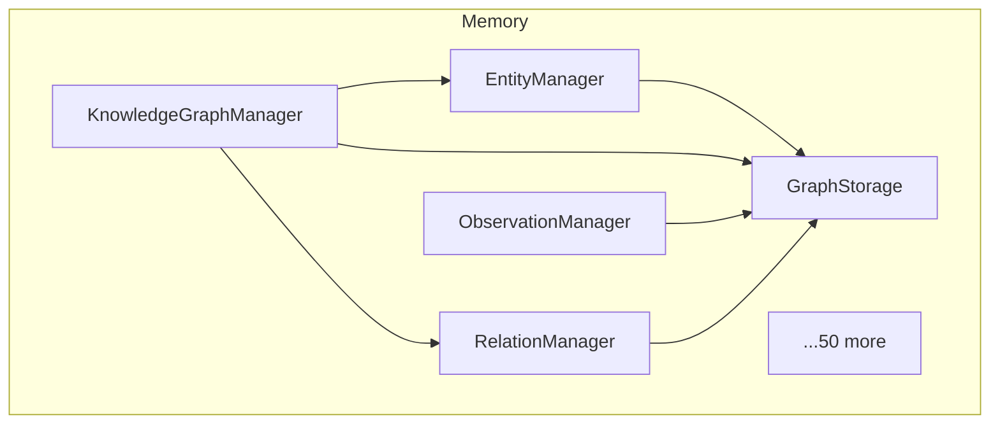

# @danielsimonjr/memory-mcp - Dependency Graph

**Version**: 0.47.1 | **Last Updated**: 2025-12-02

This document provides a comprehensive dependency graph of all files, components, imports, functions, and variables in the codebase.

---

## Table of Contents

1. [Overview](#overview)
2. [Memory Dependencies](#memory-dependencies)
3. [Dependency Matrix](#dependency-matrix)
4. [Circular Dependency Analysis](#circular-dependency-analysis)
5. [Visual Dependency Graph](#visual-dependency-graph)
6. [Summary Statistics](#summary-statistics)

---

## Overview

The codebase is organized into the following modules:

- **memory**: 55 files

---

## Memory Dependencies

### `src/memory/core/EntityManager.ts` - Entity Manager

**Internal Dependencies:**
| File | Imports | Type |
|------|---------|------|
| `../types/index.js` | `Entity` | Import (type-only) |
| `./GraphStorage.js` | `GraphStorage` | Import (type-only) |
| `../utils/errors.js` | `EntityNotFoundError, InvalidImportanceError, ValidationError` | Import |
| `../utils/index.js` | `BatchCreateEntitiesSchema, UpdateEntitySchema, EntityNamesSchema` | Import |
| `../utils/constants.js` | `GRAPH_LIMITS` | Import |

**Exports:**
- Classes: `EntityManager`
- Constants: `MIN_IMPORTANCE`, `MAX_IMPORTANCE`

---

### `src/memory/core/GraphStorage.ts` - Graph Storage

**Node.js Built-in Dependencies:**
| Module | Import |
|--------|--------|
| `fs` | `promises` |

**Internal Dependencies:**
| File | Imports | Type |
|------|---------|------|
| `../types/index.js` | `KnowledgeGraph, Entity, Relation` | Import (type-only) |
| `../utils/searchCache.js` | `clearAllSearchCaches` | Import |

**Exports:**
- Classes: `GraphStorage`

---

### `src/memory/core/KnowledgeGraphManager.ts` - Knowledge Graph Manager

**Node.js Built-in Dependencies:**
| Module | Import |
|--------|--------|
| `path` | `path` |

**Internal Dependencies:**
| File | Imports | Type |
|------|---------|------|
| `../utils/constants.js` | `DEFAULT_DUPLICATE_THRESHOLD, SEARCH_LIMITS` | Import |
| `./GraphStorage.js` | `GraphStorage` | Import |
| `./EntityManager.js` | `EntityManager` | Import |
| `./RelationManager.js` | `RelationManager` | Import |
| `../search/SearchManager.js` | `SearchManager` | Import |
| `../features/CompressionManager.js` | `CompressionManager` | Import |
| `../features/HierarchyManager.js` | `HierarchyManager` | Import |
| `../features/ExportManager.js` | `ExportManager` | Import |
| `../features/ImportManager.js` | `ImportManager` | Import |
| `../features/AnalyticsManager.js` | `AnalyticsManager` | Import |
| `../features/TagManager.js` | `TagManager` | Import |
| `../features/ArchiveManager.js` | `ArchiveManager` | Import |
| `../types/index.js` | `Entity, Relation, KnowledgeGraph, GraphStats, ValidationReport, SavedSearch, TagAlias, SearchResult, ImportResult, CompressionResult` | Import (type-only) |

**Exports:**
- Classes: `KnowledgeGraphManager`

---

### `src/memory/core/ObservationManager.ts` - Observation Manager

**Internal Dependencies:**
| File | Imports | Type |
|------|---------|------|
| `./GraphStorage.js` | `GraphStorage` | Import (type-only) |
| `../utils/errors.js` | `EntityNotFoundError` | Import |

**Exports:**
- Classes: `ObservationManager`
- Interfaces: `AddObservationsResult`

---

### `src/memory/core/RelationManager.ts` - Relation Manager

**Internal Dependencies:**
| File | Imports | Type |
|------|---------|------|
| `../types/index.js` | `Relation` | Import (type-only) |
| `./GraphStorage.js` | `GraphStorage` | Import (type-only) |
| `../utils/errors.js` | `ValidationError` | Import |
| `../utils/index.js` | `BatchCreateRelationsSchema, DeleteRelationsSchema` | Import |
| `../utils/constants.js` | `GRAPH_LIMITS` | Import |

**Exports:**
- Classes: `RelationManager`

---

### `src/memory/core/TransactionManager.ts` - Transaction Manager

**Internal Dependencies:**
| File | Imports | Type |
|------|---------|------|
| `../types/index.js` | `Entity, Relation, KnowledgeGraph` | Import (type-only) |
| `./GraphStorage.js` | `GraphStorage` | Import (type-only) |
| `../features/BackupManager.js` | `BackupManager` | Import |
| `../utils/errors.js` | `KnowledgeGraphError` | Import |

**Exports:**
- Classes: `TransactionManager`
- Interfaces: `TransactionResult`
- Enums: `OperationType`

---

### `src/memory/core/index.ts` - Core Module Barrel Export

**Internal Dependencies:**
| File | Imports | Type |
|------|---------|------|
| `./GraphStorage.js` | `GraphStorage` | Re-export |
| `./EntityManager.js` | `EntityManager` | Re-export |
| `./RelationManager.js` | `RelationManager` | Re-export |
| `./ObservationManager.js` | `ObservationManager` | Re-export |
| `./KnowledgeGraphManager.js` | `KnowledgeGraphManager` | Re-export |
| `./TransactionManager.js` | `TransactionManager, OperationType, type TransactionOperation, type TransactionResult` | Re-export |

**Exports:**
- Re-exports: `GraphStorage`, `EntityManager`, `RelationManager`, `ObservationManager`, `KnowledgeGraphManager`, `TransactionManager`, `OperationType`, `type TransactionOperation`, `type TransactionResult`

---

### `src/memory/features/AnalyticsManager.ts` - Analytics Manager

**Internal Dependencies:**
| File | Imports | Type |
|------|---------|------|
| `../types/index.js` | `ValidationReport, ValidationError, ValidationWarning, GraphStats` | Import (type-only) |
| `../core/GraphStorage.js` | `GraphStorage` | Import (type-only) |

**Exports:**
- Classes: `AnalyticsManager`

---

### `src/memory/features/ArchiveManager.ts` - Archive Manager

**Internal Dependencies:**
| File | Imports | Type |
|------|---------|------|
| `../types/index.js` | `Entity` | Import (type-only) |
| `../core/GraphStorage.js` | `GraphStorage` | Import (type-only) |

**Exports:**
- Classes: `ArchiveManager`
- Interfaces: `ArchiveCriteria`, `ArchiveResult`

---

### `src/memory/features/BackupManager.ts` - Backup Manager

**Node.js Built-in Dependencies:**
| Module | Import |
|--------|--------|
| `fs` | `promises` |
| `path` | `dirname, join` |

**Internal Dependencies:**
| File | Imports | Type |
|------|---------|------|
| `../core/GraphStorage.js` | `GraphStorage` | Import (type-only) |
| `../utils/errors.js` | `FileOperationError` | Import |

**Exports:**
- Classes: `BackupManager`
- Interfaces: `BackupMetadata`, `BackupInfo`

---

### `src/memory/features/CompressionManager.ts` - Compression Manager

**Internal Dependencies:**
| File | Imports | Type |
|------|---------|------|
| `../types/index.js` | `Entity, Relation, CompressionResult` | Import (type-only) |
| `../core/GraphStorage.js` | `GraphStorage` | Import (type-only) |
| `../utils/levenshtein.js` | `levenshteinDistance` | Import |
| `../utils/errors.js` | `EntityNotFoundError, InsufficientEntitiesError` | Import |
| `../utils/constants.js` | `SIMILARITY_WEIGHTS, DEFAULT_DUPLICATE_THRESHOLD` | Import |

**Exports:**
- Classes: `CompressionManager`

---

### `src/memory/features/ExportManager.ts` - Export Manager

**Internal Dependencies:**
| File | Imports | Type |
|------|---------|------|
| `../types/index.js` | `KnowledgeGraph` | Import (type-only) |

**Exports:**
- Classes: `ExportManager`

---

### `src/memory/features/HierarchyManager.ts` - Hierarchy Manager

**Internal Dependencies:**
| File | Imports | Type |
|------|---------|------|
| `../types/index.js` | `Entity, KnowledgeGraph` | Import (type-only) |
| `../core/GraphStorage.js` | `GraphStorage` | Import (type-only) |
| `../utils/errors.js` | `EntityNotFoundError, CycleDetectedError` | Import |

**Exports:**
- Classes: `HierarchyManager`

---

### `src/memory/features/ImportExportManager.ts` - Import/Export Manager

**Internal Dependencies:**
| File | Imports | Type |
|------|---------|------|
| `../types/index.js` | `KnowledgeGraph, ImportResult` | Import (type-only) |
| `../search/BasicSearch.js` | `BasicSearch` | Import (type-only) |
| `./ExportManager.js` | `ExportManager, ExportFormat` | Import |
| `./ImportManager.js` | `ImportManager, ImportFormat, MergeStrategy` | Import |

**Exports:**
- Classes: `ImportExportManager`
- Interfaces: `ExportFilter`

---

### `src/memory/features/ImportManager.ts` - Import Manager

**Internal Dependencies:**
| File | Imports | Type |
|------|---------|------|
| `../types/index.js` | `Entity, Relation, KnowledgeGraph, ImportResult` | Import (type-only) |
| `../core/GraphStorage.js` | `GraphStorage` | Import (type-only) |

**Exports:**
- Classes: `ImportManager`

---

### `src/memory/features/TagManager.ts` - Tag Manager

**Node.js Built-in Dependencies:**
| Module | Import |
|--------|--------|
| `fs/promises` | `* as fs` |

**Internal Dependencies:**
| File | Imports | Type |
|------|---------|------|
| `../types/index.js` | `TagAlias` | Import (type-only) |

**Exports:**
- Classes: `TagManager`

---

### `src/memory/features/index.ts` - Features Module Barrel Export

**Internal Dependencies:**
| File | Imports | Type |
|------|---------|------|
| `./TagManager.js` | `TagManager` | Re-export |
| `./HierarchyManager.js` | `HierarchyManager` | Re-export |
| `./AnalyticsManager.js` | `AnalyticsManager` | Re-export |
| `./CompressionManager.js` | `CompressionManager` | Re-export |
| `./ArchiveManager.js` | `ArchiveManager, type ArchiveCriteria, type ArchiveResult` | Re-export |
| `./BackupManager.js` | `BackupManager, type BackupMetadata, type BackupInfo` | Re-export |
| `./ExportManager.js` | `ExportManager, type ExportFormat` | Re-export |
| `./ImportManager.js` | `ImportManager, type ImportFormat, type MergeStrategy` | Re-export |
| `./ImportExportManager.js` | `ImportExportManager, type ExportFilter` | Re-export |

**Exports:**
- Re-exports: `TagManager`, `HierarchyManager`, `AnalyticsManager`, `CompressionManager`, `ArchiveManager`, `type ArchiveCriteria`, `type ArchiveResult`, `BackupManager`, `type BackupMetadata`, `type BackupInfo`, `ExportManager`, `type ExportFormat`, `ImportManager`, `type ImportFormat`, `type MergeStrategy`, `ImportExportManager`, `type ExportFilter`

---

### `src/memory/index.ts` - Define memory file path using environment variable with fallback

**Node.js Built-in Dependencies:**
| Module | Import |
|--------|--------|
| `fs` | `promises` |
| `path` | `path` |
| `url` | `fileURLToPath` |

**Internal Dependencies:**
| File | Imports | Type |
|------|---------|------|
| `./utils/logger.js` | `logger` | Import |
| `./core/KnowledgeGraphManager.js` | `KnowledgeGraphManager` | Import |
| `./server/MCPServer.js` | `MCPServer` | Import |
| `./types/index.js` | `Entity, Relation, KnowledgeGraph, GraphStats, ValidationReport, ValidationError, ValidationWarning, SavedSearch, TagAlias, SearchResult, BooleanQueryNode, ImportResult, CompressionResult` | Import (type-only) |

**Exports:**
- Functions: `ensureMemoryFilePath`
- Constants: `defaultMemoryPath`

---

### `src/memory/search/BasicSearch.ts` - Basic Search

**Internal Dependencies:**
| File | Imports | Type |
|------|---------|------|
| `../types/index.js` | `KnowledgeGraph` | Import (type-only) |
| `../core/GraphStorage.js` | `GraphStorage` | Import (type-only) |
| `../utils/dateUtils.js` | `isWithinDateRange` | Import |
| `../utils/constants.js` | `SEARCH_LIMITS` | Import |
| `../utils/searchCache.js` | `searchCaches` | Import |
| `./SearchFilterChain.js` | `SearchFilterChain, SearchFilters` | Import |

**Exports:**
- Classes: `BasicSearch`

---

### `src/memory/search/BooleanSearch.ts` - Boolean Search

**Internal Dependencies:**
| File | Imports | Type |
|------|---------|------|
| `../types/index.js` | `BooleanQueryNode, Entity, KnowledgeGraph` | Import (type-only) |
| `../core/GraphStorage.js` | `GraphStorage` | Import (type-only) |
| `../utils/constants.js` | `SEARCH_LIMITS, QUERY_LIMITS` | Import |
| `../utils/errors.js` | `ValidationError` | Import |
| `./SearchFilterChain.js` | `SearchFilterChain, SearchFilters` | Import |

**Exports:**
- Classes: `BooleanSearch`

---

### `src/memory/search/FuzzySearch.ts` - Fuzzy Search

**Internal Dependencies:**
| File | Imports | Type |
|------|---------|------|
| `../types/index.js` | `KnowledgeGraph` | Import (type-only) |
| `../core/GraphStorage.js` | `GraphStorage` | Import (type-only) |
| `../utils/levenshtein.js` | `levenshteinDistance` | Import |
| `../utils/constants.js` | `SEARCH_LIMITS` | Import |
| `./SearchFilterChain.js` | `SearchFilterChain, SearchFilters` | Import |

**Exports:**
- Classes: `FuzzySearch`
- Constants: `DEFAULT_FUZZY_THRESHOLD`

---

### `src/memory/search/RankedSearch.ts` - Ranked Search

**Internal Dependencies:**
| File | Imports | Type |
|------|---------|------|
| `../types/index.js` | `SearchResult, TFIDFIndex` | Import (type-only) |
| `../core/GraphStorage.js` | `GraphStorage` | Import (type-only) |
| `../utils/tfidf.js` | `calculateTFIDF, tokenize` | Import |
| `../utils/constants.js` | `SEARCH_LIMITS` | Import |
| `./TFIDFIndexManager.js` | `TFIDFIndexManager` | Import |
| `./SearchFilterChain.js` | `SearchFilterChain, SearchFilters` | Import |

**Exports:**
- Classes: `RankedSearch`

---

### `src/memory/search/SavedSearchManager.ts` - Saved Search Manager

**Node.js Built-in Dependencies:**
| Module | Import |
|--------|--------|
| `fs/promises` | `* as fs` |

**Internal Dependencies:**
| File | Imports | Type |
|------|---------|------|
| `../types/index.js` | `SavedSearch, KnowledgeGraph` | Import (type-only) |
| `./BasicSearch.js` | `BasicSearch` | Import (type-only) |

**Exports:**
- Classes: `SavedSearchManager`

---

### `src/memory/search/SearchFilterChain.ts` - Search Filter Chain

**Internal Dependencies:**
| File | Imports | Type |
|------|---------|------|
| `../types/entity.types.js` | `Entity` | Import (type-only) |
| `../utils/tagUtils.js` | `normalizeTags, hasMatchingTag` | Import |
| `../utils/filterUtils.js` | `isWithinImportanceRange` | Import |
| `../utils/paginationUtils.js` | `validatePagination, applyPagination, ValidatedPagination` | Import |

**Exports:**
- Classes: `SearchFilterChain`
- Interfaces: `SearchFilters`

---

### `src/memory/search/SearchManager.ts` - Search Manager

**Internal Dependencies:**
| File | Imports | Type |
|------|---------|------|
| `../types/index.js` | `KnowledgeGraph, SearchResult, SavedSearch` | Import (type-only) |
| `../core/GraphStorage.js` | `GraphStorage` | Import (type-only) |
| `./BasicSearch.js` | `BasicSearch` | Import |
| `./RankedSearch.js` | `RankedSearch` | Import |
| `./BooleanSearch.js` | `BooleanSearch` | Import |
| `./FuzzySearch.js` | `FuzzySearch` | Import |
| `./SearchSuggestions.js` | `SearchSuggestions` | Import |
| `./SavedSearchManager.js` | `SavedSearchManager` | Import |

**Exports:**
- Classes: `SearchManager`

---

### `src/memory/search/SearchSuggestions.ts` - Search Suggestions

**Internal Dependencies:**
| File | Imports | Type |
|------|---------|------|
| `../core/GraphStorage.js` | `GraphStorage` | Import (type-only) |
| `../utils/levenshtein.js` | `levenshteinDistance` | Import |

**Exports:**
- Classes: `SearchSuggestions`

---

### `src/memory/search/TFIDFIndexManager.ts` - TF-IDF Index Manager

**Node.js Built-in Dependencies:**
| Module | Import |
|--------|--------|
| `fs/promises` | `* as fs` |
| `path` | `* as path` |

**Internal Dependencies:**
| File | Imports | Type |
|------|---------|------|
| `../types/index.js` | `TFIDFIndex, DocumentVector, KnowledgeGraph` | Import (type-only) |
| `../utils/tfidf.js` | `calculateIDF, tokenize` | Import |

**Exports:**
- Classes: `TFIDFIndexManager`

---

### `src/memory/search/index.ts` - Search Module Barrel Export

**Internal Dependencies:**
| File | Imports | Type |
|------|---------|------|
| `./BasicSearch.js` | `BasicSearch` | Re-export |
| `./RankedSearch.js` | `RankedSearch` | Re-export |
| `./BooleanSearch.js` | `BooleanSearch` | Re-export |
| `./FuzzySearch.js` | `FuzzySearch` | Re-export |
| `./SearchSuggestions.js` | `SearchSuggestions` | Re-export |
| `./SavedSearchManager.js` | `SavedSearchManager` | Re-export |
| `./SearchManager.js` | `SearchManager` | Re-export |
| `./SearchFilterChain.js` | `SearchFilterChain, type SearchFilters, type ValidatedPagination` | Re-export |

**Exports:**
- Re-exports: `BasicSearch`, `RankedSearch`, `BooleanSearch`, `FuzzySearch`, `SearchSuggestions`, `SavedSearchManager`, `SearchManager`, `SearchFilterChain`, `type SearchFilters`, `type ValidatedPagination`

---

### `src/memory/server/MCPServer.ts` - MCP Server

**External Dependencies:**
| Package | Import |
|---------|--------|
| `@modelcontextprotocol/sdk/server/index.js` | `Server` |
| `@modelcontextprotocol/sdk/server/stdio.js` | `StdioServerTransport` |
| `@modelcontextprotocol/sdk/types.js` | `CallToolRequestSchema, ListToolsRequestSchema` |

**Internal Dependencies:**
| File | Imports | Type |
|------|---------|------|
| `../utils/logger.js` | `logger` | Import |
| `./toolDefinitions.js` | `toolDefinitions` | Import |
| `./toolHandlers.js` | `handleToolCall` | Import |
| `../core/KnowledgeGraphManager.js` | `KnowledgeGraphManager` | Import (type-only) |

**Exports:**
- Classes: `MCPServer`

---

### `src/memory/server/toolDefinitions.ts` - MCP Tool Definitions

**Exports:**
- Interfaces: `ToolDefinition`
- Constants: `toolDefinitions`, `toolCategories`

---

### `src/memory/server/toolHandlers.ts` - MCP Tool Handlers

**Internal Dependencies:**
| File | Imports | Type |
|------|---------|------|
| `../utils/responseFormatter.js` | `formatToolResponse, formatTextResponse, formatRawResponse` | Import |
| `../core/KnowledgeGraphManager.js` | `KnowledgeGraphManager` | Import (type-only) |
| `../types/index.js` | `SavedSearch` | Import (type-only) |

**Exports:**
- Functions: `handleToolCall`
- Constants: `toolHandlers`

---

### `src/memory/types/analytics.types.ts` - Analytics Types

---

### `src/memory/types/entity.types.ts` - Entity Types

---

### `src/memory/types/import-export.types.ts` - Import/Export Types

---

### `src/memory/types/index.ts` - Types Module - Barrel Export

**Internal Dependencies:**
| File | Imports | Type |
|------|---------|------|
| `./types/index.js` | `Entity, Relation, KnowledgeGraph, SearchResult` | Import |

---

### `src/memory/types/search.types.ts` - Search Types

**Internal Dependencies:**
| File | Imports | Type |
|------|---------|------|
| `./entity.types.js` | `Entity` | Import (type-only) |

---

### `src/memory/types/tag.types.ts` - Tag Types

---

### `src/memory/utils/constants.ts` - Application Constants

**Exports:**
- Constants: `FILE_EXTENSIONS`, `FILE_SUFFIXES`, `DEFAULT_FILE_NAMES`, `ENV_VARS`, `DEFAULT_BASE_DIR`, `LOG_PREFIXES`, `SIMILARITY_WEIGHTS`, `DEFAULT_DUPLICATE_THRESHOLD`, `SEARCH_LIMITS`, `IMPORTANCE_RANGE`, `GRAPH_LIMITS`, `QUERY_LIMITS`

---

### `src/memory/utils/dateUtils.ts` - Date Utilities

**Exports:**
- Functions: `isWithinDateRange`, `parseDateRange`, `isValidISODate`, `getCurrentTimestamp`

---

### `src/memory/utils/entityUtils.ts` - Entity Lookup and Utility Functions

**Internal Dependencies:**
| File | Imports | Type |
|------|---------|------|
| `../types/entity.types.js` | `Entity, KnowledgeGraph` | Import (type-only) |
| `./errors.js` | `EntityNotFoundError` | Import |

**Exports:**
- Functions: `findEntityByName`, `findEntityByName`, `findEntityByName`, `findEntityByName`, `findEntitiesByNames`, `entityExists`, `getEntityIndex`, `removeEntityByName`, `getEntityNameSet`, `groupEntitiesByType`, `touchEntity`

---

### `src/memory/utils/errors.ts` - Custom Error Types

**Exports:**
- Classes: `KnowledgeGraphError`, `EntityNotFoundError`, `RelationNotFoundError`, `DuplicateEntityError`, `ValidationError`, `CycleDetectedError`, `InvalidImportanceError`, `FileOperationError`, `ImportError`, `ExportError`, `InsufficientEntitiesError`

---

### `src/memory/utils/filterUtils.ts` - Entity Filtering Utilities

**Internal Dependencies:**
| File | Imports | Type |
|------|---------|------|
| `../types/entity.types.js` | `Entity` | Import (type-only) |

**Exports:**
- Interfaces: `CommonSearchFilters`
- Functions: `isWithinImportanceRange`, `filterByImportance`, `isWithinDateRange`, `filterByCreatedDate`, `filterByModifiedDate`, `filterByEntityType`, `entityPassesFilters`

---

### `src/memory/utils/index.ts` - Utilities Module Barrel Export

**Internal Dependencies:**
| File | Imports | Type |
|------|---------|------|
| `./errors.js` | `KnowledgeGraphError, EntityNotFoundError, RelationNotFoundError, DuplicateEntityError, ValidationError, CycleDetectedError, InvalidImportanceError, FileOperationError, ImportError, ExportError, InsufficientEntitiesError` | Re-export |
| `./levenshtein.js` | `levenshteinDistance` | Re-export |
| `./tfidf.js` | `calculateTF, calculateIDF, calculateTFIDF, tokenize` | Re-export |
| `./logger.js` | `logger` | Re-export |
| `./dateUtils.js` | `isWithinDateRange, parseDateRange, isValidISODate, getCurrentTimestamp` | Re-export |
| `./validationUtils.js` | `validateEntity, validateRelation, validateImportance, validateTags, type ValidationResult` | Re-export |
| `./pathUtils.js` | `defaultMemoryPath, ensureMemoryFilePath, validateFilePath` | Re-export |
| `./constants.js` | `FILE_EXTENSIONS, FILE_SUFFIXES, DEFAULT_FILE_NAMES, ENV_VARS, DEFAULT_BASE_DIR, LOG_PREFIXES, SIMILARITY_WEIGHTS, DEFAULT_DUPLICATE_THRESHOLD, SEARCH_LIMITS, IMPORTANCE_RANGE` | Re-export |
| `./schemas.js` | `EntitySchema, CreateEntitySchema, UpdateEntitySchema, RelationSchema, CreateRelationSchema, SearchQuerySchema, DateRangeSchema, TagAliasSchema, ExportFormatSchema, BatchCreateEntitiesSchema, BatchCreateRelationsSchema, EntityNamesSchema, DeleteRelationsSchema, type EntityInput, type CreateEntityInput, type UpdateEntityInput, type RelationInput, type CreateRelationInput, type SearchQuery, type DateRange, type TagAlias, type ExportFormat` | Re-export |
| `./searchCache.js` | `SearchCache, searchCaches, clearAllSearchCaches, getAllCacheStats, cleanupAllCaches, type CacheStats` | Re-export |
| `./responseFormatter.js` | `formatToolResponse, formatTextResponse, formatRawResponse, formatErrorResponse, type ToolResponse` | Re-export |
| `./tagUtils.js` | `normalizeTag, normalizeTags, hasMatchingTag, hasAllTags, filterByTags, addUniqueTags, removeTags` | Re-export |
| `./entityUtils.js` | `findEntityByName, findEntitiesByNames, entityExists, getEntityIndex, removeEntityByName, getEntityNameSet, groupEntitiesByType, touchEntity` | Re-export |
| `./validationHelper.js` | `formatZodErrors, validateWithSchema, validateSafe, validateArrayWithSchema` | Re-export |
| `./paginationUtils.js` | `validatePagination, applyPagination, paginateArray, getPaginationMeta, type ValidatedPagination` | Re-export |
| `./filterUtils.js` | `isWithinImportanceRange, filterByImportance, filterByCreatedDate, filterByModifiedDate, filterByEntityType, entityPassesFilters, type CommonSearchFilters` | Re-export |

**Exports:**
- Re-exports: `KnowledgeGraphError`, `EntityNotFoundError`, `RelationNotFoundError`, `DuplicateEntityError`, `ValidationError`, `CycleDetectedError`, `InvalidImportanceError`, `FileOperationError`, `ImportError`, `ExportError`, `InsufficientEntitiesError`, `levenshteinDistance`, `calculateTF`, `calculateIDF`, `calculateTFIDF`, `tokenize`, `logger`, `isWithinDateRange`, `parseDateRange`, `isValidISODate`, `getCurrentTimestamp`, `validateEntity`, `validateRelation`, `validateImportance`, `validateTags`, `type ValidationResult`, `defaultMemoryPath`, `ensureMemoryFilePath`, `validateFilePath`, `FILE_EXTENSIONS`, `FILE_SUFFIXES`, `DEFAULT_FILE_NAMES`, `ENV_VARS`, `DEFAULT_BASE_DIR`, `LOG_PREFIXES`, `SIMILARITY_WEIGHTS`, `DEFAULT_DUPLICATE_THRESHOLD`, `SEARCH_LIMITS`, `IMPORTANCE_RANGE`, `EntitySchema`, `CreateEntitySchema`, `UpdateEntitySchema`, `RelationSchema`, `CreateRelationSchema`, `SearchQuerySchema`, `DateRangeSchema`, `TagAliasSchema`, `ExportFormatSchema`, `BatchCreateEntitiesSchema`, `BatchCreateRelationsSchema`, `EntityNamesSchema`, `DeleteRelationsSchema`, `type EntityInput`, `type CreateEntityInput`, `type UpdateEntityInput`, `type RelationInput`, `type CreateRelationInput`, `type SearchQuery`, `type DateRange`, `type TagAlias`, `type ExportFormat`, `SearchCache`, `searchCaches`, `clearAllSearchCaches`, `getAllCacheStats`, `cleanupAllCaches`, `type CacheStats`, `formatToolResponse`, `formatTextResponse`, `formatRawResponse`, `formatErrorResponse`, `type ToolResponse`, `normalizeTag`, `normalizeTags`, `hasMatchingTag`, `hasAllTags`, `filterByTags`, `addUniqueTags`, `removeTags`, `findEntityByName`, `findEntitiesByNames`, `entityExists`, `getEntityIndex`, `removeEntityByName`, `getEntityNameSet`, `groupEntitiesByType`, `touchEntity`, `formatZodErrors`, `validateWithSchema`, `validateSafe`, `validateArrayWithSchema`, `validatePagination`, `applyPagination`, `paginateArray`, `getPaginationMeta`, `type ValidatedPagination`, `isWithinImportanceRange`, `filterByImportance`, `filterByCreatedDate`, `filterByModifiedDate`, `filterByEntityType`, `entityPassesFilters`, `type CommonSearchFilters`

---

### `src/memory/utils/levenshtein.ts` - Levenshtein Distance Algorithm

**Exports:**
- Functions: `levenshteinDistance`

---

### `src/memory/utils/logger.ts` - Simple logging utility for the Memory MCP Server

**Exports:**
- Constants: `logger`

---

### `src/memory/utils/paginationUtils.ts` - Pagination Utilities

**Internal Dependencies:**
| File | Imports | Type |
|------|---------|------|
| `./constants.js` | `SEARCH_LIMITS` | Import |

**Exports:**
- Interfaces: `ValidatedPagination`
- Functions: `validatePagination`, `applyPagination`, `paginateArray`, `getPaginationMeta`

---

### `src/memory/utils/pathUtils.ts` - Path Utilities

**Node.js Built-in Dependencies:**
| Module | Import |
|--------|--------|
| `fs` | `promises` |
| `path` | `path` |
| `url` | `fileURLToPath` |

**Internal Dependencies:**
| File | Imports | Type |
|------|---------|------|
| `./errors.js` | `FileOperationError` | Import |

**Exports:**
- Functions: `validateFilePath`, `ensureMemoryFilePath`
- Constants: `defaultMemoryPath`

---

### `src/memory/utils/responseFormatter.ts` - MCP Tool Response Formatter Utilities

**Exports:**
- Functions: `formatToolResponse`, `formatTextResponse`, `formatRawResponse`, `formatErrorResponse`

---

### `src/memory/utils/schemas.ts` - Validation Schemas

**External Dependencies:**
| Package | Import |
|---------|--------|
| `zod` | `z` |

**Internal Dependencies:**
| File | Imports | Type |
|------|---------|------|
| `./constants.js` | `IMPORTANCE_RANGE` | Import |

**Exports:**
- Constants: `EntitySchema`, `CreateEntitySchema`, `UpdateEntitySchema`, `RelationSchema`, `CreateRelationSchema`, `SearchQuerySchema`, `DateRangeSchema`, `TagAliasSchema`, `ExportFormatSchema`, `BatchCreateEntitiesSchema`, `BatchCreateRelationsSchema`, `EntityNamesSchema`, `DeleteRelationsSchema`

---

### `src/memory/utils/searchCache.ts` - Search Result Cache

**Internal Dependencies:**
| File | Imports | Type |
|------|---------|------|
| `../types/index.js` | `SearchResult, KnowledgeGraph` | Import (type-only) |

**Exports:**
- Classes: `SearchCache`
- Interfaces: `CacheStats`
- Functions: `clearAllSearchCaches`, `getAllCacheStats`, `cleanupAllCaches`
- Constants: `searchCaches`

---

### `src/memory/utils/tagUtils.ts` - Tag Normalization and Matching Utilities

**Exports:**
- Functions: `normalizeTag`, `normalizeTags`, `hasMatchingTag`, `hasAllTags`, `filterByTags`, `addUniqueTags`, `removeTags`

---

### `src/memory/utils/tfidf.ts` - TF-IDF (Term Frequency-Inverse Document Frequency) Utilities

**Exports:**
- Functions: `calculateTF`, `calculateIDF`, `calculateTFIDF`, `tokenize`, `calculateMultiTermTFIDF`

---

### `src/memory/utils/validationHelper.ts` - Zod Schema Validation Helper

**External Dependencies:**
| Package | Import |
|---------|--------|
| `zod` | `ZodSchema, ZodError` |

**Internal Dependencies:**
| File | Imports | Type |
|------|---------|------|
| `./errors.js` | `ValidationError` | Import |

**Exports:**
- Functions: `formatZodErrors`, `validateWithSchema`, `validateSafe`, `validateArrayWithSchema`

---

### `src/memory/utils/validationUtils.ts` - Validation Utilities

**Internal Dependencies:**
| File | Imports | Type |
|------|---------|------|
| `./constants.js` | `IMPORTANCE_RANGE` | Import |

**Exports:**
- Interfaces: `ValidationResult`
- Functions: `validateEntity`, `validateRelation`, `validateImportance`, `validateTags`

---

### `src/memory/vitest.config.ts` - vitest.config module

**External Dependencies:**
| Package | Import |
|---------|--------|
| `vitest/config` | `defineConfig` |

**Exports:**
- Default: `defineConfig`

---

## Dependency Matrix

### File Import/Export Matrix

| File | Imports From | Exports To |
|------|--------------|------------|
| `EntityManager` | 5 files | 2 files |
| `GraphStorage` | 2 files | 18 files |
| `KnowledgeGraphManager` | 13 files | 4 files |
| `ObservationManager` | 2 files | 1 files |
| `RelationManager` | 5 files | 2 files |
| `TransactionManager` | 4 files | 1 files |
| `index` | 6 files | 0 files |
| `AnalyticsManager` | 2 files | 2 files |
| `ArchiveManager` | 2 files | 2 files |
| `BackupManager` | 2 files | 2 files |
| `CompressionManager` | 5 files | 2 files |
| `ExportManager` | 1 files | 3 files |
| `HierarchyManager` | 3 files | 2 files |
| `ImportExportManager` | 4 files | 1 files |
| `ImportManager` | 2 files | 3 files |
| `TagManager` | 1 files | 2 files |
| `index` | 9 files | 0 files |
| `index` | 4 files | 0 files |
| `BasicSearch` | 6 files | 4 files |
| `BooleanSearch` | 5 files | 2 files |
| `FuzzySearch` | 5 files | 2 files |
| `RankedSearch` | 6 files | 2 files |
| `SavedSearchManager` | 2 files | 2 files |
| `SearchFilterChain` | 4 files | 5 files |
| `SearchManager` | 8 files | 2 files |
| `SearchSuggestions` | 2 files | 2 files |
| `TFIDFIndexManager` | 2 files | 1 files |
| `index` | 8 files | 0 files |
| `MCPServer` | 4 files | 1 files |
| `toolDefinitions` | 0 files | 1 files |

---

## Circular Dependency Analysis

**No circular dependencies detected.**
---

## Visual Dependency Graph

---

## Summary Statistics

| Category | Count |
|----------|-------|
| Total TypeScript Files | 55 |
| Total Modules | 1 |
| Total Lines of Code | 10835 |
| Total Exports | 268 |
| Total Re-exports | 139 |
| Total Classes | 37 |
| Total Interfaces | 27 |
| Total Functions | 58 |
| Total Type Guards | 4 |
| Total Enums | 1 |
| Type-only Imports | 47 |
| Runtime Circular Deps | 0 |
| Type-only Circular Deps | 0 |

---

*Last Updated*: 2025-12-02
*Version*: 0.47.1
