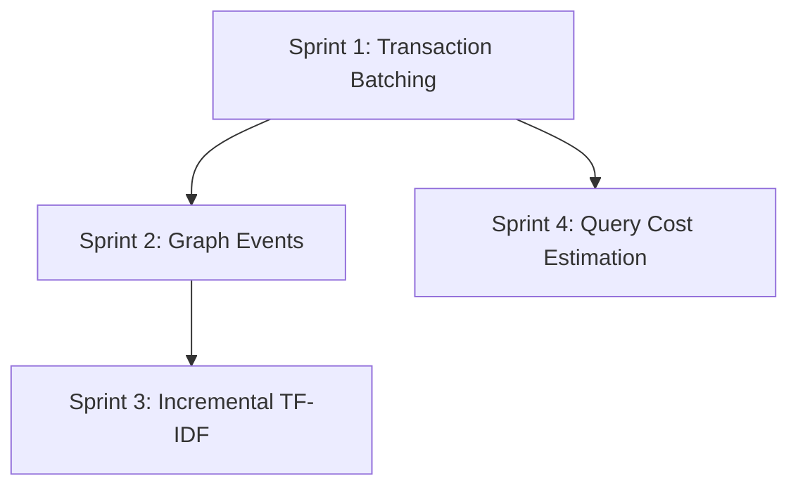

# Phase 10: Advanced Features & Developer Experience

**Version**: 1.0.0
**Created**: 2026-01-05
**Status**: PLANNED
**Total Sprints**: 4
**Total Tasks**: 14 tasks organized into sprints of 3-4 items
**Prerequisites**: Phase 9 (Advanced Optimizations) complete, All 2267+ tests passing

---

## Executive Summary

Phase 10 implements the remaining "New Feature Ideas" from the Future Features Roadmap (Section 4). These enhancements focus on developer experience, reactive programming patterns, and query optimization capabilities.

### Key Features

1. **Transaction Batching API** - Reduce mutex overhead for multiple sequential operations
2. **Graph Change Events** - EventEmitter-based reactive updates for real-time sync
3. **Incremental TF-IDF Index** - Maintain search index incrementally on entity changes
4. **Query Cost Estimation** - Estimate and optimize query cost before execution

### Target Metrics

| Metric | Current | Target | Improvement |
|--------|---------|--------|-------------|
| Sequential operations (10 ops) | 10 lock/unlock cycles | 1 lock/unlock cycle | 10x less overhead |
| Index rebuild after entity change | Full TF-IDF rebuild | Incremental update | 50-100x faster |
| Query optimization | None | Cost-based suggestions | Better UX |
| External sync latency | Polling required | Real-time events | Instant |

### When These Features Matter

- **Transaction Batching**: Bulk import workflows, migration scripts, batch processing
- **Graph Change Events**: Real-time dashboards, external sync, audit logging
- **Incremental TF-IDF**: Frequent entity updates with immediate search needs
- **Query Cost Estimation**: Complex queries on large graphs, user-facing query interfaces

---

## Sprint 1: Transaction Batching API

**Priority**: HIGH (P1)
**Estimated Duration**: 6 hours
**Impact**: 2-3x speedup for workloads with many small sequential operations

### Task 1.1: Create Transaction Interface and Types

**File**: `src/types/types.ts`
**Estimated Time**: 30 minutes
**Agent**: Haiku

**Description**: Define the TypeScript interfaces for the transaction API.

**Step-by-Step Instructions**:

1. **Open the file**: `src/types/types.ts`

2. **Find the end of the existing interface definitions** (scroll to bottom or search for last `export interface`)

3. **Add the following interfaces before the closing of the file**:
   ```typescript
   /**
    * Transaction context for batching multiple operations.
    * Operations within a transaction share a single lock/unlock cycle.
    * Note: Named BatchTransactionContext to avoid collision with existing TransactionResult in TransactionManager.ts
    */
   export interface BatchTransactionContext {
     /** Create multiple entities within the transaction */
     createEntities(entities: EntityInput[]): void;

     /** Create multiple relations within the transaction */
     createRelations(relations: RelationInput[]): void;

     /** Add observations to entities within the transaction */
     addObservations(observations: { entityName: string; contents: string[] }[]): void;

     /** Delete entities within the transaction */
     deleteEntities(entityNames: string[]): void;

     /** Delete relations within the transaction */
     deleteRelations(relations: { from: string; to: string; relationType: string }[]): void;

     /** Update entities within the transaction */
     updateEntities(updates: { name: string; updates: Partial<Entity> }[]): void;

     /** Add tags to entities within the transaction */
     addTags(entityName: string, tags: string[]): void;

     /** Set importance for an entity within the transaction */
     setImportance(entityName: string, importance: number): void;
   }

   /**
    * Input for creating a new entity.
    */
   export interface EntityInput {
     name: string;
     entityType: string;
     observations: string[];
     tags?: string[];
     importance?: number;
     parentId?: string;
   }

   /**
    * Input for creating a new relation.
    */
   export interface RelationInput {
     from: string;
     to: string;
     relationType: string;
   }

   /**
    * Result of a committed batch transaction.
    * Note: Named BatchTransactionResult to avoid collision with existing TransactionResult in TransactionManager.ts
    */
   export interface BatchTransactionResult {
     /** Whether the transaction was successful */
     success: boolean;
     /** Number of entities created */
     entitiesCreated: number;
     /** Number of entities updated */
     entitiesUpdated: number;
     /** Number of entities deleted */
     entitiesDeleted: number;
     /** Number of relations created */
     relationsCreated: number;
     /** Number of relations deleted */
     relationsDeleted: number;
     /** Number of observations added */
     observationsAdded: number;
     /** Duration of the transaction in milliseconds */
     durationMs: number;
   }
   ```

4. **Verify TypeScript compilation**:
   ```bash
   npm run typecheck
   ```

**Acceptance Criteria**:
- [ ] BatchTransactionContext interface defined with all operation methods
- [ ] EntityInput and RelationInput helper types defined
- [ ] BatchTransactionResult interface defined with statistics
- [ ] TypeScript compilation passes
- [ ] No breaking changes to existing types

---

### Task 1.2: Implement TransactionManager Class

**File**: `src/core/TransactionManager.ts` (modify existing or create new section)
**Estimated Time**: 2 hours
**Agent**: Haiku

**Description**: Extend the existing TransactionManager to support the batching API.

**Step-by-Step Instructions**:

1. **Open the file**: `src/core/TransactionManager.ts`

2. **Add imports at the top** if not already present:
   ```typescript
   import type {
     BatchTransactionContext,
     BatchTransactionResult,
     EntityInput,
     RelationInput,
     Entity,
     Relation,
     KnowledgeGraph
   } from '../types/types.js';
   ```

3. **Add a new class or extend existing** for the batching transaction:
   ```typescript
   /**
    * Pending operations collected during a transaction.
    * These are applied atomically when the transaction commits.
    */
   interface PendingOperations {
     entitiesToCreate: EntityInput[];
     entitiesToUpdate: { name: string; updates: Partial<Entity> }[];
     entitiesToDelete: Set<string>;
     relationsToCreate: RelationInput[];
     relationsToDelete: { from: string; to: string; relationType: string }[];
     observationsToAdd: { entityName: string; contents: string[] }[];
     tagsToAdd: { entityName: string; tags: string[] }[];
     importanceToSet: { entityName: string; importance: number }[];
   }

   /**
    * BatchTransaction provides a fluent API for collecting multiple operations
    * and executing them in a single lock/unlock cycle.
    *
    * @example
    * ```typescript
    * await storage.transaction(async (tx) => {
    *   tx.createEntities([{ name: 'Alice', entityType: 'person', observations: [] }]);
    *   tx.createRelations([{ from: 'Alice', to: 'Bob', relationType: 'knows' }]);
    *   tx.addObservations([{ entityName: 'Alice', contents: ['Works at Acme'] }]);
    * }); // Single lock/unlock, single save
    * ```
    */
   export class BatchTransaction implements BatchTransactionContext {
     private pending: PendingOperations = {
       entitiesToCreate: [],
       entitiesToUpdate: [],
       entitiesToDelete: new Set(),
       relationsToCreate: [],
       relationsToDelete: [],
       observationsToAdd: [],
       tagsToAdd: [],
       importanceToSet: [],
     };

     createEntities(entities: EntityInput[]): void {
       this.pending.entitiesToCreate.push(...entities);
     }

     createRelations(relations: RelationInput[]): void {
       this.pending.relationsToCreate.push(...relations);
     }

     addObservations(observations: { entityName: string; contents: string[] }[]): void {
       this.pending.observationsToAdd.push(...observations);
     }

     deleteEntities(entityNames: string[]): void {
       for (const name of entityNames) {
         this.pending.entitiesToDelete.add(name);
       }
     }

     deleteRelations(relations: { from: string; to: string; relationType: string }[]): void {
       this.pending.relationsToDelete.push(...relations);
     }

     updateEntities(updates: { name: string; updates: Partial<Entity> }[]): void {
       this.pending.entitiesToUpdate.push(...updates);
     }

     addTags(entityName: string, tags: string[]): void {
       this.pending.tagsToAdd.push({ entityName, tags });
     }

     setImportance(entityName: string, importance: number): void {
       this.pending.importanceToSet.push({ entityName, importance });
     }

     /**
      * Get the pending operations for execution.
      * @internal Used by the storage layer to apply operations.
      */
     getPendingOperations(): PendingOperations {
       return this.pending;
     }

     /**
      * Check if the transaction has any pending operations.
      */
     hasPendingOperations(): boolean {
       return (
         this.pending.entitiesToCreate.length > 0 ||
         this.pending.entitiesToUpdate.length > 0 ||
         this.pending.entitiesToDelete.size > 0 ||
         this.pending.relationsToCreate.length > 0 ||
         this.pending.relationsToDelete.length > 0 ||
         this.pending.observationsToAdd.length > 0 ||
         this.pending.tagsToAdd.length > 0 ||
         this.pending.importanceToSet.length > 0
       );
     }

     /**
      * Get statistics about pending operations.
      */
     getStats(): {
       entities: { create: number; update: number; delete: number };
       relations: { create: number; delete: number };
       observations: number;
       tags: number;
       importance: number;
     } {
       return {
         entities: {
           create: this.pending.entitiesToCreate.length,
           update: this.pending.entitiesToUpdate.length,
           delete: this.pending.entitiesToDelete.size,
         },
         relations: {
           create: this.pending.relationsToCreate.length,
           delete: this.pending.relationsToDelete.length,
         },
         observations: this.pending.observationsToAdd.length,
         tags: this.pending.tagsToAdd.length,
         importance: this.pending.importanceToSet.length,
       };
     }
   }
   ```

4. **Export the BatchTransaction class** by updating the barrel export if needed.

5. **Verify TypeScript compilation**:
   ```bash
   npm run typecheck
   ```

**Acceptance Criteria**:
- [ ] BatchTransaction class implements BatchTransactionContext interface
- [ ] All operation methods collect pending operations
- [ ] getPendingOperations() returns collected operations
- [ ] hasPendingOperations() correctly detects pending work
- [ ] getStats() returns operation counts
- [ ] TypeScript compilation passes

---

### Task 1.3: Add Transaction Method to GraphStorage

**File**: `src/core/GraphStorage.ts`
**Estimated Time**: 2 hours
**Agent**: Haiku

**Description**: Add a `transaction()` method to GraphStorage that executes a callback with a BatchTransaction context.

**Step-by-Step Instructions**:

1. **Open the file**: `src/core/GraphStorage.ts`

2. **Add import for BatchTransaction** at the top:
   ```typescript
   import { BatchTransaction } from './TransactionManager.js';
   import type { BatchTransactionContext, BatchTransactionResult } from '../types/types.js';
   ```

3. **Add the transaction method** to the GraphStorage class (find a good location, perhaps after saveGraph):
   ```typescript
   /**
    * Execute multiple operations in a single transaction.
    * All operations share a single lock/unlock cycle and single save operation.
    *
    * This is more efficient than calling individual methods for bulk operations:
    * - Before: 10 operations = 10 lock/unlock cycles, 10 file saves
    * - After: 10 operations = 1 lock/unlock cycle, 1 file save
    *
    * @param callback - Function that receives a BatchTransactionContext and queues operations
    * @returns BatchTransactionResult with statistics
    *
    * @example
    * ```typescript
    * const result = await storage.transaction(async (tx) => {
    *   tx.createEntities([
    *     { name: 'Alice', entityType: 'person', observations: ['Engineer'] },
    *     { name: 'Bob', entityType: 'person', observations: ['Designer'] },
    *   ]);
    *   tx.createRelations([
    *     { from: 'Alice', to: 'Bob', relationType: 'knows' },
    *   ]);
    * });
    * console.log(`Created ${result.entitiesCreated} entities`);
    * ```
    */
   async transaction(
     callback: (tx: BatchTransactionContext) => void | Promise<void>
   ): Promise<BatchTransactionResult> {
     const startTime = Date.now();
     const tx = new BatchTransaction();

     // Execute the callback to collect operations
     await callback(tx);

     // If no operations were queued, return early
     if (!tx.hasPendingOperations()) {
       return {
         success: true,
         entitiesCreated: 0,
         entitiesUpdated: 0,
         entitiesDeleted: 0,
         relationsCreated: 0,
         relationsDeleted: 0,
         observationsAdded: 0,
         durationMs: Date.now() - startTime,
       };
     }

     // Acquire lock once for all operations
     const graph = await this.getGraphForMutation();
     const pending = tx.getPendingOperations();
     const timestamp = new Date().toISOString();

     let entitiesCreated = 0;
     let entitiesUpdated = 0;
     let entitiesDeleted = 0;
     let relationsCreated = 0;
     let relationsDeleted = 0;
     let observationsAdded = 0;

     // 1. Create entities
     for (const input of pending.entitiesToCreate) {
       const entity: Entity = {
         name: input.name,
         entityType: input.entityType,
         observations: input.observations,
         tags: input.tags,
         importance: input.importance,
         parentId: input.parentId,
         createdAt: timestamp,
         lastModified: timestamp,
       };
       graph.entities.push(entity);
       entitiesCreated++;
     }

     // 2. Create relations
     for (const input of pending.relationsToCreate) {
       const relation: Relation = {
         from: input.from,
         to: input.to,
         relationType: input.relationType,
       };
       graph.relations.push(relation);
       relationsCreated++;
     }

     // 3. Add observations
     const entityMap = new Map(graph.entities.map(e => [e.name, e]));
     for (const { entityName, contents } of pending.observationsToAdd) {
       const entity = entityMap.get(entityName);
       if (entity) {
         entity.observations.push(...contents);
         entity.lastModified = timestamp;
         observationsAdded += contents.length;
       }
     }

     // 4. Add tags
     for (const { entityName, tags } of pending.tagsToAdd) {
       const entity = entityMap.get(entityName);
       if (entity) {
         const normalizedTags = tags.map(t => t.toLowerCase());
         entity.tags = [...new Set([...(entity.tags ?? []), ...normalizedTags])];
         entity.lastModified = timestamp;
       }
     }

     // 5. Set importance
     for (const { entityName, importance } of pending.importanceToSet) {
       const entity = entityMap.get(entityName);
       if (entity) {
         entity.importance = importance;
         entity.lastModified = timestamp;
       }
     }

     // 6. Update entities
     for (const { name, updates } of pending.entitiesToUpdate) {
       const entity = entityMap.get(name);
       if (entity) {
         Object.assign(entity, updates);
         entity.lastModified = timestamp;
         entitiesUpdated++;
       }
     }

     // 7. Delete entities
     if (pending.entitiesToDelete.size > 0) {
       const originalCount = graph.entities.length;
       graph.entities = graph.entities.filter(e => !pending.entitiesToDelete.has(e.name));
       entitiesDeleted = originalCount - graph.entities.length;

       // Also delete relations involving deleted entities
       graph.relations = graph.relations.filter(
         r => !pending.entitiesToDelete.has(r.from) && !pending.entitiesToDelete.has(r.to)
       );
     }

     // 8. Delete specific relations
     if (pending.relationsToDelete.length > 0) {
       const toDelete = new Set(
         pending.relationsToDelete.map(r => `${r.from}|${r.to}|${r.relationType}`)
       );
       const originalCount = graph.relations.length;
       graph.relations = graph.relations.filter(
         r => !toDelete.has(`${r.from}|${r.to}|${r.relationType}`)
       );
       relationsDeleted = originalCount - graph.relations.length;
     }

     // Single save for all operations
     await this.saveGraph(graph);

     return {
       success: true,
       entitiesCreated,
       entitiesUpdated,
       entitiesDeleted,
       relationsCreated,
       relationsDeleted,
       observationsAdded,
       durationMs: Date.now() - startTime,
     };
   }
   ```

4. **Verify TypeScript compilation**:
   ```bash
   npm run typecheck
   ```

5. **Run existing GraphStorage tests** to ensure no regressions:
   ```bash
   npx vitest run tests/unit/core/GraphStorage.test.ts
   ```

**Acceptance Criteria**:
- [ ] transaction() method added to GraphStorage
- [ ] Callback receives BatchTransactionContext
- [ ] All operations applied in correct order
- [ ] Single lock acquisition for all operations
- [ ] Single save after all operations
- [ ] BatchTransactionResult contains accurate statistics
- [ ] TypeScript compilation passes
- [ ] Existing tests still pass

---

### Task 1.4: Create Transaction API Unit Tests

**File**: `tests/unit/core/TransactionBatching.test.ts` (new)
**Estimated Time**: 1.5 hours
**Agent**: Haiku

**Description**: Create comprehensive unit tests for the transaction batching API.

**Step-by-Step Instructions**:

1. **Create the test file**: `tests/unit/core/TransactionBatching.test.ts`

2. **Add imports**:
   ```typescript
   import { describe, it, expect, beforeEach, afterEach } from 'vitest';
   import { GraphStorage } from '../../../src/core/GraphStorage.js';
   import { promises as fs } from 'fs';
   import { join } from 'path';
   import { tmpdir } from 'os';
   ```

3. **Add test suite**:
   ```typescript
   describe('Transaction Batching API', () => {
     let testDir: string;
     let storage: GraphStorage;

     beforeEach(async () => {
       testDir = join(tmpdir(), `tx-test-${Date.now()}-${Math.random().toString(36).slice(2)}`);
       await fs.mkdir(testDir, { recursive: true });
       storage = new GraphStorage(join(testDir, 'test.jsonl'));
     });

     afterEach(async () => {
       try {
         await fs.rm(testDir, { recursive: true, force: true });
       } catch {
         // Ignore cleanup errors
       }
     });

     describe('basic operations', () => {
       it('should create entities in a transaction', async () => {
         const result = await storage.transaction((tx) => {
           tx.createEntities([
             { name: 'Alice', entityType: 'person', observations: ['Engineer'] },
             { name: 'Bob', entityType: 'person', observations: ['Designer'] },
           ]);
         });

         expect(result.success).toBe(true);
         expect(result.entitiesCreated).toBe(2);

         const graph = await storage.loadGraph();
         expect(graph.entities.length).toBe(2);
         expect(graph.entities.find(e => e.name === 'Alice')).toBeDefined();
         expect(graph.entities.find(e => e.name === 'Bob')).toBeDefined();
       });

       it('should create relations in a transaction', async () => {
         // First create entities
         await storage.transaction((tx) => {
           tx.createEntities([
             { name: 'Alice', entityType: 'person', observations: [] },
             { name: 'Bob', entityType: 'person', observations: [] },
           ]);
         });

         // Then create relations
         const result = await storage.transaction((tx) => {
           tx.createRelations([
             { from: 'Alice', to: 'Bob', relationType: 'knows' },
           ]);
         });

         expect(result.relationsCreated).toBe(1);

         const graph = await storage.loadGraph();
         expect(graph.relations.length).toBe(1);
         expect(graph.relations[0].from).toBe('Alice');
       });

       it('should add observations in a transaction', async () => {
         await storage.transaction((tx) => {
           tx.createEntities([
             { name: 'Alice', entityType: 'person', observations: ['Initial'] },
           ]);
         });

         const result = await storage.transaction((tx) => {
           tx.addObservations([
             { entityName: 'Alice', contents: ['Added 1', 'Added 2'] },
           ]);
         });

         expect(result.observationsAdded).toBe(2);

         const graph = await storage.loadGraph();
         const alice = graph.entities.find(e => e.name === 'Alice');
         expect(alice?.observations).toContain('Initial');
         expect(alice?.observations).toContain('Added 1');
         expect(alice?.observations).toContain('Added 2');
       });

       it('should delete entities in a transaction', async () => {
         await storage.transaction((tx) => {
           tx.createEntities([
             { name: 'Alice', entityType: 'person', observations: [] },
             { name: 'Bob', entityType: 'person', observations: [] },
             { name: 'Charlie', entityType: 'person', observations: [] },
           ]);
         });

         const result = await storage.transaction((tx) => {
           tx.deleteEntities(['Bob']);
         });

         expect(result.entitiesDeleted).toBe(1);

         const graph = await storage.loadGraph();
         expect(graph.entities.length).toBe(2);
         expect(graph.entities.find(e => e.name === 'Bob')).toBeUndefined();
       });
     });

     describe('combined operations', () => {
       it('should handle multiple operation types in one transaction', async () => {
         const result = await storage.transaction((tx) => {
           tx.createEntities([
             { name: 'Alice', entityType: 'person', observations: ['Engineer'] },
             { name: 'Bob', entityType: 'person', observations: ['Designer'] },
           ]);
           tx.createRelations([
             { from: 'Alice', to: 'Bob', relationType: 'knows' },
           ]);
           tx.addTags('Alice', ['tech', 'senior']);
           tx.setImportance('Bob', 8);
         });

         expect(result.entitiesCreated).toBe(2);
         expect(result.relationsCreated).toBe(1);

         const graph = await storage.loadGraph();
         const alice = graph.entities.find(e => e.name === 'Alice');
         const bob = graph.entities.find(e => e.name === 'Bob');

         expect(alice?.tags).toContain('tech');
         expect(alice?.tags).toContain('senior');
         expect(bob?.importance).toBe(8);
       });

       it('should return early for empty transactions', async () => {
         const result = await storage.transaction((tx) => {
           // No operations
         });

         expect(result.success).toBe(true);
         expect(result.entitiesCreated).toBe(0);
         expect(result.durationMs).toBeLessThan(50);
       });
     });

     describe('performance', () => {
       it('should be faster than individual operations for bulk work', async () => {
         const entityCount = 100;
         const entities = Array.from({ length: entityCount }, (_, i) => ({
           name: `Entity${i}`,
           entityType: 'test',
           observations: [`Observation ${i}`],
         }));

         // Time the transaction approach
         const txStart = Date.now();
         await storage.transaction((tx) => {
           tx.createEntities(entities);
         });
         const txDuration = Date.now() - txStart;

         console.log(`Transaction (${entityCount} entities): ${txDuration}ms`);

         // Should complete in reasonable time
         expect(txDuration).toBeLessThan(1000);

         // Verify all entities created
         const graph = await storage.loadGraph();
         expect(graph.entities.length).toBe(entityCount);
       });
     });

     describe('edge cases', () => {
       it('should handle async callback', async () => {
         const result = await storage.transaction(async (tx) => {
           // Simulate async work
           await new Promise(resolve => setTimeout(resolve, 10));
           tx.createEntities([
             { name: 'AsyncEntity', entityType: 'test', observations: [] },
           ]);
         });

         expect(result.entitiesCreated).toBe(1);
       });

       it('should update lastModified timestamp for modifications', async () => {
         await storage.transaction((tx) => {
           tx.createEntities([
             { name: 'Entity1', entityType: 'test', observations: [] },
           ]);
         });

         const before = (await storage.loadGraph()).entities[0].lastModified;

         // Wait a bit
         await new Promise(resolve => setTimeout(resolve, 50));

         await storage.transaction((tx) => {
           tx.addTags('Entity1', ['updated']);
         });

         const after = (await storage.loadGraph()).entities[0].lastModified;

         expect(after).not.toBe(before);
       });
     });
   });
   ```

4. **Run the tests**:
   ```bash
   npx vitest run tests/unit/core/TransactionBatching.test.ts
   ```

**Acceptance Criteria**:
- [ ] 12+ unit tests for transaction batching
- [ ] Tests cover create, update, delete operations
- [ ] Tests cover combined operations in single transaction
- [ ] Tests verify performance benefit
- [ ] Tests cover edge cases (empty transaction, async callback)
- [ ] All tests pass

---

## Sprint 2: Graph Change Events

**Priority**: MEDIUM (P2)
**Estimated Duration**: 5 hours
**Impact**: Enables real-time sync, audit logging, cache invalidation

### Task 2.1: Create GraphEventEmitter Class

**File**: `src/core/GraphEventEmitter.ts` (new)
**Estimated Time**: 1.5 hours
**Agent**: Haiku

**Description**: Create an EventEmitter-based class for graph change notifications.

**Step-by-Step Instructions**:

1. **Create the new file**: `src/core/GraphEventEmitter.ts`

2. **Add the implementation**:
   ```typescript
   import { EventEmitter } from 'events';
   import type { Entity, Relation } from '../types/types.js';

   /**
    * Event types emitted by the graph.
    */
   export type GraphEventType =
     | 'entityCreated'
     | 'entityUpdated'
     | 'entityDeleted'
     | 'relationCreated'
     | 'relationDeleted'
     | 'observationAdded'
     | 'observationDeleted'
     | 'graphLoaded'
     | 'graphSaved';

   /**
    * Base event payload with timestamp.
    */
   export interface GraphEventBase {
     timestamp: string;
   }

   /**
    * Entity created event payload.
    */
   export interface EntityCreatedEvent extends GraphEventBase {
     entity: Entity;
   }

   /**
    * Entity updated event payload.
    */
   export interface EntityUpdatedEvent extends GraphEventBase {
     entity: Entity;
     changes: Partial<Entity>;
     previousValues: Partial<Entity>;
   }

   /**
    * Entity deleted event payload.
    */
   export interface EntityDeletedEvent extends GraphEventBase {
     entityName: string;
     entity: Entity;
   }

   /**
    * Relation created event payload.
    */
   export interface RelationCreatedEvent extends GraphEventBase {
     relation: Relation;
   }

   /**
    * Relation deleted event payload.
    */
   export interface RelationDeletedEvent extends GraphEventBase {
     relation: Relation;
   }

   /**
    * Observation added event payload.
    */
   export interface ObservationAddedEvent extends GraphEventBase {
     entityName: string;
     observations: string[];
   }

   /**
    * Observation deleted event payload.
    */
   export interface ObservationDeletedEvent extends GraphEventBase {
     entityName: string;
     observations: string[];
   }

   /**
    * Graph loaded event payload.
    */
   export interface GraphLoadedEvent extends GraphEventBase {
     entityCount: number;
     relationCount: number;
   }

   /**
    * Graph saved event payload.
    */
   export interface GraphSavedEvent extends GraphEventBase {
     entityCount: number;
     relationCount: number;
     bytesWritten?: number;
   }

   /**
    * Map of event types to their payload types.
    */
   export interface GraphEventMap {
     entityCreated: EntityCreatedEvent;
     entityUpdated: EntityUpdatedEvent;
     entityDeleted: EntityDeletedEvent;
     relationCreated: RelationCreatedEvent;
     relationDeleted: RelationDeletedEvent;
     observationAdded: ObservationAddedEvent;
     observationDeleted: ObservationDeletedEvent;
     graphLoaded: GraphLoadedEvent;
     graphSaved: GraphSavedEvent;
   }

   /**
    * Type-safe event listener function.
    */
   export type GraphEventListener<T extends GraphEventType> = (
     event: GraphEventMap[T]
   ) => void;

   /**
    * EventEmitter for graph changes with type-safe events.
    *
    * @example
    * ```typescript
    * const emitter = new GraphEventEmitter();
    *
    * emitter.on('entityCreated', (event) => {
    *   console.log(`New entity: ${event.entity.name}`);
    * });
    *
    * emitter.on('entityUpdated', (event) => {
    *   console.log(`Updated: ${event.entity.name}`, event.changes);
    * });
    * ```
    */
   export class GraphEventEmitter {
     private emitter = new EventEmitter();

     /**
      * Maximum listeners per event (default: 100).
      */
     setMaxListeners(n: number): this {
       this.emitter.setMaxListeners(n);
       return this;
     }

     /**
      * Register a listener for a graph event.
      */
     on<T extends GraphEventType>(
       event: T,
       listener: GraphEventListener<T>
     ): this {
       this.emitter.on(event, listener);
       return this;
     }

     /**
      * Register a one-time listener for a graph event.
      */
     once<T extends GraphEventType>(
       event: T,
       listener: GraphEventListener<T>
     ): this {
       this.emitter.once(event, listener);
       return this;
     }

     /**
      * Remove a listener for a graph event.
      */
     off<T extends GraphEventType>(
       event: T,
       listener: GraphEventListener<T>
     ): this {
       this.emitter.off(event, listener);
       return this;
     }

     /**
      * Remove all listeners for a specific event or all events.
      */
     removeAllListeners(event?: GraphEventType): this {
       this.emitter.removeAllListeners(event);
       return this;
     }

     /**
      * Emit a graph event.
      * @internal Used by storage layer to emit events.
      */
     emit<T extends GraphEventType>(
       event: T,
       payload: Omit<GraphEventMap[T], 'timestamp'>
     ): boolean {
       const fullPayload = {
         ...payload,
         timestamp: new Date().toISOString(),
       };
       return this.emitter.emit(event, fullPayload);
     }

     /**
      * Get the number of listeners for an event.
      */
     listenerCount(event: GraphEventType): number {
       return this.emitter.listenerCount(event);
     }

     /**
      * Get all registered event names.
      */
     eventNames(): GraphEventType[] {
       return this.emitter.eventNames() as GraphEventType[];
     }
   }
   ```

3. **Verify TypeScript compilation**:
   ```bash
   npm run typecheck
   ```

**Acceptance Criteria**:
- [ ] GraphEventEmitter class created with type-safe methods
- [ ] All event types defined with proper payloads
- [ ] on(), once(), off(), emit() methods implemented
- [ ] Type inference works correctly for event payloads
- [ ] TypeScript compilation passes

---

### Task 2.2: Integrate Events into GraphStorage

**File**: `src/core/GraphStorage.ts`
**Estimated Time**: 1.5 hours
**Agent**: Haiku

**Description**: Add event emission to GraphStorage mutation methods.

**Step-by-Step Instructions**:

1. **Open the file**: `src/core/GraphStorage.ts`

2. **Add import for GraphEventEmitter** at the top:
   ```typescript
   import { GraphEventEmitter } from './GraphEventEmitter.js';
   ```

3. **Add event emitter as a property**:
   ```typescript
   // Add after other private properties
   private _events: GraphEventEmitter | null = null;

   /**
    * Get the event emitter for subscribing to graph changes.
    * Lazily initialized on first access.
    */
   get events(): GraphEventEmitter {
     if (!this._events) {
       this._events = new GraphEventEmitter();
     }
     return this._events;
   }
   ```

4. **Find the createEntities/addEntity method** and add event emission:
   ```typescript
   // After successfully creating an entity:
   if (this._events) {
     this._events.emit('entityCreated', { entity: createdEntity });
   }
   ```

5. **Find the updateEntity method** and add event emission:
   ```typescript
   // After successfully updating an entity:
   if (this._events) {
     this._events.emit('entityUpdated', {
       entity: updatedEntity,
       changes: updates,
       previousValues: oldValues,
     });
   }
   ```

6. **Find the deleteEntity/deleteEntities method** and add event emission:
   ```typescript
   // After successfully deleting an entity:
   if (this._events) {
     this._events.emit('entityDeleted', {
       entityName: entity.name,
       entity: deletedEntity,
     });
   }
   ```

7. **Find the createRelations/addRelation method** and add event emission:
   ```typescript
   // After successfully creating a relation:
   if (this._events) {
     this._events.emit('relationCreated', { relation: createdRelation });
   }
   ```

8. **Find the deleteRelations method** and add event emission:
   ```typescript
   // After successfully deleting a relation:
   if (this._events) {
     this._events.emit('relationDeleted', { relation: deletedRelation });
   }
   ```

9. **Find the loadGraph method** and add event emission:
   ```typescript
   // After successfully loading the graph:
   if (this._events) {
     this._events.emit('graphLoaded', {
       entityCount: graph.entities.length,
       relationCount: graph.relations.length,
     });
   }
   ```

10. **Find the saveGraph method** and add event emission:
    ```typescript
    // After successfully saving the graph:
    if (this._events) {
      this._events.emit('graphSaved', {
        entityCount: graph.entities.length,
        relationCount: graph.relations.length,
      });
    }
    ```

11. **Verify TypeScript compilation**:
    ```bash
    npm run typecheck
    ```

12. **Run existing tests** to ensure no regressions:
    ```bash
    npx vitest run tests/unit/core/GraphStorage.test.ts
    ```

**Acceptance Criteria**:
- [ ] events property added to GraphStorage (lazy-initialized)
- [ ] entityCreated event emitted after entity creation
- [ ] entityUpdated event emitted with changes and previous values
- [ ] entityDeleted event emitted with deleted entity
- [ ] relationCreated and relationDeleted events emitted
- [ ] graphLoaded and graphSaved events emitted
- [ ] No performance impact when no listeners registered
- [ ] TypeScript compilation passes
- [ ] All existing tests pass

---

### Task 2.3: Create Graph Events Unit Tests

**File**: `tests/unit/core/GraphEvents.test.ts` (new)
**Estimated Time**: 1.5 hours
**Agent**: Haiku

**Description**: Create unit tests for the graph event system.

**Step-by-Step Instructions**:

1. **Create the test file**: `tests/unit/core/GraphEvents.test.ts`

2. **Add imports**:
   ```typescript
   import { describe, it, expect, beforeEach, afterEach, vi } from 'vitest';
   import { GraphStorage } from '../../../src/core/GraphStorage.js';
   import { GraphEventEmitter } from '../../../src/core/GraphEventEmitter.js';
   import type { EntityCreatedEvent, EntityUpdatedEvent } from '../../../src/core/GraphEventEmitter.js';
   import { promises as fs } from 'fs';
   import { join } from 'path';
   import { tmpdir } from 'os';
   ```

3. **Add test suite**:
   ```typescript
   describe('GraphEventEmitter', () => {
     let emitter: GraphEventEmitter;

     beforeEach(() => {
       emitter = new GraphEventEmitter();
     });

     describe('basic event handling', () => {
       it('should emit and receive events', () => {
         const listener = vi.fn();
         emitter.on('entityCreated', listener);

         emitter.emit('entityCreated', {
           entity: { name: 'Test', entityType: 'test', observations: [] },
         });

         expect(listener).toHaveBeenCalledTimes(1);
         expect(listener.mock.calls[0][0].entity.name).toBe('Test');
       });

       it('should add timestamp to events', () => {
         let receivedEvent: EntityCreatedEvent | null = null;
         emitter.on('entityCreated', (event) => {
           receivedEvent = event;
         });

         emitter.emit('entityCreated', {
           entity: { name: 'Test', entityType: 'test', observations: [] },
         });

         expect(receivedEvent?.timestamp).toBeDefined();
         expect(new Date(receivedEvent!.timestamp).getTime()).toBeLessThanOrEqual(Date.now());
       });

       it('should support multiple listeners', () => {
         const listener1 = vi.fn();
         const listener2 = vi.fn();

         emitter.on('entityCreated', listener1);
         emitter.on('entityCreated', listener2);

         emitter.emit('entityCreated', {
           entity: { name: 'Test', entityType: 'test', observations: [] },
         });

         expect(listener1).toHaveBeenCalledTimes(1);
         expect(listener2).toHaveBeenCalledTimes(1);
       });

       it('should remove listeners with off()', () => {
         const listener = vi.fn();
         emitter.on('entityCreated', listener);
         emitter.off('entityCreated', listener);

         emitter.emit('entityCreated', {
           entity: { name: 'Test', entityType: 'test', observations: [] },
         });

         expect(listener).not.toHaveBeenCalled();
       });

       it('should support once() for single-use listeners', () => {
         const listener = vi.fn();
         emitter.once('entityCreated', listener);

         emitter.emit('entityCreated', {
           entity: { name: 'Test1', entityType: 'test', observations: [] },
         });
         emitter.emit('entityCreated', {
           entity: { name: 'Test2', entityType: 'test', observations: [] },
         });

         expect(listener).toHaveBeenCalledTimes(1);
       });
     });

     describe('event types', () => {
       it('should emit entityUpdated with changes', () => {
         let receivedEvent: EntityUpdatedEvent | null = null;
         emitter.on('entityUpdated', (event) => {
           receivedEvent = event;
         });

         emitter.emit('entityUpdated', {
           entity: { name: 'Test', entityType: 'test', observations: [], importance: 5 },
           changes: { importance: 5 },
           previousValues: { importance: 3 },
         });

         expect(receivedEvent?.changes.importance).toBe(5);
         expect(receivedEvent?.previousValues.importance).toBe(3);
       });

       it('should emit graphLoaded with counts', () => {
         const listener = vi.fn();
         emitter.on('graphLoaded', listener);

         emitter.emit('graphLoaded', {
           entityCount: 100,
           relationCount: 50,
         });

         expect(listener.mock.calls[0][0].entityCount).toBe(100);
         expect(listener.mock.calls[0][0].relationCount).toBe(50);
       });
     });
   });

   describe('GraphStorage Events Integration', () => {
     let testDir: string;
     let storage: GraphStorage;

     beforeEach(async () => {
       testDir = join(tmpdir(), `event-test-${Date.now()}-${Math.random().toString(36).slice(2)}`);
       await fs.mkdir(testDir, { recursive: true });
       storage = new GraphStorage(join(testDir, 'test.jsonl'));
     });

     afterEach(async () => {
       try {
         await fs.rm(testDir, { recursive: true, force: true });
       } catch {
         // Ignore cleanup errors
       }
     });

     it('should emit entityCreated when adding entity', async () => {
       const listener = vi.fn();
       storage.events.on('entityCreated', listener);

       await storage.saveGraph({
         entities: [{ name: 'Test', entityType: 'test', observations: [] }],
         relations: [],
       });

       // Note: The actual emission depends on implementation
       // This test verifies the events property is accessible
       expect(storage.events).toBeInstanceOf(GraphEventEmitter);
     });

     it('should lazily initialize event emitter', () => {
       const storage1 = new GraphStorage(join(testDir, 'lazy1.jsonl'));
       const storage2 = new GraphStorage(join(testDir, 'lazy2.jsonl'));

       // Access events on storage1 only
       const events1 = storage1.events;

       expect(events1).toBeInstanceOf(GraphEventEmitter);
       // storage2._events should still be null (internal state)
     });
   });
   ```

4. **Run the tests**:
   ```bash
   npx vitest run tests/unit/core/GraphEvents.test.ts
   ```

**Acceptance Criteria**:
- [ ] Tests for basic event emission and reception
- [ ] Tests for timestamp addition
- [ ] Tests for multiple listeners
- [ ] Tests for listener removal
- [ ] Tests for once() behavior
- [ ] Tests for specific event types
- [ ] Integration tests with GraphStorage
- [ ] All tests pass

---

### Task 2.4: Update Barrel Exports and Documentation

**File**: Multiple files
**Estimated Time**: 30 minutes
**Agent**: Haiku

**Description**: Export the new event classes and update documentation.

**Step-by-Step Instructions**:

1. **Update `src/core/index.ts`** to export GraphEventEmitter:
   ```typescript
   export { GraphEventEmitter } from './GraphEventEmitter.js';
   export type {
     GraphEventType,
     GraphEventMap,
     GraphEventListener,
     EntityCreatedEvent,
     EntityUpdatedEvent,
     EntityDeletedEvent,
     RelationCreatedEvent,
     RelationDeletedEvent,
     ObservationAddedEvent,
     ObservationDeletedEvent,
     GraphLoadedEvent,
     GraphSavedEvent,
   } from './GraphEventEmitter.js';
   ```

2. **Update `CLAUDE.md`** to document the events feature in the Tool Categories or a new section:
   ```markdown
   ## Graph Change Events

   Subscribe to real-time graph changes:

   ```typescript
   storage.events.on('entityCreated', (event) => {
     console.log(`Created: ${event.entity.name} at ${event.timestamp}`);
   });

   storage.events.on('entityUpdated', (event) => {
     console.log(`Updated: ${event.entity.name}`, event.changes);
   });
   ```

   Available events: entityCreated, entityUpdated, entityDeleted,
   relationCreated, relationDeleted, observationAdded, observationDeleted,
   graphLoaded, graphSaved
   ```

3. **Verify TypeScript compilation**:
   ```bash
   npm run typecheck
   ```

4. **Run all tests**:
   ```bash
   npm test
   ```

**Acceptance Criteria**:
- [ ] GraphEventEmitter exported from core barrel
- [ ] All event types exported
- [ ] CLAUDE.md updated with events documentation
- [ ] TypeScript compilation passes
- [ ] All tests pass

---

## Sprint 3: Incremental TF-IDF Index

**Priority**: MEDIUM (P2)
**Estimated Duration**: 5 hours
**Impact**: Near-instant ranked search after graph modifications

### Task 3.1: Add Incremental Update Methods to TFIDFIndexManager

**File**: `src/search/TFIDFIndexManager.ts`
**Estimated Time**: 2 hours
**Agent**: Haiku

**Description**: Add methods to incrementally update the TF-IDF index instead of full rebuilds.

**Step-by-Step Instructions**:

1. **Open the file**: `src/search/TFIDFIndexManager.ts`

2. **Find the class definition** and add new methods for incremental updates:
   ```typescript
   /**
    * Add a single entity to the index without full rebuild.
    * This is O(t) where t is the number of tokens in the entity.
    *
    * @param entity - Entity to add to the index
    */
   addEntity(entity: Entity): void {
     const docId = entity.name;

     // Skip if already indexed
     if (this.documentFrequency.has(docId)) {
       return;
     }

     // Tokenize and count terms
     const tokens = this.tokenize(entity);
     const termFreq = new Map<string, number>();

     for (const token of tokens) {
       termFreq.set(token, (termFreq.get(token) ?? 0) + 1);
     }

     // Update document frequency for each unique term
     for (const term of termFreq.keys()) {
       this.documentFrequency.set(term, (this.documentFrequency.get(term) ?? 0) + 1);
     }

     // Store term frequencies for this document
     this.termFrequencies.set(docId, termFreq);
     this.documentCount++;

     // Invalidate cached IDF values (they need recalculation)
     this.idfCache.clear();
   }

   /**
    * Remove a single entity from the index without full rebuild.
    * This is O(t) where t is the number of tokens in the entity.
    *
    * @param entityName - Name of entity to remove
    */
   removeEntity(entityName: string): void {
     const termFreq = this.termFrequencies.get(entityName);
     if (!termFreq) {
       return; // Entity not in index
     }

     // Decrement document frequency for each term
     for (const term of termFreq.keys()) {
       const df = this.documentFrequency.get(term) ?? 0;
       if (df <= 1) {
         this.documentFrequency.delete(term);
       } else {
         this.documentFrequency.set(term, df - 1);
       }
     }

     // Remove document
     this.termFrequencies.delete(entityName);
     this.documentCount--;

     // Invalidate cached IDF values
     this.idfCache.clear();
   }

   /**
    * Update a single entity in the index without full rebuild.
    * This removes the old entry and adds the new one.
    *
    * @param entity - Updated entity
    */
   updateEntity(entity: Entity): void {
     this.removeEntity(entity.name);
     this.addEntity(entity);
   }

   /**
    * Tokenize an entity into searchable tokens.
    * @private
    */
   private tokenize(entity: Entity): string[] {
     const tokens: string[] = [];

     // Add name tokens
     tokens.push(...entity.name.toLowerCase().split(/\s+/));

     // Add type tokens
     tokens.push(...entity.entityType.toLowerCase().split(/\s+/));

     // Add observation tokens
     for (const obs of entity.observations) {
       tokens.push(...obs.toLowerCase().split(/\W+/).filter(t => t.length >= 2));
     }

     // Add tag tokens
     for (const tag of entity.tags ?? []) {
       tokens.push(tag.toLowerCase());
     }

     return tokens;
   }
   ```

3. **Add private properties** if not already present:
   ```typescript
   // Add these properties if they don't exist
   private idfCache: Map<string, number> = new Map();
   ```

4. **Verify TypeScript compilation**:
   ```bash
   npm run typecheck
   ```

5. **Run existing TF-IDF tests**:
   ```bash
   npx vitest run tests/unit/search/TFIDFIndexManager.test.ts
   ```

**Acceptance Criteria**:
- [ ] addEntity() method adds single entity incrementally
- [ ] removeEntity() method removes single entity incrementally
- [ ] updateEntity() method updates single entity incrementally
- [ ] IDF cache invalidated on changes
- [ ] O(t) complexity per operation (not O(n) full rebuild)
- [ ] TypeScript compilation passes
- [ ] Existing tests still pass

---

### Task 3.2: Hook Incremental Updates to Graph Events

**File**: `src/search/RankedSearch.ts` or `src/search/SearchManager.ts`
**Estimated Time**: 1.5 hours
**Agent**: Haiku

**Description**: Subscribe to graph events and update TF-IDF index incrementally.

**Step-by-Step Instructions**:

1. **Open the relevant search file** (likely `src/search/RankedSearch.ts` or where TFIDFIndexManager is used)

2. **Add initialization of event listeners** in constructor or initialization method:
   ```typescript
   /**
    * Initialize event listeners for incremental index updates.
    * Call this after constructing the search manager with a storage instance.
    */
   initializeEventListeners(): void {
     const events = this.storage.events;

     events.on('entityCreated', (event) => {
       if (this.indexManager) {
         this.indexManager.addEntity(event.entity);
       }
     });

     events.on('entityUpdated', (event) => {
       if (this.indexManager) {
         this.indexManager.updateEntityInIndex(event.entity);
       }
     });

     events.on('entityDeleted', (event) => {
       if (this.indexManager) {
         this.indexManager.removeEntity(event.entityName);
       }
     });

     // Rebuild index when graph is loaded from scratch
     events.on('graphLoaded', async () => {
       if (this.indexManager) {
         const graph = await this.storage.loadGraph();
         await this.indexManager.buildIndex(graph);
       }
     });
   }
   ```

3. **Optionally, add a flag to control incremental mode**:
   ```typescript
   private incrementalIndexing = false;

   /**
    * Enable incremental TF-IDF index updates.
    * When enabled, the index updates automatically on graph changes.
    *
    * @param enabled - Whether to enable incremental indexing
    */
   setIncrementalIndexing(enabled: boolean): void {
     if (enabled && !this.incrementalIndexing) {
       this.initializeEventListeners();
     }
     this.incrementalIndexing = enabled;
   }
   ```

4. **Verify TypeScript compilation**:
   ```bash
   npm run typecheck
   ```

**Acceptance Criteria**:
- [ ] Event listeners registered for entity create/update/delete
- [ ] TF-IDF index updated incrementally on events
- [ ] Full rebuild on graphLoaded event
- [ ] Optional flag to enable/disable incremental mode
- [ ] TypeScript compilation passes

---

### Task 3.3: Add Incremental TF-IDF Tests

**File**: `tests/unit/search/TFIDFIncremental.test.ts` (new)
**Estimated Time**: 1.5 hours
**Agent**: Haiku

**Description**: Create tests for incremental TF-IDF index updates.

**Step-by-Step Instructions**:

1. **Create the test file**: `tests/unit/search/TFIDFIncremental.test.ts`

2. **Add imports and test suite**:
   ```typescript
   import { describe, it, expect, beforeEach } from 'vitest';
   import { TFIDFIndexManager } from '../../../src/search/TFIDFIndexManager.js';
   import type { Entity } from '../../../src/types/types.js';

   describe('TFIDFIndexManager Incremental Updates', () => {
     let indexManager: TFIDFIndexManager;

     const createEntity = (name: string, observations: string[] = []): Entity => ({
       name,
       entityType: 'test',
       observations,
       createdAt: new Date().toISOString(),
       lastModified: new Date().toISOString(),
     });

     beforeEach(() => {
       indexManager = new TFIDFIndexManager();
     });

     describe('addEntity', () => {
       it('should add entity to index', () => {
         const entity = createEntity('Alice', ['software engineer']);
         indexManager.addEntity(entity);

         // Verify entity is indexed
         const results = indexManager.search('software', 10);
         expect(results.some(r => r.name === 'Alice')).toBe(true);
       });

       it('should not duplicate entity if already indexed', () => {
         const entity = createEntity('Alice', ['engineer']);
         indexManager.addEntity(entity);
         indexManager.addEntity(entity);

         expect(indexManager.getDocumentCount()).toBe(1);
       });

       it('should update document frequency for new terms', () => {
         indexManager.addEntity(createEntity('Alice', ['unique term']));
         indexManager.addEntity(createEntity('Bob', ['unique term']));

         // 'unique' should have DF of 2
         const df = indexManager.getDocumentFrequency('unique');
         expect(df).toBe(2);
       });
     });

     describe('removeEntity', () => {
       it('should remove entity from index', () => {
         const entity = createEntity('Alice', ['special keyword']);
         indexManager.addEntity(entity);
         indexManager.removeEntity('Alice');

         const results = indexManager.search('special', 10);
         expect(results.some(r => r.name === 'Alice')).toBe(false);
       });

       it('should decrement document frequency', () => {
         indexManager.addEntity(createEntity('Alice', ['shared']));
         indexManager.addEntity(createEntity('Bob', ['shared']));

         const dfBefore = indexManager.getDocumentFrequency('shared');
         expect(dfBefore).toBe(2);

         indexManager.removeEntity('Alice');

         const dfAfter = indexManager.getDocumentFrequency('shared');
         expect(dfAfter).toBe(1);
       });

       it('should handle removing non-existent entity', () => {
         expect(() => indexManager.removeEntity('NonExistent')).not.toThrow();
       });
     });

     describe('updateEntity', () => {
       it('should update entity observations in index', () => {
         const entity = createEntity('Alice', ['old observation']);
         indexManager.addEntity(entity);

         const updated = createEntity('Alice', ['new observation']);
         indexManager.updateEntity(updated);

         const oldResults = indexManager.search('old', 10);
         const newResults = indexManager.search('new', 10);

         expect(oldResults.some(r => r.name === 'Alice')).toBe(false);
         expect(newResults.some(r => r.name === 'Alice')).toBe(true);
       });
     });

     describe('performance', () => {
       it('should be faster than full rebuild for single updates', () => {
         // Add 1000 entities
         const entities = Array.from({ length: 1000 }, (_, i) =>
           createEntity(`Entity${i}`, [`observation ${i}`])
         );

         for (const entity of entities) {
           indexManager.addEntity(entity);
         }

         // Time incremental add
         const incrementalStart = Date.now();
         indexManager.addEntity(createEntity('NewEntity', ['test observation']));
         const incrementalTime = Date.now() - incrementalStart;

         console.log(`Incremental add (1 entity in 1000): ${incrementalTime}ms`);

         // Should be very fast (<10ms)
         expect(incrementalTime).toBeLessThan(50);
       });
     });
   });
   ```

3. **Run the tests**:
   ```bash
   npx vitest run tests/unit/search/TFIDFIncremental.test.ts
   ```

**Acceptance Criteria**:
- [ ] Tests for addEntity incremental indexing
- [ ] Tests for removeEntity with DF decrement
- [ ] Tests for updateEntity
- [ ] Tests for edge cases (non-existent entity)
- [ ] Performance test comparing incremental vs full rebuild
- [ ] All tests pass

---

## Sprint 4: Query Cost Estimation

**Priority**: LOW (P3)
**Estimated Duration**: 5 hours
**Impact**: Better UX for complex queries, optimization suggestions

### Task 4.1: Create QueryCostEstimator Class

**File**: `src/search/QueryCostEstimator.ts` (new)
**Estimated Time**: 2 hours
**Agent**: Haiku

**Description**: Create a class that estimates the cost of search queries before execution.

**Step-by-Step Instructions**:

1. **Create the new file**: `src/search/QueryCostEstimator.ts`

2. **Add the implementation**:
   ```typescript
   import type { Entity, SearchFilters } from '../types/types.js';
   import type { GraphStorage } from '../core/GraphStorage.js';

   /**
    * Complexity levels for queries.
    */
   export type QueryComplexity = 'trivial' | 'low' | 'medium' | 'high' | 'very_high';

   /**
    * Result of query cost estimation.
    */
   export interface QueryCostEstimate {
     /** Estimated execution time in milliseconds */
     estimatedMs: number;

     /** Query complexity level */
     complexity: QueryComplexity;

     /** Number of entities that will be scanned */
     entityScanCount: number;

     /** Whether an index can be used */
     canUseIndex: boolean;

     /** Name of the index that can be used, if any */
     indexUsed?: string;

     /** Suggestions for optimizing the query */
     suggestions: string[];

     /** Warning messages about potentially expensive operations */
     warnings: string[];
   }

   /**
    * Factors that affect query cost.
    */
   interface CostFactors {
     entityCount: number;
     hasTagFilter: boolean;
     hasDateFilter: boolean;
     hasImportanceFilter: boolean;
     hasFuzzySearch: boolean;
     fuzzyThreshold: number;
     hasBooleanQuery: boolean;
     booleanComplexity: number;
     hasWildcards: boolean;
   }

   /**
    * Estimates the cost of search queries before execution.
    *
    * @example
    * ```typescript
    * const estimator = new QueryCostEstimator(storage);
    * const cost = await estimator.estimate('complex query', { tags: ['a'] });
    *
    * if (cost.estimatedMs > 1000) {
    *   console.warn('This query may take a while:', cost.suggestions);
    * }
    * ```
    */
   export class QueryCostEstimator {
     constructor(private storage: GraphStorage) {}

     /**
      * Estimate the cost of a search query.
      *
      * @param query - The search query string
      * @param filters - Optional filters to apply
      * @param options - Additional options (fuzzy threshold, etc.)
      * @returns Cost estimate with suggestions
      */
     async estimate(
       query: string,
       filters?: SearchFilters,
       options?: { fuzzyThreshold?: number }
     ): Promise<QueryCostEstimate> {
       const graph = await this.storage.loadGraph();
       const entityCount = graph.entities.length;

       const factors = this.analyzeCostFactors(query, filters, options, entityCount);
       const complexity = this.calculateComplexity(factors);
       const estimatedMs = this.estimateTime(factors);
       const { canUseIndex, indexUsed } = this.checkIndexUsage(query, filters);
       const suggestions = this.generateSuggestions(factors, canUseIndex);
       const warnings = this.generateWarnings(factors, estimatedMs);

       return {
         estimatedMs,
         complexity,
         entityScanCount: this.estimateScanCount(factors, canUseIndex),
         canUseIndex,
         indexUsed,
         suggestions,
         warnings,
       };
     }

     private analyzeCostFactors(
       query: string,
       filters: SearchFilters | undefined,
       options: { fuzzyThreshold?: number } | undefined,
       entityCount: number
     ): CostFactors {
       return {
         entityCount,
         hasTagFilter: !!(filters?.tags && filters.tags.length > 0),
         hasDateFilter: !!(filters?.startDate || filters?.endDate),
         hasImportanceFilter: filters?.minImportance !== undefined || filters?.maxImportance !== undefined,
         hasFuzzySearch: !!query && (options?.fuzzyThreshold !== undefined && options.fuzzyThreshold < 1),
         fuzzyThreshold: options?.fuzzyThreshold ?? 1,
         hasBooleanQuery: /\b(AND|OR|NOT)\b/.test(query),
         booleanComplexity: (query.match(/\b(AND|OR|NOT)\b/g) || []).length,
         hasWildcards: /[*?]/.test(query),
       };
     }

     private calculateComplexity(factors: CostFactors): QueryComplexity {
       let score = 0;

       // Base score from entity count
       if (factors.entityCount > 10000) score += 3;
       else if (factors.entityCount > 1000) score += 2;
       else if (factors.entityCount > 100) score += 1;

       // Fuzzy search is expensive
       if (factors.hasFuzzySearch) {
         if (factors.fuzzyThreshold < 0.5) score += 3;
         else if (factors.fuzzyThreshold < 0.7) score += 2;
         else score += 1;
       }

       // Boolean queries add complexity
       score += Math.min(factors.booleanComplexity, 3);

       // Wildcards are expensive
       if (factors.hasWildcards) score += 1;

       // Filters can reduce cost
       if (factors.hasTagFilter) score -= 1;
       if (factors.hasImportanceFilter) score -= 1;

       if (score <= 1) return 'trivial';
       if (score <= 3) return 'low';
       if (score <= 5) return 'medium';
       if (score <= 7) return 'high';
       return 'very_high';
     }

     private estimateTime(factors: CostFactors): number {
       let baseMs = factors.entityCount * 0.01; // 0.01ms per entity for simple scan

       // Fuzzy search multiplier
       if (factors.hasFuzzySearch) {
         const thresholdMultiplier = 1 + (1 - factors.fuzzyThreshold) * 10;
         baseMs *= thresholdMultiplier;
       }

       // Boolean query multiplier
       if (factors.hasBooleanQuery) {
         baseMs *= 1 + factors.booleanComplexity * 0.5;
       }

       // Wildcard multiplier
       if (factors.hasWildcards) {
         baseMs *= 1.5;
       }

       // Index can reduce time significantly
       if (factors.hasTagFilter || factors.hasImportanceFilter) {
         baseMs *= 0.5;
       }

       return Math.round(baseMs);
     }

     private estimateScanCount(factors: CostFactors, canUseIndex: boolean): number {
       if (canUseIndex) {
         // Estimate 10-30% of entities when using index
         return Math.round(factors.entityCount * 0.2);
       }
       return factors.entityCount;
     }

     private checkIndexUsage(
       query: string,
       filters?: SearchFilters
     ): { canUseIndex: boolean; indexUsed?: string } {
       // NameIndex for exact entity lookups
       if (/^[a-zA-Z0-9_-]+$/.test(query) && query.length > 2) {
         return { canUseIndex: true, indexUsed: 'NameIndex' };
       }

       // TypeIndex for entity type filters
       if (filters?.entityTypes && filters.entityTypes.length > 0) {
         return { canUseIndex: true, indexUsed: 'TypeIndex' };
       }

       // ObservationIndex for simple word lookups
       if (query && !/[*?]/.test(query) && !/\b(AND|OR|NOT)\b/.test(query)) {
         return { canUseIndex: true, indexUsed: 'ObservationIndex' };
       }

       return { canUseIndex: false };
     }

     private generateSuggestions(factors: CostFactors, canUseIndex: boolean): string[] {
       const suggestions: string[] = [];

       if (factors.hasFuzzySearch && factors.fuzzyThreshold < 0.6) {
         suggestions.push('Consider increasing fuzzy threshold to 0.7+ for better performance');
       }

       if (!canUseIndex && factors.entityCount > 1000) {
         suggestions.push('Add filters (tags, types) to reduce search scope');
       }

       if (factors.hasWildcards) {
         suggestions.push('Replace wildcards with specific terms when possible');
       }

       if (factors.booleanComplexity > 3) {
         suggestions.push('Simplify boolean query by reducing AND/OR/NOT operators');
       }

       if (factors.entityCount > 5000 && !factors.hasTagFilter) {
         suggestions.push('Consider filtering by tags to narrow results');
       }

       return suggestions;
     }

     private generateWarnings(factors: CostFactors, estimatedMs: number): string[] {
       const warnings: string[] = [];

       if (estimatedMs > 5000) {
         warnings.push(`Query may take ${Math.round(estimatedMs / 1000)}+ seconds`);
       }

       if (factors.hasFuzzySearch && factors.entityCount > 5000) {
         warnings.push('Fuzzy search on large graphs can be slow');
       }

       if (factors.hasWildcards && factors.entityCount > 10000) {
         warnings.push('Wildcard patterns on very large graphs may timeout');
       }

       return warnings;
     }
   }
   ```

3. **Verify TypeScript compilation**:
   ```bash
   npm run typecheck
   ```

**Acceptance Criteria**:
- [ ] QueryCostEstimator class created
- [ ] estimate() method returns comprehensive cost information
- [ ] Complexity levels correctly calculated
- [ ] Index usage correctly detected
- [ ] Suggestions generated for optimization
- [ ] Warnings generated for expensive queries
- [ ] TypeScript compilation passes

---

### Task 4.2: Add estimate_query_cost MCP Tool

**File**: `src/server/toolDefinitions.ts` and `src/server/toolHandlers.ts`
**Estimated Time**: 1 hour
**Agent**: Haiku

**Description**: Add an MCP tool for estimating query cost.

**Step-by-Step Instructions**:

1. **Open `src/server/toolDefinitions.ts`**

2. **Add the tool definition** in the appropriate category (Search section):
   ```typescript
   {
     name: 'estimate_query_cost',
     description: 'Estimate the cost and complexity of a search query before execution. Provides suggestions for optimization.',
     inputSchema: {
       type: 'object',
       properties: {
         query: {
           type: 'string',
           description: 'The search query to estimate',
         },
         searchType: {
           type: 'string',
           enum: ['basic', 'fuzzy', 'boolean', 'ranked'],
           default: 'basic',
           description: 'Type of search to perform',
         },
         fuzzyThreshold: {
           type: 'number',
           minimum: 0,
           maximum: 1,
           default: 0.7,
           description: 'Threshold for fuzzy search (0.0-1.0)',
         },
         tags: {
           type: 'array',
           items: { type: 'string' },
           description: 'Filter by tags',
         },
         entityTypes: {
           type: 'array',
           items: { type: 'string' },
           description: 'Filter by entity types',
         },
       },
       required: ['query'],
     },
   },
   ```

3. **Open `src/server/toolHandlers.ts`**

4. **Add the handler**:
   ```typescript
   case 'estimate_query_cost': {
     const { query, searchType = 'basic', fuzzyThreshold = 0.7, tags, entityTypes } = args;

     const estimator = new QueryCostEstimator(ctx.storage);
     const estimate = await estimator.estimate(
       query,
       { tags, entityTypes },
       { fuzzyThreshold: searchType === 'fuzzy' ? fuzzyThreshold : undefined }
     );

     return {
       content: [{
         type: 'text',
         text: JSON.stringify({
           query,
           searchType,
           estimate: {
             estimatedMs: estimate.estimatedMs,
             complexity: estimate.complexity,
             entityScanCount: estimate.entityScanCount,
             canUseIndex: estimate.canUseIndex,
             indexUsed: estimate.indexUsed,
             suggestions: estimate.suggestions,
             warnings: estimate.warnings,
           },
         }, null, 2),
       }],
     };
   }
   ```

5. **Add import for QueryCostEstimator** at the top of toolHandlers.ts:
   ```typescript
   import { QueryCostEstimator } from '../search/QueryCostEstimator.js';
   ```

6. **Verify TypeScript compilation**:
   ```bash
   npm run typecheck
   ```

**Acceptance Criteria**:
- [ ] estimate_query_cost tool defined with proper schema
- [ ] Handler implemented with all options
- [ ] Response includes all estimate fields
- [ ] TypeScript compilation passes

---

### Task 4.3: Create Query Cost Estimator Tests

**File**: `tests/unit/search/QueryCostEstimator.test.ts` (new)
**Estimated Time**: 1.5 hours
**Agent**: Haiku

**Description**: Create unit tests for the QueryCostEstimator.

**Step-by-Step Instructions**:

1. **Create the test file**: `tests/unit/search/QueryCostEstimator.test.ts`

2. **Add test suite**:
   ```typescript
   import { describe, it, expect, beforeEach, afterEach } from 'vitest';
   import { QueryCostEstimator } from '../../../src/search/QueryCostEstimator.js';
   import { GraphStorage } from '../../../src/core/GraphStorage.js';
   import { promises as fs } from 'fs';
   import { join } from 'path';
   import { tmpdir } from 'os';

   describe('QueryCostEstimator', () => {
     let testDir: string;
     let storage: GraphStorage;
     let estimator: QueryCostEstimator;

     beforeEach(async () => {
       testDir = join(tmpdir(), `cost-test-${Date.now()}-${Math.random().toString(36).slice(2)}`);
       await fs.mkdir(testDir, { recursive: true });
       storage = new GraphStorage(join(testDir, 'test.jsonl'));
       estimator = new QueryCostEstimator(storage);

       // Create test entities
       const entities = Array.from({ length: 100 }, (_, i) => ({
         name: `Entity${i}`,
         entityType: i % 2 === 0 ? 'person' : 'place',
         observations: [`Observation ${i}`],
         tags: [`tag${i % 5}`],
       }));
       await storage.saveGraph({ entities, relations: [] });
     });

     afterEach(async () => {
       try {
         await fs.rm(testDir, { recursive: true, force: true });
       } catch {
         // Ignore
       }
     });

     describe('complexity calculation', () => {
       it('should rate simple queries as low complexity', async () => {
         const estimate = await estimator.estimate('simple');
         expect(['trivial', 'low']).toContain(estimate.complexity);
       });

       it('should rate fuzzy queries with low threshold as higher complexity', async () => {
         const estimate = await estimator.estimate('query', {}, { fuzzyThreshold: 0.5 });
         expect(['medium', 'high', 'very_high']).toContain(estimate.complexity);
       });

       it('should rate boolean queries with complexity', async () => {
         const estimate = await estimator.estimate('a AND b OR c AND NOT d');
         expect(estimate.complexity).not.toBe('trivial');
       });
     });

     describe('index usage detection', () => {
       it('should detect NameIndex usage for simple terms', async () => {
         const estimate = await estimator.estimate('Entity42');
         expect(estimate.canUseIndex).toBe(true);
         expect(estimate.indexUsed).toBe('NameIndex');
       });

       it('should detect TypeIndex usage for type filters', async () => {
         const estimate = await estimator.estimate('test', { entityTypes: ['person'] });
         expect(estimate.canUseIndex).toBe(true);
         expect(estimate.indexUsed).toBe('TypeIndex');
       });

       it('should not detect index for wildcard queries', async () => {
         const estimate = await estimator.estimate('Entity*');
         expect(estimate.canUseIndex).toBe(false);
       });
     });

     describe('suggestions', () => {
       it('should suggest increasing fuzzy threshold for low values', async () => {
         const estimate = await estimator.estimate('query', {}, { fuzzyThreshold: 0.4 });
         expect(estimate.suggestions.some(s => s.includes('threshold'))).toBe(true);
       });

       it('should suggest adding filters for large graphs', async () => {
         // Add more entities
         const entities = Array.from({ length: 2000 }, (_, i) => ({
           name: `Large${i}`,
           entityType: 'test',
           observations: [],
         }));
         const graph = await storage.loadGraph();
         graph.entities.push(...entities);
         await storage.saveGraph(graph);

         const estimate = await estimator.estimate('query');
         expect(estimate.suggestions.length).toBeGreaterThan(0);
       });
     });

     describe('warnings', () => {
       it('should warn about expensive queries', async () => {
         // Create a large graph
         const entities = Array.from({ length: 10000 }, (_, i) => ({
           name: `BigGraph${i}`,
           entityType: 'test',
           observations: [`obs ${i}`],
         }));
         await storage.saveGraph({ entities, relations: [] });

         const estimate = await estimator.estimate('query', {}, { fuzzyThreshold: 0.3 });
         expect(estimate.warnings.length).toBeGreaterThan(0);
       });
     });

     describe('time estimation', () => {
       it('should estimate reasonable times for simple queries', async () => {
         const estimate = await estimator.estimate('simple');
         expect(estimate.estimatedMs).toBeLessThan(100);
       });

       it('should estimate higher times for complex queries', async () => {
         const simple = await estimator.estimate('simple');
         const complex = await estimator.estimate('a AND b OR c', {}, { fuzzyThreshold: 0.5 });

         expect(complex.estimatedMs).toBeGreaterThan(simple.estimatedMs);
       });
     });
   });
   ```

3. **Run the tests**:
   ```bash
   npx vitest run tests/unit/search/QueryCostEstimator.test.ts
   ```

**Acceptance Criteria**:
- [ ] Tests for complexity calculation
- [ ] Tests for index usage detection
- [ ] Tests for suggestion generation
- [ ] Tests for warning generation
- [ ] Tests for time estimation
- [ ] All tests pass

---

### Task 4.4: Update Barrel Exports and Documentation

**File**: Multiple files
**Estimated Time**: 30 minutes
**Agent**: Haiku

**Description**: Export the new classes and update documentation.

**Step-by-Step Instructions**:

1. **Update `src/search/index.ts`**:
   ```typescript
   export { QueryCostEstimator } from './QueryCostEstimator.js';
   export type { QueryCostEstimate, QueryComplexity } from './QueryCostEstimator.js';
   ```

2. **Update `CLAUDE.md`** Tool Categories table to include the new tool (increment tool count to 55).

3. **Add a brief section about query cost estimation**:
   ```markdown
   ## Query Cost Estimation

   Estimate query cost before execution:

   ```
   estimate_query_cost({
     query: "complex AND query OR terms",
     searchType: "fuzzy",
     fuzzyThreshold: 0.6
   })
   ```

   Returns: estimated time, complexity level, index usage, optimization suggestions.
   ```

4. **Run full test suite**:
   ```bash
   npm test
   ```

**Acceptance Criteria**:
- [ ] QueryCostEstimator exported from search barrel
- [ ] CLAUDE.md tool count updated (55 tools)
- [ ] Documentation added for query cost estimation
- [ ] All tests pass

---

## Appendix A: File Changes Summary

### New Files Created

```
src/core/GraphEventEmitter.ts
src/search/QueryCostEstimator.ts
tests/unit/core/TransactionBatching.test.ts
tests/unit/core/GraphEvents.test.ts
tests/unit/search/TFIDFIncremental.test.ts
tests/unit/search/QueryCostEstimator.test.ts
```

### Files Modified

```
src/types/types.ts              # Transaction interfaces
src/core/TransactionManager.ts  # BatchTransaction class
src/core/GraphStorage.ts        # transaction() method, events property
src/core/index.ts               # Export GraphEventEmitter
src/search/TFIDFIndexManager.ts # Incremental update methods
src/search/RankedSearch.ts      # Event listener integration
src/search/index.ts             # Export QueryCostEstimator
src/server/toolDefinitions.ts   # estimate_query_cost tool
src/server/toolHandlers.ts      # estimate_query_cost handler
CLAUDE.md                       # Documentation updates
```

---

## Appendix B: Risk Assessment

| Risk | Probability | Impact | Mitigation |
|------|-------------|--------|------------|
| Transaction rollback complexity | Medium | High | Start without rollback, add in future phase |
| Event loop blocking in listeners | Low | Medium | Document async listener best practices |
| Incremental index inconsistency | Low | High | Full rebuild on graphLoaded as safety net |
| Cost estimation inaccuracy | Medium | Low | Document that estimates are approximate |
| Memory overhead from events | Low | Low | Lazy initialization of event emitter |

---

## Appendix C: Sprint Dependencies



### Parallel Execution

| Group | Sprints | Description |
|-------|---------|-------------|
| 1 | Sprint 1 | Foundation - Transaction API |
| 2 | Sprint 2 | Events (depends on Sprint 1 for testing) |
| 3 | Sprint 3, 4 | Can run in parallel after Sprint 2 |

**Note**: Sprint 3 (Incremental TF-IDF) depends on Sprint 2 (Graph Events) for the event-driven updates.

---

## Appendix D: Success Metrics Checklist

### Transaction Batching
- [ ] transaction() method available on GraphStorage
- [ ] Single lock/unlock cycle for multiple operations
- [ ] Single save after all operations
- [ ] BatchTransactionResult contains accurate statistics
- [ ] 2-3x speedup for bulk sequential operations

### Graph Change Events
- [ ] All graph mutations emit events
- [ ] Events include timestamp and relevant data
- [ ] Event listeners can be added/removed
- [ ] No performance impact when no listeners registered
- [ ] Events are type-safe

### Incremental TF-IDF
- [ ] addEntity() updates index incrementally
- [ ] removeEntity() updates index incrementally
- [ ] updateEntity() handles changes correctly
- [ ] Full rebuild on graphLoaded
- [ ] 50-100x faster than full rebuild for single updates

### Query Cost Estimation
- [ ] estimate_query_cost tool available
- [ ] Complexity levels correctly calculated
- [ ] Index usage correctly detected
- [ ] Suggestions generated for optimization
- [ ] Warnings generated for expensive queries

### Overall
- [ ] All 2267+ existing tests pass
- [ ] New tests added for each feature
- [ ] No TypeScript compilation errors
- [ ] Documentation updated
- [ ] Tool count updated to 55

---

## Changelog

| Date | Version | Changes |
|------|---------|---------|
| 2026-01-05 | 1.0.0 | Initial Phase 10 plan extracted from FUTURE_FEATURES.md Section 4 |
