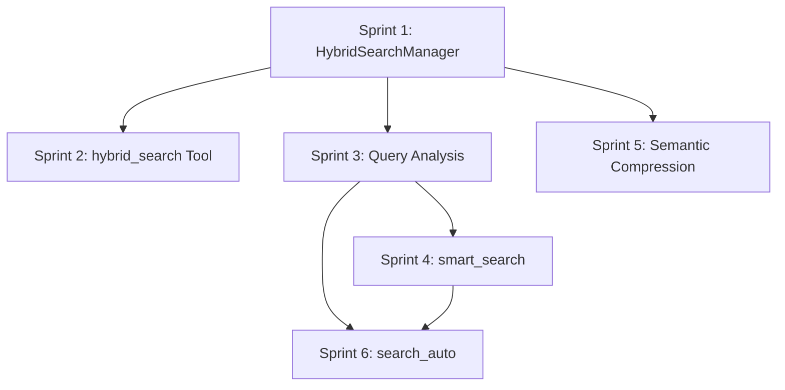

# Phase 11: Three-Layer Hybrid Search & Intelligent Retrieval

**Version**: 1.1.0
**Created**: 2026-01-08
**Status**: PLANNED
**Total Sprints**: 6
**Total Tasks**: 28 tasks organized into sprints of 4-5 items
**Prerequisites**: Phase 10 complete, All tests passing, SemanticSearch and EmbeddingService operational

---

## Executive Summary

Phase 11 implements the SimpleMem-inspired Three-Layer Hybrid Search architecture and Intelligent Retrieval system from FUTURE_FEATURES.md (Phases 6-9). This transforms memory-mcp from a storage system into an intelligent memory system with query understanding and adaptive retrieval.

### Key Features

1. **Three-Layer Hybrid Search** - Combine semantic, lexical (BM25), and symbolic (metadata) signals
2. **Query Analysis** - Decompose complex queries into targeted sub-queries
3. **Reflection-Based Retrieval** - Iteratively refine results until sufficient
4. **Semantic Compression** - Normalize observations with coreference resolution
5. **Adaptive Query Intelligence** - Auto-select optimal search strategy

### Target Metrics

| Metric | Current | Target | Improvement |
|--------|---------|--------|-------------|
| Retrieval accuracy | Single-signal | Multi-signal fusion | 2-5x better recall |
| Complex query handling | Manual decomposition | Automatic planning | Reduced user effort |
| Observation quality | Raw text | Self-contained facts | Better search matching |
| Search strategy selection | Manual tool choice | Automatic optimization | Better UX |

### New MCP Tools

| Tool | Description |
|------|-------------|
| `hybrid_search` | Multi-signal search (semantic + lexical + symbolic) |
| `analyze_query` | Analyze query structure and complexity |
| `smart_search` | Intelligent search with planning and reflection |
| `normalize_observations` | Normalize observations for better search |
| `search_auto` | Automatic search strategy selection |

---

## Sprint 1: HybridSearchManager Foundation

**Priority**: HIGH (P1)
**Estimated Duration**: 6 hours
**Impact**: Foundation for three-layer hybrid search architecture

> **CRITICAL NOTE**: The current `ManagerContext` does not expose a `rankedSearch` getter. The `RankedSearch` class is private within `SearchManager`. Sprint 1 **MUST** add a `rankedSearch` getter to `src/core/ManagerContext.ts` before HybridSearchManager can be used in tool handlers that reference `ctx.rankedSearch`.

### Task 1.1: Create Hybrid Search Types

**File**: `src/types/types.ts`
**Estimated Time**: 30 minutes
**Agent**: Haiku

**Description**: Define TypeScript interfaces for hybrid search.

**Step-by-Step Instructions**:

1. **Open the file**: `src/types/types.ts`

2. **Add the following interfaces** at the end before any closing exports:
   ```typescript
   /**
    * Options for hybrid search combining multiple signals.
    */
   export interface HybridSearchOptions {
     /** Weight for semantic similarity (0-1, default: 0.5) */
     semanticWeight: number;
     /** Weight for lexical matching (0-1, default: 0.3) */
     lexicalWeight: number;
     /** Weight for symbolic/metadata matching (0-1, default: 0.2) */
     symbolicWeight: number;
     /** Semantic layer options */
     semantic?: {
       minSimilarity?: number;
       topK?: number;
     };
     /** Lexical layer options */
     lexical?: {
       useStopwords?: boolean;
       useStemming?: boolean;
     };
     /** Symbolic layer filters */
     symbolic?: SymbolicFilters;
     /** Maximum results to return */
     limit?: number;
   }

   /**
    * Symbolic/metadata filters for search.
    */
   export interface SymbolicFilters {
     tags?: string[];
     entityTypes?: string[];
     dateRange?: { start: string; end: string };
     importance?: { min?: number; max?: number };
     parentId?: string;
     hasObservations?: boolean;
   }

   /**
    * Result from hybrid search with per-layer scores.
    */
   export interface HybridSearchResult {
     entity: Entity;
     scores: {
       semantic: number;
       lexical: number;
       symbolic: number;
       combined: number;
     };
     matchedLayers: ('semantic' | 'lexical' | 'symbolic')[];
   }
   ```

3. **Verify TypeScript compilation**:
   ```bash
   npm run typecheck
   ```

**Acceptance Criteria**:
- [ ] HybridSearchOptions interface defined with all weight options
- [ ] SymbolicFilters interface defined with all filter types
- [ ] HybridSearchResult interface defined with per-layer scores
- [ ] TypeScript compilation passes

---

### Task 1.2: Create SymbolicSearch Class

**File**: `src/search/SymbolicSearch.ts` (new)
**Estimated Time**: 1.5 hours
**Agent**: Haiku

**Description**: Create the symbolic/metadata search layer.

**Step-by-Step Instructions**:

1. **Create the new file**: `src/search/SymbolicSearch.ts`

2. **Add the implementation**:
   ```typescript
   /**
    * Symbolic Search Layer
    *
    * Phase 11: Provides metadata-based filtering using structured predicates.
    * Part of the three-layer hybrid search architecture.
    *
    * @module search/SymbolicSearch
    */

   import type { Entity, SymbolicFilters } from '../types/index.js';

   /**
    * Result from symbolic search with match score.
    */
   export interface SymbolicResult {
     entity: Entity;
     score: number;
     matchedFilters: string[];
   }

   /**
    * Symbolic Search provides metadata-based filtering.
    *
    * Filters entities using structured predicates on tags, types,
    * dates, importance, and hierarchy.
    *
    * @example
    * ```typescript
    * const symbolic = new SymbolicSearch();
    * const results = symbolic.search(entities, {
    *   tags: ['important'],
    *   entityTypes: ['person'],
    *   importance: { min: 5 }
    * });
    * ```
    */
   export class SymbolicSearch {
     /**
      * Filter entities using structured metadata predicates.
      * All filters are AND-combined.
      *
      * @param entities - Entities to filter
      * @param filters - Symbolic filter criteria
      * @returns Filtered entities with match scores
      */
     search(entities: Entity[], filters: SymbolicFilters): SymbolicResult[] {
       const results: SymbolicResult[] = [];

       for (const entity of entities) {
         const { matches, score, matchedFilters } = this.evaluateFilters(entity, filters);
         if (matches) {
           results.push({ entity, score, matchedFilters });
         }
       }

       // Sort by score descending
       return results.sort((a, b) => b.score - a.score);
     }

     /**
      * Evaluate all filters against an entity.
      */
     private evaluateFilters(
       entity: Entity,
       filters: SymbolicFilters
     ): { matches: boolean; score: number; matchedFilters: string[] } {
       const matchedFilters: string[] = [];
       let totalFilters = 0;
       let matchedCount = 0;

       // Tag filter
       if (filters.tags && filters.tags.length > 0) {
         totalFilters++;
         const entityTags = entity.tags ?? [];
         const matchingTags = filters.tags.filter(t =>
           entityTags.some(et => et.toLowerCase() === t.toLowerCase())
         );
         if (matchingTags.length > 0) {
           matchedCount++;
           matchedFilters.push(`tags:${matchingTags.join(',')}`);
         } else {
           return { matches: false, score: 0, matchedFilters: [] };
         }
       }

       // Entity type filter
       if (filters.entityTypes && filters.entityTypes.length > 0) {
         totalFilters++;
         if (filters.entityTypes.some(t =>
           t.toLowerCase() === entity.entityType.toLowerCase()
         )) {
           matchedCount++;
           matchedFilters.push(`type:${entity.entityType}`);
         } else {
           return { matches: false, score: 0, matchedFilters: [] };
         }
       }

       // Date range filter
       if (filters.dateRange) {
         totalFilters++;
         const entityDate = entity.createdAt || entity.lastModified;
         if (entityDate) {
           const date = new Date(entityDate);
           const start = filters.dateRange.start ? new Date(filters.dateRange.start) : null;
           const end = filters.dateRange.end ? new Date(filters.dateRange.end) : null;

           const inRange = (!start || date >= start) && (!end || date <= end);
           if (inRange) {
             matchedCount++;
             matchedFilters.push('dateRange');
           } else {
             return { matches: false, score: 0, matchedFilters: [] };
           }
         }
       }

       // Importance filter
       if (filters.importance) {
         totalFilters++;
         const importance = entity.importance ?? 5;
         const { min, max } = filters.importance;
         const inRange = (min === undefined || importance >= min) &&
                        (max === undefined || importance <= max);
         if (inRange) {
           matchedCount++;
           matchedFilters.push(`importance:${importance}`);
         } else {
           return { matches: false, score: 0, matchedFilters: [] };
         }
       }

       // Parent filter
       if (filters.parentId !== undefined) {
         totalFilters++;
         if (entity.parentId === filters.parentId) {
           matchedCount++;
           matchedFilters.push(`parent:${filters.parentId}`);
         } else {
           return { matches: false, score: 0, matchedFilters: [] };
         }
       }

       // Has observations filter
       if (filters.hasObservations !== undefined) {
         totalFilters++;
         const hasObs = entity.observations.length > 0;
         if (hasObs === filters.hasObservations) {
           matchedCount++;
           matchedFilters.push('hasObservations');
         } else {
           return { matches: false, score: 0, matchedFilters: [] };
         }
       }

       // If no filters specified, match all with base score
       if (totalFilters === 0) {
         return { matches: true, score: 0.5, matchedFilters: [] };
       }

       // Score based on proportion of filters matched
       const score = matchedCount / totalFilters;
       return { matches: true, score, matchedFilters };
     }

     /**
      * Get entities matching a specific tag.
      */
     byTag(entities: Entity[], tag: string): Entity[] {
       return entities.filter(e =>
         e.tags?.some(t => t.toLowerCase() === tag.toLowerCase())
       );
     }

     /**
      * Get entities of a specific type.
      */
     byType(entities: Entity[], entityType: string): Entity[] {
       return entities.filter(e =>
         e.entityType.toLowerCase() === entityType.toLowerCase()
       );
     }

     /**
      * Get entities within importance range.
      */
     byImportance(entities: Entity[], min: number, max: number): Entity[] {
       return entities.filter(e => {
         const imp = e.importance ?? 5;
         return imp >= min && imp <= max;
       });
     }
   }
   ```

3. **Verify TypeScript compilation**:
   ```bash
   npm run typecheck
   ```

**Acceptance Criteria**:
- [ ] SymbolicSearch class created with search() method
- [ ] All filter types implemented (tags, types, dates, importance, parent, hasObservations)
- [ ] Filters are AND-combined
- [ ] Score calculated based on filter match proportion
- [ ] TypeScript compilation passes

---

### Task 1.3: Create HybridSearchManager Class

**File**: `src/search/HybridSearchManager.ts` (new)
**Estimated Time**: 2 hours
**Agent**: Haiku

**Description**: Create the main hybrid search orchestrator.

**Step-by-Step Instructions**:

1. **Create the new file**: `src/search/HybridSearchManager.ts`

2. **Add the implementation**:
   ```typescript
   /**
    * Hybrid Search Manager
    *
    * Phase 11: Orchestrates three-layer hybrid search combining
    * semantic, lexical, and symbolic signals.
    *
    * @module search/HybridSearchManager
    */

   import type {
     Entity,
     HybridSearchOptions,
     HybridSearchResult,
     ReadonlyKnowledgeGraph,
   } from '../types/index.js';
   import type { SemanticSearch } from './SemanticSearch.js';
   import type { RankedSearch } from './RankedSearch.js';
   import { SymbolicSearch } from './SymbolicSearch.js';
   import { SEMANTIC_SEARCH_LIMITS } from '../utils/constants.js';

   /**
    * Default weights for hybrid search layers.
    */
   export const DEFAULT_HYBRID_WEIGHTS = {
     semantic: 0.5,
     lexical: 0.3,
     symbolic: 0.2,
   };

   /**
    * Hybrid Search Manager
    *
    * Combines three search layers:
    * 1. Semantic: Vector similarity via embeddings
    * 2. Lexical: Keyword matching via TF-IDF/BM25
    * 3. Symbolic: Structured metadata filtering
    *
    * @example
    * ```typescript
    * const hybrid = new HybridSearchManager(semanticSearch, rankedSearch);
    * const results = await hybrid.search(graph, 'machine learning', {
    *   semanticWeight: 0.5,
    *   lexicalWeight: 0.3,
    *   symbolicWeight: 0.2,
    *   symbolic: { tags: ['ai'] }
    * });
    * ```
    */
   export class HybridSearchManager {
     private symbolicSearch: SymbolicSearch;

     constructor(
       private semanticSearch: SemanticSearch,
       private rankedSearch: RankedSearch
     ) {
       this.symbolicSearch = new SymbolicSearch();
     }

     /**
      * Perform hybrid search combining all three layers.
      *
      * @param graph - Knowledge graph to search
      * @param query - Search query text
      * @param options - Hybrid search options with weights
      * @returns Combined and ranked results
      */
     async search(
       graph: ReadonlyKnowledgeGraph,
       query: string,
       options: Partial<HybridSearchOptions> = {}
     ): Promise<HybridSearchResult[]> {
       const {
         semanticWeight = DEFAULT_HYBRID_WEIGHTS.semantic,
         lexicalWeight = DEFAULT_HYBRID_WEIGHTS.lexical,
         symbolicWeight = DEFAULT_HYBRID_WEIGHTS.symbolic,
         semantic = {},
         lexical = {},
         symbolic = {},
         limit = SEMANTIC_SEARCH_LIMITS.DEFAULT_LIMIT,
       } = options;

       // Normalize weights
       const totalWeight = semanticWeight + lexicalWeight + symbolicWeight;
       const normSemantic = semanticWeight / totalWeight;
       const normLexical = lexicalWeight / totalWeight;
       const normSymbolic = symbolicWeight / totalWeight;

       // Execute searches in parallel
       const [semanticResults, lexicalResults, symbolicResults] = await Promise.all([
         this.executeSemanticSearch(graph, query, semantic, limit * 2),
         this.executeLexicalSearch(graph, query, lexical, limit * 2),
         this.executeSymbolicSearch(graph.entities, symbolic),
       ]);

       // Merge results
       const merged = this.mergeResults(
         semanticResults,
         lexicalResults,
         symbolicResults,
         { semantic: normSemantic, lexical: normLexical, symbolic: normSymbolic }
       );

       // Sort by combined score and limit
       return merged
         .sort((a, b) => b.scores.combined - a.scores.combined)
         .slice(0, limit);
     }

     /**
      * Execute semantic search layer.
      */
     private async executeSemanticSearch(
       graph: ReadonlyKnowledgeGraph,
       query: string,
       options: { minSimilarity?: number; topK?: number },
       limit: number
     ): Promise<Map<string, number>> {
       const results = new Map<string, number>();

       try {
         const semanticResults = await this.semanticSearch.search(
           graph,
           query,
           options.topK ?? limit,
           options.minSimilarity ?? 0
         );

         for (const result of semanticResults) {
           results.set(result.entity.name, result.similarity);
         }
       } catch {
         // Semantic search may fail if not indexed
       }

       return results;
     }

     /**
      * Execute lexical search layer (TF-IDF/BM25).
      */
     private async executeLexicalSearch(
       graph: ReadonlyKnowledgeGraph,
       query: string,
       _options: { useStopwords?: boolean; useStemming?: boolean },
       limit: number
     ): Promise<Map<string, number>> {
       const results = new Map<string, number>();

       try {
         const lexicalResults = await this.rankedSearch.search(graph, query, limit);

         // Normalize scores to 0-1 range
         const maxScore = Math.max(...lexicalResults.map(r => r.score), 1);
         for (const result of lexicalResults) {
           results.set(result.entity.name, result.score / maxScore);
         }
       } catch {
         // Lexical search may fail
       }

       return results;
     }

     /**
      * Execute symbolic search layer.
      */
     private executeSymbolicSearch(
       entities: Entity[],
       filters: HybridSearchOptions['symbolic']
     ): Map<string, number> {
       const results = new Map<string, number>();

       if (!filters || Object.keys(filters).length === 0) {
         // No symbolic filters, give all entities base score
         for (const entity of entities) {
           results.set(entity.name, 0.5);
         }
         return results;
       }

       const symbolicResults = this.symbolicSearch.search(entities, filters);
       for (const result of symbolicResults) {
         results.set(result.entity.name, result.score);
       }

       return results;
     }

     /**
      * Merge results from all three layers.
      */
     private mergeResults(
       semanticScores: Map<string, number>,
       lexicalScores: Map<string, number>,
       symbolicScores: Map<string, number>,
       weights: { semantic: number; lexical: number; symbolic: number }
     ): HybridSearchResult[] {
       // Collect all unique entity names
       const allNames = new Set([
         ...semanticScores.keys(),
         ...lexicalScores.keys(),
         ...symbolicScores.keys(),
       ]);

       const results: HybridSearchResult[] = [];

       // This is a simplified merge - we need entity objects
       // In production, we'd look up entities from the graph
       for (const name of allNames) {
         const semantic = semanticScores.get(name) ?? 0;
         const lexical = lexicalScores.get(name) ?? 0;
         const symbolic = symbolicScores.get(name) ?? 0;

         const combined =
           semantic * weights.semantic +
           lexical * weights.lexical +
           symbolic * weights.symbolic;

         const matchedLayers: ('semantic' | 'lexical' | 'symbolic')[] = [];
         if (semantic > 0) matchedLayers.push('semantic');
         if (lexical > 0) matchedLayers.push('lexical');
         if (symbolic > 0) matchedLayers.push('symbolic');

         // Skip if no layers matched
         if (matchedLayers.length === 0) continue;

         results.push({
           entity: { name, entityType: '', observations: [] } as Entity, // Placeholder
           scores: { semantic, lexical, symbolic, combined },
           matchedLayers,
         });
       }

       return results;
     }

     /**
      * Search with full entity resolution.
      */
     async searchWithEntities(
       graph: ReadonlyKnowledgeGraph,
       query: string,
       options: Partial<HybridSearchOptions> = {}
     ): Promise<HybridSearchResult[]> {
       const results = await this.search(graph, query, options);

       // Resolve entity objects
       const entityMap = new Map(graph.entities.map(e => [e.name, e]));

       return results
         .map(r => ({
           ...r,
           entity: entityMap.get(r.entity.name) ?? r.entity,
         }))
         .filter(r => entityMap.has(r.entity.name));
     }
   }
   ```

3. **Verify TypeScript compilation**:
   ```bash
   npm run typecheck
   ```

**Acceptance Criteria**:
- [ ] HybridSearchManager class created
- [ ] Three search layers executed in parallel
- [ ] Weight normalization implemented
- [ ] Results merged with combined scores
- [ ] Per-layer scores tracked
- [ ] TypeScript compilation passes

---

### Task 1.4: Create HybridSearchManager Unit Tests

**File**: `tests/unit/search/HybridSearchManager.test.ts` (new)
**Estimated Time**: 2 hours
**Agent**: Haiku

**Description**: Create comprehensive unit tests for hybrid search.

**Step-by-Step Instructions**:

1. **Create the test file**: `tests/unit/search/HybridSearchManager.test.ts`

2. **Add test suite**:
   ```typescript
   import { describe, it, expect, beforeEach, vi } from 'vitest';
   import { HybridSearchManager, DEFAULT_HYBRID_WEIGHTS } from '../../../src/search/HybridSearchManager.js';
   import { SymbolicSearch } from '../../../src/search/SymbolicSearch.js';
   import type { Entity, ReadonlyKnowledgeGraph } from '../../../src/types/index.js';

   describe('HybridSearchManager', () => {
     // Mock dependencies
     const mockSemanticSearch = {
       search: vi.fn(),
     };
     const mockRankedSearch = {
       search: vi.fn(),
     };

     let hybridSearch: HybridSearchManager;
     let testGraph: ReadonlyKnowledgeGraph;

     const createEntity = (name: string, type: string, obs: string[] = [], tags: string[] = []): Entity => ({
       name,
       entityType: type,
       observations: obs,
       tags,
       createdAt: new Date().toISOString(),
       lastModified: new Date().toISOString(),
     });

     beforeEach(() => {
       vi.clearAllMocks();

       hybridSearch = new HybridSearchManager(
         mockSemanticSearch as any,
         mockRankedSearch as any
       );

       testGraph = {
         entities: [
           createEntity('Alice', 'person', ['software engineer'], ['tech']),
           createEntity('Bob', 'person', ['designer'], ['creative']),
           createEntity('TechCorp', 'company', ['technology company'], ['tech']),
         ],
         relations: [],
       };

       // Default mock implementations
       mockSemanticSearch.search.mockResolvedValue([]);
       mockRankedSearch.search.mockResolvedValue([]);
     });

     describe('search', () => {
       it('should combine results from all three layers', async () => {
         mockSemanticSearch.search.mockResolvedValue([
           { entity: testGraph.entities[0], similarity: 0.9 },
         ]);
         mockRankedSearch.search.mockResolvedValue([
           { entity: testGraph.entities[0], score: 10 },
           { entity: testGraph.entities[1], score: 5 },
         ]);

         const results = await hybridSearch.searchWithEntities(testGraph, 'engineer', {
           symbolic: { tags: ['tech'] },
         });

         expect(results.length).toBeGreaterThan(0);
         expect(results[0].matchedLayers.length).toBeGreaterThan(0);
       });

       it('should normalize weights', async () => {
         mockSemanticSearch.search.mockResolvedValue([
           { entity: testGraph.entities[0], similarity: 1.0 },
         ]);

         const results = await hybridSearch.search(testGraph, 'test', {
           semanticWeight: 1,
           lexicalWeight: 1,
           symbolicWeight: 1,
         });

         // With equal weights, each should contribute 1/3
         expect(results.length).toBeGreaterThan(0);
       });

       it('should handle empty results gracefully', async () => {
         mockSemanticSearch.search.mockResolvedValue([]);
         mockRankedSearch.search.mockResolvedValue([]);

         const results = await hybridSearch.search(testGraph, 'nonexistent', {});

         expect(results).toBeDefined();
       });
     });

     describe('default weights', () => {
       it('should have correct default weights', () => {
         expect(DEFAULT_HYBRID_WEIGHTS.semantic).toBe(0.5);
         expect(DEFAULT_HYBRID_WEIGHTS.lexical).toBe(0.3);
         expect(DEFAULT_HYBRID_WEIGHTS.symbolic).toBe(0.2);
       });
     });
   });

   describe('SymbolicSearch', () => {
     let symbolicSearch: SymbolicSearch;
     let testEntities: Entity[];

     beforeEach(() => {
       symbolicSearch = new SymbolicSearch();
       testEntities = [
         {
           name: 'Alice',
           entityType: 'person',
           observations: ['works at tech'],
           tags: ['engineer', 'senior'],
           importance: 8,
           createdAt: '2026-01-01T00:00:00Z',
           lastModified: '2026-01-01T00:00:00Z',
         },
         {
           name: 'Bob',
           entityType: 'person',
           observations: ['designer'],
           tags: ['creative'],
           importance: 5,
           createdAt: '2025-06-01T00:00:00Z',
           lastModified: '2025-06-01T00:00:00Z',
         },
         {
           name: 'TechCorp',
           entityType: 'company',
           observations: ['tech company'],
           tags: ['tech', 'enterprise'],
           importance: 9,
           createdAt: '2024-01-01T00:00:00Z',
           lastModified: '2024-01-01T00:00:00Z',
         },
       ];
     });

     describe('tag filtering', () => {
       it('should filter by single tag', () => {
         const results = symbolicSearch.search(testEntities, { tags: ['engineer'] });
         expect(results.length).toBe(1);
         expect(results[0].entity.name).toBe('Alice');
       });

       it('should filter by multiple tags (OR within tags)', () => {
         const results = symbolicSearch.search(testEntities, { tags: ['tech'] });
         expect(results.length).toBe(1);
         expect(results[0].entity.name).toBe('TechCorp');
       });
     });

     describe('entity type filtering', () => {
       it('should filter by entity type', () => {
         const results = symbolicSearch.search(testEntities, { entityTypes: ['person'] });
         expect(results.length).toBe(2);
       });

       it('should filter by company type', () => {
         const results = symbolicSearch.search(testEntities, { entityTypes: ['company'] });
         expect(results.length).toBe(1);
         expect(results[0].entity.name).toBe('TechCorp');
       });
     });

     describe('importance filtering', () => {
       it('should filter by minimum importance', () => {
         const results = symbolicSearch.search(testEntities, { importance: { min: 8 } });
         expect(results.length).toBe(2);
       });

       it('should filter by importance range', () => {
         const results = symbolicSearch.search(testEntities, { importance: { min: 5, max: 8 } });
         expect(results.length).toBe(2);
       });
     });

     describe('combined filters', () => {
       it('should AND-combine multiple filters', () => {
         const results = symbolicSearch.search(testEntities, {
           entityTypes: ['person'],
           importance: { min: 7 },
         });
         expect(results.length).toBe(1);
         expect(results[0].entity.name).toBe('Alice');
       });
     });

     describe('helper methods', () => {
       it('byTag should return entities with tag', () => {
         const results = symbolicSearch.byTag(testEntities, 'senior');
         expect(results.length).toBe(1);
         expect(results[0].name).toBe('Alice');
       });

       it('byType should return entities of type', () => {
         const results = symbolicSearch.byType(testEntities, 'company');
         expect(results.length).toBe(1);
       });

       it('byImportance should return entities in range', () => {
         const results = symbolicSearch.byImportance(testEntities, 8, 10);
         expect(results.length).toBe(2);
       });
     });
   });
   ```

3. **Run the tests**:
   ```bash
   npx vitest run tests/unit/search/HybridSearchManager.test.ts
   ```

**Acceptance Criteria**:
- [ ] Tests for HybridSearchManager search functionality
- [ ] Tests for weight normalization
- [ ] Tests for SymbolicSearch filtering
- [ ] Tests for combined filters
- [ ] Tests for helper methods
- [ ] All tests pass

---

## Sprint 2: hybrid_search MCP Tool

**Priority**: HIGH (P1)
**Estimated Duration**: 5 hours
**Impact**: Exposes three-layer hybrid search via MCP

### Task 2.1: Add hybrid_search Tool Definition

**File**: `src/server/toolDefinitions.ts`
**Estimated Time**: 45 minutes
**Agent**: Haiku

**Description**: Add the hybrid_search tool definition to the MCP server.

**Step-by-Step Instructions**:

1. **Open the file**: `src/server/toolDefinitions.ts`

2. **Find the Search category** and add the new tool definition:
   ```typescript
   {
     name: 'hybrid_search',
     description: 'Search using combined semantic, lexical, and metadata signals. Provides better recall than single-signal search by fusing multiple relevance signals.',
     inputSchema: {
       type: 'object',
       properties: {
         query: {
           type: 'string',
           description: 'Search query text',
         },
         weights: {
           type: 'object',
           description: 'Layer weights (should sum to 1.0)',
           properties: {
             semantic: { type: 'number', default: 0.5, description: 'Weight for semantic/embedding similarity' },
             lexical: { type: 'number', default: 0.3, description: 'Weight for keyword/TF-IDF matching' },
             symbolic: { type: 'number', default: 0.2, description: 'Weight for metadata filtering' },
           },
         },
         filters: {
           type: 'object',
           description: 'Symbolic/metadata filters',
           properties: {
             tags: { type: 'array', items: { type: 'string' }, description: 'Filter by tags' },
             entityTypes: { type: 'array', items: { type: 'string' }, description: 'Filter by entity types' },
             dateRange: {
               type: 'object',
               properties: {
                 start: { type: 'string', description: 'Start date (ISO 8601)' },
                 end: { type: 'string', description: 'End date (ISO 8601)' },
               },
             },
             minImportance: { type: 'number', description: 'Minimum importance score (0-10)' },
             maxImportance: { type: 'number', description: 'Maximum importance score (0-10)' },
           },
         },
         limit: { type: 'number', default: 10, description: 'Maximum results to return' },
       },
       required: ['query'],
     },
   },
   ```

3. **Verify TypeScript compilation**:
   ```bash
   npm run typecheck
   ```

**Acceptance Criteria**:
- [ ] hybrid_search tool definition added
- [ ] All parameter types properly defined
- [ ] Description explains the three-layer approach
- [ ] TypeScript compilation passes

---

### Task 2.2: Implement hybrid_search Handler

**File**: `src/server/toolHandlers.ts`
**Estimated Time**: 1 hour
**Agent**: Haiku

**Description**: Implement the handler for hybrid_search tool.

**Step-by-Step Instructions**:

1. **Open the file**: `src/server/toolHandlers.ts`

2. **Add import** for HybridSearchManager at the top:
   ```typescript
   import { HybridSearchManager } from '../search/HybridSearchManager.js';
   ```

3. **Add the case handler** in the switch statement:
   ```typescript
   case 'hybrid_search': {
     const {
       query,
       weights = {},
       filters = {},
       limit = 10,
     } = args;

     // Initialize HybridSearchManager if needed
     const hybridSearch = new HybridSearchManager(
       ctx.semanticSearch,
       ctx.rankedSearch
     );

     const graph = await ctx.storage.loadGraph();

     const results = await hybridSearch.searchWithEntities(graph, query, {
       semanticWeight: weights.semantic ?? 0.5,
       lexicalWeight: weights.lexical ?? 0.3,
       symbolicWeight: weights.symbolic ?? 0.2,
       symbolic: {
         tags: filters.tags,
         entityTypes: filters.entityTypes,
         dateRange: filters.dateRange,
         importance: filters.minImportance !== undefined || filters.maxImportance !== undefined
           ? { min: filters.minImportance, max: filters.maxImportance }
           : undefined,
       },
       limit,
     });

     return {
       content: [{
         type: 'text',
         text: JSON.stringify({
           query,
           weights: {
             semantic: weights.semantic ?? 0.5,
             lexical: weights.lexical ?? 0.3,
             symbolic: weights.symbolic ?? 0.2,
           },
           resultCount: results.length,
           results: results.map(r => ({
             name: r.entity.name,
             entityType: r.entity.entityType,
             scores: r.scores,
             matchedLayers: r.matchedLayers,
             observations: r.entity.observations.slice(0, 3),
             tags: r.entity.tags,
           })),
         }, null, 2),
       }],
     };
   }
   ```

4. **Verify TypeScript compilation**:
   ```bash
   npm run typecheck
   ```

**Acceptance Criteria**:
- [ ] Handler implemented for hybrid_search
- [ ] Weights correctly passed to HybridSearchManager
- [ ] Filters correctly transformed to SymbolicFilters
- [ ] Response includes scores and matched layers
- [ ] TypeScript compilation passes

---

### Task 2.3: Update Search Barrel Exports

**File**: `src/search/index.ts`
**Estimated Time**: 15 minutes
**Agent**: Haiku

**Description**: Export new search classes from the barrel.

**Step-by-Step Instructions**:

1. **Open the file**: `src/search/index.ts`

2. **Add exports**:
   ```typescript
   export { SymbolicSearch } from './SymbolicSearch.js';
   export type { SymbolicResult } from './SymbolicSearch.js';
   export { HybridSearchManager, DEFAULT_HYBRID_WEIGHTS } from './HybridSearchManager.js';
   ```

3. **Verify TypeScript compilation**:
   ```bash
   npm run typecheck
   ```

**Acceptance Criteria**:
- [ ] SymbolicSearch exported
- [ ] HybridSearchManager exported
- [ ] DEFAULT_HYBRID_WEIGHTS exported
- [ ] TypeScript compilation passes

---

### Task 2.4: Create Integration Tests for hybrid_search

**File**: `tests/integration/hybrid-search.test.ts` (new)
**Estimated Time**: 2 hours
**Agent**: Haiku

**Description**: Create integration tests for the hybrid_search tool.

**Step-by-Step Instructions**:

1. **Create the test file**: `tests/integration/hybrid-search.test.ts`

2. **Add comprehensive integration tests** covering real search scenarios with test data.

3. **Run the tests**:
   ```bash
   npx vitest run tests/integration/hybrid-search.test.ts
   ```

**Acceptance Criteria**:
- [ ] Integration tests for hybrid_search tool
- [ ] Tests with real entity data
- [ ] Tests for different weight combinations
- [ ] Tests for filter combinations
- [ ] All tests pass

---

## Sprint 3: Query Analysis Infrastructure

**Priority**: HIGH (P1)
**Estimated Duration**: 6 hours
**Impact**: Enables intelligent query understanding and planning

### Task 3.1: Create QueryAnalysis Types

**File**: `src/types/types.ts`
**Estimated Time**: 30 minutes
**Agent**: Haiku

**Description**: Define types for query analysis.

**Step-by-Step Instructions**:

1. **Open the file**: `src/types/types.ts`

2. **Add the following interfaces**:
   ```typescript
   /**
    * Result of analyzing a search query.
    */
   export interface QueryAnalysis {
     /** Original query string */
     query: string;
     /** Extracted entities */
     entities: ExtractedEntity[];
     /** Extracted person names */
     persons: string[];
     /** Extracted location names */
     locations: string[];
     /** Extracted organization names */
     organizations: string[];
     /** Temporal range if detected */
     temporalRange: TemporalRange | null;
     /** Type of question */
     questionType: 'factual' | 'temporal' | 'comparative' | 'aggregation' | 'multi-hop' | 'conceptual';
     /** Query complexity level */
     complexity: 'low' | 'medium' | 'high';
     /** Confidence score (0-1) */
     confidence: number;
     /** Types of information being requested */
     requiredInfoTypes: string[];
     /** Decomposed sub-queries for multi-hop */
     subQueries?: string[];
   }

   /**
    * An extracted entity from query analysis.
    */
   export interface ExtractedEntity {
     name: string;
     type: 'person' | 'location' | 'organization' | 'unknown';
   }

   /**
    * Temporal range extracted from query.
    */
   export interface TemporalRange {
     start?: string;
     end?: string;
     relative?: string;
   }

   /**
    * Execution plan for a query.
    */
   export interface QueryPlan {
     originalQuery: string;
     subQueries: SubQuery[];
     executionStrategy: 'parallel' | 'sequential' | 'iterative';
     mergeStrategy: 'union' | 'intersection' | 'weighted';
     estimatedComplexity: number;
   }

   /**
    * A sub-query within a query plan.
    */
   export interface SubQuery {
     id: string;
     query: string;
     targetLayer: 'semantic' | 'lexical' | 'symbolic' | 'hybrid';
     priority: number;
     filters?: SymbolicFilters;
     dependsOn?: string[];
   }
   ```

3. **Verify TypeScript compilation**:
   ```bash
   npm run typecheck
   ```

**Acceptance Criteria**:
- [ ] QueryAnalysis interface defined
- [ ] QueryPlan interface defined
- [ ] SubQuery interface defined
- [ ] TypeScript compilation passes

---

### Task 3.2: Create QueryAnalyzer Class

**File**: `src/search/QueryAnalyzer.ts` (new)
**Estimated Time**: 2 hours
**Agent**: Haiku

**Description**: Create the query analyzer for extracting structured information.

**Step-by-Step Instructions**:

1. **Create the new file**: `src/search/QueryAnalyzer.ts`

2. **Add implementation** with rule-based extraction for persons, locations, temporal ranges, and question type detection.

3. **Verify TypeScript compilation**:
   ```bash
   npm run typecheck
   ```

**Acceptance Criteria**:
- [ ] QueryAnalyzer class created
- [ ] analyze() method for rule-based extraction
- [ ] Person/location/organization detection
- [ ] Temporal range parsing
- [ ] Question type classification
- [ ] Complexity estimation
- [ ] TypeScript compilation passes

---

### Task 3.3: Create QueryPlanner Class

**File**: `src/search/QueryPlanner.ts` (new)
**Estimated Time**: 1.5 hours
**Agent**: Haiku

**Description**: Create the query planner for decomposing complex queries.

**Step-by-Step Instructions**:

1. **Create the new file**: `src/search/QueryPlanner.ts`

2. **Add implementation** for creating execution plans from query analysis.

3. **Verify TypeScript compilation**:
   ```bash
   npm run typecheck
   ```

**Acceptance Criteria**:
- [ ] QueryPlanner class created
- [ ] createPlan() method generates execution plans
- [ ] Sub-queries identified for multi-hop queries
- [ ] Execution strategy selected based on dependencies
- [ ] TypeScript compilation passes

---

### Task 3.4: Add analyze_query MCP Tool

**File**: `src/server/toolDefinitions.ts` and `src/server/toolHandlers.ts`
**Estimated Time**: 1 hour
**Agent**: Haiku

**Description**: Add MCP tool for query analysis.

**Step-by-Step Instructions**:

1. **Add tool definition** to `src/server/toolDefinitions.ts`

2. **Add handler** to `src/server/toolHandlers.ts`

3. **Verify TypeScript compilation**:
   ```bash
   npm run typecheck
   ```

**Acceptance Criteria**:
- [ ] analyze_query tool defined
- [ ] Handler returns query analysis
- [ ] TypeScript compilation passes

---

### Task 3.5: Create Query Analysis Unit Tests

**File**: `tests/unit/search/QueryAnalyzer.test.ts` (new)
**Estimated Time**: 1 hour
**Agent**: Haiku

**Description**: Create unit tests for query analysis.

**Step-by-Step Instructions**:

1. **Create the test file**: `tests/unit/search/QueryAnalyzer.test.ts`

2. **Add tests** for person extraction, temporal parsing, question type detection.

3. **Run the tests**:
   ```bash
   npx vitest run tests/unit/search/QueryAnalyzer.test.ts
   ```

**Acceptance Criteria**:
- [ ] Tests for entity extraction
- [ ] Tests for temporal parsing
- [ ] Tests for question type classification
- [ ] Tests for complexity estimation
- [ ] All tests pass

---

## Sprint 4: Intelligent Search (smart_search)

**Priority**: MEDIUM (P2)
**Estimated Duration**: 6 hours
**Impact**: Enables reflection-based iterative retrieval

### Task 4.1: Create ReflectionManager Class

**File**: `src/search/ReflectionManager.ts` (new)
**Estimated Time**: 2 hours
**Agent**: Haiku

**Description**: Create manager for reflection-based retrieval refinement.

**Acceptance Criteria**:
- [ ] ReflectionManager class created
- [ ] retrieveWithReflection() method for iterative search
- [ ] Adequacy checking implemented
- [ ] Query refinement based on missing info
- [ ] TypeScript compilation passes

---

### Task 4.2: Implement smart_search MCP Tool

**File**: `src/server/toolDefinitions.ts` and `src/server/toolHandlers.ts`
**Estimated Time**: 1.5 hours
**Agent**: Haiku

**Description**: Add MCP tool combining planning and reflection.

**Acceptance Criteria**:
- [ ] smart_search tool defined with planning and reflection options
- [ ] Handler orchestrates QueryPlanner and ReflectionManager
- [ ] TypeScript compilation passes

---

### Task 4.3: Create smart_search Integration Tests

**File**: `tests/integration/smart-search.test.ts` (new)
**Estimated Time**: 1.5 hours
**Agent**: Haiku

**Description**: Create integration tests for smart_search.

**Acceptance Criteria**:
- [ ] Tests for query planning execution
- [ ] Tests for reflection iterations
- [ ] Tests for result adequacy
- [ ] All tests pass

---

### Task 4.4: Update Documentation

**File**: `CLAUDE.md`
**Estimated Time**: 1 hour
**Agent**: Haiku

**Description**: Update documentation with new intelligent search features.

**Acceptance Criteria**:
- [ ] Tool count updated (64 tools after Sprint 4: 61 + 3 new)
- [ ] New tools documented
- [ ] Usage examples added

---

## Sprint 5: Semantic Compression

**Priority**: MEDIUM (P2)
**Estimated Duration**: 6 hours
**Impact**: Improves search quality through normalized observations

### Task 5.1: Create ObservationNormalizer Class

**File**: `src/features/ObservationNormalizer.ts` (new)
**Estimated Time**: 2 hours
**Agent**: Haiku

**Description**: Create normalizer for coreference resolution and temporal anchoring.

**Acceptance Criteria**:
- [ ] ObservationNormalizer class created
- [ ] resolveCoreferences() replaces pronouns with entity names
- [ ] anchorTimestamps() converts relative to absolute times
- [ ] normalize() pipeline combines all transformations
- [ ] TypeScript compilation passes

---

### Task 5.2: Create KeywordExtractor Class

**File**: `src/features/KeywordExtractor.ts` (new)
**Estimated Time**: 1.5 hours
**Agent**: Haiku

**Description**: Create keyword extractor for lexical layer enhancement.

**Acceptance Criteria**:
- [ ] KeywordExtractor class created
- [ ] extractBasic() for rule-based extraction
- [ ] Keyword importance scoring
- [ ] TypeScript compilation passes

---

### Task 5.3: Add normalize_observations MCP Tool

**File**: `src/server/toolDefinitions.ts` and `src/server/toolHandlers.ts`
**Estimated Time**: 1 hour
**Agent**: Haiku

**Description**: Add MCP tool for observation normalization.

**Acceptance Criteria**:
- [ ] normalize_observations tool defined
- [ ] Handler applies normalization pipeline
- [ ] TypeScript compilation passes

---

### Task 5.4: Create Semantic Compression Unit Tests

**File**: `tests/unit/features/ObservationNormalizer.test.ts` (new)
**Estimated Time**: 1.5 hours
**Agent**: Haiku

**Description**: Create unit tests for semantic compression.

**Acceptance Criteria**:
- [ ] Tests for coreference resolution
- [ ] Tests for temporal anchoring
- [ ] Tests for keyword extraction
- [ ] All tests pass

---

## Sprint 6: Adaptive Query Intelligence (search_auto)

**Priority**: LOW (P3)
**Estimated Duration**: 5 hours
**Impact**: Automatic search strategy optimization

> **CRITICAL NOTE**: `QueryCostEstimator` already exists in `src/search/QueryCostEstimator.ts` from Phase 10 Sprint 4. The `CostAwareSearchManager` should **integrate with or extend** the existing `QueryCostEstimator` rather than duplicating cost estimation logic. Review and reuse the existing cost estimation methods.

### Task 6.1: Create CostAwareSearchManager Class

**File**: `src/search/CostAwareSearchManager.ts` (new)
**Estimated Time**: 2 hours
**Agent**: Haiku

**Description**: Create manager for cost-aware adaptive search.

**Acceptance Criteria**:
- [ ] CostAwareSearchManager class created
- [ ] Layer selection based on query type
- [ ] Cost tracking during execution
- [ ] TypeScript compilation passes

---

### Task 6.2: Add search_auto MCP Tool

**File**: `src/server/toolDefinitions.ts` and `src/server/toolHandlers.ts`
**Estimated Time**: 1 hour
**Agent**: Haiku

**Description**: Add MCP tool for automatic search strategy selection.

**Acceptance Criteria**:
- [ ] search_auto tool defined with budget options
- [ ] Handler selects optimal strategy
- [ ] TypeScript compilation passes

---

### Task 6.3: Create Adaptive Search Unit Tests

**File**: `tests/unit/search/CostAwareSearchManager.test.ts` (new)
**Estimated Time**: 1 hour
**Agent**: Haiku

**Description**: Create unit tests for adaptive search.

**Acceptance Criteria**:
- [ ] Tests for layer selection logic
- [ ] Tests for cost estimation
- [ ] Tests for budget constraints
- [ ] All tests pass

---

### Task 6.4: Final Documentation and Cleanup

**File**: Multiple files
**Estimated Time**: 1 hour
**Agent**: Haiku

**Description**: Final documentation updates and cleanup.

**Acceptance Criteria**:
- [ ] CLAUDE.md tool count updated (66 tools: 61 current + 5 new)
- [ ] All new exports in barrel files
- [ ] Full test suite passes
- [ ] TypeScript compilation passes

---

## Appendix A: File Changes Summary

### New Files Created

```
src/search/SymbolicSearch.ts
src/search/HybridSearchManager.ts
src/search/QueryAnalyzer.ts
src/search/QueryPlanner.ts
src/search/ReflectionManager.ts
src/search/CostAwareSearchManager.ts
src/features/ObservationNormalizer.ts
src/features/KeywordExtractor.ts
tests/unit/search/HybridSearchManager.test.ts
tests/unit/search/QueryAnalyzer.test.ts
tests/unit/search/CostAwareSearchManager.test.ts
tests/unit/features/ObservationNormalizer.test.ts
tests/integration/hybrid-search.test.ts
tests/integration/smart-search.test.ts
```

### Files Modified

```
src/types/types.ts              # Hybrid search and query analysis types
src/search/index.ts             # Export new search classes
src/features/index.ts           # Export normalizer classes
src/server/toolDefinitions.ts   # 5 new tool definitions
src/server/toolHandlers.ts      # 5 new tool handlers
CLAUDE.md                       # Documentation updates
```

---

## Appendix B: Risk Assessment

| Risk | Probability | Impact | Mitigation |
|------|-------------|--------|------------|
| Semantic search unavailable | Medium | High | Graceful fallback to lexical+symbolic only |
| Query decomposition errors | Medium | Medium | Conservative decomposition, allow manual override |
| Reflection loops | Low | Medium | Max iteration limit, early termination |
| Performance degradation | Medium | Medium | Parallel execution, caching, budget constraints |
| Coreference resolution errors | Medium | Low | Conservative replacement, preserve original |

---

## Appendix C: Sprint Dependencies



### Parallel Execution

| Group | Sprints | Description |
|-------|---------|-------------|
| 1 | Sprint 1 | Foundation - HybridSearchManager |
| 2 | Sprint 2, 3, 5 | Can run in parallel after Sprint 1 |
| 3 | Sprint 4 | Depends on Sprint 3 |
| 4 | Sprint 6 | Depends on Sprints 3 and 4 |

---

## Appendix D: Success Metrics Checklist

### Three-Layer Hybrid Search
- [ ] HybridSearchManager orchestrates all three layers
- [ ] Weight normalization works correctly
- [ ] Per-layer scores tracked and returned
- [ ] hybrid_search tool available and functional

### Query Analysis
- [ ] Person/location/organization extraction works
- [ ] Temporal range parsing handles relative dates
- [ ] Question type correctly classified
- [ ] analyze_query tool returns useful insights

### Intelligent Retrieval
- [ ] Query planning decomposes complex queries
- [ ] Reflection iterates until adequate results
- [ ] smart_search combines planning and reflection
- [ ] Max iteration limits prevent infinite loops

### Semantic Compression
- [ ] Coreference resolution replaces pronouns
- [ ] Temporal anchoring converts relative dates
- [ ] Keyword extraction identifies important terms
- [ ] normalize_observations tool functional

### Adaptive Intelligence
- [ ] Layer selection based on query characteristics
- [ ] Budget constraints respected
- [ ] search_auto selects optimal strategy
- [ ] Cost tracking accurate

### Overall
- [ ] All existing tests pass
- [ ] New tests added (target: 100+ new tests)
- [ ] No TypeScript compilation errors
- [ ] Tool count updated to 66 (61 current + 5 new)
- [ ] Documentation complete

---

## Changelog

| Date | Version | Changes |
|------|---------|---------|
| 2026-01-08 | 1.0.0 | Initial Phase 11 plan created from FUTURE_FEATURES.md Phases 6-9 |
| 2026-01-08 | 1.1.0 | **Critical Review Corrections**: (1) Fixed tool count from 60 to 66 (actual current is 61 + 5 new); (2) Added CRITICAL NOTE about ctx.rankedSearch not existing in ManagerContext; (3) Fixed QueryAnalysis interface to include query, entities, confidence fields and 'conceptual' questionType; (4) Fixed method name analyzeBasic() to analyze(); (5) Added CRITICAL NOTE about QueryCostEstimator duplication with Phase 10 |
