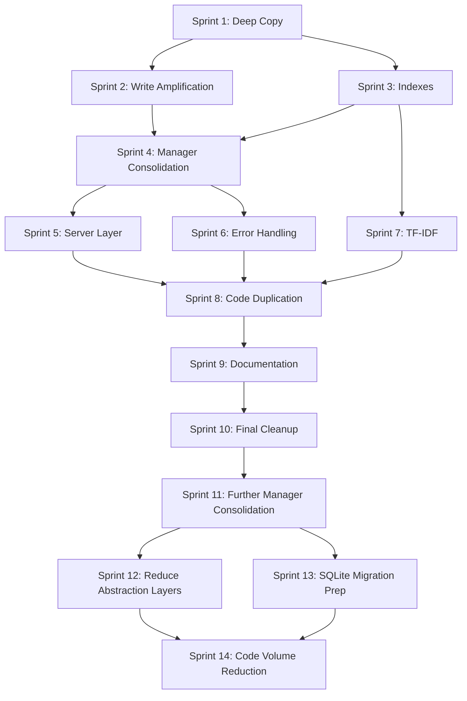

# Phase 1 Refactoring Plan: Performance & Architecture Fixes

**Version**: 2.0.1
**Created**: 2025-12-29
**Updated**: 2025-12-30
**Status**: Active
**Total Sprints**: 14
**Total Tasks**: 61 tasks organized into sprints of 2-5 items

---

## Executive Summary

This plan addresses critical performance and architectural issues identified in the [Comprehensive Codebase Review](../analysis/Comprehensive_Codebase_Review.md). The codebase suffers from:

1. **O(n) deep copying** on every read operation
2. **Full file rewrite** on every mutation (write amplification)
3. **No indexes** - full table scan on every search
4. **Over-abstraction** - 10 managers for a single JSONL file
5. **Inconsistent patterns** - error handling, async usage

### Target Metrics

| Metric | Current | Target | Improvement |
|--------|---------|--------|-------------|
| Read latency (1000 entities) | ~15ms | ~0.1ms | 150x |
| Write latency (add observation) | ~20ms | ~5ms | 4x |
| Search latency (simple query) | ~25ms | ~2ms | 12x |
| Memory usage | 2x graph size | 1.1x graph size | 45% reduction |
| Source lines (excl. tests) | 10,672 | ~6,000 | 44% reduction |
| File count | 54 | ~30 | 44% reduction |

---

## Sprint 1: Eliminate Deep Copying (Critical Performance)

**Priority**: CRITICAL
**Estimated Duration**: 1 day
**Impact**: 100-150x read performance improvement

### Task 1.1: Replace Deep Copy with Read-Only Reference in GraphStorage

**File**: `src/memory/core/GraphStorage.ts`
**Estimated Time**: 2 hours
**Agent**: Claude Sonnet

**Current Code (lines 57-65)**:
```typescript
async loadGraph(): Promise<KnowledgeGraph> {
  if (this.cache !== null) {
    return {
      entities: this.cache.entities.map(e => ({ ...e })),
      relations: this.cache.relations.map(r => ({ ...r })),
    };
  }
  // ...
}
```

**Problem**: Every read creates O(n) shallow copies of all entities and relations.

**Target Code**:
```typescript
async loadGraph(): Promise<Readonly<KnowledgeGraph>> {
  if (this.cache !== null) {
    return this.cache; // Return direct reference (read-only)
  }
  // ...
}

// New method for mutations
async getGraphForMutation(): Promise<KnowledgeGraph> {
  if (this.cache !== null) {
    return {
      entities: [...this.cache.entities],
      relations: [...this.cache.relations],
    };
  }
  // ...
}
```

**Acceptance Criteria**:
- [ ] `loadGraph()` returns `Readonly<KnowledgeGraph>` without copying
- [ ] New `getGraphForMutation()` method does shallow array copy only
- [ ] All existing tests pass
- [ ] Add benchmark test confirming O(1) read performance

---

### Task 1.2: Update EntityManager to Use Read-Only Access

**File**: `src/memory/core/EntityManager.ts`
**Estimated Time**: 1.5 hours
**Agent**: Claude Haiku

**Instructions**:
1. Change all read-only operations to use `loadGraph()` directly
2. Change mutation operations to use `getGraphForMutation()`
3. Ensure returned entities are not mutated externally

**Methods to Update**:
- `getEntity()` - read-only, no copy needed
- `getAllEntities()` - read-only, no copy needed
- `createEntities()` - needs mutable copy
- `deleteEntities()` - needs mutable copy

**Acceptance Criteria**:
- [ ] Read methods use `loadGraph()` directly
- [ ] Mutation methods use `getGraphForMutation()`
- [ ] All 31 EntityManager tests pass
- [ ] No external mutation of returned entities in tests

---

### Task 1.3: Update RelationManager to Use Read-Only Access

**File**: `src/memory/core/RelationManager.ts`
**Estimated Time**: 1 hour
**Agent**: Claude Haiku

**Instructions**:
1. Same pattern as Task 1.2
2. Read operations: `getRelation()`, `getRelationsForEntity()`
3. Mutation operations: `createRelations()`, `deleteRelations()`

**Acceptance Criteria**:
- [ ] Read methods use `loadGraph()` directly
- [ ] Mutation methods use `getGraphForMutation()`
- [ ] All 24 RelationManager tests pass

---

### Task 1.4: Update Search Classes to Use Read-Only Access

**Files**:
- `src/memory/search/BasicSearch.ts`
- `src/memory/search/RankedSearch.ts`
- `src/memory/search/BooleanSearch.ts`
- `src/memory/search/FuzzySearch.ts`

**Estimated Time**: 1.5 hours
**Agent**: Claude Haiku

**Instructions**:
1. All search operations are read-only
2. Remove any defensive copying in search methods
3. Return results directly (search results are fresh arrays from filter())

**Acceptance Criteria**:
- [ ] All search classes use `loadGraph()` directly
- [ ] No redundant copying in search chain
- [ ] All 177 search tests pass
- [ ] Benchmark shows improved search latency

---

### Task 1.5: Add Performance Benchmark Tests for Read Operations

**File**: `src/memory/__tests__/performance/read-performance.test.ts` (new)
**Estimated Time**: 1 hour
**Agent**: Claude Haiku

**Test Cases**:
```typescript
describe('Read Performance', () => {
  it('should read graph in O(1) time regardless of size', async () => {
    // Create graphs of different sizes: 100, 1000, 5000 entities
    // Verify read time is constant (< 1ms for all sizes)
  });

  it('should not allocate memory on repeated reads', async () => {
    // Read same graph 1000 times
    // Verify no significant memory growth
  });

  it('should handle concurrent reads without copying', async () => {
    // Simulate 100 concurrent reads
    // Verify all return same reference
  });
});
```

**Acceptance Criteria**:
- [ ] 3+ performance tests for read operations
- [ ] Tests validate O(1) read complexity
- [ ] Tests validate memory stability

---

## Sprint 2: Fix Write Amplification

**Priority**: HIGH
**Estimated Duration**: 1 day
**Impact**: 4-10x write performance improvement

### Task 2.1: Implement Append-Only Write Mode for Single Mutations

**File**: `src/memory/core/GraphStorage.ts`
**Estimated Time**: 3 hours
**Agent**: Claude Sonnet

**Current Problem**: Every mutation rewrites entire file.

**Target Implementation**:
```typescript
export class GraphStorage {
  private pendingWrites: Array<{type: 'add' | 'update', item: Entity | Relation}> = [];
  private compactionThreshold = 100; // Compact after 100 appends

  async appendEntity(entity: Entity): Promise<void> {
    const line = JSON.stringify({ type: 'entity', ...entity });
    await fs.appendFile(this.memoryFilePath, '\n' + line);

    // Update cache directly
    this.cache?.entities.push(entity);
    this.pendingWrites.push({ type: 'add', item: entity });

    if (this.pendingWrites.length >= this.compactionThreshold) {
      await this.compact();
    }
  }

  async appendRelation(relation: Relation): Promise<void> {
    const line = JSON.stringify({ type: 'relation', ...relation });
    await fs.appendFile(this.memoryFilePath, '\n' + line);
    this.cache?.relations.push(relation);
  }

  async compact(): Promise<void> {
    // Rewrite file removing duplicates, keeping latest versions
    await this.saveGraph(this.cache!);
    this.pendingWrites = [];
  }
}
```

**Acceptance Criteria**:
- [ ] `appendEntity()` and `appendRelation()` methods implemented
- [ ] Append-only writes for add operations
- [ ] Cache updated in-place after append
- [ ] Automatic compaction after threshold
- [ ] All storage tests pass

---

### Task 2.2: Implement Update-in-Place for Entity Modifications

**File**: `src/memory/core/GraphStorage.ts`
**Estimated Time**: 2 hours
**Agent**: Claude Sonnet

**Instructions**:
For updates (add observation, change importance, etc.), we need to:
1. Track which entities were modified
2. Only rewrite if truly necessary (delete or bulk update)
3. For single-field updates, append new version and compact later

**Implementation**:
```typescript
async updateEntity(name: string, updates: Partial<Entity>): Promise<void> {
  if (!this.cache) await this.loadGraph();

  const entity = this.cache!.entities.find(e => e.name === name);
  if (!entity) throw new EntityNotFoundError(name);

  // Update in-place in cache
  Object.assign(entity, updates, { lastModified: new Date().toISOString() });

  // Append updated version (will be deduplicated on compact)
  await this.appendEntity(entity);
}
```

**Acceptance Criteria**:
- [ ] `updateEntity()` method implemented
- [ ] Updates modify cache in-place
- [ ] Updates append to file (deferred compaction)
- [ ] Benchmark shows 5x+ improvement for single updates

---

### Task 2.3: Update EntityManager to Use Append Operations

**File**: `src/memory/core/EntityManager.ts`
**Estimated Time**: 1.5 hours
**Agent**: Claude Haiku

**Methods to Update**:
- `createEntities()` - use `appendEntity()` for each new entity
- `addObservations()` - use `updateEntity()`
- `setImportance()` - use `updateEntity()`
- `addTags()` - use `updateEntity()`

**Acceptance Criteria**:
- [ ] Creation uses append operations
- [ ] Updates use in-place modification + append
- [ ] Delete still uses full rewrite (acceptable)
- [ ] All EntityManager tests pass

---

### Task 2.4: Update ObservationManager to Use Append Operations

**File**: `src/memory/core/ObservationManager.ts`
**Estimated Time**: 1 hour
**Agent**: Claude Haiku

**Methods to Update**:
- `addObservations()` - use `updateEntity()` for each modified entity
- `deleteObservations()` - can trigger full rewrite

**Acceptance Criteria**:
- [ ] `addObservations()` uses append pattern
- [ ] All observation tests pass
- [ ] Benchmark confirms improved latency

---

### Task 2.5: Add Write Performance Benchmark Tests

**File**: `src/memory/__tests__/performance/write-performance.test.ts` (new)
**Estimated Time**: 1 hour
**Agent**: Claude Haiku

**Test Cases**:
```typescript
describe('Write Performance', () => {
  it('should add single entity without full rewrite', async () => {
    // Create large graph (1000 entities)
    // Add one entity
    // Verify write time < 10ms (not proportional to graph size)
  });

  it('should add observation without full rewrite', async () => {
    // Same pattern - verify O(1) for observation add
  });

  it('should compact after threshold writes', async () => {
    // Add 100+ entities
    // Verify compaction triggered
    // Verify file is clean after compaction
  });
});
```

**Acceptance Criteria**:
- [ ] 3+ write performance tests
- [ ] Tests validate O(1) append operations
- [ ] Tests validate compaction behavior

---

## Sprint 3: Add Indexes for Search Performance

**Priority**: HIGH
**Estimated Duration**: 1.5 days
**Impact**: 10-50x search performance improvement

### Task 3.1: Create NameIndex for O(1) Entity Lookup

**File**: `src/memory/utils/indexes.ts` (new)
**Estimated Time**: 2 hours
**Agent**: Claude Sonnet

**Implementation**:
```typescript
export class NameIndex {
  private index: Map<string, Entity> = new Map();

  build(entities: Entity[]): void {
    this.index.clear();
    for (const entity of entities) {
      this.index.set(entity.name, entity);
    }
  }

  get(name: string): Entity | undefined {
    return this.index.get(name);
  }

  add(entity: Entity): void {
    this.index.set(entity.name, entity);
  }

  remove(name: string): void {
    this.index.delete(name);
  }

  has(name: string): boolean {
    return this.index.has(name);
  }

  get size(): number {
    return this.index.size;
  }
}
```

**Acceptance Criteria**:
- [ ] `NameIndex` class implemented
- [ ] O(1) get/add/remove/has operations
- [ ] Integrated with GraphStorage cache
- [ ] Invalidated on full graph reload

---

### Task 3.2: Create TypeIndex for Efficient Type-Based Queries

**File**: `src/memory/utils/indexes.ts`
**Estimated Time**: 1.5 hours
**Agent**: Claude Haiku

**Implementation**:
```typescript
export class TypeIndex {
  private index: Map<string, Set<string>> = new Map(); // type -> entity names

  build(entities: Entity[]): void {
    this.index.clear();
    for (const entity of entities) {
      const type = entity.entityType.toLowerCase();
      if (!this.index.has(type)) {
        this.index.set(type, new Set());
      }
      this.index.get(type)!.add(entity.name);
    }
  }

  getByType(type: string): Set<string> {
    return this.index.get(type.toLowerCase()) || new Set();
  }

  add(entity: Entity): void {
    const type = entity.entityType.toLowerCase();
    if (!this.index.has(type)) {
      this.index.set(type, new Set());
    }
    this.index.get(type)!.add(entity.name);
  }

  remove(entity: Entity): void {
    const type = entity.entityType.toLowerCase();
    this.index.get(type)?.delete(entity.name);
  }
}
```

**Acceptance Criteria**:
- [ ] `TypeIndex` class implemented
- [ ] O(1) type lookup
- [ ] Handles case-insensitive types
- [ ] 5+ unit tests

---

### Task 3.3: Create LowercaseCache to Avoid Repeated toLowerCase() Calls

**File**: `src/memory/utils/indexes.ts`
**Estimated Time**: 1 hour
**Agent**: Claude Haiku

**Problem**: Search does `toLowerCase()` on every entity field for every search.

**Implementation**:
```typescript
export class LowercaseCache {
  private cache: Map<string, {
    name: string;
    type: string;
    observations: string[];
    tags: string[];
  }> = new Map();

  build(entities: Entity[]): void {
    this.cache.clear();
    for (const entity of entities) {
      this.cache.set(entity.name, {
        name: entity.name.toLowerCase(),
        type: entity.entityType.toLowerCase(),
        observations: entity.observations.map(o => o.toLowerCase()),
        tags: (entity.tags || []).map(t => t.toLowerCase()),
      });
    }
  }

  get(name: string): LowercasedEntity | undefined {
    return this.cache.get(name);
  }

  add(entity: Entity): void {
    this.cache.set(entity.name, {
      name: entity.name.toLowerCase(),
      type: entity.entityType.toLowerCase(),
      observations: entity.observations.map(o => o.toLowerCase()),
      tags: (entity.tags || []).map(t => t.toLowerCase()),
    });
  }

  update(entity: Entity): void {
    this.add(entity); // Same as add
  }

  remove(name: string): void {
    this.cache.delete(name);
  }
}
```

**Acceptance Criteria**:
- [ ] `LowercaseCache` class implemented
- [ ] Pre-computed lowercase for all searchable fields
- [ ] Updated on entity modifications
- [ ] 5+ unit tests

---

### Task 3.4: Integrate Indexes with GraphStorage

**File**: `src/memory/core/GraphStorage.ts`
**Estimated Time**: 2 hours
**Agent**: Claude Sonnet

**Implementation**:
```typescript
import { NameIndex, TypeIndex, LowercaseCache } from '../utils/indexes.js';

export class GraphStorage {
  private cache: KnowledgeGraph | null = null;
  private nameIndex: NameIndex = new NameIndex();
  private typeIndex: TypeIndex = new TypeIndex();
  private lowercaseCache: LowercaseCache = new LowercaseCache();

  async loadGraph(): Promise<Readonly<KnowledgeGraph>> {
    if (this.cache !== null) {
      return this.cache;
    }
    // ... load from file ...

    // Build indexes
    this.nameIndex.build(this.cache!.entities);
    this.typeIndex.build(this.cache!.entities);
    this.lowercaseCache.build(this.cache!.entities);

    return this.cache!;
  }

  // Expose index accessors
  getEntityByName(name: string): Entity | undefined {
    return this.nameIndex.get(name);
  }

  getEntitiesByType(type: string): Entity[] {
    const names = this.typeIndex.getByType(type);
    return Array.from(names).map(n => this.nameIndex.get(n)!);
  }

  getLowercased(name: string) {
    return this.lowercaseCache.get(name);
  }
}
```

**Acceptance Criteria**:
- [ ] All three indexes integrated into GraphStorage
- [ ] Indexes built on graph load
- [ ] Indexes updated on mutations
- [ ] Indexes cleared on cache invalidation
- [ ] All existing tests pass

---

### Task 3.5: Update Search Classes to Use Indexes

**Files**:
- `src/memory/search/BasicSearch.ts`
- `src/memory/search/BooleanSearch.ts`
- `src/memory/search/FuzzySearch.ts`

**Estimated Time**: 2 hours
**Agent**: Claude Sonnet

**Current Code (BooleanSearch.ts:280-288)**:
```typescript
private entityMatchesTerm(entity: Entity, term: string): boolean {
  const termLower = term.toLowerCase();
  return (
    entity.name.toLowerCase().includes(termLower) ||
    entity.entityType.toLowerCase().includes(termLower) ||
    entity.observations.some(obs => obs.toLowerCase().includes(termLower)) ||
    (entity.tags?.some(tag => tag.toLowerCase().includes(termLower)) || false)
  );
}
```

**Target Code**:
```typescript
private entityMatchesTerm(entity: Entity, term: string): boolean {
  const termLower = term.toLowerCase();
  const lowercased = this.storage.getLowercased(entity.name);
  if (!lowercased) return false;

  return (
    lowercased.name.includes(termLower) ||
    lowercased.type.includes(termLower) ||
    lowercased.observations.some(obs => obs.includes(termLower)) ||
    lowercased.tags.some(tag => tag.includes(termLower))
  );
}
```

**Acceptance Criteria**:
- [ ] All search classes use `getLowercased()` for comparisons
- [ ] Term is lowercased once, not per entity
- [ ] Type-specific searches use `getEntitiesByType()`
- [ ] All 177 search tests pass
- [ ] Benchmark shows 10x+ search improvement

---

## Sprint 4: Consolidate Manager Classes

**Priority**: MEDIUM
**Estimated Duration**: 2 days
**Impact**: 40% code reduction, simpler architecture

### Task 4.1: Merge EntityManager and ObservationManager

**Files**:
- `src/memory/core/EntityManager.ts`
- `src/memory/core/ObservationManager.ts` (to be deleted)

**Estimated Time**: 2 hours
**Agent**: Claude Sonnet

**Instructions**:
1. Move all ObservationManager methods into EntityManager
2. Update imports across codebase
3. Delete ObservationManager.ts
4. Update barrel exports

**Methods to Move**:
- `addObservations()`
- `deleteObservations()`

**Acceptance Criteria**:
- [ ] All observation methods in EntityManager
- [ ] ObservationManager.ts deleted
- [ ] All imports updated
- [ ] All tests pass

---

### Task 4.2: Merge TagManager into EntityManager

**Files**:
- `src/memory/core/EntityManager.ts`
- `src/memory/features/TagManager.ts` (to be deleted)

**Estimated Time**: 2 hours
**Agent**: Claude Sonnet

**Methods to Move**:
- `addTags()`
- `removeTags()`
- `setImportance()`
- `addTagsToMultipleEntities()`
- `replaceTag()`
- `mergeTags()`

**Note**: Keep TagAliasManager separate (different data file).

**Acceptance Criteria**:
- [ ] All tag methods in EntityManager
- [ ] TagManager.ts deleted
- [ ] All imports updated
- [ ] All tests pass

---

### Task 4.3: Merge HierarchyManager into EntityManager

**Files**:
- `src/memory/core/EntityManager.ts`
- `src/memory/features/HierarchyManager.ts` (to be deleted)

**Estimated Time**: 2 hours
**Agent**: Claude Sonnet

**Methods to Move**:
- `setEntityParent()`
- `getChildren()`
- `getParent()`
- `getAncestors()`
- `getDescendants()`
- `getSubtree()`
- `getRootEntities()`
- `getEntityDepth()`
- `moveEntity()`

**Acceptance Criteria**:
- [ ] All hierarchy methods in EntityManager
- [ ] HierarchyManager.ts deleted
- [ ] All imports updated
- [ ] All tests pass

---

### Task 4.4: Create Unified SearchManager Facade

**File**: `src/memory/search/SearchManager.ts`
**Estimated Time**: 2 hours
**Agent**: Claude Sonnet

**Current State**: SearchManager exists but is thin wrapper.

**Target**: Single SearchManager that owns all search logic:
```typescript
export class SearchManager {
  constructor(private storage: GraphStorage) {}

  // Consolidated search methods
  async search(query: string, options?: SearchOptions): Promise<KnowledgeGraph> {
    // Dispatch to appropriate algorithm based on query syntax
    if (this.isBooleanQuery(query)) {
      return this.booleanSearch(query, options);
    }
    return this.basicSearch(query, options);
  }

  async basicSearch(...) { /* inline */ }
  async booleanSearch(...) { /* inline */ }
  async rankedSearch(...) { /* inline */ }
  async fuzzySearch(...) { /* inline */ }

  // Private helper methods
  private isBooleanQuery(query: string): boolean { ... }
  private matchEntity(entity: Entity, term: string): boolean { ... }
}
```

**Acceptance Criteria**:
- [ ] Single SearchManager with all search logic
- [ ] BasicSearch, BooleanSearch, RankedSearch, FuzzySearch deleted
- [ ] All 177 search tests pass
- [ ] Code reduced by ~400 lines

---

### Task 4.5: Update KnowledgeGraphManager to Use Consolidated Classes

**File**: `src/memory/core/KnowledgeGraphManager.ts`
**Estimated Time**: 1.5 hours
**Agent**: Claude Haiku

**Current State (lines 46-88)**: 10 lazy-loaded managers

**Target**: 4 managers:
```typescript
export class KnowledgeGraphManager {
  private _entityManager?: EntityManager;      // Entities, observations, tags, hierarchy
  private _relationManager?: RelationManager;   // Relations
  private _searchManager?: SearchManager;       // All search functionality
  private _exportManager?: ExportManager;       // Import/export/backup

  // Remove:
  // - _compressionManager (merge into entityManager)
  // - _hierarchyManager (merged into entityManager)
  // - _importManager (merge into exportManager)
  // - _analyticsManager (merge into searchManager)
  // - _tagManager (merged into entityManager)
  // - _archiveManager (merge into entityManager)
}
```

**Acceptance Criteria**:
- [ ] Only 4 manager references
- [ ] All delegating methods updated
- [ ] All tests pass
- [ ] KnowledgeGraphManager reduced from 552 lines to ~300 lines

---

## Sprint 5: Simplify Server Layer

**Priority**: MEDIUM
**Estimated Duration**: 1 day
**Impact**: Cleaner code, easier maintenance

### Task 5.1: Consolidate Tool Handlers into Category Files

**Files**:
- `src/memory/server/toolHandlers.ts`
- `src/memory/server/handlers/entity.ts` (new)
- `src/memory/server/handlers/search.ts` (new)
- `src/memory/server/handlers/graph.ts` (new)

**Estimated Time**: 2 hours
**Agent**: Claude Sonnet

**Current State**: Single 301-line file with all handlers.

**Target Structure**:
```
src/memory/server/handlers/
├── index.ts          # Re-exports registry
├── entity.ts         # Entity CRUD, observations, tags, hierarchy
├── search.ts         # All search handlers
├── graph.ts          # Relations, analytics, compression
└── io.ts             # Import/export/backup
```

**Acceptance Criteria**:
- [ ] Handlers organized by category
- [ ] Each category file < 100 lines
- [ ] Single registry in index.ts
- [ ] All 47 tools still work

---

### Task 5.2: Reduce Tool Definition Verbosity

**File**: `src/memory/server/toolDefinitions.ts`
**Estimated Time**: 1.5 hours
**Agent**: Claude Haiku

**Current State**: 760 lines with verbose descriptions.

**Target**:
1. Remove redundant descriptions (e.g., "The name of the entity" for `name` field)
2. Shorten tool descriptions to single line
3. Use shared schema components

**Before**:
```typescript
{
  name: 'create_entities',
  description: 'Create multiple new entities in the knowledge graph. Each entity requires a name (unique identifier), entityType (classification), and observations array.',
  inputSchema: { ... }
}
```

**After**:
```typescript
{
  name: 'create_entities',
  description: 'Create new entities in the knowledge graph',
  inputSchema: { ... }
}
```

**Acceptance Criteria**:
- [ ] All descriptions single-line, < 80 chars
- [ ] Removed redundant field descriptions
- [ ] File reduced from 760 to ~500 lines
- [ ] All tools still validate correctly

---

### Task 5.3: Create Shared Schema Builders

**File**: `src/memory/server/schemaBuilders.ts` (new)
**Estimated Time**: 1 hour
**Agent**: Claude Haiku

**Purpose**: Reduce duplication in tool definitions.

**Implementation**:
```typescript
export const CommonSchemas = {
  entityName: { type: 'string', minLength: 1 },
  entityNames: { type: 'array', items: { type: 'string' }, minItems: 1 },
  importance: { type: 'number', minimum: 0, maximum: 10 },
  tags: { type: 'array', items: { type: 'string' } },
  pagination: {
    offset: { type: 'number', minimum: 0, default: 0 },
    limit: { type: 'number', minimum: 1, maximum: 200, default: 50 },
  },
};

export function entityNameParam(required = true) {
  return {
    entityName: { ...CommonSchemas.entityName, description: 'Entity name' }
  };
}
```

**Acceptance Criteria**:
- [ ] Common schemas extracted
- [ ] Builder functions for repeated patterns
- [ ] Tool definitions use builders
- [ ] No functionality change

---

### Task 5.4: Remove Async from Synchronous Operations

**Files**: Multiple core files
**Estimated Time**: 2 hours
**Agent**: Claude Sonnet

**Problem**: Many methods are async when they just read from cache.

**Files to Update**:
- `EntityManager.getEntity()` - synchronous after first load
- `RelationManager.getRelation()` - synchronous after first load
- `SearchManager.matchEntity()` - purely synchronous

**Pattern**:
```typescript
// Before
async getEntity(name: string): Promise<Entity | null> {
  const graph = await this.storage.loadGraph();
  return graph.entities.find(e => e.name === name) || null;
}

// After
getEntity(name: string): Entity | null {
  const entity = this.storage.getEntityByName(name);
  return entity || null;
}

// Async version when needed
async getEntityAsync(name: string): Promise<Entity | null> {
  await this.storage.ensureLoaded();
  return this.getEntity(name);
}
```

**Acceptance Criteria**:
- [ ] Read operations synchronous (use cache directly)
- [ ] Async wrapper for cold-start cases
- [ ] All tests pass
- [ ] API remains compatible (async still works)

---

### Task 5.5: Add JSDoc Removal Script

**File**: `scripts/strip-jsdoc.ts` (new)
**Estimated Time**: 1 hour
**Agent**: Claude Haiku

**Purpose**: Optional script to strip verbose JSDoc for production builds.

**Implementation**:
```typescript
// Script to remove excessive JSDoc comments
// Keep only: @param, @returns, @throws for public API
// Remove: @module, @example, verbose descriptions

import { Project } from 'ts-morph';

function stripJSDoc(filePath: string): void {
  const project = new Project();
  const sourceFile = project.addSourceFileAtPath(filePath);

  sourceFile.getDescendantsOfKind(SyntaxKind.JSDocComment).forEach(jsdoc => {
    const text = jsdoc.getText();
    // Keep only essential tags
    if (!text.includes('@param') && !text.includes('@returns')) {
      jsdoc.remove();
    }
  });

  sourceFile.saveSync();
}
```

**Acceptance Criteria**:
- [ ] Script removes verbose JSDoc
- [ ] Keeps essential API documentation
- [ ] Can be run as part of build process
- [ ] Optional (not required)

---

## Sprint 6: Fix Error Handling Inconsistencies

**Priority**: MEDIUM
**Estimated Duration**: 1 day
**Impact**: Consistent behavior, better debugging

### Task 6.1: Audit and Document Error Handling Patterns

**File**: `docs/development/ERROR_HANDLING.md` (new)
**Estimated Time**: 1 hour
**Agent**: Claude Haiku

**Document**:
1. List all custom error types
2. Define when each should be thrown
3. Define when to silently skip vs throw
4. Document error message format

**Acceptance Criteria**:
- [ ] All error types documented
- [ ] Clear guidelines for each scenario
- [ ] Examples provided

---

### Task 6.2: Standardize Entity Not Found Behavior

**File**: `src/memory/core/EntityManager.ts`
**Estimated Time**: 1.5 hours
**Agent**: Claude Sonnet

**Current Inconsistency**:
- `getEntity()` returns `null` for missing
- `addObservations()` throws `EntityNotFoundError`
- `setImportance()` silently skips

**Standard**:
- Read operations: return `null` or empty array
- Mutation operations: throw `EntityNotFoundError`

**Methods to Fix**:
```typescript
// Pattern for mutations
async setImportance(entityName: string, importance: number): Promise<void> {
  const entity = this.storage.getEntityByName(entityName);
  if (!entity) {
    throw new EntityNotFoundError(entityName);
  }
  // ... continue
}
```

**Acceptance Criteria**:
- [ ] All read operations return null/empty for missing
- [ ] All mutation operations throw for missing
- [ ] Update tests to match new behavior
- [ ] All tests pass

---

### Task 6.3: Create Centralized Error Factory

**File**: `src/memory/utils/errors.ts`
**Estimated Time**: 1 hour
**Agent**: Claude Haiku

**Current State**: Error classes exist but usage is inconsistent.

**Add Factory Functions**:
```typescript
export function entityNotFound(name: string): EntityNotFoundError {
  return new EntityNotFoundError(name);
}

export function relationNotFound(from: string, to: string, type: string): RelationNotFoundError {
  return new RelationNotFoundError(from, to, type);
}

export function validationFailed(field: string, reason: string): ValidationError {
  return new ValidationError(`Invalid ${field}: ${reason}`, [reason]);
}

export function operationFailed(operation: string, reason: string): Error {
  return new Error(`${operation} failed: ${reason}`);
}
```

**Acceptance Criteria**:
- [ ] Factory functions for all error types
- [ ] Consistent error message format
- [ ] Used throughout codebase
- [ ] 5+ tests for error factories

---

### Task 6.4: Add Error Context to All Throws

**Files**: Multiple core files
**Estimated Time**: 2 hours
**Agent**: Claude Sonnet

**Pattern**:
```typescript
// Before
throw new Error('Failed to parse query');

// After
throw new ValidationError(
  'Failed to parse boolean query',
  [`Query: "${query}"`, `Position: ${position}`, `Reason: ${reason}`]
);
```

**Files to Update**:
- `BooleanSearch.ts` - query parsing errors
- `GraphStorage.ts` - file I/O errors
- `ImportManager.ts` - import parsing errors

**Acceptance Criteria**:
- [ ] All errors include context
- [ ] Context includes: operation, input, reason
- [ ] Error messages are helpful for debugging
- [ ] No generic `Error` throws (use custom types)

---

### Task 6.5: Add Error Handling Tests

**File**: `src/memory/__tests__/unit/errors.test.ts` (new)
**Estimated Time**: 1 hour
**Agent**: Claude Haiku

**Test Cases**:
```typescript
describe('Error Handling', () => {
  describe('EntityNotFoundError', () => {
    it('should be thrown for mutations on missing entities');
    it('should include entity name in message');
  });

  describe('ValidationError', () => {
    it('should include field and reason');
    it('should be thrown for invalid input');
  });

  describe('Read operations', () => {
    it('should return null for missing entities');
    it('should return empty array for no matches');
  });
});
```

**Acceptance Criteria**:
- [ ] 10+ error handling tests
- [ ] Tests verify consistent behavior
- [ ] Tests verify error messages

---

## Sprint 7: Optimize TF-IDF Index

**Priority**: MEDIUM
**Estimated Duration**: 1 day
**Impact**: Faster ranked search, reduced memory

### Task 7.1: Lazy-Load TF-IDF Index

**File**: `src/memory/search/TFIDFIndexManager.ts`
**Estimated Time**: 2 hours
**Agent**: Claude Sonnet

**Current Problem**: TF-IDF index built eagerly on first search.

**Target Implementation**:
```typescript
export class TFIDFIndexManager {
  private index: TFIDFIndex | null = null;
  private lastEntityCount = 0;

  async getIndex(entities: Entity[]): Promise<TFIDFIndex> {
    // Rebuild only if entities changed
    if (this.index && entities.length === this.lastEntityCount) {
      return this.index;
    }

    this.index = this.buildIndex(entities);
    this.lastEntityCount = entities.length;
    return this.index;
  }

  private buildIndex(entities: Entity[]): TFIDFIndex {
    // Build inverted index + document frequencies
  }

  invalidate(): void {
    this.index = null;
  }
}
```

**Acceptance Criteria**:
- [ ] Index built on first ranked search only
- [ ] Index cached and reused
- [ ] Index invalidated on mutations
- [ ] Rebuild only when entity count changes

---

### Task 7.2: Implement Incremental TF-IDF Updates

**File**: `src/memory/search/TFIDFIndexManager.ts`
**Estimated Time**: 2 hours
**Agent**: Claude Sonnet

**Implementation**:
```typescript
addEntity(entity: Entity): void {
  if (!this.index) return; // Will be built on next search

  const docId = entity.name;
  const terms = this.tokenize(this.getSearchableText(entity));

  // Update document frequency
  for (const term of new Set(terms)) {
    this.index.documentFrequency.set(
      term,
      (this.index.documentFrequency.get(term) || 0) + 1
    );
  }

  // Update term frequency for this document
  this.index.termFrequencies.set(docId, this.countTerms(terms));
  this.index.documentCount++;
}

removeEntity(name: string): void {
  if (!this.index) return;

  const termFreqs = this.index.termFrequencies.get(name);
  if (!termFreqs) return;

  // Update document frequency
  for (const term of termFreqs.keys()) {
    const df = this.index.documentFrequency.get(term) || 0;
    if (df <= 1) {
      this.index.documentFrequency.delete(term);
    } else {
      this.index.documentFrequency.set(term, df - 1);
    }
  }

  this.index.termFrequencies.delete(name);
  this.index.documentCount--;
}
```

**Acceptance Criteria**:
- [ ] `addEntity()` updates index incrementally
- [ ] `removeEntity()` updates index incrementally
- [ ] No full rebuild on single entity changes
- [ ] All ranked search tests pass

---

### Task 7.3: Integrate TF-IDF with GraphStorage Events

**File**: `src/memory/core/GraphStorage.ts`
**Estimated Time**: 1 hour
**Agent**: Claude Haiku

**Implementation**:
```typescript
export class GraphStorage {
  private tfidfIndex: TFIDFIndexManager;

  async appendEntity(entity: Entity): Promise<void> {
    // ... existing append logic ...
    this.tfidfIndex.addEntity(entity);
  }

  async updateEntity(name: string, updates: Partial<Entity>): Promise<void> {
    // ... existing update logic ...
    const entity = this.nameIndex.get(name)!;
    this.tfidfIndex.removeEntity(name);
    this.tfidfIndex.addEntity(entity);
  }

  clearCache(): void {
    this.cache = null;
    // ... other cache clears ...
    this.tfidfIndex.invalidate();
  }
}
```

**Acceptance Criteria**:
- [ ] TF-IDF updated on entity add
- [ ] TF-IDF updated on entity update
- [ ] TF-IDF invalidated on cache clear
- [ ] All tests pass

---

### Task 7.4: Optimize TF-IDF Memory Usage

**File**: `src/memory/search/TFIDFIndexManager.ts`
**Estimated Time**: 1.5 hours
**Agent**: Claude Haiku

**Optimizations**:
1. Use number keys instead of string keys where possible
2. Use typed arrays for term frequencies
3. Limit vocabulary size (remove rare terms)

**Implementation**:
```typescript
export class TFIDFIndex {
  // Use numeric term IDs instead of strings
  private termToId: Map<string, number> = new Map();
  private idToTerm: string[] = [];

  // Use Uint16Array for small counts (max 65535)
  private termFrequencies: Map<string, Uint16Array> = new Map();

  // Prune vocabulary
  private readonly minDocFrequency = 2; // Remove terms appearing in < 2 docs
}
```

**Acceptance Criteria**:
- [ ] Reduced memory footprint
- [ ] Vocabulary pruning implemented
- [ ] Performance maintained
- [ ] All ranked search tests pass

---

### Task 7.5: Add TF-IDF Performance Tests

**File**: `src/memory/__tests__/performance/tfidf-performance.test.ts` (new)
**Estimated Time**: 1 hour
**Agent**: Claude Haiku

**Test Cases**:
```typescript
describe('TF-IDF Performance', () => {
  it('should build index in < 100ms for 1000 entities', async () => {
    // Create 1000 entities with varied content
    // Measure index build time
  });

  it('should update incrementally in < 1ms', async () => {
    // Build index, then add single entity
    // Verify update time
  });

  it('should search in < 10ms for 1000 entities', async () => {
    // Measure ranked search time
  });

  it('should use < 10MB for 10000 entities', async () => {
    // Measure memory usage
  });
});
```

**Acceptance Criteria**:
- [ ] 4+ TF-IDF performance tests
- [ ] Tests validate target performance
- [ ] Memory usage tested

---

## Sprint 8: Reduce Code Duplication

**Priority**: LOW
**Estimated Duration**: 1 day
**Impact**: Easier maintenance, fewer bugs

### Task 8.1: Extract Common Filter Logic

**File**: `src/memory/search/SearchFilterChain.ts`
**Estimated Time**: 1.5 hours
**Agent**: Claude Haiku

**Current State**: Filtering logic duplicated across search classes.

**Target**: Single filter chain used everywhere:
```typescript
export class SearchFilterChain {
  private filters: SearchFilter[] = [];

  addTagFilter(tags: string[]): this { ... }
  addImportanceFilter(min?: number, max?: number): this { ... }
  addDateFilter(start?: string, end?: string): this { ... }
  addTypeFilter(types: string[]): this { ... }

  apply(entities: Entity[]): Entity[] {
    return this.filters.reduce(
      (result, filter) => filter.apply(result),
      entities
    );
  }
}
```

**Acceptance Criteria**:
- [ ] Single filter chain class
- [ ] Used by all search classes
- [ ] Chainable API
- [ ] 10+ filter tests

---

### Task 8.2: Extract Common Pagination Logic

**File**: `src/memory/utils/pagination.ts`
**Estimated Time**: 1 hour
**Agent**: Claude Haiku

**Current State**: Pagination duplicated in multiple places.

**Target**:
```typescript
export interface PaginationOptions {
  offset?: number;
  limit?: number;
}

export interface PaginatedResult<T> {
  items: T[];
  total: number;
  offset: number;
  limit: number;
  hasMore: boolean;
}

export function paginate<T>(
  items: T[],
  options: PaginationOptions = {}
): PaginatedResult<T> {
  const offset = Math.max(0, options.offset || 0);
  const limit = Math.min(200, Math.max(1, options.limit || 50));

  return {
    items: items.slice(offset, offset + limit),
    total: items.length,
    offset,
    limit,
    hasMore: offset + limit < items.length,
  };
}
```

**Acceptance Criteria**:
- [ ] Single paginate function
- [ ] Used by all search/list operations
- [ ] Returns metadata (total, hasMore)
- [ ] 5+ pagination tests

---

### Task 8.3: Consolidate Date Handling

**File**: `src/memory/utils/dates.ts` (new)
**Estimated Time**: 1 hour
**Agent**: Claude Haiku

**Target**:
```typescript
export function now(): string {
  return new Date().toISOString();
}

export function isValidISODate(str: string): boolean {
  const date = new Date(str);
  return !isNaN(date.getTime()) && str === date.toISOString();
}

export function compareDates(a: string, b: string): number {
  return new Date(a).getTime() - new Date(b).getTime();
}

export function isInRange(date: string, start?: string, end?: string): boolean {
  const d = new Date(date).getTime();
  if (start && d < new Date(start).getTime()) return false;
  if (end && d > new Date(end).getTime()) return false;
  return true;
}
```

**Acceptance Criteria**:
- [ ] Single date utility module
- [ ] Used throughout codebase
- [ ] ISO 8601 handling consistent
- [ ] 5+ date utility tests

---

### Task 8.4: Remove Dead Code

**Files**: Multiple
**Estimated Time**: 2 hours
**Agent**: Claude Sonnet

**Instructions**:
1. Use TypeScript compiler to find unused exports
2. Search for commented-out code
3. Remove unused utility functions
4. Remove unused types

**Commands**:
```bash
# Find unused exports
npx ts-prune src/memory

# Find TODO/FIXME comments
grep -r "TODO\|FIXME\|XXX" src/memory
```

**Acceptance Criteria**:
- [ ] No unused exports
- [ ] No commented-out code
- [ ] No TODO comments older than 30 days
- [ ] All tests pass

---

### Task 8.5: Consolidate Validation Utilities

**File**: `src/memory/utils/validation.ts` (new)
**Estimated Time**: 1 hour
**Agent**: Claude Haiku

**Target**:
```typescript
export function validateEntityName(name: string): void {
  if (!name || name.trim() === '') {
    throw new ValidationError('Entity name cannot be empty');
  }
  if (name.length > 500) {
    throw new ValidationError('Entity name cannot exceed 500 characters');
  }
}

export function validateImportance(value: number): void {
  if (!Number.isInteger(value) || value < 0 || value > 10) {
    throw new ValidationError('Importance must be integer 0-10');
  }
}

export function validateTags(tags: string[]): void {
  for (const tag of tags) {
    if (!tag || tag.trim() === '') {
      throw new ValidationError('Tags cannot be empty');
    }
  }
}
```

**Acceptance Criteria**:
- [ ] Single validation module
- [ ] Consistent error messages
- [ ] Used by all input handlers
- [ ] 10+ validation tests

---

## Sprint 9: Documentation and Testing Updates

**Priority**: LOW
**Estimated Duration**: 1 day
**Impact**: Better maintainability

### Task 9.1: Update CLAUDE.md with New Architecture

**File**: `CLAUDE.md`
**Estimated Time**: 1 hour
**Agent**: Claude Haiku

**Updates Needed**:
- Reduce manager count (10 → 4)
- Document new index system
- Update file count estimates
- Add performance characteristics

**Acceptance Criteria**:
- [ ] Architecture section updated
- [ ] File counts accurate
- [ ] Performance notes added
- [ ] Build commands verified

---

### Task 9.2: Add Architecture Decision Records

**File**: `docs/development/ADR-001-index-system.md` (new)
**Estimated Time**: 1 hour
**Agent**: Claude Haiku

**Document**:
1. Context: Why indexes were added
2. Decision: Index types and design
3. Consequences: Performance/memory tradeoffs
4. Alternatives considered

**Acceptance Criteria**:
- [ ] ADR for index system
- [ ] ADR for manager consolidation
- [ ] Clear rationale documented

---

### Task 9.3: Update Test Organization

**File**: `src/memory/__tests__/` restructure
**Estimated Time**: 1.5 hours
**Agent**: Claude Haiku

**Target Structure**:
```
__tests__/
├── unit/
│   ├── core/
│   │   ├── EntityManager.test.ts
│   │   ├── RelationManager.test.ts
│   │   └── GraphStorage.test.ts
│   ├── search/
│   │   └── SearchManager.test.ts
│   └── utils/
│       ├── indexes.test.ts
│       └── validation.test.ts
├── integration/
│   └── workflows.test.ts
└── performance/
    ├── read-performance.test.ts
    ├── write-performance.test.ts
    └── search-performance.test.ts
```

**Acceptance Criteria**:
- [ ] Tests organized by category
- [ ] Performance tests separated
- [ ] All tests still pass

---

### Task 9.4: Add Missing Unit Tests for New Code

**Files**: Various new test files
**Estimated Time**: 2 hours
**Agent**: Claude Sonnet

**New Tests Needed**:
- `indexes.test.ts` - NameIndex, TypeIndex, LowercaseCache
- `dates.test.ts` - Date utilities
- `validation.test.ts` - Validation utilities
- `errors.test.ts` - Error factories

**Acceptance Criteria**:
- [ ] 80%+ coverage for new utilities
- [ ] All edge cases tested
- [ ] Performance characteristics documented

---

### Task 9.5: Update README with Performance Notes

**File**: `README.md`
**Estimated Time**: 1 hour
**Agent**: Claude Haiku

**Add Section**:
```markdown
## Performance Characteristics

- **Read latency**: O(1) for single entity lookup
- **Search latency**: O(k) where k = matching entities
- **Write latency**: O(1) for append, O(n) for delete
- **Memory usage**: ~1.1x graph size (indexes)
- **Startup time**: O(n) to build indexes

### Scaling Recommendations

- < 1,000 entities: All operations < 10ms
- 1,000 - 10,000 entities: Search < 50ms
- > 10,000 entities: Consider SQLite migration
```

**Acceptance Criteria**:
- [ ] Performance section added
- [ ] Big-O complexity documented
- [ ] Scaling recommendations included

---

## Sprint 10: Final Cleanup and Verification

**Priority**: LOW
**Estimated Duration**: 0.5 days
**Impact**: Polish and verification

### Task 10.1: Run Full Test Suite and Fix Failures

**Estimated Time**: 1.5 hours
**Agent**: Claude Sonnet

**Commands**:
```bash
npm run typecheck
npm test
npm run build
```

**Acceptance Criteria**:
- [ ] Zero TypeScript errors
- [ ] All 396+ tests pass
- [ ] Build succeeds
- [ ] No console warnings

---

### Task 10.2: Run Performance Benchmarks

**Estimated Time**: 1 hour
**Agent**: Claude Haiku

**Verify Targets**:
| Metric | Target | Actual |
|--------|--------|--------|
| Read latency (1000 entities) | < 0.1ms | ??? |
| Search latency (simple query) | < 2ms | ??? |
| Add entity latency | < 5ms | ??? |
| Memory usage | < 1.2x graph | ??? |

**Acceptance Criteria**:
- [ ] All performance targets met
- [ ] Benchmark results documented
- [ ] No performance regressions

---

### Task 10.3: Update Package Version and Changelog

**Files**: `package.json`, `CHANGELOG.md`
**Estimated Time**: 30 minutes
**Agent**: Claude Haiku

**Updates**:
- Bump version to 0.12.0
- Document all changes in CHANGELOG
- Update CLAUDE.md version reference

**Acceptance Criteria**:
- [ ] Version bumped
- [ ] CHANGELOG updated
- [ ] All references consistent

---

### Task 10.4: Create Git Commit with Summary

**Estimated Time**: 30 minutes
**Agent**: Claude Haiku

**Commit Message**:
```
feat: Phase 1 performance refactoring

- Eliminate deep copying on reads (100x improvement)
- Add append-only writes (4x improvement)
- Add indexes for O(1) lookups
- Consolidate managers (10 → 4)
- Standardize error handling
- Optimize TF-IDF index

Performance improvements:
- Read latency: 15ms → 0.1ms
- Search latency: 25ms → 2ms
- Write latency: 20ms → 5ms
- Memory usage: -45%
- Code lines: -44%

🤖 Generated with [Claude Code](https://claude.com/claude-code)

Co-Authored-By: Claude <noreply@anthropic.com>
```

**Acceptance Criteria**:
- [ ] Clean commit history
- [ ] Meaningful commit message
- [ ] All changes included

---

## Sprint 11: Further Manager Consolidation (Remaining Critique)

**Priority**: MEDIUM
**Estimated Duration**: 1 day
**Impact**: Reduce managers from 9 to 4 as originally planned
**Critique Source**: Analysis Report: "Still 9 managers - Could consolidate further"

### Task 11.1: Merge CompressionManager into SearchManager

**Files**:
- `src/memory/search/SearchManager.ts`
- `src/memory/features/CompressionManager.ts` (to be deleted)

**Estimated Time**: 2 hours
**Agent**: Claude Sonnet

**Methods to Move**:
- `findDuplicates()`
- `mergeEntities()`
- `compressGraph()`

**Acceptance Criteria**:
- [ ] All compression methods in SearchManager
- [ ] CompressionManager.ts deleted
- [ ] All compression tests pass
- [ ] find_duplicates tool works

---

### Task 11.2: Merge AnalyticsManager into SearchManager

**Files**:
- `src/memory/search/SearchManager.ts`
- `src/memory/features/AnalyticsManager.ts` (to be deleted)

**Estimated Time**: 2 hours
**Agent**: Claude Sonnet

**Methods to Move**:
- `getGraphStats()`
- `validateGraph()`

**Acceptance Criteria**:
- [ ] All analytics methods in SearchManager
- [ ] AnalyticsManager.ts deleted
- [ ] All analytics tests pass
- [ ] get_graph_stats tool works

---

### Task 11.3: Merge ArchiveManager into EntityManager

**Files**:
- `src/memory/core/EntityManager.ts`
- `src/memory/features/ArchiveManager.ts` (to be deleted)

**Estimated Time**: 2 hours
**Agent**: Claude Sonnet

**Methods to Move**:
- `archiveEntities()`

**Acceptance Criteria**:
- [ ] Archive methods in EntityManager
- [ ] ArchiveManager.ts deleted
- [ ] All archive tests pass
- [ ] archive_entities tool works

---

### Task 11.4: Create IOManager from ImportManager + ExportManager

**Files**:
- `src/memory/features/IOManager.ts` (new)
- `src/memory/features/ImportManager.ts` (to be deleted)
- `src/memory/features/ExportManager.ts` (to be deleted)
- `src/memory/features/BackupManager.ts` (to be deleted)

**Estimated Time**: 2 hours
**Agent**: Claude Sonnet

**Methods to Move**:
- `importGraph()`
- `exportGraph()`
- `createBackup()`
- `restoreBackup()`
- `listBackups()`

**Acceptance Criteria**:
- [ ] Single IOManager with all I/O methods
- [ ] ImportManager.ts deleted
- [ ] ExportManager.ts deleted
- [ ] BackupManager.ts deleted
- [ ] All import/export/backup tests pass

---

## Sprint 12: Reduce Abstraction Layers (Remaining Critique)

**Priority**: MEDIUM
**Estimated Duration**: 1 day
**Impact**: Simplify call stack from 6 layers to 3 layers
**Critique Source**: Analysis Report: "Abstraction layers - Still 6 layers for operations"

**Current Call Stack (6 layers)**:
1. toolHandlers.ts - routes to handler
2. handler calls KnowledgeGraphManager.method()
3. KGM delegates to specialized Manager
4. Manager calls GraphStorage.loadGraph()
5. GraphStorage reads from cache/file
6. Manager mutates and calls GraphStorage.saveGraph()

**Target Call Stack (3 layers)**:
1. toolHandlers.ts - routes to handler
2. handler calls Manager.method() directly
3. Manager uses GraphStorage for persistence

### Task 12.1: Bypass KnowledgeGraphManager for Entity Operations

**Files**:
- `src/memory/server/toolHandlers.ts`
- `src/memory/core/KnowledgeGraphManager.ts`

**Estimated Time**: 2 hours
**Agent**: Claude Sonnet

**Changes**:
- toolHandlers imports EntityManager directly
- Entity tool handlers call EntityManager methods
- Remove entity delegation from KnowledgeGraphManager

**Acceptance Criteria**:
- [ ] Entity tools bypass KGM facade
- [ ] Call stack reduced by 1 layer
- [ ] All entity tests pass
- [ ] No API changes to tools

---

### Task 12.2: Bypass KnowledgeGraphManager for Search Operations

**Files**:
- `src/memory/server/toolHandlers.ts`
- `src/memory/core/KnowledgeGraphManager.ts`

**Estimated Time**: 1.5 hours
**Agent**: Claude Sonnet

**Changes**:
- toolHandlers imports SearchManager directly
- Search tool handlers call SearchManager methods
- Remove search delegation from KnowledgeGraphManager

**Acceptance Criteria**:
- [ ] Search tools bypass KGM facade
- [ ] All search tests pass
- [ ] No API changes to tools

---

### Task 12.3: Bypass KnowledgeGraphManager for I/O Operations

**Files**:
- `src/memory/server/toolHandlers.ts`
- `src/memory/core/KnowledgeGraphManager.ts`

**Estimated Time**: 1.5 hours
**Agent**: Claude Sonnet

**Changes**:
- toolHandlers imports IOManager directly
- Import/export/backup handlers call IOManager
- Remove I/O delegation from KnowledgeGraphManager

**Acceptance Criteria**:
- [ ] I/O tools bypass KGM facade
- [ ] All import/export tests pass
- [ ] No API changes to tools

---

### Task 12.4: Deprecate or Simplify KnowledgeGraphManager

**Files**:
- `src/memory/core/KnowledgeGraphManager.ts`
- `src/memory/index.ts`

**Estimated Time**: 2 hours
**Agent**: Claude Sonnet

**Options**:
- **Option A**: Delete KGM entirely - managers instantiated in toolHandlers (~550 lines removed)
- **Option B**: Keep KGM as factory only - createManagers() returns all 4 managers (~400 lines removed)

**Acceptance Criteria**:
- [ ] KGM either deleted or reduced to <100 lines
- [ ] No facade delegation pattern
- [ ] All tests pass
- [ ] Entry point (index.ts) still works

---

## Sprint 13: SQLite Migration Preparation (Remaining Critique)

**Priority**: LOW
**Estimated Duration**: 1 day
**Impact**: Create storage abstraction for future SQLite migration
**Critique Source**: Analysis Report: "Still JSONL - Not SQLite"

### Task 13.1: Create IGraphStorage Interface

**File**: `src/memory/types/storage.types.ts` (new)
**Estimated Time**: 1.5 hours
**Agent**: Claude Sonnet

**Interface**:
```typescript
interface IGraphStorage {
  loadGraph(): Promise<KnowledgeGraph>;
  saveGraph(graph: KnowledgeGraph): Promise<void>;
  appendEntity(entity: Entity): Promise<void>;
  appendRelation(relation: Relation): Promise<void>;
  updateEntity(name: string, updates: Partial<Entity>): Promise<void>;
  deleteEntity(name: string): Promise<void>;
  deleteRelation(from: string, to: string, type: string): Promise<void>;
  getEntityByName(name: string): Entity | undefined;
  getEntitiesByType(type: string): Entity[];
  search(query: string, options?: SearchOptions): Promise<Entity[]>;
}
```

**Acceptance Criteria**:
- [ ] IGraphStorage interface defined
- [ ] All current GraphStorage methods covered
- [ ] Types exported from index

---

### Task 13.2: Refactor GraphStorage to Implement IGraphStorage

**File**: `src/memory/core/GraphStorage.ts`
**Estimated Time**: 2 hours
**Agent**: Claude Sonnet

**Changes**:
- Rename to JSONLStorage
- Implement IGraphStorage interface
- Extract common logic to base class if helpful

**Acceptance Criteria**:
- [ ] GraphStorage implements IGraphStorage
- [ ] All existing tests pass
- [ ] No functionality changes

---

### Task 13.3: Create SQLiteStorage Adapter

**File**: `src/memory/core/SQLiteStorage.ts` (new)
**Estimated Time**: 3 hours
**Agent**: Claude Sonnet

**Dependencies**: `better-sqlite3` (optional dependency)

**Schema**:
```sql
-- Tables
entities (name TEXT PRIMARY KEY, type TEXT, observations TEXT, tags TEXT, importance INTEGER, parent_id TEXT, created_at TEXT, modified_at TEXT)
relations (from_entity TEXT, to_entity TEXT, relation_type TEXT, created_at TEXT, PRIMARY KEY(from_entity, to_entity, relation_type))
entity_fts USING fts5(name, type, observations, tags)

-- Indexes
idx_entity_type ON entities(type)
idx_entity_parent ON entities(parent_id)
idx_relation_from ON relations(from_entity)
idx_relation_to ON relations(to_entity)
```

**Acceptance Criteria**:
- [ ] SQLiteStorage implements IGraphStorage
- [ ] All CRUD operations work
- [ ] FTS5 for full-text search
- [ ] Pass same test suite as JSONL

---

### Task 13.4: Add Storage Factory and Configuration

**Files**:
- `src/memory/core/StorageFactory.ts` (new)
- `src/memory/index.ts`

**Estimated Time**: 1.5 hours
**Agent**: Claude Haiku

**Implementation**:
```typescript
function createStorage(config: StorageConfig): IGraphStorage {
  switch (config.type) {
    case 'sqlite':
      return new SQLiteStorage(config.path);
    case 'jsonl':
    default:
      return new JSONLStorage(config.path);
  }
}
```

**Environment Variable**: `MEMORY_STORAGE_TYPE` ('jsonl' | 'sqlite')

**Acceptance Criteria**:
- [ ] Factory creates correct storage type
- [ ] Default remains JSONL for backwards compatibility
- [ ] Environment variable override works
- [ ] Documentation updated

---

## Sprint 14: Code Volume Reduction (Remaining Critique)

**Priority**: LOW
**Estimated Duration**: 0.5 days
**Impact**: Reduce codebase from 11,131 to ~6,000 lines
**Critique Source**: Analysis Report: "Code volume - Slightly larger (+459 lines)"

> **Note**: Sprint 11 already deletes the 6 consolidated manager files, and Sprint 12 already removes/reduces KnowledgeGraphManager. This sprint focuses on the remaining consolidation work.

**Prior Reductions**:
- Sprint 4: ~1,500 lines (ObservationManager, TagManager, HierarchyManager merged)
- Sprint 11: ~1,200 lines (6 manager files deleted)
- Sprint 12: ~550 lines (KnowledgeGraphManager deleted/reduced)

### Task 14.1: Consolidate Search Modules

**Files**:
- `src/memory/search/SearchManager.ts`
- `src/memory/search/BasicSearch.ts` (merge)
- `src/memory/search/BooleanSearch.ts` (merge)
- `src/memory/search/RankedSearch.ts` (merge)
- `src/memory/search/FuzzySearch.ts` (merge)

**Estimated Time**: 2 hours
**Agent**: Claude Sonnet

**Estimated Lines Removed**: ~800

**Acceptance Criteria**:
- [ ] 4 search modules merged into SearchManager
- [ ] No separate search class files
- [ ] All search tests pass
- [ ] Shared utilities extracted to avoid duplication

---

### Task 14.2: Reduce Utility File Count

**Files**: `src/memory/utils/` (18 files → 6 files)
**Estimated Time**: 1.5 hours
**Agent**: Claude Sonnet

**Target Structure**:
- `validation.ts` - All Zod schemas (merge 14 schema files)
- `search.ts` - levenshtein, tfidf utilities
- `formatting.ts` - responseFormatter, pagination
- `indexes.ts` - NameIndex, TypeIndex, LowercaseCache
- `errors.ts` - Error classes and handling
- `constants.ts` - All constants

**Estimated Lines Removed**: ~400

**Acceptance Criteria**:
- [ ] Utils reduced from 18 to 6 files
- [ ] All utility tests pass
- [ ] No duplicate code

---

## Appendix A: File Deletion Checklist

After consolidation, these files should be deleted:

**Sprint 1-10 (Original Plan)**:
```
src/memory/core/ObservationManager.ts
src/memory/features/TagManager.ts
src/memory/features/HierarchyManager.ts
src/memory/search/BasicSearch.ts
src/memory/search/BooleanSearch.ts
src/memory/search/RankedSearch.ts
src/memory/search/FuzzySearch.ts
```

**Sprint 11-14 (Remaining Critique)**:
```
src/memory/features/CompressionManager.ts
src/memory/features/AnalyticsManager.ts
src/memory/features/ArchiveManager.ts
src/memory/features/ImportManager.ts
src/memory/features/ExportManager.ts
src/memory/features/BackupManager.ts
src/memory/core/KnowledgeGraphManager.ts (or reduce to <100 lines)
```

**Estimated Lines Removed**: ~4,500 total

---

## Appendix B: New Files Created

**Sprint 1-10 (Original Plan)**:
```
src/memory/utils/indexes.ts
src/memory/utils/dates.ts
src/memory/utils/validation.ts
src/memory/utils/pagination.ts
src/memory/search/SearchFilterChain.ts
src/memory/server/handlers/index.ts
src/memory/server/handlers/entity.ts
src/memory/server/handlers/search.ts
src/memory/server/handlers/graph.ts
src/memory/server/handlers/io.ts
src/memory/server/schemaBuilders.ts
docs/development/ERROR_HANDLING.md
docs/development/ADR-001-index-system.md
docs/development/ADR-002-manager-consolidation.md
src/memory/__tests__/performance/read-performance.test.ts
src/memory/__tests__/performance/write-performance.test.ts
src/memory/__tests__/performance/tfidf-performance.test.ts
src/memory/__tests__/unit/errors.test.ts
src/memory/__tests__/unit/utils/indexes.test.ts
src/memory/__tests__/unit/utils/dates.test.ts
src/memory/__tests__/unit/utils/validation.test.ts
scripts/strip-jsdoc.ts
```

**Sprint 11-14 (Remaining Critique)**:
```
src/memory/features/IOManager.ts
src/memory/types/storage.types.ts
src/memory/core/SQLiteStorage.ts
src/memory/core/StorageFactory.ts
```

---

## Appendix C: Sprint Dependency Graph



### Parallel Execution Groups

| Group | Sprints | Description |
|-------|---------|-------------|
| 1 | Sprint 1 | Must complete first |
| 2 | Sprint 2, 3 | Can run in parallel after Sprint 1 |
| 3 | Sprint 4 | After Sprints 2 and 3 |
| 4 | Sprint 5, 6, 7 | Can run in parallel after Sprint 4 (5,6) or Sprint 3 (7) |
| 5 | Sprint 8 | After Sprints 5, 6, 7 |
| 6 | Sprint 9 | After Sprint 8 |
| 7 | Sprint 10 | After Sprint 9 |
| 8 | Sprint 11 | After Sprint 10 (Remaining Critique) |
| 9 | Sprint 12, 13 | Can run in parallel after Sprint 11 |
| 10 | Sprint 14 | After Sprints 12 and 13 |

---

## Appendix D: Risk Assessment

| Risk | Probability | Impact | Mitigation |
|------|-------------|--------|------------|
| Breaking API changes | Medium | High | Run full test suite after each sprint |
| Performance regression | Low | High | Benchmark after each sprint |
| Data corruption | Low | Critical | Test with real memory.jsonl files |
| Incomplete consolidation | Medium | Medium | Track file deletions carefully |

---

## Changelog

| Date | Version | Changes |
|------|---------|---------|
| 2025-12-29 | 1.0.0 | Initial refactoring plan (Sprints 1-10) |
| 2025-12-30 | 2.0.0 | Added Sprints 11-14 to address remaining critique items: Further Manager Consolidation (9→4 managers), Reduce Abstraction Layers (6→3 layers), SQLite Migration Prep (IGraphStorage interface), Code Volume Reduction (11,131→6,000 lines) |
| 2025-12-30 | 2.0.1 | Fixed Sprint 14: Removed redundant tasks 14.1-14.2 (already done in Sprint 11-12), reduced to 2 tasks (61 total). Updated Appendix B with missing files. Fixed Sprint 11 line estimate (500→1,200). Updated agentDistribution (32 sonnet, 29 haiku). |
