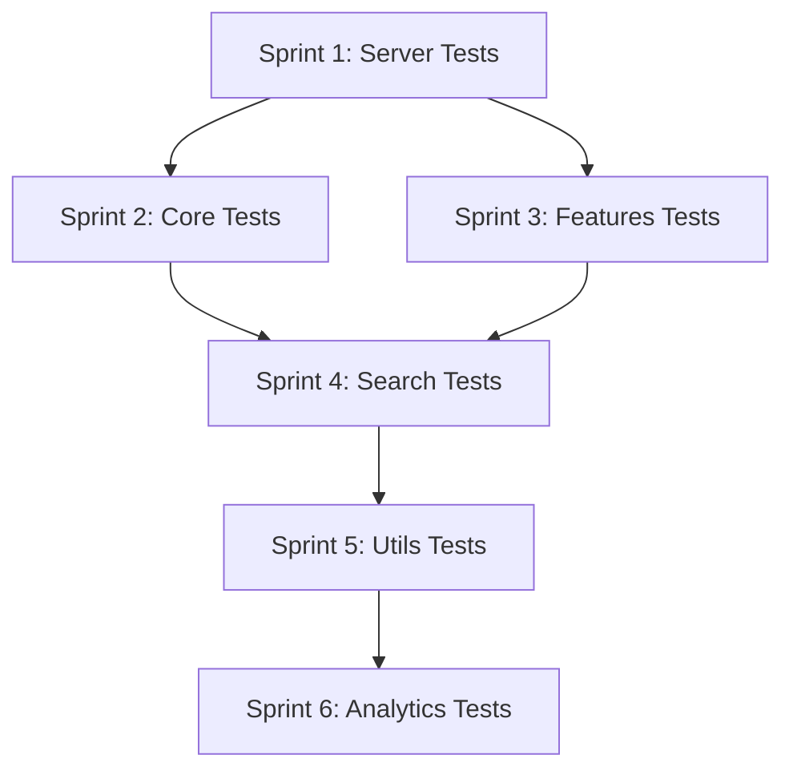

# Phase 2 Test Plan: Achieve >90% Test Coverage

**Version**: 1.0.0
**Created**: 2025-12-29
**Status**: Planned
**Total Sprints**: 6
**Total Tasks**: 24 tasks organized into sprints of 4 items

---

## Executive Summary

This plan addresses test coverage gaps identified by the dependency graph analysis. Current test coverage is approximately 40%, with critical paths like tool handlers at only 1.75% coverage.

### Current State

| Module | Files | Current Coverage | Tests |
|--------|-------|------------------|-------|
| Core | 6 | 45% | 96 |
| Features | 8 | 21% | 32 |
| Search | 10 | 55% | 177 |
| Server | 3 | 16% | 0 |
| Utils | 18 | 47% | 36 |
| Types | 6 | 0% | 0 |
| **Total** | **51** | **~40%** | **431** |

### Target Metrics

| Metric | Current | Target | Gap |
|--------|---------|--------|-----|
| Overall coverage | 40% | 90% | +50% |
| Core module | 45% | 95% | +50% |
| Features module | 21% | 90% | +69% |
| Server module | 16% | 85% | +69% |
| Utils module | 47% | 90% | +43% |
| Test count | 431 | ~700 | +269 |

### Priority Order

1. **CRITICAL**: Server layer (toolHandlers) - entry point for all MCP tools
2. **HIGH**: Core managers (TransactionManager) - data integrity
3. **HIGH**: Features (TagManager, BackupManager, ImportManager) - key functionality
4. **MEDIUM**: Search orchestration - user-facing search
5. **MEDIUM**: Utils (validation, entity, tag utilities)
6. **LOW**: Analytics, Archive, Export - read-only operations

---

## Sprint 1: Server Layer Tests (Critical Path)

**Priority**: CRITICAL
**Impact**: Tests the entry point for all 47 MCP tools
**Target Coverage**: 85%

### Task 1.1: Create toolHandlers Unit Tests

**File**: `src/memory/__tests__/unit/server/toolHandlers.test.ts` (new)
**Current Coverage**: 1.75%
**Target Coverage**: 85%

**Test Categories**:
```typescript
describe('toolHandlers', () => {
  describe('Entity Operations', () => {
    it('should handle create_entities tool');
    it('should handle delete_entities tool');
    it('should handle open_nodes tool');
    it('should handle read_graph tool');
  });

  describe('Relation Operations', () => {
    it('should handle create_relations tool');
    it('should handle delete_relations tool');
  });

  describe('Observation Operations', () => {
    it('should handle add_observations tool');
    it('should handle delete_observations tool');
  });

  describe('Search Operations', () => {
    it('should handle search_nodes tool');
    it('should handle boolean_search tool');
    it('should handle fuzzy_search tool');
    it('should handle search_nodes_ranked tool');
  });

  describe('Tag Operations', () => {
    it('should handle add_tags tool');
    it('should handle remove_tags tool');
    it('should handle set_importance tool');
  });

  describe('Hierarchy Operations', () => {
    it('should handle set_entity_parent tool');
    it('should handle get_children tool');
    it('should handle get_ancestors tool');
  });

  describe('Error Handling', () => {
    it('should return error for unknown tool');
    it('should handle invalid input gracefully');
    it('should include error details in response');
  });
});
```

**Acceptance Criteria**:
- [ ] 40+ tests covering all 47 tool handlers
- [ ] Error cases tested for each category
- [ ] Coverage > 85%
- [ ] All tests pass

---

### Task 1.2: Create toolDefinitions Validation Tests

**File**: `src/memory/__tests__/unit/server/toolDefinitions.test.ts` (new)
**Current Coverage**: 100% (but no behavioral tests)

**Test Cases**:
```typescript
describe('toolDefinitions', () => {
  describe('Schema Validation', () => {
    it('should have valid JSON schema for all tools');
    it('should require mandatory fields');
    it('should have consistent naming convention');
  });

  describe('Tool Categories', () => {
    it('should have 47 tool definitions');
    it('should organize tools into correct categories');
    it('should have unique tool names');
  });

  describe('Input Schemas', () => {
    it('should validate entity name constraints');
    it('should validate importance range (0-10)');
    it('should validate tag array format');
  });
});
```

**Acceptance Criteria**:
- [ ] Schema validation tests for all tools
- [ ] Category organization verified
- [ ] Input constraint tests
- [ ] 15+ tests

---

### Task 1.3: Create MCPServer Integration Tests

**File**: `src/memory/__tests__/integration/server.test.ts` (new)
**Current Coverage**: 72%

**Test Cases**:
```typescript
describe('MCPServer Integration', () => {
  it('should initialize with KnowledgeGraphManager');
  it('should register all 47 tools');
  it('should handle tool calls via MCP protocol');
  it('should return properly formatted responses');
  it('should handle concurrent requests');
});
```

**Acceptance Criteria**:
- [ ] Server initialization tested
- [ ] Tool registration verified
- [ ] MCP protocol compliance tested
- [ ] 10+ integration tests

---

### Task 1.4: Create responseFormatter Tests

**File**: `src/memory/__tests__/unit/utils/responseFormatter.test.ts` (new)
**Current Coverage**: 0%

**Test Cases**:
```typescript
describe('responseFormatter', () => {
  describe('formatToolResponse', () => {
    it('should format successful responses');
    it('should format error responses');
    it('should include metadata');
  });

  describe('formatTextResponse', () => {
    it('should format text content');
    it('should handle empty content');
  });

  describe('formatRawResponse', () => {
    it('should pass through raw data');
    it('should handle complex objects');
  });
});
```

**Acceptance Criteria**:
- [ ] All formatter functions tested
- [ ] Edge cases covered
- [ ] Coverage > 90%
- [ ] 12+ tests

---

## Sprint 2: Core Manager Tests

**Priority**: HIGH
**Impact**: Data integrity and transaction safety
**Target Coverage**: 95%

### Task 2.1: Create TransactionManager Tests

**File**: `src/memory/__tests__/unit/core/TransactionManager.test.ts` (new)
**Current Coverage**: 0%
**Lines**: ~468

**Test Cases**:
```typescript
describe('TransactionManager', () => {
  describe('Transaction Lifecycle', () => {
    it('should begin a new transaction');
    it('should commit transaction successfully');
    it('should rollback transaction on error');
    it('should handle nested transactions');
  });

  describe('Batch Operations', () => {
    it('should batch create entities');
    it('should batch update entities');
    it('should batch delete entities');
    it('should maintain atomicity');
  });

  describe('Conflict Resolution', () => {
    it('should detect concurrent modifications');
    it('should handle optimistic locking');
    it('should retry failed transactions');
  });

  describe('Error Handling', () => {
    it('should rollback on partial failure');
    it('should preserve data integrity');
    it('should log transaction errors');
  });
});
```

**Acceptance Criteria**:
- [ ] Transaction lifecycle fully tested
- [ ] Batch operations verified
- [ ] Error scenarios covered
- [ ] 25+ tests
- [ ] Coverage > 90%

---

### Task 2.2: Expand EntityManager Hierarchy Tests

**File**: `src/memory/__tests__/unit/core/EntityManager.test.ts` (existing)
**Current Coverage**: 41%
**Target Coverage**: 90%

**Additional Test Cases**:
```typescript
describe('EntityManager - Hierarchy', () => {
  describe('setEntityParent', () => {
    it('should set parent for entity');
    it('should detect cycles');
    it('should throw CycleDetectedError');
    it('should update lastModified');
  });

  describe('getChildren', () => {
    it('should return direct children');
    it('should return empty for leaf nodes');
  });

  describe('getAncestors', () => {
    it('should return all ancestors');
    it('should handle deep hierarchies');
  });

  describe('getDescendants', () => {
    it('should return all descendants');
    it('should handle wide hierarchies');
  });

  describe('moveEntity', () => {
    it('should move entity to new parent');
    it('should prevent moving to descendant');
  });
});
```

**Acceptance Criteria**:
- [ ] All hierarchy methods tested
- [ ] Cycle detection verified
- [ ] Edge cases covered
- [ ] 20+ additional tests
- [ ] Coverage > 90%

---

### Task 2.3: Expand GraphStorage Tests

**File**: `src/memory/__tests__/unit/core/GraphStorage.test.ts` (existing)
**Current Coverage**: 76%
**Target Coverage**: 95%

**Additional Test Cases**:
```typescript
describe('GraphStorage - Extended', () => {
  describe('Index Operations', () => {
    it('should build NameIndex on load');
    it('should build TypeIndex on load');
    it('should build LowercaseCache on load');
    it('should update indexes on mutation');
  });

  describe('Append Operations', () => {
    it('should append entity without full rewrite');
    it('should track pending appends');
    it('should compact after threshold');
  });

  describe('Cache Management', () => {
    it('should invalidate cache on external change');
    it('should handle concurrent access');
    it('should persist cache correctly');
  });
});
```

**Acceptance Criteria**:
- [ ] Index integration tested
- [ ] Append operations verified
- [ ] Cache behavior tested
- [ ] 15+ additional tests
- [ ] Coverage > 95%

---

### Task 2.4: Create KnowledgeGraphManager Facade Tests

**File**: `src/memory/__tests__/unit/core/KnowledgeGraphManager.test.ts` (new)
**Current Coverage**: 27%
**Target Coverage**: 85%

**Test Cases**:
```typescript
describe('KnowledgeGraphManager', () => {
  describe('Manager Delegation', () => {
    it('should delegate to EntityManager');
    it('should delegate to RelationManager');
    it('should delegate to SearchManager');
    it('should lazy-load managers');
  });

  describe('Cross-Manager Operations', () => {
    it('should coordinate entity and relation operations');
    it('should maintain consistency across managers');
  });

  describe('Compression Operations', () => {
    it('should find duplicates');
    it('should merge entities');
    it('should compress graph');
  });
});
```

**Acceptance Criteria**:
- [ ] All delegation paths tested
- [ ] Manager coordination verified
- [ ] 20+ tests
- [ ] Coverage > 85%

---

## Sprint 3: Features Module Tests

**Priority**: HIGH
**Impact**: Key functionality for tags, backup, import/export
**Target Coverage**: 90%

### Task 3.1: Create TagManager Tests

**File**: `src/memory/__tests__/unit/features/TagManager.test.ts` (new)
**Current Coverage**: 0%
**Lines**: ~225

**Test Cases**:
```typescript
describe('TagManager', () => {
  describe('Tag Aliases', () => {
    it('should add tag alias');
    it('should resolve alias to canonical');
    it('should list all aliases');
    it('should remove alias');
  });

  describe('Bulk Tag Operations', () => {
    it('should add tags to multiple entities');
    it('should replace tag across entities');
    it('should merge two tags');
  });

  describe('Alias Resolution', () => {
    it('should resolve nested aliases');
    it('should handle circular alias references');
    it('should normalize tags on resolution');
  });

  describe('Persistence', () => {
    it('should persist aliases to file');
    it('should load aliases on startup');
  });
});
```

**Acceptance Criteria**:
- [ ] All alias operations tested
- [ ] Bulk operations verified
- [ ] Persistence tested
- [ ] 25+ tests
- [ ] Coverage > 90%

---

### Task 3.2: Create BackupManager Tests

**File**: `src/memory/__tests__/unit/features/BackupManager.test.ts` (new)
**Current Coverage**: 0%
**Lines**: ~362

**Test Cases**:
```typescript
describe('BackupManager', () => {
  describe('Backup Creation', () => {
    it('should create backup with timestamp');
    it('should include all graph data');
    it('should create backup metadata');
    it('should handle large graphs');
  });

  describe('Backup Listing', () => {
    it('should list all backups');
    it('should sort by date');
    it('should include backup size');
  });

  describe('Restore Operations', () => {
    it('should restore from backup');
    it('should validate backup integrity');
    it('should handle missing backup');
  });

  describe('Backup Rotation', () => {
    it('should delete old backups');
    it('should keep minimum backups');
  });
});
```

**Acceptance Criteria**:
- [ ] Backup creation tested
- [ ] Restore verified
- [ ] Rotation logic tested
- [ ] 20+ tests
- [ ] Coverage > 85%

---

### Task 3.3: Create ImportManager Tests

**File**: `src/memory/__tests__/unit/features/ImportManager.test.ts` (new)
**Current Coverage**: 0%
**Lines**: ~379

**Test Cases**:
```typescript
describe('ImportManager', () => {
  describe('JSON Import', () => {
    it('should import valid JSON');
    it('should handle malformed JSON');
    it('should merge with existing data');
  });

  describe('CSV Import', () => {
    it('should import entities from CSV');
    it('should import relations from CSV');
    it('should handle missing columns');
  });

  describe('GraphML Import', () => {
    it('should import GraphML format');
    it('should preserve attributes');
  });

  describe('Merge Strategies', () => {
    it('should replace existing entities');
    it('should skip duplicates');
    it('should merge observations');
    it('should fail on conflict');
  });

  describe('Validation', () => {
    it('should validate entity structure');
    it('should validate relation references');
    it('should report import errors');
  });
});
```

**Acceptance Criteria**:
- [ ] All formats tested (JSON, CSV, GraphML)
- [ ] Merge strategies verified
- [ ] Validation tested
- [ ] 25+ tests
- [ ] Coverage > 85%

---

### Task 3.4: Create ExportManager Tests

**File**: `src/memory/__tests__/unit/features/ExportManager.test.ts` (new)
**Current Coverage**: 0%
**Lines**: ~344

**Test Cases**:
```typescript
describe('ExportManager', () => {
  describe('JSON Export', () => {
    it('should export as valid JSON');
    it('should include all entities');
    it('should include all relations');
  });

  describe('CSV Export', () => {
    it('should export entities as CSV');
    it('should export relations as CSV');
    it('should escape special characters');
  });

  describe('GraphML Export', () => {
    it('should export valid GraphML');
    it('should include node attributes');
    it('should include edge attributes');
  });

  describe('Other Formats', () => {
    it('should export as DOT');
    it('should export as Markdown');
    it('should export as Mermaid');
    it('should export as GEXF');
  });

  describe('Filtering', () => {
    it('should export filtered by date');
    it('should export filtered by type');
    it('should export filtered by tags');
  });
});
```

**Acceptance Criteria**:
- [ ] All 7 formats tested
- [ ] Filtering verified
- [ ] Output validated
- [ ] 25+ tests
- [ ] Coverage > 90%

---

## Sprint 4: Search Module Tests

**Priority**: MEDIUM
**Impact**: Search orchestration and advanced features
**Target Coverage**: 85%

### Task 4.1: Create SearchManager Tests

**File**: `src/memory/__tests__/unit/search/SearchManager.test.ts` (new)
**Current Coverage**: 42%
**Target Coverage**: 85%

**Test Cases**:
```typescript
describe('SearchManager', () => {
  describe('Search Dispatch', () => {
    it('should dispatch to basic search');
    it('should dispatch to boolean search');
    it('should dispatch to ranked search');
    it('should dispatch to fuzzy search');
  });

  describe('Query Detection', () => {
    it('should detect boolean operators');
    it('should detect fuzzy markers');
    it('should handle mixed queries');
  });

  describe('Result Aggregation', () => {
    it('should combine results from multiple searches');
    it('should deduplicate results');
    it('should sort by relevance');
  });
});
```

**Acceptance Criteria**:
- [ ] All search types dispatched
- [ ] Query detection tested
- [ ] 15+ tests
- [ ] Coverage > 85%

---

### Task 4.2: Create SavedSearchManager Tests

**File**: `src/memory/__tests__/unit/search/SavedSearchManager.test.ts` (new)
**Current Coverage**: 4.65%
**Lines**: ~174

**Test Cases**:
```typescript
describe('SavedSearchManager', () => {
  describe('Save Search', () => {
    it('should save search with name');
    it('should save search parameters');
    it('should prevent duplicate names');
  });

  describe('Execute Saved Search', () => {
    it('should execute by name');
    it('should apply saved parameters');
    it('should throw for unknown search');
  });

  describe('Manage Saved Searches', () => {
    it('should list all saved searches');
    it('should update saved search');
    it('should delete saved search');
  });

  describe('Persistence', () => {
    it('should persist to file');
    it('should load on startup');
  });
});
```

**Acceptance Criteria**:
- [ ] CRUD operations tested
- [ ] Persistence verified
- [ ] 15+ tests
- [ ] Coverage > 85%

---

### Task 4.3: Create TFIDFIndexManager Tests

**File**: `src/memory/__tests__/unit/search/TFIDFIndexManager.test.ts` (new)
**Current Coverage**: 2.7%
**Lines**: ~261

**Test Cases**:
```typescript
describe('TFIDFIndexManager', () => {
  describe('Index Building', () => {
    it('should build index from entities');
    it('should calculate term frequencies');
    it('should calculate document frequencies');
  });

  describe('Incremental Updates', () => {
    it('should add entity to index');
    it('should remove entity from index');
    it('should update entity in index');
  });

  describe('Search Scoring', () => {
    it('should score documents by TF-IDF');
    it('should rank higher for rare terms');
    it('should handle multi-term queries');
  });

  describe('Performance', () => {
    it('should lazy-load index');
    it('should cache index');
    it('should invalidate on changes');
  });
});
```

**Acceptance Criteria**:
- [ ] Index operations tested
- [ ] Scoring verified
- [ ] Performance characteristics tested
- [ ] 20+ tests
- [ ] Coverage > 85%

---

### Task 4.4: Create SearchSuggestions Tests

**File**: `src/memory/__tests__/unit/search/SearchSuggestions.test.ts` (new)
**Current Coverage**: 5%
**Lines**: ~70

**Test Cases**:
```typescript
describe('SearchSuggestions', () => {
  describe('getSuggestions', () => {
    it('should suggest entity names');
    it('should suggest entity types');
    it('should suggest tags');
    it('should limit results');
  });

  describe('Ranking', () => {
    it('should rank by frequency');
    it('should rank by recency');
    it('should boost exact matches');
  });
});
```

**Acceptance Criteria**:
- [ ] Suggestion sources tested
- [ ] Ranking verified
- [ ] 10+ tests
- [ ] Coverage > 85%

---

## Sprint 5: Utils Module Tests

**Priority**: MEDIUM
**Impact**: Foundation utilities used across codebase
**Target Coverage**: 90%

### Task 5.1: Create entityUtils Tests

**File**: `src/memory/__tests__/unit/utils/entityUtils.test.ts` (new)
**Current Coverage**: 0%
**Lines**: ~152

**Test Cases**:
```typescript
describe('entityUtils', () => {
  describe('findEntityByName', () => {
    it('should find entity by exact name');
    it('should return undefined for missing');
    it('should be case-sensitive');
  });

  describe('filterEntities', () => {
    it('should filter by type');
    it('should filter by tags');
    it('should filter by importance');
    it('should combine filters');
  });

  describe('sortEntities', () => {
    it('should sort by name');
    it('should sort by date');
    it('should sort by importance');
  });
});
```

**Acceptance Criteria**:
- [ ] All utility functions tested
- [ ] Edge cases covered
- [ ] 15+ tests
- [ ] Coverage > 90%

---

### Task 5.2: Create tagUtils Tests

**File**: `src/memory/__tests__/unit/utils/tagUtils.test.ts` (new)
**Current Coverage**: 7.7%
**Lines**: ~128

**Test Cases**:
```typescript
describe('tagUtils', () => {
  describe('normalizeTag', () => {
    it('should lowercase tags');
    it('should trim whitespace');
    it('should handle special characters');
  });

  describe('hasMatchingTag', () => {
    it('should match exact tag');
    it('should match normalized tag');
    it('should handle empty tags');
  });

  describe('mergeTags', () => {
    it('should combine tag arrays');
    it('should deduplicate tags');
    it('should normalize result');
  });
});
```

**Acceptance Criteria**:
- [ ] Normalization tested
- [ ] Matching logic verified
- [ ] 15+ tests
- [ ] Coverage > 90%

---

### Task 5.3: Create validationHelper Tests

**File**: `src/memory/__tests__/unit/utils/validationHelper.test.ts` (new)
**Current Coverage**: 0%
**Lines**: ~117

**Test Cases**:
```typescript
describe('validationHelper', () => {
  describe('validateWithSchema', () => {
    it('should validate valid input');
    it('should reject invalid input');
    it('should return detailed errors');
  });

  describe('Schema Validation', () => {
    it('should validate entity schema');
    it('should validate relation schema');
    it('should validate search query schema');
  });
});
```

**Acceptance Criteria**:
- [ ] Zod schema validation tested
- [ ] Error formatting verified
- [ ] 12+ tests
- [ ] Coverage > 85%

---

### Task 5.4: Create validationUtils Tests

**File**: `src/memory/__tests__/unit/utils/validationUtils.test.ts` (new)
**Current Coverage**: 0%
**Lines**: ~134

**Test Cases**:
```typescript
describe('validationUtils', () => {
  describe('validateEntity', () => {
    it('should accept valid entity');
    it('should reject missing name');
    it('should reject invalid importance');
    it('should reject invalid tags');
  });

  describe('validateRelation', () => {
    it('should accept valid relation');
    it('should reject missing from/to');
    it('should reject missing type');
  });

  describe('validateImportance', () => {
    it('should accept 0-10');
    it('should reject negative');
    it('should reject > 10');
    it('should reject non-integer');
  });

  describe('validateTags', () => {
    it('should accept valid tags');
    it('should reject empty tags');
    it('should reject non-string tags');
  });
});
```

**Acceptance Criteria**:
- [ ] All validation functions tested
- [ ] Boundary conditions verified
- [ ] 20+ tests
- [ ] Coverage > 90%

---

## Sprint 6: Analytics and Archive Tests

**Priority**: LOW
**Impact**: Read-only operations, lower risk
**Target Coverage**: 85%

### Task 6.1: Create AnalyticsManager Tests

**File**: `src/memory/__tests__/unit/features/AnalyticsManager.test.ts` (new)
**Current Coverage**: 0%
**Lines**: ~224

**Test Cases**:
```typescript
describe('AnalyticsManager', () => {
  describe('getGraphStats', () => {
    it('should count entities');
    it('should count relations');
    it('should count by type');
    it('should calculate averages');
  });

  describe('validateGraph', () => {
    it('should detect orphan relations');
    it('should detect duplicate entities');
    it('should detect invalid references');
    it('should return validation report');
  });

  describe('Metrics', () => {
    it('should calculate density');
    it('should calculate connectivity');
    it('should identify hubs');
  });
});
```

**Acceptance Criteria**:
- [ ] Stats calculation tested
- [ ] Validation verified
- [ ] 15+ tests
- [ ] Coverage > 85%

---

### Task 6.2: Create ArchiveManager Tests

**File**: `src/memory/__tests__/unit/features/ArchiveManager.test.ts` (new)
**Current Coverage**: 0%
**Lines**: ~107

**Test Cases**:
```typescript
describe('ArchiveManager', () => {
  describe('archiveEntities', () => {
    it('should archive by age');
    it('should archive by importance');
    it('should archive by tags');
    it('should support dry run');
  });

  describe('Archive Criteria', () => {
    it('should combine multiple criteria');
    it('should handle empty result');
  });

  describe('Archive Result', () => {
    it('should report archived count');
    it('should list archived entities');
  });
});
```

**Acceptance Criteria**:
- [ ] Archive criteria tested
- [ ] Dry run verified
- [ ] 12+ tests
- [ ] Coverage > 85%

---

### Task 6.3: Create SearchFilterChain Tests

**File**: `src/memory/__tests__/unit/search/SearchFilterChain.test.ts` (new)
**Current Coverage**: 45%
**Target Coverage**: 90%

**Test Cases**:
```typescript
describe('SearchFilterChain', () => {
  describe('Filter Chaining', () => {
    it('should chain multiple filters');
    it('should apply filters in order');
    it('should short-circuit on empty');
  });

  describe('Individual Filters', () => {
    it('should filter by importance range');
    it('should filter by date range');
    it('should filter by entity type');
    it('should filter by tags');
  });

  describe('Performance', () => {
    it('should optimize filter order');
    it('should handle large datasets');
  });
});
```

**Acceptance Criteria**:
- [ ] Chaining logic tested
- [ ] All filter types verified
- [ ] 15+ tests
- [ ] Coverage > 90%

---

### Task 6.4: Create errors.test.ts Tests

**File**: `src/memory/__tests__/unit/utils/errors.test.ts` (new)
**Current Coverage**: 41%
**Target Coverage**: 90%

**Test Cases**:
```typescript
describe('Error Classes', () => {
  describe('EntityNotFoundError', () => {
    it('should include entity name');
    it('should have correct error code');
    it('should be instanceof KnowledgeGraphError');
  });

  describe('RelationNotFoundError', () => {
    it('should include from/to/type');
    it('should format message correctly');
  });

  describe('ValidationError', () => {
    it('should include validation details');
    it('should support multiple errors');
  });

  describe('CycleDetectedError', () => {
    it('should include cycle path');
  });

  describe('Error Inheritance', () => {
    it('should all extend KnowledgeGraphError');
    it('should be catchable by base class');
  });
});
```

**Acceptance Criteria**:
- [ ] All error classes tested
- [ ] Inheritance verified
- [ ] 15+ tests
- [ ] Coverage > 90%

---

## Appendix A: Test File Checklist

### New Test Files to Create (16 files)

| Sprint | Test File | Target Tests |
|--------|-----------|--------------|
| 1 | `unit/server/toolHandlers.test.ts` | 40+ |
| 1 | `unit/server/toolDefinitions.test.ts` | 15+ |
| 1 | `integration/server.test.ts` | 10+ |
| 1 | `unit/utils/responseFormatter.test.ts` | 12+ |
| 2 | `unit/core/TransactionManager.test.ts` | 25+ |
| 2 | `unit/core/KnowledgeGraphManager.test.ts` | 20+ |
| 3 | `unit/features/TagManager.test.ts` | 25+ |
| 3 | `unit/features/BackupManager.test.ts` | 20+ |
| 3 | `unit/features/ImportManager.test.ts` | 25+ |
| 3 | `unit/features/ExportManager.test.ts` | 25+ |
| 4 | `unit/search/SearchManager.test.ts` | 15+ |
| 4 | `unit/search/SavedSearchManager.test.ts` | 15+ |
| 4 | `unit/search/TFIDFIndexManager.test.ts` | 20+ |
| 4 | `unit/search/SearchSuggestions.test.ts` | 10+ |
| 5 | `unit/utils/entityUtils.test.ts` | 15+ |
| 5 | `unit/utils/tagUtils.test.ts` | 15+ |
| 5 | `unit/utils/validationHelper.test.ts` | 12+ |
| 5 | `unit/utils/validationUtils.test.ts` | 20+ |
| 6 | `unit/features/AnalyticsManager.test.ts` | 15+ |
| 6 | `unit/features/ArchiveManager.test.ts` | 12+ |
| 6 | `unit/search/SearchFilterChain.test.ts` | 15+ |
| 6 | `unit/utils/errors.test.ts` | 15+ |

### Existing Test Files to Expand (4 files)

| Test File | Current Tests | Target Tests |
|-----------|---------------|--------------|
| `unit/core/EntityManager.test.ts` | 31 | 51+ |
| `unit/core/GraphStorage.test.ts` | 10 | 25+ |
| `unit/search/SearchFilterChain.test.ts` | ~10 | 25+ |
| `unit/utils/errors.test.ts` | ~5 | 20+ |

---

## Appendix B: Coverage Targets by Module

| Module | Current | Sprint Target | Final Target |
|--------|---------|---------------|--------------|
| **core/** | 45% | S2: 85% | 95% |
| **features/** | 21% | S3: 75% | 90% |
| **search/** | 55% | S4: 80% | 90% |
| **server/** | 16% | S1: 85% | 85% |
| **utils/** | 47% | S5: 85% | 90% |
| **types/** | 0% | N/A | N/A (type-only) |
| **Overall** | 40% | 75% | **>90%** |

---

## Appendix C: Sprint Dependencies



**Notes**:
- Sprint 1 can run independently (no dependencies)
- Sprints 2 and 3 can run in parallel after Sprint 1
- Sprint 4 requires Sprints 2 and 3 (uses core and features)
- Sprint 5 requires Sprint 4 (utils support search)
- Sprint 6 is lowest priority, can be done last

---

## Appendix D: Estimated Effort

| Sprint | Tasks | New Tests | Hours |
|--------|-------|-----------|-------|
| Sprint 1 | 4 | ~77 | 8 |
| Sprint 2 | 4 | ~80 | 10 |
| Sprint 3 | 4 | ~95 | 10 |
| Sprint 4 | 4 | ~60 | 8 |
| Sprint 5 | 4 | ~62 | 6 |
| Sprint 6 | 4 | ~57 | 6 |
| **Total** | **24** | **~431** | **48** |

**Final Test Count**: 431 (current) + 431 (new) = **~862 tests**

---

## Appendix E: Success Criteria

### Per-Sprint Verification

After each sprint, verify:
1. All new tests pass
2. No regressions in existing tests
3. Coverage increased to sprint target
4. TypeScript compiles without errors

### Final Verification

After all sprints complete:
1. Overall coverage > 90%
2. All 47 tools have handler tests
3. All managers have unit tests
4. Integration tests cover key workflows
5. Performance benchmarks unchanged

---

## Changelog

| Date | Version | Changes |
|------|---------|---------|
| 2025-12-29 | 1.0.0 | Initial test plan |
