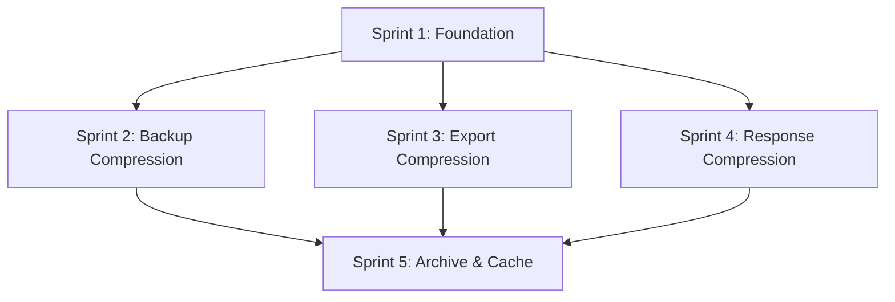

# Phase 3 Refactoring Plan: Brotli Compression Integration

**Version**: 1.0.1
**Created**: 2026-01-01
**Updated**: 2026-01-01
**Status**: Planned
**Total Sprints**: 5
**Total Tasks**: 25 tasks organized into sprints of 4-6 items
**Prerequisites**: Phase 1 Sprint 11.4 (IOManager consolidation) must be complete

---

## Executive Summary

This plan integrates brotli compression into the memory-mcp knowledge graph system based on the [Brotli Compression Integration Analysis](./brotli-compression-integration.md). Brotli offers 15-20% better compression than gzip, with 60-75% compression typical for JSON data.

### Key Benefits

1. **50-70% backup space reduction** - Immediate ROI with minimal code changes
2. **60-75% export compression** - Smaller files for all 7 export formats
3. **Reduced bandwidth** - Compressed MCP responses for large payloads
4. **Efficient archiving** - Cold storage compression for archived entities
5. **Lower RAM footprint** - Cache compression for 50k+ entity graphs

### Target Metrics

| Metric | Current | Target | Improvement |
|--------|---------|--------|-------------|
| Backup file size (5K entities) | ~1.25 MB | ~375 KB | 70% reduction |
| Backup file size (50K entities) | ~12.5 MB | ~3.75 MB | 70% reduction |
| Export payload (100K entities) | ~25 MB | ~7.5 MB | 70% reduction |
| MCP response (large graph) | Uncompressed | Auto-compressed | 60-75% reduction |
| Entity write overhead | 1-2ms | 2-4ms | +1-2ms |
| Graph load overhead | 50ms | +10-15ms | Acceptable |

---

## Sprint 1: Foundation & Utility Setup

**Priority**: CRITICAL (P0)
**Estimated Duration**: 1 day
**Impact**: Enables all subsequent compression features

### Task 1.1: Verify Node.js Brotli Support

**File**: `src/memory/package.json`
**Estimated Time**: 15 minutes
**Agent**: Claude Haiku

**Notes**:
- Node.js 11.7.0+ includes built-in brotli support via the `zlib` module
- No external dependencies required
- Uses `zlib.brotliCompress()` and `zlib.brotliDecompress()` async functions
- Uses `zlib.brotliCompressSync()` and `zlib.brotliDecompressSync()` for sync operations

**Verification**:
```typescript
import { brotliCompress, brotliDecompress, constants } from 'zlib';
import { promisify } from 'util';

const compress = promisify(brotliCompress);
const decompress = promisify(brotliDecompress);
```

**Acceptance Criteria**:
- [ ] Node.js version >=18 confirmed in package.json engines
- [ ] No additional dependencies needed
- [ ] TypeScript types available via `@types/node`

---

### Task 1.2: Create Compression Utility Module

**File**: `src/memory/utils/compressionUtil.ts` (new)
**Estimated Time**: 2 hours
**Agent**: Claude Sonnet

**Implementation**:
```typescript
import { brotliCompress, brotliDecompress, constants } from 'zlib';
import { promisify } from 'util';
import { promises as fs } from 'fs';

// Promisify Node.js zlib functions
const compressAsync = promisify(brotliCompress);
const decompressAsync = promisify(brotliDecompress);

export interface CompressionOptions {
  quality: number;          // 0-11, default 6
  lgwin?: number;           // Window size (10-24)
  mode?: 'text' | 'generic'; // Compression mode
}

export interface CompressionResult {
  compressed: Buffer;
  originalSize: number;
  compressedSize: number;
  ratio: number;            // compressedSize / originalSize
}

export interface CompressionMetadata {
  compressed: boolean;
  compressionFormat: 'brotli' | 'none';
  originalSize: number;
  compressedSize: number;
  originalChecksum?: string;
  createdAt: string;
}

/**
 * Detect if buffer is brotli compressed.
 *
 * Note: Brotli doesn't have fixed magic bytes like gzip.
 * Detection uses heuristics: try to decompress a small chunk
 * or check file extension. For reliability, use file extension
 * or metadata rather than magic byte detection.
 *
 * This function checks if the first byte looks like a valid
 * brotli window size byte (WBITS encoding).
 */
export function isBrotliCompressed(buffer: Buffer): boolean {
  if (buffer.length < 1) return false;

  // Brotli streams start with a window size encoded in the first byte
  // Valid WBITS values are 10-24, encoded as (WBITS - 10) in bits 0-3
  // with bit 4 indicating if it's the last meta-block
  // This is a heuristic - not 100% reliable
  const firstByte = buffer[0];

  // Check if first byte could be a valid brotli stream start
  // If data starts with '{' (0x7B) or '[' (0x5B), it's likely JSON
  if (firstByte === 0x7B || firstByte === 0x5B) {
    return false;
  }

  // Try decompression as definitive check for small buffers
  // For performance, only check first few bytes pattern
  return true; // Rely on file extension (.br) for reliable detection
}

/**
 * Check if file path indicates brotli compression.
 */
export function hasBrotliExtension(filePath: string): boolean {
  return filePath.endsWith('.br');
}

export async function compress(
  data: Buffer | string,
  options: CompressionOptions = { quality: 6 }
): Promise<CompressionResult> {
  const input = Buffer.isBuffer(data) ? data : Buffer.from(data, 'utf-8');

  const zlibOptions = {
    params: {
      [constants.BROTLI_PARAM_QUALITY]: options.quality,
      [constants.BROTLI_PARAM_MODE]: options.mode === 'text'
        ? constants.BROTLI_MODE_TEXT
        : constants.BROTLI_MODE_GENERIC,
    },
  };

  if (options.lgwin) {
    zlibOptions.params[constants.BROTLI_PARAM_LGWIN] = options.lgwin;
  }

  const compressed = await compressAsync(input, zlibOptions);

  return {
    compressed,
    originalSize: input.length,
    compressedSize: compressed.length,
    ratio: compressed.length / input.length,
  };
}

export async function decompress(data: Buffer): Promise<Buffer> {
  return await decompressAsync(data);
}

export function getCompressionRatio(original: number, compressed: number): number {
  return compressed / original;
}

export async function compressFile(
  inputPath: string,
  outputPath: string,
  options?: CompressionOptions
): Promise<CompressionResult> {
  const input = await fs.readFile(inputPath);
  const result = await compress(input, options);
  await fs.writeFile(outputPath, result.compressed);
  return result;
}

export async function decompressFile(
  inputPath: string,
  outputPath: string
): Promise<void> {
  const input = await fs.readFile(inputPath);
  const decompressed = await decompress(input);
  await fs.writeFile(outputPath, decompressed);
}

export function createMetadata(
  result: CompressionResult,
  checksum?: string
): CompressionMetadata {
  return {
    compressed: true,
    compressionFormat: 'brotli',
    originalSize: result.originalSize,
    compressedSize: result.compressedSize,
    originalChecksum: checksum,
    createdAt: new Date().toISOString(),
  };
}
```

**Acceptance Criteria**:
- [ ] `compress()` and `decompress()` functions work correctly
- [ ] `hasBrotliExtension()` reliably detects .br files
- [ ] `compressFile()` and `decompressFile()` handle file I/O
- [ ] All functions have proper error handling
- [ ] JSDoc documentation for public API

---

### Task 1.3: Add Compression Constants

**File**: `src/memory/utils/constants.ts`
**Estimated Time**: 30 minutes
**Agent**: Claude Haiku

**Additions**:
```typescript
export const COMPRESSION_CONFIG = {
  // Quality levels (0-11)
  BROTLI_QUALITY_REALTIME: 4,      // Entity writes - fast
  BROTLI_QUALITY_BATCH: 6,         // Exports, imports - balanced
  BROTLI_QUALITY_ARCHIVE: 11,      // Backups, archives - maximum
  BROTLI_QUALITY_CACHE: 5,         // Cache compression - fast decompress

  // Auto-compression thresholds
  AUTO_COMPRESS_EXPORT_SIZE: 100 * 1024,    // 100KB
  AUTO_COMPRESS_RESPONSE_SIZE: 256 * 1024,  // 256KB
  AUTO_COMPRESS_BACKUP: true,               // Always compress backups

  // File extension for compressed files
  BROTLI_EXTENSION: '.br',

  // Performance tuning
  COMPRESSION_CHUNK_SIZE: 65536,    // 64KB chunks for streaming
  COMPRESSION_WINDOW_SIZE: 22,      // Default window size (lgwin)
} as const;

export type CompressionQuality =
  | typeof COMPRESSION_CONFIG.BROTLI_QUALITY_REALTIME
  | typeof COMPRESSION_CONFIG.BROTLI_QUALITY_BATCH
  | typeof COMPRESSION_CONFIG.BROTLI_QUALITY_ARCHIVE
  | typeof COMPRESSION_CONFIG.BROTLI_QUALITY_CACHE;
```

**Acceptance Criteria**:
- [ ] All compression constants defined
- [ ] Quality levels documented with use cases
- [ ] Thresholds configurable
- [ ] Type exports for quality levels

---

### Task 1.4: Create Compression Unit Tests

**File**: `src/memory/__tests__/unit/utils/compressionUtil.test.ts` (new)
**Estimated Time**: 2 hours
**Agent**: Claude Sonnet

**Test Cases**:
```typescript
import { describe, it, expect, beforeEach } from 'vitest';
import {
  compress,
  decompress,
  hasBrotliExtension,
  compressFile,
  decompressFile,
  getCompressionRatio,
  createMetadata,
} from '../../../utils/compressionUtil.js';

describe('compressionUtil', () => {
  describe('compress/decompress roundtrip', () => {
    it('should compress and decompress string data correctly');
    it('should compress and decompress Buffer data correctly');
    it('should handle empty input');
    it('should handle large data (1MB+)');
    it('should achieve expected compression ratio for JSON');
  });

  describe('hasBrotliExtension', () => {
    it('should detect .br file extension');
    it('should reject .json extension');
    it('should reject .jsonl extension');
    it('should handle paths with multiple dots');
  });

  describe('quality levels', () => {
    it('should compress faster with lower quality');
    it('should achieve better ratio with higher quality');
    it('should work with all quality levels 0-11');
  });

  describe('file operations', () => {
    it('should compress file to disk');
    it('should decompress file from disk');
    it('should preserve file content through roundtrip');
  });

  describe('error handling', () => {
    it('should throw on corrupt compressed data');
    it('should handle file not found gracefully');
    it('should validate quality range');
  });

  describe('metadata', () => {
    it('should create valid compression metadata');
    it('should include checksum when provided');
    it('should calculate correct compression ratio');
  });
});
```

**Acceptance Criteria**:
- [ ] 20+ unit tests for compression utilities
- [ ] Tests cover all public functions
- [ ] Tests validate roundtrip correctness
- [ ] Tests validate error handling
- [ ] All tests pass

---

### Task 1.5: Update Barrel Exports

**File**: `src/memory/utils/index.ts`
**Estimated Time**: 15 minutes
**Agent**: Claude Haiku

**Changes**:
```typescript
export * from './compressionUtil.js';
export { COMPRESSION_CONFIG, type CompressionQuality } from './constants.js';
```

**Acceptance Criteria**:
- [ ] Compression utilities exported from utils barrel
- [ ] Constants exported from utils barrel
- [ ] No circular dependencies

---

## Sprint 2: Backup Compression (Priority 1)

**Priority**: HIGH (P1)
**Estimated Duration**: 1 day
**Impact**: Immediate 50-70% backup space reduction

### Task 2.1: Implement Compressed Backup Creation

**File**: `src/memory/features/IOManager.ts`
**Estimated Time**: 2 hours
**Agent**: Claude Sonnet

**Current Method**: `createBackup()` in IOManager class

**Target Implementation**:
```typescript
import { compress, createMetadata } from '../utils/compressionUtil.js';
import { COMPRESSION_CONFIG } from '../utils/constants.js';

async createBackup(options?: BackupOptions): Promise<BackupResult> {
  const graph = await this.storage.loadGraph();
  const timestamp = new Date().toISOString().replace(/[:.]/g, '-');
  const backupDir = path.join(path.dirname(this.storage.getFilePath()), '.backups');

  await fs.mkdir(backupDir, { recursive: true });

  // Serialize graph
  const content = JSON.stringify(graph, null, 0);
  const shouldCompress = options?.compress ?? COMPRESSION_CONFIG.AUTO_COMPRESS_BACKUP;

  if (shouldCompress) {
    // Compress with archive quality (maximum compression)
    const result = await compress(content, {
      quality: COMPRESSION_CONFIG.BROTLI_QUALITY_ARCHIVE,
    });

    const backupPath = path.join(backupDir, `backup_${timestamp}.jsonl.br`);
    const metadataPath = path.join(backupDir, `backup_${timestamp}.meta.json`);

    await fs.writeFile(backupPath, result.compressed);
    await fs.writeFile(metadataPath, JSON.stringify(createMetadata(result), null, 2));

    return {
      path: backupPath,
      timestamp,
      entityCount: graph.entities.length,
      relationCount: graph.relations.length,
      compressed: true,
      originalSize: result.originalSize,
      compressedSize: result.compressedSize,
      compressionRatio: result.ratio,
    };
  } else {
    // Uncompressed backup (legacy behavior)
    const backupPath = path.join(backupDir, `backup_${timestamp}.jsonl`);
    await fs.writeFile(backupPath, content);

    return {
      path: backupPath,
      timestamp,
      entityCount: graph.entities.length,
      relationCount: graph.relations.length,
      compressed: false,
      originalSize: content.length,
      compressedSize: content.length,
      compressionRatio: 1,
    };
  }
}
```

**Acceptance Criteria**:
- [ ] Backups compressed by default with brotli
- [ ] Metadata file created alongside backup
- [ ] Compression ratio included in result
- [ ] Option to disable compression
- [ ] All backup tests pass

---

### Task 2.2: Implement Compressed Backup Restoration

**File**: `src/memory/features/IOManager.ts`
**Estimated Time**: 1.5 hours
**Agent**: Claude Sonnet

**Target Implementation**:
```typescript
import { decompress, hasBrotliExtension } from '../utils/compressionUtil.js';

async restoreBackup(backupPath: string): Promise<RestoreResult> {
  const content = await fs.readFile(backupPath);

  let jsonContent: string;

  // Detect compression by file extension (reliable method)
  if (hasBrotliExtension(backupPath)) {
    const decompressed = await decompress(content);
    jsonContent = decompressed.toString('utf-8');
  } else {
    jsonContent = content.toString('utf-8');
  }

  const graph = JSON.parse(jsonContent) as KnowledgeGraph;

  // Validate graph structure
  this.validateGraph(graph);

  // Save to current storage
  await this.storage.saveGraph(graph);

  return {
    entityCount: graph.entities.length,
    relationCount: graph.relations.length,
    restoredFrom: backupPath,
    wasCompressed: hasBrotliExtension(backupPath),
  };
}
```

**Acceptance Criteria**:
- [ ] Detects compression via `.br` file extension
- [ ] Decompresses brotli backups correctly
- [ ] Maintains backward compatibility with old backups
- [ ] Validates graph structure after decompression
- [ ] All restore tests pass

---

### Task 2.3: Update listBackups to Show Compression Info

**File**: `src/memory/features/IOManager.ts`
**Estimated Time**: 1 hour
**Agent**: Claude Haiku

**Target Implementation**:
```typescript
import { hasBrotliExtension, CompressionMetadata } from '../utils/compressionUtil.js';

/**
 * Extract timestamp from backup filename.
 * Filename format: backup_YYYY-MM-DDTHH-MM-SS-sssZ.jsonl[.br]
 */
private extractTimestamp(filename: string): string {
  const match = filename.match(/backup_(.+?)\.(jsonl|jsonl\.br)$/);
  if (!match) return '';
  // Convert dashes back to colons for ISO format
  return match[1].replace(/-/g, (m, offset) => {
    // Keep date dashes (positions 4, 7), convert time dashes to colons
    return offset === 4 || offset === 7 ? '-' : ':';
  });
}

async listBackups(): Promise<BackupInfo[]> {
  try {
    const files = await fs.readdir(this.backupDir);
    const backups: BackupInfo[] = [];

    for (const file of files) {
      if (!file.startsWith('backup_') || file.endsWith('.meta.json')) continue;

      const filePath = join(this.backupDir, file);
      const stats = await fs.stat(filePath);
      const isCompressed = hasBrotliExtension(file);

      // Try to read metadata file
      const metaPath = filePath.replace(/\.(jsonl|jsonl\.br)$/, '.meta.json');
      let metadata: CompressionMetadata | null = null;

      try {
        const metaContent = await fs.readFile(metaPath, 'utf-8');
        metadata = JSON.parse(metaContent);
      } catch {
        // Metadata file may not exist for old backups
      }

      backups.push({
        filename: file,
        path: filePath,
        timestamp: this.extractTimestamp(file),
        size: stats.size,
        compressed: isCompressed,
        originalSize: metadata?.originalSize,
        compressionRatio: metadata ? metadata.compressedSize / metadata.originalSize : undefined,
      });
    }

    return backups.sort((a, b) => b.timestamp.localeCompare(a.timestamp));
  } catch {
    return [];
  }
}
```

**Acceptance Criteria**:
- [ ] Lists both compressed and uncompressed backups
- [ ] Shows compression ratio when metadata available
- [ ] Backward compatible with old backup format
- [ ] Sorted by timestamp (newest first)

---

### Task 2.4: Add Backup Compression Integration Tests

**File**: `src/memory/__tests__/integration/backup-compression.test.ts` (new)
**Estimated Time**: 1.5 hours
**Agent**: Claude Sonnet

**Test Cases**:
```typescript
describe('Backup Compression Integration', () => {
  it('should create compressed backup by default');
  it('should create uncompressed backup when disabled');
  it('should restore compressed backup correctly');
  it('should restore uncompressed backup correctly');
  it('should maintain data integrity through compress/decompress');
  it('should list backups with compression info');
  it('should handle mixed compressed/uncompressed backups');
  it('should achieve 50%+ compression on typical graph');
});
```

**Acceptance Criteria**:
- [ ] 8+ integration tests for backup compression
- [ ] Tests verify data integrity
- [ ] Tests verify compression ratio
- [ ] Tests verify backward compatibility
- [ ] All tests pass

---

### Task 2.5: Update BackupResult and BackupInfo Types

**File**: `src/memory/types/types.ts`
**Estimated Time**: 30 minutes
**Agent**: Claude Haiku

**Additions**:
```typescript
export interface BackupResult {
  path: string;
  timestamp: string;
  entityCount: number;
  relationCount: number;
  compressed: boolean;
  originalSize: number;
  compressedSize: number;
  compressionRatio: number;
}

export interface BackupInfo {
  filename: string;
  path: string;
  timestamp: string;
  size: number;
  compressed: boolean;
  originalSize?: number;
  compressionRatio?: number;
}

export interface RestoreResult {
  entityCount: number;
  relationCount: number;
  restoredFrom: string;
  wasCompressed: boolean;
}
```

**Acceptance Criteria**:
- [ ] Types updated with compression fields
- [ ] Types exported from barrel
- [ ] No breaking changes to existing API

---

## Sprint 3: Export Compression (Priority 2)

**Priority**: MEDIUM (P2)
**Estimated Duration**: 1.5 days
**Impact**: 60-75% reduction on exported graphs

### Task 3.1: Add Compression Option to export_graph Tool

**File**: `src/memory/server/toolDefinitions.ts`
**Estimated Time**: 30 minutes
**Agent**: Claude Haiku

**Addition to export_graph tool schema**:
```typescript
{
  name: 'export_graph',
  description: 'Export knowledge graph in various formats with optional compression',
  inputSchema: {
    type: 'object',
    properties: {
      format: { /* existing */ },
      filter: { /* existing */ },
      compress: {
        type: 'boolean',
        description: 'Compress output with brotli (auto-enabled for >100KB)',
        default: false,
      },
      compressionQuality: {
        type: 'number',
        description: 'Brotli quality level 0-11 (default: 6)',
        minimum: 0,
        maximum: 11,
        default: 6,
      },
    },
  },
}
```

**Acceptance Criteria**:
- [ ] compress option added to schema
- [ ] compressionQuality option added
- [ ] Tool definition validates correctly

---

### Task 3.2: Implement Export Compression in IOManager

**File**: `src/memory/features/IOManager.ts`
**Estimated Time**: 2 hours
**Agent**: Claude Sonnet

**Target Implementation**:
```typescript
async exportGraph(
  format: ExportFormat,
  options?: ExportOptions
): Promise<ExportResult> {
  const graph = await this.getFilteredGraph(options?.filter);

  // Generate export content based on format
  let content: string;
  switch (format) {
    case 'json': content = this.exportJSON(graph); break;
    case 'graphml': content = this.exportGraphML(graph); break;
    case 'gexf': content = this.exportGEXF(graph); break;
    case 'csv': content = this.exportCSV(graph); break;
    case 'markdown': content = this.exportMarkdown(graph); break;
    case 'mermaid': content = this.exportMermaid(graph); break;
    case 'dot': content = this.exportDOT(graph); break;
  }

  const originalSize = Buffer.byteLength(content, 'utf-8');

  // Auto-compress if enabled or above threshold
  const shouldCompress = options?.compress ||
    (originalSize > COMPRESSION_CONFIG.AUTO_COMPRESS_EXPORT_SIZE);

  if (shouldCompress) {
    const quality = options?.compressionQuality ?? COMPRESSION_CONFIG.BROTLI_QUALITY_BATCH;
    const result = await compress(content, { quality });

    return {
      format,
      content: result.compressed.toString('base64'),
      entityCount: graph.entities.length,
      relationCount: graph.relations.length,
      compressed: true,
      encoding: 'base64',
      originalSize,
      compressedSize: result.compressedSize,
      compressionRatio: result.ratio,
    };
  }

  return {
    format,
    content,
    entityCount: graph.entities.length,
    relationCount: graph.relations.length,
    compressed: false,
    encoding: 'utf-8',
    originalSize,
    compressedSize: originalSize,
    compressionRatio: 1,
  };
}
```

**Acceptance Criteria**:
- [ ] All 7 export formats support compression
- [ ] Auto-compression above threshold
- [ ] Manual compression option
- [ ] Quality level configurable
- [ ] Base64 encoding for compressed output

---

### Task 3.3: Update ExportResult Type

**File**: `src/memory/types/types.ts`
**Estimated Time**: 30 minutes
**Agent**: Claude Haiku

**Updates**:
```typescript
export interface ExportResult {
  format: ExportFormat;
  content: string;
  entityCount: number;
  relationCount: number;
  compressed: boolean;
  encoding: 'utf-8' | 'base64';
  originalSize: number;
  compressedSize: number;
  compressionRatio: number;
}

export interface ExportOptions {
  filter?: GraphFilter;
  compress?: boolean;
  compressionQuality?: number;
}
```

**Acceptance Criteria**:
- [ ] ExportResult includes compression fields
- [ ] ExportOptions includes compression options
- [ ] Types properly exported

---

### Task 3.4: Update export_graph Tool Handler

**File**: `src/memory/server/toolHandlers.ts`
**Estimated Time**: 1 hour
**Agent**: Claude Haiku

**Updates to handle compression options**:
```typescript
case 'export_graph': {
  const { format, filter, compress, compressionQuality } = args;
  const result = await ctx.ioManager.exportGraph(format, {
    filter,
    compress,
    compressionQuality,
  });

  return {
    content: [{
      type: 'text',
      text: JSON.stringify({
        format: result.format,
        entityCount: result.entityCount,
        relationCount: result.relationCount,
        compressed: result.compressed,
        encoding: result.encoding,
        originalSize: result.originalSize,
        compressedSize: result.compressedSize,
        compressionRatio: `${(result.compressionRatio * 100).toFixed(1)}%`,
        data: result.content,
      }),
    }],
  };
}
```

**Acceptance Criteria**:
- [ ] Handler passes compression options
- [ ] Response includes compression metadata
- [ ] Compression ratio formatted as percentage

---

### Task 3.5: Add Export Compression Tests

**File**: `src/memory/__tests__/unit/features/ExportManager.test.ts` (extend)
**Estimated Time**: 1.5 hours
**Agent**: Claude Sonnet

**Test Cases**:
```typescript
describe('Export Compression', () => {
  it('should export JSON with compression');
  it('should export GraphML with compression');
  it('should export all 7 formats with compression');
  it('should auto-compress above threshold');
  it('should not compress below threshold without explicit option');
  it('should respect compressionQuality setting');
  it('should return base64 encoded compressed content');
  it('should decompress exported content correctly');
  it('should achieve 60%+ compression on JSON format');
});
```

**Acceptance Criteria**:
- [ ] 9+ tests for export compression
- [ ] Tests cover all formats
- [ ] Tests verify decompression roundtrip
- [ ] Tests verify compression ratio
- [ ] All tests pass

---

## Sprint 4: MCP Response Compression (Priority 3)

**Priority**: MEDIUM (P3)
**Estimated Duration**: 1 day
**Impact**: Reduced bandwidth for large responses

### Task 4.1: Create Response Compression Wrapper

**File**: `src/memory/server/responseCompressor.ts` (new)
**Estimated Time**: 2 hours
**Agent**: Claude Sonnet

**Implementation**:
```typescript
import { compress, decompress } from '../utils/compressionUtil.js';
import { COMPRESSION_CONFIG } from '../utils/constants.js';

export interface CompressedResponse {
  compressed: boolean;
  compressionFormat: 'brotli' | 'none';
  encoding: 'utf-8' | 'base64';
  originalSize?: number;
  compressedSize?: number;
  data: string;
}

export async function maybeCompressResponse(
  content: string,
  options?: { forceCompress?: boolean; threshold?: number }
): Promise<CompressedResponse> {
  const threshold = options?.threshold ?? COMPRESSION_CONFIG.AUTO_COMPRESS_RESPONSE_SIZE;
  const originalSize = Buffer.byteLength(content, 'utf-8');

  const shouldCompress = options?.forceCompress || originalSize > threshold;

  if (!shouldCompress) {
    return {
      compressed: false,
      compressionFormat: 'none',
      encoding: 'utf-8',
      data: content,
    };
  }

  const result = await compress(content, {
    quality: COMPRESSION_CONFIG.BROTLI_QUALITY_BATCH,
  });

  return {
    compressed: true,
    compressionFormat: 'brotli',
    encoding: 'base64',
    originalSize,
    compressedSize: result.compressedSize,
    data: result.compressed.toString('base64'),
  };
}

export async function decompressResponse(
  response: CompressedResponse
): Promise<string> {
  if (!response.compressed) {
    return response.data;
  }

  const buffer = Buffer.from(response.data, 'base64');
  const decompressed = await decompress(buffer);
  return decompressed.toString('utf-8');
}
```

**Acceptance Criteria**:
- [ ] `maybeCompressResponse()` auto-compresses large responses
- [ ] `decompressResponse()` reverses compression
- [ ] Threshold configurable
- [ ] Force compression option available

---

### Task 4.2: Integrate Response Compression in Tool Handlers

**File**: `src/memory/server/toolHandlers.ts`
**Estimated Time**: 1.5 hours
**Agent**: Claude Sonnet

**Note**: The current architecture routes tool calls through `toolHandlers.ts`, not directly through `MCPServer.ts`. The response compression should be applied in the handler dispatcher.

**Target Implementation**:
```typescript
import { maybeCompressResponse } from './responseCompressor.js';

/**
 * Wrapper to apply response compression to large tool responses.
 */
async function withCompression(
  handler: () => Promise<ToolResponse>
): Promise<ToolResponse> {
  const result = await handler();

  // Check if response should be compressed
  const textContent = result.content[0];
  if (textContent?.type === 'text') {
    const compressed = await maybeCompressResponse(textContent.text);

    if (compressed.compressed) {
      return {
        content: [{
          type: 'text',
          text: JSON.stringify(compressed),
        }],
      };
    }
  }

  return result;
}

// Apply to large-response handlers
export const toolHandlers: Record<string, ToolHandler> = {
  // Wrap handlers that may return large responses
  read_graph: async (args, ctx) => withCompression(() => readGraphHandler(args, ctx)),
  export_graph: async (args, ctx) => withCompression(() => exportGraphHandler(args, ctx)),
  search_nodes: async (args, ctx) => withCompression(() => searchNodesHandler(args, ctx)),
  get_subtree: async (args, ctx) => withCompression(() => getSubtreeHandler(args, ctx)),
  // ... other handlers without compression wrapper
};
```

**Acceptance Criteria**:
- [ ] Large responses auto-compressed
- [ ] Compression handled transparently
- [ ] Small responses unchanged
- [ ] No breaking changes to MCP protocol

---

### Task 4.3: Verify Large Response Tools Use Compression Wrapper

**Files**: `src/memory/server/toolHandlers.ts`
**Estimated Time**: 1 hour
**Agent**: Claude Haiku

**Tools to Verify** (ones that can return large payloads):
- `read_graph` - Returns full graph
- `export_graph` - Already handles compression in Sprint 3
- `search_nodes` - May return many results
- `get_subtree` - Large hierarchies
- `open_nodes` - Multiple entities

**Notes**: Task 4.2 implements the compression wrapper. This task verifies all large-payload tools use it correctly and tests the integration.

**Acceptance Criteria**:
- [ ] All large payload tools wrapped with compression
- [ ] Compression applied after serialization
- [ ] Response format consistent
- [ ] Integration tests verify compression triggers at threshold

---

### Task 4.4: Add Response Compression Tests

**File**: `src/memory/__tests__/unit/server/responseCompressor.test.ts` (new)
**Estimated Time**: 1 hour
**Agent**: Claude Haiku

**Test Cases**:
```typescript
describe('Response Compression', () => {
  it('should not compress small responses');
  it('should compress responses above threshold');
  it('should respect forceCompress option');
  it('should decompress compressed response correctly');
  it('should include compression metadata');
  it('should handle UTF-8 content correctly');
});
```

**Acceptance Criteria**:
- [ ] 6+ response compression tests
- [ ] Tests verify threshold behavior
- [ ] Tests verify roundtrip
- [ ] All tests pass

---

### Task 4.5: Document Response Compression Protocol

**File**: `docs/guides/COMPRESSION.md` (new)
**Estimated Time**: 1 hour
**Agent**: Claude Haiku

**Content**:
```markdown
# Compression Guide

## Response Compression

Large MCP responses (>256KB) are automatically compressed using brotli.

### Compressed Response Format

\`\`\`json
{
  "compressed": true,
  "compressionFormat": "brotli",
  "encoding": "base64",
  "originalSize": 524288,
  "compressedSize": 157286,
  "data": "base64-encoded-compressed-data..."
}
\`\`\`

### Client Decompression

\`\`\`typescript
import { decompress } from 'brotli';

function handleResponse(response) {
  if (response.compressed) {
    const buffer = Buffer.from(response.data, 'base64');
    const decompressed = decompress(buffer);
    return decompressed.toString('utf-8');
  }
  return response.data;
}
\`\`\`

## Configuration

Environment variables:
- \`MEMORY_COMPRESS_THRESHOLD\`: Response size threshold (default: 262144)
- \`MEMORY_COMPRESS_QUALITY\`: Brotli quality 0-11 (default: 6)
```

**Acceptance Criteria**:
- [ ] Response format documented
- [ ] Client decompression example provided
- [ ] Configuration options documented

---

## Sprint 5: Archive & Cache Compression (Priority 4)

**Priority**: LOW (P4)
**Estimated Duration**: 1.5 days
**Impact**: Efficient long-term storage, reduced RAM

### Task 5.1: Implement Archive Compression in EntityManager

**File**: `src/memory/core/EntityManager.ts`
**Estimated Time**: 2 hours
**Agent**: Claude Sonnet

**Note**: EntityManager already has `archiveEntities()` method. This task adds brotli compression to the archive file output.

**Target Implementation**:
```typescript
import { compress, COMPRESSION_CONFIG } from '../utils/compressionUtil.js';
import { promises as fs } from 'fs';
import { dirname, join } from 'path';

async archiveEntities(options: ArchiveOptions): Promise<ArchiveResult> {
  const { olderThan, importanceLessThan, tags, dryRun } = options;

  const graph = await this.storage.loadGraph();
  const toArchive = graph.entities.filter(entity =>
    this.shouldArchive(entity, { olderThan, importanceLessThan, tags })
  );

  if (dryRun) {
    return {
      archivedCount: toArchive.length,
      dryRun: true,
      entities: toArchive.map(e => e.name),
    };
  }

  // Create compressed archive file
  const filePath = this.storage.getFilePath();
  const archiveDir = join(dirname(filePath), '.archives');
  await fs.mkdir(archiveDir, { recursive: true });

  const timestamp = new Date().toISOString().replace(/[:.]/g, '-');
  const archivePath = join(archiveDir, `archive_${timestamp}.jsonl.br`);

  const archiveContent = toArchive.map(e => JSON.stringify(e)).join('\n');
  const result = await compress(archiveContent, {
    quality: COMPRESSION_CONFIG.BROTLI_QUALITY_ARCHIVE,
  });

  await fs.writeFile(archivePath, result.compressed);

  // Remove archived entities from active graph
  await this.deleteEntities(toArchive.map(e => e.name));

  return {
    archivedCount: toArchive.length,
    archivePath,
    originalSize: result.originalSize,
    compressedSize: result.compressedSize,
    compressionRatio: result.ratio,
  };
}
```

**Acceptance Criteria**:
- [ ] Archives compressed with maximum quality
- [ ] Archive metadata included
- [ ] Dry run option works
- [ ] Entities removed after archiving
- [ ] All archive tests pass

---

### Task 5.2: Implement Cache Layer Compression

**File**: `src/memory/utils/compressedCache.ts` (new)
**Estimated Time**: 2.5 hours
**Agent**: Claude Sonnet

**Note**: This is an optional optimization for very large graphs (50k+ entities). The cache layer compression should be a separate utility class that can be optionally integrated with GraphStorage. Uses synchronous compression for cache operations to avoid async complexity.

**Target Implementation**:
```typescript
import { brotliCompressSync, brotliDecompressSync, constants } from 'zlib';
import type { Entity } from '../types/entity.types.js';
import { COMPRESSION_CONFIG } from './constants.js';

interface CacheEntry {
  entity: Entity | null;
  compressed: boolean;
  compressedData?: Buffer;
  lastAccessed: number;
}

/**
 * LRU cache with automatic compression of old entries.
 * Reduces memory footprint for large knowledge graphs.
 */
export class CompressedCache {
  private entries: Map<string, CacheEntry> = new Map();
  private readonly maxUncompressed: number;
  private readonly compressionThreshold: number; // ms

  constructor(options?: { maxUncompressed?: number; compressionThresholdMs?: number }) {
    this.maxUncompressed = options?.maxUncompressed ?? 1000;
    this.compressionThreshold = options?.compressionThresholdMs ?? 5 * 60 * 1000;
  }

  get(name: string): Entity | undefined {
    const entry = this.entries.get(name);
    if (!entry) return undefined;

    entry.lastAccessed = Date.now();

    if (entry.compressed && entry.compressedData) {
      // Decompress on access (sync for cache operations)
      const decompressed = brotliDecompressSync(entry.compressedData);
      entry.entity = JSON.parse(decompressed.toString('utf-8'));
      entry.compressed = false;
      entry.compressedData = undefined;
    }

    return entry.entity ?? undefined;
  }

  set(name: string, entity: Entity): void {
    this.entries.set(name, {
      entity,
      compressed: false,
      lastAccessed: Date.now(),
    });

    this.maybeCompressOldEntries();
  }

  delete(name: string): boolean {
    return this.entries.delete(name);
  }

  clear(): void {
    this.entries.clear();
  }

  get size(): number {
    return this.entries.size;
  }

  getStats(): { total: number; compressed: number; uncompressed: number } {
    let compressed = 0;
    let uncompressed = 0;
    for (const entry of this.entries.values()) {
      if (entry.compressed) compressed++;
      else uncompressed++;
    }
    return { total: this.entries.size, compressed, uncompressed };
  }

  private maybeCompressOldEntries(): void {
    if (this.entries.size <= this.maxUncompressed) return;

    const now = Date.now();
    const sorted = [...this.entries.entries()]
      .filter(([, e]) => !e.compressed)
      .sort((a, b) => a[1].lastAccessed - b[1].lastAccessed);

    // Compress oldest entries
    const toCompress = sorted.slice(0, sorted.length - this.maxUncompressed);
    for (const [, entry] of toCompress) {
      if (now - entry.lastAccessed > this.compressionThreshold && entry.entity) {
        const data = JSON.stringify(entry.entity);
        entry.compressedData = brotliCompressSync(Buffer.from(data, 'utf-8'), {
          params: {
            [constants.BROTLI_PARAM_QUALITY]: COMPRESSION_CONFIG.BROTLI_QUALITY_CACHE,
          },
        });
        entry.compressed = true;
        entry.entity = null; // Free memory
      }
    }
  }
}
```

**Acceptance Criteria**:
- [ ] LRU cache with compression for old entries
- [ ] Automatic decompression on access
- [ ] Configurable thresholds
- [ ] Memory usage reduced for large graphs
- [ ] All storage tests pass

---

### Task 5.3: Add Cache Compression Statistics

**File**: `src/memory/search/SearchManager.ts`
**Estimated Time**: 1 hour
**Agent**: Claude Haiku

**Add to getGraphStats()**:
```typescript
async getGraphStats(): Promise<GraphStats> {
  const graph = await this.storage.loadGraph();
  const cacheStats = this.storage.getCacheStats();

  return {
    // ... existing stats ...

    cacheStats: {
      totalEntries: cacheStats.totalEntries,
      compressedEntries: cacheStats.compressedEntries,
      uncompressedEntries: cacheStats.uncompressedEntries,
      estimatedMemorySaved: cacheStats.memorySaved,
    },
  };
}
```

**Acceptance Criteria**:
- [ ] Cache statistics included in graph stats
- [ ] Memory savings estimated
- [ ] get_graph_stats tool returns cache info

---

### Task 5.4: Add Archive and Cache Compression Tests

**File**: `src/memory/__tests__/unit/features/ArchiveManager.test.ts` (extend)
**Estimated Time**: 1.5 hours
**Agent**: Claude Sonnet

**Test Cases**:
```typescript
describe('Archive Compression', () => {
  it('should create compressed archive file');
  it('should achieve 50%+ compression');
  it('should restore archived entities correctly');
  it('should list archives with compression info');
});

describe('Cache Compression', () => {
  it('should compress old cache entries');
  it('should decompress on access');
  it('should maintain data integrity');
  it('should reduce memory for large graphs');
  it('should track compression statistics');
});
```

**Acceptance Criteria**:
- [ ] 9+ tests for archive/cache compression
- [ ] Tests verify compression ratios
- [ ] Tests verify data integrity
- [ ] All tests pass

---

### Task 5.5: Performance Benchmarks

**File**: `src/memory/__tests__/performance/compression-benchmarks.test.ts` (new)
**Estimated Time**: 1.5 hours
**Agent**: Claude Sonnet

**Test Cases**:
```typescript
describe('Compression Performance', () => {
  it('should compress backup in < 100ms for 5K entities');
  it('should decompress backup in < 50ms for 5K entities');
  it('should achieve 50%+ compression ratio on typical graph');
  it('should add < 5ms overhead per entity write');
  it('should add < 20ms overhead on graph load');
  it('should reduce cache memory by 40%+ for 50K entities');
});
```

**Acceptance Criteria**:
- [ ] 6+ performance benchmarks
- [ ] Benchmarks verify target metrics
- [ ] No performance regressions
- [ ] Results documented

---

## Appendix A: File Changes Summary

### New Files Created

```
src/memory/utils/compressionUtil.ts
src/memory/utils/compressedCache.ts
src/memory/server/responseCompressor.ts
src/memory/__tests__/unit/utils/compressionUtil.test.ts
src/memory/__tests__/unit/utils/compressedCache.test.ts
src/memory/__tests__/unit/server/responseCompressor.test.ts
src/memory/__tests__/integration/backup-compression.test.ts
src/memory/__tests__/performance/compression-benchmarks.test.ts
docs/guides/COMPRESSION.md
```

### Files Modified

```
src/memory/package.json                    # Verify Node.js version (brotli built-in)
src/memory/utils/constants.ts              # Add compression constants
src/memory/utils/index.ts                  # Export compression utilities
src/memory/types/types.ts                  # Add compression types
src/memory/features/IOManager.ts           # Backup/export compression
src/memory/core/EntityManager.ts           # Archive compression
src/memory/server/toolDefinitions.ts       # Compression options
src/memory/server/toolHandlers.ts          # Response compression wrapper
src/memory/search/SearchManager.ts         # Cache stats (optional)
```

---

## Appendix B: Risk Assessment

| Risk | Probability | Impact | Mitigation |
|------|-------------|--------|------------|
| Corrupt compressed files | Low | High | Checksums, graceful fallback |
| Decompression failures | Low | Medium | Error handling, retry logic |
| Out-of-memory on large decompress | Medium | Medium | Streaming for files >100MB |
| Backward compatibility issues | Low | High | File extension detection (.br), testing |
| Performance regression | Low | Medium | Benchmarking in Sprint 5 |
| Increased complexity | Medium | Low | Abstraction in compressionUtil |

---

## Appendix C: Sprint Dependencies



### Parallel Execution

| Group | Sprints | Description |
|-------|---------|-------------|
| 1 | Sprint 1 | Must complete first (foundation) |
| 2 | Sprint 2, 3, 4 | Can run in parallel after Sprint 1 |
| 3 | Sprint 5 | After Sprints 2, 3, 4 complete |

---

## Appendix D: Success Metrics Checklist

### Space Efficiency
- [ ] Backups reduced by 50-70% per file
- [ ] Exports >100KB reduced by 60-75%
- [ ] Archives achieve maximum compression

### Performance Impact
- [ ] Entity writes remain <5ms overhead
- [ ] Graph load time increase <20ms
- [ ] Cache decompression <5ms

### User Experience
- [ ] Seamless backup compression (default)
- [ ] Optional export compression (flag)
- [ ] Automatic response compression (transparent)
- [ ] Clear documentation

### Adoption
- [ ] Zero breaking changes for existing graphs
- [ ] Backward compatibility with uncompressed backups
- [ ] Clear migration path

---

## Changelog

| Date | Version | Changes |
|------|---------|---------|
| 2026-01-01 | 1.0.0 | Initial plan based on brotli-compression-integration.md analysis |
| 2026-01-01 | 1.0.1 | Fixed: Use Node.js built-in zlib brotli (no npm package needed), corrected brotli detection to use file extension instead of unreliable magic bytes, fixed IOManager method references, corrected MCPServer → toolHandlers.ts for response compression, added missing extractTimestamp method, added missing import statements, fixed compressedCache as separate utility class, updated file paths in Appendix A |
