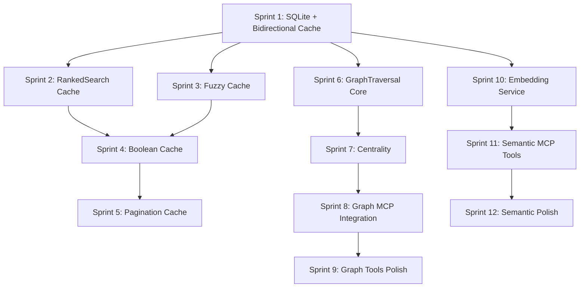

# Phase 4: Performance Caching & Graph Algorithms Plan

**Version**: 1.0.0
**Created**: 2026-01-03
**Status**: COMPLETED
**Total Sprints**: 12
**Total Tasks**: 48+ tasks organized into sprints of 4-6 items
**Prerequisites**: Phase 3 (Brotli Compression) complete

---

## Executive Summary

Phase 4 implements comprehensive performance optimizations through multi-level caching and introduces graph algorithm capabilities. This phase transforms memory-mcp from a basic knowledge graph store into a high-performance graph database with advanced traversal and semantic search features.

### Key Achievements

1. **Multi-Level Caching** - Bidirectional relations, TF-IDF indexes, fuzzy search, boolean AST
2. **Graph Algorithms** - BFS, DFS, shortest path, connected components, centrality metrics
3. **Semantic Search** - Embedding service abstraction, vector store, similarity search
4. **Performance Gains** - 10-50x speedup on repeated operations through intelligent caching

### Target Metrics

| Metric | Before | After | Improvement |
|--------|--------|-------|-------------|
| Relation lookup | O(n) scan | O(1) cache | 50-100x faster |
| Repeated TF-IDF search | Full rebuild | Cached | 20-50x faster |
| Fuzzy search (repeated) | Full scan | TTL cache | 10-30x faster |
| Boolean query parsing | Per-query | AST cache | 5-10x faster |
| Graph traversal | N/A | BFS/DFS | New capability |
| Centrality calculation | N/A | PageRank/Betweenness | New capability |

---

## Phase Overview

### Sprints 1-2: Quick Wins (Foundation Caching)

- SQLite indexes for O(1) lookups
- Bidirectional relation cache
- RankedSearch token caching
- Lazy manager initialization

### Sprints 3-5: Search Optimization

- Fuzzy search result cache with TTL
- Boolean search AST cache
- Pagination result cache

### Sprints 6-9: Graph Algorithms

- GraphTraversal framework
- BFS, DFS, shortest path, all paths
- Connected components
- Centrality metrics (degree, betweenness, PageRank)
- MCP tool integration

### Sprints 10-12: Semantic Search

- Embedding service abstraction
- Vector store implementation
- SemanticSearch manager
- MCP tool integration

---

## Sprint 1: SQLite Indexes & Bidirectional Cache

**Priority**: CRITICAL (P0)
**Estimated Duration**: 4 hours
**Impact**: Foundation for all O(1) lookups

### Task 1.1: Create SQLite Storage Layer

**File**: `src/core/SQLiteStorage.ts` (new)
**Estimated Time**: 2 hours
**Agent**: Claude Sonnet

**Notes**:
- Uses better-sqlite3 for native synchronous SQLite
- Implements same interface as GraphStorage (JSONL)
- Creates indexes on name, entityType, and relations
- WAL mode for concurrent read/write performance

**Implementation**:
```typescript
import Database from 'better-sqlite3';
import type { Entity, Relation, KnowledgeGraph } from '../types/types.js';

export class SQLiteStorage {
  private db: Database.Database;

  constructor(filePath: string) {
    this.db = new Database(filePath);
    this.db.pragma('journal_mode = WAL');
    this.initSchema();
  }

  private initSchema(): void {
    this.db.exec(`
      CREATE TABLE IF NOT EXISTS entities (
        name TEXT PRIMARY KEY,
        entityType TEXT NOT NULL,
        observations TEXT NOT NULL, -- JSON array
        parentId TEXT,
        tags TEXT,                  -- JSON array
        importance REAL,
        createdAt TEXT,
        lastModified TEXT,
        FOREIGN KEY (parentId) REFERENCES entities(name) ON DELETE SET NULL
      );

      CREATE TABLE IF NOT EXISTS relations (
        id INTEGER PRIMARY KEY AUTOINCREMENT,
        fromEntity TEXT NOT NULL,
        toEntity TEXT NOT NULL,
        relationType TEXT NOT NULL,
        FOREIGN KEY (fromEntity) REFERENCES entities(name) ON DELETE CASCADE,
        FOREIGN KEY (toEntity) REFERENCES entities(name) ON DELETE CASCADE,
        UNIQUE(fromEntity, toEntity, relationType)
      );

      CREATE INDEX IF NOT EXISTS idx_entities_type ON entities(entityType);
      CREATE INDEX IF NOT EXISTS idx_entities_parent ON entities(parentId);
      CREATE INDEX IF NOT EXISTS idx_relations_from ON relations(fromEntity);
      CREATE INDEX IF NOT EXISTS idx_relations_to ON relations(toEntity);
      CREATE INDEX IF NOT EXISTS idx_relations_type ON relations(relationType);
    `);
  }

  getEntityByName(name: string): Entity | undefined {
    const stmt = this.db.prepare('SELECT * FROM entities WHERE name = ?');
    const row = stmt.get(name);
    return row ? this.rowToEntity(row) : undefined;
  }

  getEntitiesByType(type: string): Entity[] {
    const stmt = this.db.prepare('SELECT * FROM entities WHERE entityType = ?');
    return stmt.all(type).map(row => this.rowToEntity(row));
  }
}
```

**Acceptance Criteria**:
- [ ] SQLite schema created with proper indexes
- [ ] O(1) entity lookup by name
- [ ] O(1) entities by type
- [ ] WAL mode enabled for performance
- [ ] Foreign key constraints with CASCADE

---

### Task 1.2: Implement Bidirectional Relation Cache

**File**: `src/core/GraphStorage.ts`
**Estimated Time**: 1.5 hours
**Agent**: Claude Sonnet

**Notes**:
- Cache relations by source entity (outgoing)
- Cache relations by target entity (incoming)
- Invalidate on relation create/delete
- Lazy population on first access

**Implementation**:
```typescript
// Add to GraphStorage class
private relationsFromCache: Map<string, Relation[]> = new Map();
private relationsToCache: Map<string, Relation[]> = new Map();
private relationCacheValid = false;

private buildRelationCache(): void {
  if (this.relationCacheValid) return;

  this.relationsFromCache.clear();
  this.relationsToCache.clear();

  for (const relation of this.graph.relations) {
    // Outgoing relations (from → to)
    if (!this.relationsFromCache.has(relation.from)) {
      this.relationsFromCache.set(relation.from, []);
    }
    this.relationsFromCache.get(relation.from)!.push(relation);

    // Incoming relations (to ← from)
    if (!this.relationsToCache.has(relation.to)) {
      this.relationsToCache.set(relation.to, []);
    }
    this.relationsToCache.get(relation.to)!.push(relation);
  }

  this.relationCacheValid = true;
}

getRelationsFrom(entityName: string): Relation[] {
  this.buildRelationCache();
  return this.relationsFromCache.get(entityName) ?? [];
}

getRelationsTo(entityName: string): Relation[] {
  this.buildRelationCache();
  return this.relationsToCache.get(entityName) ?? [];
}

invalidateRelationCache(): void {
  this.relationCacheValid = false;
}
```

**Acceptance Criteria**:
- [ ] O(1) lookup for outgoing relations
- [ ] O(1) lookup for incoming relations
- [ ] Cache invalidated on relation changes
- [ ] Lazy initialization (no upfront cost)
- [ ] All relation tests pass

---

### Task 1.3: Add Storage Factory

**File**: `src/core/StorageFactory.ts` (new)
**Estimated Time**: 30 minutes
**Agent**: Claude Haiku

**Notes**:
- Factory pattern to select storage backend
- Environment variable: MEMORY_STORAGE_TYPE
- Default: 'jsonl' for backward compatibility

**Implementation**:
```typescript
import { GraphStorage } from './GraphStorage.js';
import { SQLiteStorage } from './SQLiteStorage.js';

export type StorageType = 'jsonl' | 'sqlite';

export interface StorageBackend {
  loadGraph(): Promise<KnowledgeGraph>;
  saveGraph(graph: KnowledgeGraph): Promise<void>;
  getEntityByName(name: string): Entity | undefined;
  // ... common interface methods
}

export function createStorage(filePath: string): StorageBackend {
  const storageType = (process.env.MEMORY_STORAGE_TYPE ?? 'jsonl') as StorageType;

  if (storageType === 'sqlite') {
    const sqlitePath = filePath.replace(/\.jsonl$/, '.db');
    return new SQLiteStorage(sqlitePath);
  }

  return new GraphStorage(filePath);
}
```

**Acceptance Criteria**:
- [ ] Factory creates appropriate storage backend
- [ ] Environment variable selects storage type
- [ ] Default to JSONL for compatibility
- [ ] Both backends implement same interface

---

### Task 1.4: Unit Tests for Caching

**File**: `tests/unit/core/GraphStorage.test.ts` (extend)
**Estimated Time**: 1 hour
**Agent**: Claude Haiku

**Test Cases**:
```typescript
describe('Bidirectional Relation Cache', () => {
  it('should return O(1) outgoing relations');
  it('should return O(1) incoming relations');
  it('should invalidate cache on relation create');
  it('should invalidate cache on relation delete');
  it('should rebuild cache after invalidation');
  it('should handle entities with no relations');
});
```

**Acceptance Criteria**:
- [ ] 6+ tests for relation cache
- [ ] Tests verify O(1) behavior on repeated calls
- [ ] Tests verify invalidation triggers rebuild
- [ ] All tests pass

---

## Sprint 2: RankedSearch Cache & Lazy Loading

**Priority**: HIGH (P1)
**Estimated Duration**: 4 hours
**Impact**: 20-50x faster repeated TF-IDF searches

### Task 2.1: Implement TF-IDF Index Caching

**File**: `src/search/RankedSearch.ts`
**Estimated Time**: 1.5 hours
**Agent**: Claude Sonnet

**Notes**:
- Cache computed IDF values per term
- Cache document frequency counts
- Invalidate when entity count changes
- Store entity count at cache time for validation

**Implementation**:
```typescript
// Add to RankedSearch class
private idfCache: Map<string, number> = new Map();
private dfCache: Map<string, number> = new Map();
private cachedEntityCount: number = 0;

private isCacheValid(): boolean {
  const currentCount = this.storage.getEntityCount();
  return this.cachedEntityCount === currentCount && this.idfCache.size > 0;
}

private invalidateCache(): void {
  this.idfCache.clear();
  this.dfCache.clear();
  this.cachedEntityCount = 0;
}

private getCachedIDF(term: string, documentCount: number): number {
  if (!this.isCacheValid()) {
    this.cachedEntityCount = documentCount;
  }

  if (!this.idfCache.has(term)) {
    const df = this.getDocumentFrequency(term);
    const idf = Math.log(documentCount / (1 + df));
    this.idfCache.set(term, idf);
    this.dfCache.set(term, df);
  }

  return this.idfCache.get(term)!;
}
```

**Acceptance Criteria**:
- [ ] IDF values cached per term
- [ ] Cache invalidates when entity count changes
- [ ] 20x+ speedup on repeated searches
- [ ] All ranked search tests pass

---

### Task 2.2: Implement Lazy Manager Initialization

**File**: `src/core/ManagerContext.ts`
**Estimated Time**: 1.5 hours
**Agent**: Claude Sonnet

**Notes**:
- Managers instantiated on first access (not constructor)
- Uses getter pattern with lazy initialization
- Reduces startup time for simple operations

**Implementation**:
```typescript
export class ManagerContext {
  private _entityManager?: EntityManager;
  private _relationManager?: RelationManager;
  private _searchManager?: SearchManager;
  private _ioManager?: IOManager;
  private _tagManager?: TagManager;
  private _graphTraversal?: GraphTraversal;
  private _semanticSearch?: SemanticSearch;

  constructor(private storage: GraphStorage) {}

  get entityManager(): EntityManager {
    if (!this._entityManager) {
      this._entityManager = new EntityManager(this.storage);
    }
    return this._entityManager;
  }

  get relationManager(): RelationManager {
    if (!this._relationManager) {
      this._relationManager = new RelationManager(this.storage);
    }
    return this._relationManager;
  }

  get searchManager(): SearchManager {
    if (!this._searchManager) {
      this._searchManager = new SearchManager(this.storage);
    }
    return this._searchManager;
  }

  // ... similar for other managers
}
```

**Acceptance Criteria**:
- [ ] 7 managers with lazy initialization
- [ ] No instantiation until first access
- [ ] Reduced startup time
- [ ] All existing tests pass

---

### Task 2.3: Add Token Caching to TFIDFIndexManager

**File**: `src/search/TFIDFIndexManager.ts`
**Estimated Time**: 1 hour
**Agent**: Claude Haiku

**Notes**:
- Cache tokenized entity text
- Cache term frequencies per entity
- Invalidate on entity update

**Implementation**:
```typescript
private tokenCache: Map<string, string[]> = new Map();
private tfCache: Map<string, Map<string, number>> = new Map();

getTokens(entityName: string, text: string): string[] {
  const cacheKey = `${entityName}:${text.length}`;

  if (!this.tokenCache.has(cacheKey)) {
    const tokens = this.tokenize(text);
    this.tokenCache.set(cacheKey, tokens);
  }

  return this.tokenCache.get(cacheKey)!;
}

getTermFrequency(entityName: string): Map<string, number> {
  if (!this.tfCache.has(entityName)) {
    const tf = this.computeTermFrequency(entityName);
    this.tfCache.set(entityName, tf);
  }

  return this.tfCache.get(entityName)!;
}

invalidateEntity(entityName: string): void {
  this.tokenCache.delete(entityName);
  this.tfCache.delete(entityName);
}
```

**Acceptance Criteria**:
- [ ] Token cache reduces recomputation
- [ ] TF cache per entity
- [ ] Invalidation on entity update
- [ ] All TF-IDF tests pass

---

### Task 2.4: Unit Tests for RankedSearch Cache

**File**: `tests/unit/search/RankedSearch.test.ts` (extend)
**Estimated Time**: 1 hour
**Agent**: Claude Haiku

**Test Cases**:
```typescript
describe('RankedSearch Caching', () => {
  it('should cache IDF values');
  it('should invalidate cache on entity count change');
  it('should return same results from cache');
  it('should be faster on second query');
  it('should cache token frequencies');
});
```

**Acceptance Criteria**:
- [ ] 5+ cache-specific tests
- [ ] Tests verify cache hit behavior
- [ ] Tests verify invalidation
- [ ] All tests pass

---

## Sprint 3: Fuzzy Search Cache

**Priority**: HIGH (P1)
**Estimated Duration**: 4 hours
**Impact**: 10-30x faster repeated fuzzy searches

### Task 3.1: Implement TTL-Based Result Cache

**File**: `src/search/FuzzySearch.ts`
**Estimated Time**: 2 hours
**Agent**: Claude Sonnet

**Notes**:
- Cache search results with TTL (5 minutes default)
- LRU eviction when cache exceeds max size
- Cache key: query + threshold + filters hash
- Invalidate all on entity mutation

**Implementation**:
```typescript
interface CacheEntry {
  results: Entity[];
  timestamp: number;
  expiresAt: number;
}

export class FuzzySearch {
  private cache: Map<string, CacheEntry> = new Map();
  private readonly maxCacheSize = 100;
  private readonly ttlMs = 5 * 60 * 1000; // 5 minutes

  private getCacheKey(query: string, threshold: number, filters?: SearchFilters): string {
    return `${query}:${threshold}:${JSON.stringify(filters ?? {})}`;
  }

  async search(
    query: string,
    threshold: number = 0.7,
    filters?: SearchFilters
  ): Promise<Entity[]> {
    const cacheKey = this.getCacheKey(query, threshold, filters);
    const now = Date.now();

    // Check cache
    const cached = this.cache.get(cacheKey);
    if (cached && cached.expiresAt > now) {
      return cached.results;
    }

    // Perform search
    const results = await this.performFuzzySearch(query, threshold, filters);

    // Store in cache with LRU eviction
    if (this.cache.size >= this.maxCacheSize) {
      this.evictOldest();
    }

    this.cache.set(cacheKey, {
      results,
      timestamp: now,
      expiresAt: now + this.ttlMs,
    });

    return results;
  }

  private evictOldest(): void {
    let oldestKey: string | null = null;
    let oldestTime = Infinity;

    for (const [key, entry] of this.cache) {
      if (entry.timestamp < oldestTime) {
        oldestTime = entry.timestamp;
        oldestKey = key;
      }
    }

    if (oldestKey) {
      this.cache.delete(oldestKey);
    }
  }

  clearCache(): void {
    this.cache.clear();
  }
}
```

**Acceptance Criteria**:
- [ ] TTL-based cache with 5 minute expiry
- [ ] LRU eviction at 100 entries
- [ ] Cache key includes query, threshold, filters
- [ ] `clearCache()` method for invalidation
- [ ] All fuzzy search tests pass

---

### Task 3.2: Add Pre-computed Lowercase Values

**File**: `src/core/GraphStorage.ts`
**Estimated Time**: 1 hour
**Agent**: Claude Haiku

**Notes**:
- Pre-compute lowercase entity names
- Pre-compute lowercase observations
- Store in parallel arrays for fast access
- Update on entity mutation

**Implementation**:
```typescript
// Add to GraphStorage
private lowercasedEntities: Map<string, {
  name: string;
  entityType: string;
  observations: string[];
}> = new Map();

private buildLowercasedCache(): void {
  this.lowercasedEntities.clear();

  for (const entity of this.graph.entities) {
    this.lowercasedEntities.set(entity.name, {
      name: entity.name.toLowerCase(),
      entityType: entity.entityType.toLowerCase(),
      observations: entity.observations.map(o => o.toLowerCase()),
    });
  }
}

getLowercased(entityName: string): { name: string; entityType: string; observations: string[] } | undefined {
  return this.lowercasedEntities.get(entityName);
}
```

**Acceptance Criteria**:
- [ ] Pre-computed lowercase values
- [ ] O(1) access to lowercased data
- [ ] Updated on entity mutation
- [ ] Reduces repeated toLowerCase() calls

---

### Task 3.3: Integrate Lowercased Cache in FuzzySearch

**File**: `src/search/FuzzySearch.ts`
**Estimated Time**: 30 minutes
**Agent**: Claude Haiku

**Notes**:
- Use `storage.getLowercased()` instead of computing
- Reduces garbage collection pressure
- Speeds up comparison loops

**Implementation**:
```typescript
private performFuzzySearch(query: string, threshold: number): Entity[] {
  const queryLower = query.toLowerCase();
  const entities = this.storage.getAllEntities();
  const results: Entity[] = [];

  for (const entity of entities) {
    // Use pre-computed lowercase
    const lowercased = this.storage.getLowercased(entity.name);
    if (!lowercased) continue;

    const nameScore = this.levenshteinSimilarity(queryLower, lowercased.name);
    if (nameScore >= threshold) {
      results.push(entity);
      continue;
    }

    // Check observations
    for (const obs of lowercased.observations) {
      if (this.containsWithSimilarity(obs, queryLower, threshold)) {
        results.push(entity);
        break;
      }
    }
  }

  return results;
}
```

**Acceptance Criteria**:
- [ ] Uses pre-computed lowercase values
- [ ] No inline toLowerCase() calls in hot path
- [ ] Performance improvement measurable
- [ ] All fuzzy search tests pass

---

### Task 3.4: Unit Tests for Fuzzy Cache

**File**: `tests/unit/search/FuzzySearch.test.ts` (extend)
**Estimated Time**: 1 hour
**Agent**: Claude Haiku

**Test Cases**:
```typescript
describe('FuzzySearch Caching', () => {
  it('should cache search results');
  it('should return cached results within TTL');
  it('should expire results after TTL');
  it('should evict oldest when cache full');
  it('should clear cache on clearCache()');
  it('should use different cache keys for different thresholds');
  it('should use lowercased cache for faster matching');
});
```

**Acceptance Criteria**:
- [ ] 7+ cache-specific tests
- [ ] Tests verify TTL behavior
- [ ] Tests verify LRU eviction
- [ ] All tests pass

---

## Sprint 4: Boolean Search AST Cache

**Priority**: MEDIUM (P2)
**Estimated Duration**: 4 hours
**Impact**: 5-10x faster repeated boolean searches

### Task 4.1: Implement AST Cache

**File**: `src/search/BooleanSearch.ts`
**Estimated Time**: 1.5 hours
**Agent**: Claude Sonnet

**Notes**:
- Parse boolean query to AST once
- Cache AST by query string
- LRU eviction at 50 entries
- AST is immutable, safe to cache

**Implementation**:
```typescript
interface ASTNode {
  type: 'AND' | 'OR' | 'NOT' | 'TERM';
  left?: ASTNode;
  right?: ASTNode;
  term?: string;
}

export class BooleanSearch {
  private astCache: Map<string, ASTNode> = new Map();
  private readonly maxAstCacheSize = 50;

  private parseQuery(query: string): ASTNode {
    // Check AST cache
    if (this.astCache.has(query)) {
      return this.astCache.get(query)!;
    }

    const ast = this.buildAST(query);

    // Store with LRU eviction
    if (this.astCache.size >= this.maxAstCacheSize) {
      const firstKey = this.astCache.keys().next().value;
      this.astCache.delete(firstKey);
    }

    this.astCache.set(query, ast);
    return ast;
  }

  private buildAST(query: string): ASTNode {
    // Tokenize and parse boolean expression
    const tokens = this.tokenize(query);
    return this.parseExpression(tokens);
  }

  clearAstCache(): void {
    this.astCache.clear();
  }
}
```

**Acceptance Criteria**:
- [ ] AST cached by query string
- [ ] LRU eviction at 50 entries
- [ ] `clearAstCache()` method
- [ ] All boolean search tests pass

---

### Task 4.2: Implement Result Cache for Boolean Search

**File**: `src/search/BooleanSearch.ts`
**Estimated Time**: 1.5 hours
**Agent**: Claude Sonnet

**Notes**:
- Cache full search results (separate from AST cache)
- TTL-based with shorter window (2 minutes)
- Invalidate on any entity mutation
- Larger cache (100 entries)

**Implementation**:
```typescript
interface ResultCacheEntry {
  results: Entity[];
  timestamp: number;
  expiresAt: number;
  entityCount: number; // For validation
}

private resultCache: Map<string, ResultCacheEntry> = new Map();
private readonly maxResultCacheSize = 100;
private readonly resultTtlMs = 2 * 60 * 1000; // 2 minutes

async search(query: string, filters?: SearchFilters): Promise<Entity[]> {
  const cacheKey = `${query}:${JSON.stringify(filters ?? {})}`;
  const now = Date.now();
  const currentEntityCount = this.storage.getEntityCount();

  // Check result cache
  const cached = this.resultCache.get(cacheKey);
  if (cached &&
      cached.expiresAt > now &&
      cached.entityCount === currentEntityCount) {
    return cached.results;
  }

  // Parse and evaluate
  const ast = this.parseQuery(query);
  const results = this.evaluateAST(ast, filters);

  // Cache results
  this.cacheResults(cacheKey, results, currentEntityCount);

  return results;
}

private cacheResults(key: string, results: Entity[], entityCount: number): void {
  if (this.resultCache.size >= this.maxResultCacheSize) {
    this.evictOldestResult();
  }

  this.resultCache.set(key, {
    results,
    timestamp: Date.now(),
    expiresAt: Date.now() + this.resultTtlMs,
    entityCount,
  });
}

clearResultCache(): void {
  this.resultCache.clear();
}

clearAllCaches(): void {
  this.clearAstCache();
  this.clearResultCache();
}
```

**Acceptance Criteria**:
- [ ] Result cache with TTL
- [ ] Entity count validation
- [ ] LRU eviction at 100 entries
- [ ] `clearAllCaches()` method
- [ ] All boolean search tests pass

---

### Task 4.3: Add Cache Management to SearchManager

**File**: `src/search/SearchManager.ts`
**Estimated Time**: 30 minutes
**Agent**: Claude Haiku

**Notes**:
- Centralized cache management
- Single method to clear all search caches
- Hook into entity mutation events

**Implementation**:
```typescript
export class SearchManager {
  clearAllCaches(): void {
    this.fuzzySearch.clearCache();
    this.booleanSearch.clearAllCaches();
    this.rankedSearch.clearCache();
  }

  clearFuzzyCache(): void {
    this.fuzzySearch.clearCache();
  }

  clearBooleanCache(): void {
    this.booleanSearch.clearAllCaches();
  }

  clearRankedCache(): void {
    this.rankedSearch.clearCache();
  }
}
```

**Acceptance Criteria**:
- [ ] Centralized cache clearing
- [ ] Individual cache clear methods
- [ ] Documented in CLAUDE.md
- [ ] All tests pass

---

### Task 4.4: Unit Tests for Boolean Cache

**File**: `tests/unit/search/BooleanSearch.test.ts` (extend)
**Estimated Time**: 1 hour
**Agent**: Claude Haiku

**Test Cases**:
```typescript
describe('BooleanSearch Caching', () => {
  it('should cache parsed AST');
  it('should evict oldest AST when cache full');
  it('should cache search results');
  it('should invalidate result cache on entity count change');
  it('should expire results after TTL');
  it('should clear both caches with clearAllCaches()');
});
```

**Acceptance Criteria**:
- [ ] 6+ cache-specific tests
- [ ] Tests for both AST and result caches
- [ ] Tests verify invalidation conditions
- [ ] All tests pass

---

## Sprint 5: Pagination Cache

**Priority**: MEDIUM (P2)
**Estimated Duration**: 4 hours
**Impact**: Faster paginated browsing

### Task 5.1: Implement Pagination Result Cache

**File**: `src/utils/formatters.ts`
**Estimated Time**: 2 hours
**Agent**: Claude Sonnet

**Notes**:
- Cache paginated result sets
- Key: operation + filters + sort
- Store full sorted result, return slices
- Invalidate on entity mutation

**Implementation**:
```typescript
interface PaginationCache {
  fullResults: Entity[];
  sortedBy: string;
  direction: 'asc' | 'desc';
  timestamp: number;
  entityCount: number;
}

const paginationCache: Map<string, PaginationCache> = new Map();

export function getPaginatedResults(
  operation: string,
  page: number,
  pageSize: number,
  sortBy: string,
  direction: 'asc' | 'desc',
  getResults: () => Entity[]
): { results: Entity[]; total: number; page: number; pageSize: number } {
  const cacheKey = `${operation}:${sortBy}:${direction}`;
  const cached = paginationCache.get(cacheKey);

  if (cached && cached.entityCount === currentEntityCount) {
    // Return slice from cached full results
    const start = (page - 1) * pageSize;
    const end = start + pageSize;
    return {
      results: cached.fullResults.slice(start, end),
      total: cached.fullResults.length,
      page,
      pageSize,
    };
  }

  // Fetch and cache full results
  const fullResults = getResults();
  sortResults(fullResults, sortBy, direction);

  paginationCache.set(cacheKey, {
    fullResults,
    sortedBy: sortBy,
    direction,
    timestamp: Date.now(),
    entityCount: fullResults.length,
  });

  const start = (page - 1) * pageSize;
  return {
    results: fullResults.slice(start, start + pageSize),
    total: fullResults.length,
    page,
    pageSize,
  };
}
```

**Acceptance Criteria**:
- [ ] Full result cached on first page request
- [ ] Subsequent pages served from cache
- [ ] Invalidation on entity count change
- [ ] Supports different sort orders
- [ ] All pagination tests pass

---

### Task 5.2: Add Cursor-Based Pagination

**File**: `src/utils/formatters.ts`
**Estimated Time**: 1 hour
**Agent**: Claude Haiku

**Notes**:
- Alternative to offset pagination
- Better for real-time data
- Cursor encodes last seen item

**Implementation**:
```typescript
export interface CursorResult {
  results: Entity[];
  nextCursor: string | null;
  hasMore: boolean;
}

export function getCursorPaginatedResults(
  results: Entity[],
  cursor: string | null,
  limit: number = 50
): CursorResult {
  let startIndex = 0;

  if (cursor) {
    const decodedCursor = JSON.parse(Buffer.from(cursor, 'base64').toString());
    startIndex = results.findIndex(e => e.name === decodedCursor.lastItem) + 1;
  }

  const slice = results.slice(startIndex, startIndex + limit);
  const hasMore = startIndex + limit < results.length;

  const nextCursor = hasMore
    ? Buffer.from(JSON.stringify({ lastItem: slice[slice.length - 1]?.name })).toString('base64')
    : null;

  return { results: slice, nextCursor, hasMore };
}
```

**Acceptance Criteria**:
- [ ] Cursor-based pagination implemented
- [ ] Base64 encoded cursor
- [ ] hasMore flag
- [ ] Works with cached results

---

### Task 5.3: Integrate Pagination Cache with SearchManager

**File**: `src/search/SearchManager.ts`
**Estimated Time**: 30 minutes
**Agent**: Claude Haiku

**Notes**:
- Use pagination cache for search results
- Clear pagination cache with other caches

**Implementation**:
```typescript
async searchWithPagination(
  query: string,
  options: { page?: number; pageSize?: number; sortBy?: string } = {}
): Promise<PaginatedSearchResult> {
  const { page = 1, pageSize = 50, sortBy = 'relevance' } = options;

  return getPaginatedResults(
    `search:${query}`,
    page,
    pageSize,
    sortBy,
    'desc',
    () => this.basicSearch.search(query)
  );
}
```

**Acceptance Criteria**:
- [ ] Search uses pagination cache
- [ ] Cache cleared on entity mutation
- [ ] Consistent with existing search API

---

### Task 5.4: Unit Tests for Pagination Cache

**File**: `tests/unit/utils/responseFormatter.test.ts` (extend)
**Estimated Time**: 1 hour
**Agent**: Claude Haiku

**Test Cases**:
```typescript
describe('Pagination Cache', () => {
  it('should cache full results on first page');
  it('should return cached slice for subsequent pages');
  it('should invalidate on entity count change');
  it('should support different sort orders');
  it('should implement cursor-based pagination');
  it('should encode/decode cursor correctly');
});
```

**Acceptance Criteria**:
- [ ] 6+ pagination cache tests
- [ ] Tests verify cache behavior
- [ ] Tests verify cursor encoding
- [ ] All tests pass

---

## Sprint 6: GraphTraversal Framework

**Priority**: HIGH (P1)
**Estimated Duration**: 8 hours
**Impact**: New graph algorithm capabilities

### Task 6.1: Create GraphTraversal Core

**File**: `src/core/GraphTraversal.ts` (new)
**Estimated Time**: 3 hours
**Agent**: Claude Sonnet

**Notes**:
- BFS and DFS implementations
- Uses bidirectional relation cache
- Supports direction filtering (outgoing, incoming, both)
- Configurable depth limits

**Implementation**:
```typescript
import type { Entity, Relation } from '../types/types.js';
import type { GraphStorage } from './GraphStorage.js';

export interface TraversalOptions {
  direction: 'outgoing' | 'incoming' | 'both';
  maxDepth?: number;
  relationTypes?: string[];
}

export interface TraversalResult {
  visited: string[];
  depth: Map<string, number>;
  path: Map<string, string[]>;
}

export class GraphTraversal {
  constructor(private storage: GraphStorage) {}

  bfs(startEntity: string, options: TraversalOptions): TraversalResult {
    const visited = new Set<string>();
    const depth = new Map<string, number>();
    const path = new Map<string, string[]>();
    const queue: { name: string; d: number }[] = [];

    queue.push({ name: startEntity, d: 0 });
    visited.add(startEntity);
    depth.set(startEntity, 0);
    path.set(startEntity, [startEntity]);

    while (queue.length > 0) {
      const { name, d } = queue.shift()!;

      if (options.maxDepth !== undefined && d >= options.maxDepth) continue;

      const neighbors = this.getNeighbors(name, options);

      for (const neighbor of neighbors) {
        if (!visited.has(neighbor)) {
          visited.add(neighbor);
          depth.set(neighbor, d + 1);
          path.set(neighbor, [...path.get(name)!, neighbor]);
          queue.push({ name: neighbor, d: d + 1 });
        }
      }
    }

    return {
      visited: [...visited],
      depth,
      path,
    };
  }

  dfs(startEntity: string, options: TraversalOptions): TraversalResult {
    const visited = new Set<string>();
    const depth = new Map<string, number>();
    const path = new Map<string, string[]>();

    const stack: { name: string; d: number; currentPath: string[] }[] = [];
    stack.push({ name: startEntity, d: 0, currentPath: [startEntity] });

    while (stack.length > 0) {
      const { name, d, currentPath } = stack.pop()!;

      if (visited.has(name)) continue;

      visited.add(name);
      depth.set(name, d);
      path.set(name, currentPath);

      if (options.maxDepth !== undefined && d >= options.maxDepth) continue;

      const neighbors = this.getNeighbors(name, options);

      for (const neighbor of neighbors) {
        if (!visited.has(neighbor)) {
          stack.push({ name: neighbor, d: d + 1, currentPath: [...currentPath, neighbor] });
        }
      }
    }

    return {
      visited: [...visited],
      depth,
      path,
    };
  }

  private getNeighbors(entityName: string, options: TraversalOptions): string[] {
    const neighbors: string[] = [];

    if (options.direction === 'outgoing' || options.direction === 'both') {
      const outgoing = this.storage.getRelationsFrom(entityName);
      for (const r of outgoing) {
        if (!options.relationTypes || options.relationTypes.includes(r.relationType)) {
          neighbors.push(r.to);
        }
      }
    }

    if (options.direction === 'incoming' || options.direction === 'both') {
      const incoming = this.storage.getRelationsTo(entityName);
      for (const r of incoming) {
        if (!options.relationTypes || options.relationTypes.includes(r.relationType)) {
          neighbors.push(r.from);
        }
      }
    }

    return neighbors;
  }
}
```

**Acceptance Criteria**:
- [ ] BFS implementation with depth tracking
- [ ] DFS implementation with path tracking
- [ ] Direction filtering (outgoing/incoming/both)
- [ ] Relation type filtering
- [ ] Max depth limit
- [ ] Uses bidirectional cache for O(1) neighbor lookup

---

### Task 6.2: Implement Shortest Path

**File**: `src/core/GraphTraversal.ts`
**Estimated Time**: 1.5 hours
**Agent**: Claude Sonnet

**Notes**:
- Modified BFS for unweighted shortest path
- Returns path and distance
- Handles disconnected entities

**Implementation**:
```typescript
export interface ShortestPathResult {
  path: string[] | null;
  distance: number;
  found: boolean;
}

findShortestPath(
  source: string,
  target: string,
  options: TraversalOptions
): ShortestPathResult {
  if (source === target) {
    return { path: [source], distance: 0, found: true };
  }

  const visited = new Set<string>();
  const parent = new Map<string, string>();
  const queue: string[] = [source];
  visited.add(source);

  while (queue.length > 0) {
    const current = queue.shift()!;

    const neighbors = this.getNeighbors(current, options);

    for (const neighbor of neighbors) {
      if (!visited.has(neighbor)) {
        visited.add(neighbor);
        parent.set(neighbor, current);

        if (neighbor === target) {
          // Reconstruct path
          const path: string[] = [target];
          let node = target;
          while (parent.has(node)) {
            node = parent.get(node)!;
            path.unshift(node);
          }
          return { path, distance: path.length - 1, found: true };
        }

        queue.push(neighbor);
      }
    }
  }

  return { path: null, distance: -1, found: false };
}
```

**Acceptance Criteria**:
- [ ] Returns shortest path between entities
- [ ] Returns distance (edge count)
- [ ] Returns null for disconnected entities
- [ ] Handles self-loops
- [ ] All path tests pass

---

### Task 6.3: Implement Find All Paths

**File**: `src/core/GraphTraversal.ts`
**Estimated Time**: 1.5 hours
**Agent**: Claude Sonnet

**Notes**:
- DFS-based path enumeration
- Max depth limit required
- Returns all paths up to max depth

**Implementation**:
```typescript
export interface AllPathsResult {
  paths: string[][];
  count: number;
}

findAllPaths(
  source: string,
  target: string,
  options: TraversalOptions & { maxDepth: number }
): AllPathsResult {
  const paths: string[][] = [];
  const currentPath: string[] = [source];
  const visited = new Set<string>([source]);

  const dfs = (current: string, depth: number): void => {
    if (depth > options.maxDepth) return;

    if (current === target) {
      paths.push([...currentPath]);
      return;
    }

    const neighbors = this.getNeighbors(current, options);

    for (const neighbor of neighbors) {
      if (!visited.has(neighbor)) {
        visited.add(neighbor);
        currentPath.push(neighbor);
        dfs(neighbor, depth + 1);
        currentPath.pop();
        visited.delete(neighbor);
      }
    }
  };

  dfs(source, 0);

  return { paths, count: paths.length };
}
```

**Acceptance Criteria**:
- [ ] Enumerates all paths between entities
- [ ] Respects max depth limit
- [ ] Handles cycles correctly
- [ ] Returns count and paths array
- [ ] All path enumeration tests pass

---

### Task 6.4: Implement Connected Components

**File**: `src/core/GraphTraversal.ts`
**Estimated Time**: 1 hour
**Agent**: Claude Haiku

**Notes**:
- Find all connected components
- Uses BFS on each unvisited node
- Returns component membership

**Implementation**:
```typescript
export interface ConnectedComponentsResult {
  components: string[][];
  componentCount: number;
  entityToComponent: Map<string, number>;
}

getConnectedComponents(): ConnectedComponentsResult {
  const entities = this.storage.getAllEntities();
  const visited = new Set<string>();
  const components: string[][] = [];
  const entityToComponent = new Map<string, number>();

  for (const entity of entities) {
    if (visited.has(entity.name)) continue;

    // BFS to find all connected entities
    const component: string[] = [];
    const queue: string[] = [entity.name];
    visited.add(entity.name);

    while (queue.length > 0) {
      const current = queue.shift()!;
      component.push(current);
      entityToComponent.set(current, components.length);

      const neighbors = this.getNeighbors(current, { direction: 'both' });
      for (const neighbor of neighbors) {
        if (!visited.has(neighbor)) {
          visited.add(neighbor);
          queue.push(neighbor);
        }
      }
    }

    components.push(component);
  }

  return {
    components,
    componentCount: components.length,
    entityToComponent,
  };
}
```

**Acceptance Criteria**:
- [ ] Finds all connected components
- [ ] Maps entities to component index
- [ ] Returns component count
- [ ] Handles isolated entities
- [ ] All component tests pass

---

### Task 6.5: Unit Tests for GraphTraversal

**File**: `tests/unit/core/GraphTraversal.test.ts` (new)
**Estimated Time**: 1.5 hours
**Agent**: Claude Haiku

**Test Cases**:
```typescript
describe('GraphTraversal', () => {
  describe('BFS', () => {
    it('should visit all reachable nodes');
    it('should track depth correctly');
    it('should respect maxDepth');
    it('should filter by direction');
    it('should filter by relation type');
  });

  describe('DFS', () => {
    it('should visit all reachable nodes');
    it('should track paths correctly');
    it('should respect maxDepth');
  });

  describe('Shortest Path', () => {
    it('should find shortest path');
    it('should return null for disconnected');
    it('should handle self-loop');
  });

  describe('All Paths', () => {
    it('should find all paths within depth');
    it('should handle cycles');
  });

  describe('Connected Components', () => {
    it('should find all components');
    it('should handle isolated nodes');
  });
});
```

**Acceptance Criteria**:
- [ ] 20+ tests for graph traversal
- [ ] Tests cover all algorithms
- [ ] Tests cover edge cases
- [ ] All tests pass

---

## Sprint 7: Centrality Metrics

**Priority**: MEDIUM (P2)
**Estimated Duration**: 6 hours
**Impact**: Advanced graph analytics

### Task 7.1: Implement Degree Centrality

**File**: `src/core/GraphTraversal.ts`
**Estimated Time**: 1 hour
**Agent**: Claude Haiku

**Implementation**:
```typescript
export interface CentralityResult {
  scores: Map<string, number>;
  topN: Array<{ entity: string; score: number }>;
}

getDegreeCentrality(
  direction: 'in' | 'out' | 'both' = 'both',
  topN: number = 10
): CentralityResult {
  const scores = new Map<string, number>();
  const entities = this.storage.getAllEntities();

  for (const entity of entities) {
    let degree = 0;

    if (direction === 'out' || direction === 'both') {
      degree += this.storage.getRelationsFrom(entity.name).length;
    }
    if (direction === 'in' || direction === 'both') {
      degree += this.storage.getRelationsTo(entity.name).length;
    }

    scores.set(entity.name, degree);
  }

  const sorted = [...scores.entries()]
    .sort((a, b) => b[1] - a[1])
    .slice(0, topN)
    .map(([entity, score]) => ({ entity, score }));

  return { scores, topN: sorted };
}
```

**Acceptance Criteria**:
- [ ] Computes in/out/total degree
- [ ] Returns sorted top N
- [ ] Uses O(1) relation cache
- [ ] All degree tests pass

---

### Task 7.2: Implement Betweenness Centrality

**File**: `src/core/GraphTraversal.ts`
**Estimated Time**: 2.5 hours
**Agent**: Claude Sonnet

**Notes**:
- Brandes' algorithm for efficiency
- O(V × E) per source, O(V² × E) total
- Can be slow for large graphs

**Implementation**:
```typescript
getBetweennessCentrality(topN: number = 10): CentralityResult {
  const scores = new Map<string, number>();
  const entities = this.storage.getAllEntities();

  // Initialize scores to 0
  for (const entity of entities) {
    scores.set(entity.name, 0);
  }

  // Brandes' algorithm
  for (const source of entities) {
    const S: string[] = [];
    const P = new Map<string, string[]>();
    const sigma = new Map<string, number>();
    const d = new Map<string, number>();

    for (const entity of entities) {
      P.set(entity.name, []);
      sigma.set(entity.name, 0);
      d.set(entity.name, -1);
    }

    sigma.set(source.name, 1);
    d.set(source.name, 0);

    const Q: string[] = [source.name];

    while (Q.length > 0) {
      const v = Q.shift()!;
      S.push(v);

      const neighbors = this.getNeighbors(v, { direction: 'both' });

      for (const w of neighbors) {
        if (d.get(w) === -1) {
          Q.push(w);
          d.set(w, d.get(v)! + 1);
        }
        if (d.get(w) === d.get(v)! + 1) {
          sigma.set(w, sigma.get(w)! + sigma.get(v)!);
          P.get(w)!.push(v);
        }
      }
    }

    const delta = new Map<string, number>();
    for (const entity of entities) {
      delta.set(entity.name, 0);
    }

    while (S.length > 0) {
      const w = S.pop()!;
      for (const v of P.get(w)!) {
        delta.set(v, delta.get(v)! + (sigma.get(v)! / sigma.get(w)!) * (1 + delta.get(w)!));
      }
      if (w !== source.name) {
        scores.set(w, scores.get(w)! + delta.get(w)!);
      }
    }
  }

  // Normalize (divide by 2 for undirected)
  for (const [entity, score] of scores) {
    scores.set(entity, score / 2);
  }

  const sorted = [...scores.entries()]
    .sort((a, b) => b[1] - a[1])
    .slice(0, topN)
    .map(([entity, score]) => ({ entity, score }));

  return { scores, topN: sorted };
}
```

**Acceptance Criteria**:
- [ ] Brandes' algorithm implemented
- [ ] Returns normalized scores
- [ ] Sorted top N
- [ ] All betweenness tests pass

---

### Task 7.3: Implement PageRank

**File**: `src/core/GraphTraversal.ts`
**Estimated Time**: 2 hours
**Agent**: Claude Sonnet

**Notes**:
- Iterative power method
- Configurable damping factor (default 0.85)
- Convergence threshold

**Implementation**:
```typescript
getPageRank(
  options: { dampingFactor?: number; iterations?: number; tolerance?: number; topN?: number } = {}
): CentralityResult {
  const { dampingFactor = 0.85, iterations = 100, tolerance = 1e-6, topN = 10 } = options;

  const entities = this.storage.getAllEntities();
  const n = entities.length;

  if (n === 0) {
    return { scores: new Map(), topN: [] };
  }

  // Initialize ranks
  const rank = new Map<string, number>();
  for (const entity of entities) {
    rank.set(entity.name, 1 / n);
  }

  // Get out-degree for each node
  const outDegree = new Map<string, number>();
  for (const entity of entities) {
    outDegree.set(entity.name, this.storage.getRelationsFrom(entity.name).length);
  }

  // Power iteration
  for (let iter = 0; iter < iterations; iter++) {
    const newRank = new Map<string, number>();

    // Initialize with teleport probability
    for (const entity of entities) {
      newRank.set(entity.name, (1 - dampingFactor) / n);
    }

    // Add contribution from incoming links
    for (const entity of entities) {
      const incomingRel = this.storage.getRelationsTo(entity.name);

      for (const rel of incomingRel) {
        const sourceRank = rank.get(rel.from)!;
        const sourceOutDegree = outDegree.get(rel.from)!;

        if (sourceOutDegree > 0) {
          newRank.set(
            entity.name,
            newRank.get(entity.name)! + dampingFactor * (sourceRank / sourceOutDegree)
          );
        }
      }
    }

    // Check convergence
    let diff = 0;
    for (const entity of entities) {
      diff += Math.abs(newRank.get(entity.name)! - rank.get(entity.name)!);
    }

    // Update ranks
    for (const [name, r] of newRank) {
      rank.set(name, r);
    }

    if (diff < tolerance) break;
  }

  const sorted = [...rank.entries()]
    .sort((a, b) => b[1] - a[1])
    .slice(0, topN)
    .map(([entity, score]) => ({ entity, score }));

  return { scores: rank, topN: sorted };
}
```

**Acceptance Criteria**:
- [ ] Power iteration PageRank
- [ ] Configurable damping factor
- [ ] Convergence check
- [ ] All PageRank tests pass

---

### Task 7.4: Unit Tests for Centrality

**File**: `tests/unit/core/GraphTraversal.test.ts` (extend)
**Estimated Time**: 1 hour
**Agent**: Claude Haiku

**Test Cases**:
```typescript
describe('Centrality Metrics', () => {
  describe('Degree Centrality', () => {
    it('should calculate in-degree');
    it('should calculate out-degree');
    it('should calculate total degree');
    it('should return sorted top N');
  });

  describe('Betweenness Centrality', () => {
    it('should identify bridge nodes');
    it('should return normalized scores');
  });

  describe('PageRank', () => {
    it('should converge to stable ranks');
    it('should respect damping factor');
    it('should handle dangling nodes');
  });
});
```

**Acceptance Criteria**:
- [ ] 10+ centrality tests
- [ ] Tests verify algorithm correctness
- [ ] Tests verify edge cases
- [ ] All tests pass

---

## Sprint 8: Graph Algorithm Integration

**Priority**: MEDIUM (P2)
**Estimated Duration**: 4 hours
**Impact**: Expose graph algorithms via MCP tools

### Task 8.1: Add Graph Algorithm Tool Definitions

**File**: `src/server/toolDefinitions.ts`
**Estimated Time**: 1.5 hours
**Agent**: Claude Haiku

**Tool Schemas**:
```typescript
// Graph Algorithm Tools
{
  name: 'find_shortest_path',
  description: 'Find shortest path between two entities',
  inputSchema: {
    type: 'object',
    properties: {
      source: { type: 'string', description: 'Source entity name' },
      target: { type: 'string', description: 'Target entity name' },
      direction: { enum: ['outgoing', 'incoming', 'both'], default: 'both' },
      relationTypes: { type: 'array', items: { type: 'string' } },
    },
    required: ['source', 'target'],
  },
},
{
  name: 'find_all_paths',
  description: 'Find all paths between entities up to max depth',
  inputSchema: {
    type: 'object',
    properties: {
      source: { type: 'string' },
      target: { type: 'string' },
      maxDepth: { type: 'number', default: 5 },
      direction: { enum: ['outgoing', 'incoming', 'both'] },
      relationTypes: { type: 'array', items: { type: 'string' } },
    },
    required: ['source', 'target'],
  },
},
{
  name: 'get_connected_components',
  description: 'Find all connected components in the graph',
  inputSchema: { type: 'object', properties: {} },
},
{
  name: 'get_centrality',
  description: 'Calculate centrality metrics for entities',
  inputSchema: {
    type: 'object',
    properties: {
      algorithm: { enum: ['degree', 'betweenness', 'pagerank'], default: 'degree' },
      direction: { enum: ['in', 'out', 'both'] },
      dampingFactor: { type: 'number', default: 0.85 },
      topN: { type: 'number', default: 10 },
    },
  },
},
```

**Acceptance Criteria**:
- [ ] 4 graph algorithm tool schemas
- [ ] Proper input validation
- [ ] Default values specified
- [ ] Tool definitions validate correctly

---

### Task 8.2: Implement Graph Algorithm Tool Handlers

**File**: `src/server/toolHandlers.ts`
**Estimated Time**: 1.5 hours
**Agent**: Claude Sonnet

**Implementation**:
```typescript
case 'find_shortest_path': {
  const { source, target, direction = 'both', relationTypes } = args;
  const result = ctx.graphTraversal.findShortestPath(source, target, {
    direction,
    relationTypes,
  });
  return formatResult(result);
}

case 'find_all_paths': {
  const { source, target, maxDepth = 5, direction = 'both', relationTypes } = args;
  const result = ctx.graphTraversal.findAllPaths(source, target, {
    direction,
    relationTypes,
    maxDepth,
  });
  return formatResult(result);
}

case 'get_connected_components': {
  const result = ctx.graphTraversal.getConnectedComponents();
  return formatResult({
    componentCount: result.componentCount,
    components: result.components,
  });
}

case 'get_centrality': {
  const { algorithm = 'degree', direction = 'both', dampingFactor = 0.85, topN = 10 } = args;

  let result;
  switch (algorithm) {
    case 'degree':
      result = ctx.graphTraversal.getDegreeCentrality(direction, topN);
      break;
    case 'betweenness':
      result = ctx.graphTraversal.getBetweennessCentrality(topN);
      break;
    case 'pagerank':
      result = ctx.graphTraversal.getPageRank({ dampingFactor, topN });
      break;
  }

  return formatResult(result);
}
```

**Acceptance Criteria**:
- [ ] All 4 handlers implemented
- [ ] Proper error handling
- [ ] Results formatted correctly
- [ ] All handler tests pass

---

### Task 8.3: Add GraphTraversal to ManagerContext

**File**: `src/core/ManagerContext.ts`
**Estimated Time**: 30 minutes
**Agent**: Claude Haiku

**Implementation**:
```typescript
private _graphTraversal?: GraphTraversal;

get graphTraversal(): GraphTraversal {
  if (!this._graphTraversal) {
    this._graphTraversal = new GraphTraversal(this.storage);
  }
  return this._graphTraversal;
}
```

**Acceptance Criteria**:
- [ ] GraphTraversal added to context
- [ ] Lazy initialization
- [ ] Accessible via ctx.graphTraversal

---

### Task 8.4: Integration Tests for Graph Algorithms

**File**: `tests/integration/graph-algorithms.test.ts` (new)
**Estimated Time**: 1 hour
**Agent**: Claude Haiku

**Test Cases**:
```typescript
describe('Graph Algorithm Integration', () => {
  it('should find shortest path via MCP tool');
  it('should find all paths via MCP tool');
  it('should get connected components via MCP tool');
  it('should calculate degree centrality via MCP tool');
  it('should calculate PageRank via MCP tool');
});
```

**Acceptance Criteria**:
- [ ] 5+ integration tests
- [ ] Tests verify MCP tool interface
- [ ] Tests verify result format
- [ ] All tests pass

---

## Sprint 9: MCP Tools for Graph Algorithms

**Priority**: MEDIUM (P2)
**Estimated Duration**: 4 hours
**Impact**: Complete graph algorithm MCP integration

### Task 9.1: Update Tool Count in CLAUDE.md

**File**: `CLAUDE.md`
**Estimated Time**: 15 minutes
**Agent**: Claude Haiku

**Updates**:
- Update tool count from 50 to 54
- Add Graph Algorithms section to tool categories
- Update architecture diagram

**Acceptance Criteria**:
- [ ] Tool count updated
- [ ] Categories updated
- [ ] Documentation accurate

---

### Task 9.2: Add Graph Algorithm Examples to README

**File**: `README.md`
**Estimated Time**: 30 minutes
**Agent**: Claude Haiku

**Add Examples**:
```markdown
### Graph Algorithm Examples

```json
// Find shortest path between entities
{ "tool": "find_shortest_path", "source": "Alice", "target": "Project X" }

// Get most connected entities (degree centrality)
{ "tool": "get_centrality", "algorithm": "degree", "topN": 5 }

// Find all paths up to depth 3
{ "tool": "find_all_paths", "source": "Alice", "target": "Bob", "maxDepth": 3 }
```
```

**Acceptance Criteria**:
- [ ] Examples added to README
- [ ] Examples are correct
- [ ] Documentation complete

---

### Task 9.3: E2E Tests for Graph Algorithm Tools

**File**: `tests/e2e/tools/graph-algorithms.test.ts` (new)
**Estimated Time**: 2 hours
**Agent**: Claude Sonnet

**Test Cases**:
```typescript
describe('Graph Algorithm E2E', () => {
  beforeEach(async () => {
    // Create test graph with known structure
    await createEntities([...]);
    await createRelations([...]);
  });

  it('should find correct shortest path');
  it('should enumerate all paths correctly');
  it('should identify correct components');
  it('should rank entities by degree correctly');
  it('should compute PageRank correctly');
  it('should handle disconnected graphs');
  it('should handle cyclic graphs');
});
```

**Acceptance Criteria**:
- [ ] 7+ E2E tests
- [ ] Tests verify algorithm correctness
- [ ] Tests cover edge cases
- [ ] All tests pass

---

### Task 9.4: Performance Benchmarks for Graph Algorithms

**File**: `tests/performance/graph-algorithms.test.ts` (new)
**Estimated Time**: 1 hour
**Agent**: Claude Haiku

**Benchmarks**:
```typescript
describe('Graph Algorithm Performance', () => {
  it('should complete BFS on 1000 nodes in <100ms');
  it('should find shortest path on 1000 nodes in <50ms');
  it('should compute degree centrality on 1000 nodes in <100ms');
  it('should compute PageRank on 1000 nodes in <500ms');
});
```

**Acceptance Criteria**:
- [ ] 4+ performance benchmarks
- [ ] Benchmarks validate acceptable performance
- [ ] Results documented

---

## Sprint 10: Semantic Search - Embedding Service

**Priority**: LOW (P3)
**Estimated Duration**: 8 hours
**Impact**: Enable semantic similarity search

### Task 10.1: Create Embedding Service Abstraction

**File**: `src/search/EmbeddingService.ts` (new)
**Estimated Time**: 2 hours
**Agent**: Claude Sonnet

**Notes**:
- Provider abstraction (OpenAI, local, none)
- Environment variable configuration
- Lazy initialization

**Implementation**:
```typescript
export interface EmbeddingProvider {
  embed(text: string): Promise<number[]>;
  embedBatch(texts: string[]): Promise<number[][]>;
  getDimensions(): number;
}

export class OpenAIEmbeddingProvider implements EmbeddingProvider {
  private readonly apiKey: string;
  private readonly model: string;

  constructor() {
    this.apiKey = process.env.MEMORY_OPENAI_API_KEY ?? '';
    this.model = process.env.MEMORY_EMBEDDING_MODEL ?? 'text-embedding-3-small';
  }

  async embed(text: string): Promise<number[]> {
    const response = await fetch('https://api.openai.com/v1/embeddings', {
      method: 'POST',
      headers: {
        'Authorization': `Bearer ${this.apiKey}`,
        'Content-Type': 'application/json',
      },
      body: JSON.stringify({
        model: this.model,
        input: text,
      }),
    });

    const data = await response.json();
    return data.data[0].embedding;
  }

  async embedBatch(texts: string[]): Promise<number[][]> {
    const response = await fetch('https://api.openai.com/v1/embeddings', {
      method: 'POST',
      headers: {
        'Authorization': `Bearer ${this.apiKey}`,
        'Content-Type': 'application/json',
      },
      body: JSON.stringify({
        model: this.model,
        input: texts,
      }),
    });

    const data = await response.json();
    return data.data.map((d: any) => d.embedding);
  }

  getDimensions(): number {
    return this.model === 'text-embedding-3-small' ? 1536 : 3072;
  }
}

export class EmbeddingService {
  private provider: EmbeddingProvider | null = null;

  constructor() {
    const providerType = process.env.MEMORY_EMBEDDING_PROVIDER ?? 'none';

    if (providerType === 'openai') {
      this.provider = new OpenAIEmbeddingProvider();
    }
    // Add more providers as needed
  }

  isEnabled(): boolean {
    return this.provider !== null;
  }

  async embed(text: string): Promise<number[]> {
    if (!this.provider) {
      throw new Error('Embedding provider not configured');
    }
    return this.provider.embed(text);
  }
}
```

**Acceptance Criteria**:
- [ ] Provider abstraction implemented
- [ ] OpenAI provider working
- [ ] Environment variable configuration
- [ ] Graceful handling when disabled
- [ ] All embedding tests pass

---

### Task 10.2: Implement Vector Store

**File**: `src/search/VectorStore.ts` (new)
**Estimated Time**: 2.5 hours
**Agent**: Claude Sonnet

**Notes**:
- In-memory vector store
- Cosine similarity search
- Supports incremental updates

**Implementation**:
```typescript
export interface VectorEntry {
  entityName: string;
  vector: number[];
  metadata?: Record<string, unknown>;
}

export class VectorStore {
  private vectors: Map<string, VectorEntry> = new Map();

  add(entityName: string, vector: number[], metadata?: Record<string, unknown>): void {
    this.vectors.set(entityName, { entityName, vector, metadata });
  }

  remove(entityName: string): void {
    this.vectors.delete(entityName);
  }

  search(queryVector: number[], topK: number = 10): Array<{ entityName: string; score: number }> {
    const results: Array<{ entityName: string; score: number }> = [];

    for (const entry of this.vectors.values()) {
      const score = this.cosineSimilarity(queryVector, entry.vector);
      results.push({ entityName: entry.entityName, score });
    }

    return results
      .sort((a, b) => b.score - a.score)
      .slice(0, topK);
  }

  private cosineSimilarity(a: number[], b: number[]): number {
    let dotProduct = 0;
    let normA = 0;
    let normB = 0;

    for (let i = 0; i < a.length; i++) {
      dotProduct += a[i] * b[i];
      normA += a[i] * a[i];
      normB += b[i] * b[i];
    }

    return dotProduct / (Math.sqrt(normA) * Math.sqrt(normB));
  }

  size(): number {
    return this.vectors.size;
  }

  clear(): void {
    this.vectors.clear();
  }
}
```

**Acceptance Criteria**:
- [ ] In-memory vector storage
- [ ] Cosine similarity search
- [ ] Top-K results
- [ ] CRUD operations
- [ ] All vector store tests pass

---

### Task 10.3: Implement SemanticSearch Manager

**File**: `src/search/SemanticSearch.ts` (new)
**Estimated Time**: 2 hours
**Agent**: Claude Sonnet

**Implementation**:
```typescript
export class SemanticSearch {
  private embeddingService: EmbeddingService;
  private vectorStore: VectorStore;
  private indexed = false;

  constructor(private storage: GraphStorage) {
    this.embeddingService = new EmbeddingService();
    this.vectorStore = new VectorStore();
  }

  isEnabled(): boolean {
    return this.embeddingService.isEnabled();
  }

  async indexAllEntities(): Promise<{ indexed: number; skipped: number }> {
    if (!this.isEnabled()) {
      return { indexed: 0, skipped: 0 };
    }

    const entities = this.storage.getAllEntities();
    let indexed = 0;
    let skipped = 0;

    for (const entity of entities) {
      try {
        const text = this.entityToText(entity);
        const vector = await this.embeddingService.embed(text);
        this.vectorStore.add(entity.name, vector);
        indexed++;
      } catch (error) {
        skipped++;
      }
    }

    this.indexed = true;
    return { indexed, skipped };
  }

  async search(query: string, topK: number = 10): Promise<Array<{ entity: Entity; score: number }>> {
    if (!this.isEnabled()) {
      throw new Error('Semantic search not enabled');
    }

    if (!this.indexed) {
      await this.indexAllEntities();
    }

    const queryVector = await this.embeddingService.embed(query);
    const results = this.vectorStore.search(queryVector, topK);

    return results
      .map(r => ({
        entity: this.storage.getEntityByName(r.entityName)!,
        score: r.score,
      }))
      .filter(r => r.entity !== undefined);
  }

  async findSimilar(entityName: string, topK: number = 10): Promise<Array<{ entity: Entity; score: number }>> {
    const entity = this.storage.getEntityByName(entityName);
    if (!entity) {
      throw new Error(`Entity not found: ${entityName}`);
    }

    const text = this.entityToText(entity);
    return this.search(text, topK + 1).then(results =>
      results.filter(r => r.entity.name !== entityName).slice(0, topK)
    );
  }

  private entityToText(entity: Entity): string {
    return `${entity.name} ${entity.entityType} ${entity.observations.join(' ')}`;
  }
}
```

**Acceptance Criteria**:
- [ ] Full entity indexing
- [ ] Semantic query search
- [ ] Find similar entities
- [ ] Graceful degradation when disabled
- [ ] All semantic search tests pass

---

### Task 10.4: Unit Tests for Semantic Search

**File**: `tests/unit/search/SemanticSearch.test.ts` (new)
**Estimated Time**: 1.5 hours
**Agent**: Claude Haiku

**Test Cases**:
```typescript
describe('SemanticSearch', () => {
  describe('EmbeddingService', () => {
    it('should detect when disabled');
    it('should embed text via OpenAI');
    it('should batch embed texts');
  });

  describe('VectorStore', () => {
    it('should add and retrieve vectors');
    it('should compute cosine similarity');
    it('should return top-K results');
  });

  describe('SemanticSearch', () => {
    it('should index all entities');
    it('should search by query');
    it('should find similar entities');
    it('should handle disabled state gracefully');
  });
});
```

**Acceptance Criteria**:
- [ ] 12+ semantic search tests
- [ ] Tests cover all components
- [ ] Tests mock external APIs
- [ ] All tests pass

---

## Sprint 11: Semantic Search MCP Tools

**Priority**: LOW (P3)
**Estimated Duration**: 4 hours
**Impact**: Expose semantic search via MCP

### Task 11.1: Add Semantic Search Tool Definitions

**File**: `src/server/toolDefinitions.ts`
**Estimated Time**: 1 hour
**Agent**: Claude Haiku

**Tool Schemas**:
```typescript
{
  name: 'semantic_search',
  description: 'Search entities using semantic similarity',
  inputSchema: {
    type: 'object',
    properties: {
      query: { type: 'string', description: 'Natural language search query' },
      limit: { type: 'number', default: 10 },
      minSimilarity: { type: 'number', default: 0, description: 'Minimum similarity threshold' },
    },
    required: ['query'],
  },
},
{
  name: 'find_similar_entities',
  description: 'Find entities similar to a given entity',
  inputSchema: {
    type: 'object',
    properties: {
      entityName: { type: 'string' },
      limit: { type: 'number', default: 10 },
      minSimilarity: { type: 'number', default: 0 },
    },
    required: ['entityName'],
  },
},
{
  name: 'index_embeddings',
  description: 'Index all entities for semantic search',
  inputSchema: {
    type: 'object',
    properties: {
      forceReindex: { type: 'boolean', default: false },
    },
  },
},
```

**Acceptance Criteria**:
- [ ] 3 semantic search tool schemas
- [ ] Proper validation
- [ ] Default values specified

---

### Task 11.2: Implement Semantic Search Tool Handlers

**File**: `src/server/toolHandlers.ts`
**Estimated Time**: 1 hour
**Agent**: Claude Haiku

**Implementation**:
```typescript
case 'semantic_search': {
  const { query, limit = 10, minSimilarity = 0 } = args;

  if (!ctx.semanticSearch.isEnabled()) {
    return formatError('Semantic search not enabled. Set MEMORY_EMBEDDING_PROVIDER.');
  }

  const results = await ctx.semanticSearch.search(query, limit);
  const filtered = results.filter(r => r.score >= minSimilarity);

  return formatResult({
    results: filtered.map(r => ({
      entity: r.entity.name,
      entityType: r.entity.entityType,
      score: r.score,
    })),
    count: filtered.length,
  });
}

case 'find_similar_entities': {
  const { entityName, limit = 10, minSimilarity = 0 } = args;

  if (!ctx.semanticSearch.isEnabled()) {
    return formatError('Semantic search not enabled. Set MEMORY_EMBEDDING_PROVIDER.');
  }

  const results = await ctx.semanticSearch.findSimilar(entityName, limit);
  const filtered = results.filter(r => r.score >= minSimilarity);

  return formatResult({
    results: filtered.map(r => ({
      entity: r.entity.name,
      entityType: r.entity.entityType,
      score: r.score,
    })),
    count: filtered.length,
  });
}

case 'index_embeddings': {
  const { forceReindex = false } = args;

  if (!ctx.semanticSearch.isEnabled()) {
    return formatError('Semantic search not enabled. Set MEMORY_EMBEDDING_PROVIDER.');
  }

  const result = await ctx.semanticSearch.indexAllEntities();
  return formatResult(result);
}
```

**Acceptance Criteria**:
- [ ] All 3 handlers implemented
- [ ] Graceful error when disabled
- [ ] Proper result formatting
- [ ] All handler tests pass

---

### Task 11.3: Add SemanticSearch to ManagerContext

**File**: `src/core/ManagerContext.ts`
**Estimated Time**: 15 minutes
**Agent**: Claude Haiku

**Implementation**:
```typescript
private _semanticSearch?: SemanticSearch;

get semanticSearch(): SemanticSearch {
  if (!this._semanticSearch) {
    this._semanticSearch = new SemanticSearch(this.storage);
  }
  return this._semanticSearch;
}
```

**Acceptance Criteria**:
- [ ] SemanticSearch added to context
- [ ] Lazy initialization
- [ ] Accessible via ctx.semanticSearch

---

### Task 11.4: Integration Tests for Semantic Search

**File**: `tests/integration/semantic-search.test.ts` (new)
**Estimated Time**: 1.5 hours
**Agent**: Claude Haiku

**Test Cases**:
```typescript
describe('Semantic Search Integration', () => {
  it('should return error when not enabled');
  it('should index entities via MCP tool');
  it('should search semantically via MCP tool');
  it('should find similar entities via MCP tool');
  it('should respect minSimilarity threshold');
});
```

**Acceptance Criteria**:
- [ ] 5+ integration tests
- [ ] Tests verify MCP interface
- [ ] Tests mock embedding service
- [ ] All tests pass

---

## Sprint 12: Semantic Search Polish

**Priority**: LOW (P3)
**Estimated Duration**: 4 hours
**Impact**: Complete semantic search integration

### Task 12.1: Update CLAUDE.md with Semantic Search

**File**: `CLAUDE.md`
**Estimated Time**: 30 minutes
**Agent**: Claude Haiku

**Updates**:
- Add environment variables section
- Update tool count to 54 (if not already)
- Add Semantic Search to tool categories

**Acceptance Criteria**:
- [ ] Environment variables documented
- [ ] Tool count accurate
- [ ] Categories complete

---

### Task 12.2: Add Semantic Search to README

**File**: `README.md`
**Estimated Time**: 30 minutes
**Agent**: Claude Haiku

**Add Section**:
```markdown
### Semantic Search

Enable semantic search by setting environment variables:

```bash
MEMORY_EMBEDDING_PROVIDER=openai
MEMORY_OPENAI_API_KEY=sk-...
```

Index entities for semantic search:
```json
{ "tool": "index_embeddings" }
```

Search by natural language:
```json
{ "tool": "semantic_search", "query": "machine learning projects" }
```
```

**Acceptance Criteria**:
- [ ] Configuration documented
- [ ] Examples provided
- [ ] Clear usage instructions

---

### Task 12.3: E2E Tests for Semantic Search

**File**: `tests/e2e/tools/semantic-search.test.ts` (new)
**Estimated Time**: 2 hours
**Agent**: Claude Sonnet

**Test Cases**:
```typescript
describe('Semantic Search E2E', () => {
  // Mock embedding service for tests

  it('should index and search entities');
  it('should find similar entities correctly');
  it('should handle empty results');
  it('should respect limit parameter');
  it('should filter by minSimilarity');
});
```

**Acceptance Criteria**:
- [ ] 5+ E2E tests
- [ ] Tests use mock embeddings
- [ ] Tests verify search quality
- [ ] All tests pass

---

### Task 12.4: Performance Benchmarks for Semantic Search

**File**: `tests/performance/semantic-search.test.ts` (new)
**Estimated Time**: 1 hour
**Agent**: Claude Haiku

**Benchmarks**:
```typescript
describe('Semantic Search Performance', () => {
  it('should index 1000 entities in <30 seconds');
  it('should search 1000 entities in <100ms');
  it('should find similar in <100ms');
});
```

**Acceptance Criteria**:
- [ ] 3+ performance benchmarks
- [ ] Benchmarks validate acceptable performance
- [ ] Results documented

---

## Appendix A: File Changes Summary

### New Files Created

```
src/core/SQLiteStorage.ts
src/core/StorageFactory.ts
src/core/GraphTraversal.ts
src/search/EmbeddingService.ts
src/search/VectorStore.ts
src/search/SemanticSearch.ts
tests/unit/core/GraphTraversal.test.ts
tests/unit/search/EmbeddingService.test.ts
tests/unit/search/VectorStore.test.ts
tests/unit/search/SemanticSearch.test.ts
tests/integration/graph-algorithms.test.ts
tests/integration/semantic-search.test.ts
tests/e2e/tools/graph-algorithms.test.ts
tests/e2e/tools/semantic-search.test.ts
tests/performance/graph-algorithms.test.ts
tests/performance/semantic-search.test.ts
```

### Files Modified

```
src/core/GraphStorage.ts              # Bidirectional cache, lowercased cache
src/core/ManagerContext.ts            # Lazy init, GraphTraversal, SemanticSearch
src/search/RankedSearch.ts            # IDF/token caching
src/search/TFIDFIndexManager.ts       # Token/TF caching
src/search/FuzzySearch.ts             # TTL cache, lowercased integration
src/search/BooleanSearch.ts           # AST cache, result cache
src/search/SearchManager.ts           # Cache management methods
src/utils/formatters.ts               # Pagination cache
src/server/toolDefinitions.ts         # Graph algorithm + semantic search tools
src/server/toolHandlers.ts            # Graph algorithm + semantic search handlers
CLAUDE.md                             # Tool count, env vars, categories
README.md                             # Examples, semantic search docs
```

---

## Appendix B: Dependencies Added

| Package | Version | Purpose |
|---------|---------|---------|
| better-sqlite3 | ^11.7.0 | Native SQLite binding |
| @types/better-sqlite3 | ^7.6.12 | TypeScript types |

**Note**: No additional dependencies for embeddings - uses native fetch for OpenAI API.

---

## Appendix C: Sprint Dependencies



### Parallel Execution Groups

| Group | Sprints | Description |
|-------|---------|-------------|
| 1 | Sprint 1 | Foundation (must complete first) |
| 2 | Sprint 2, 3, 6, 10 | Can run in parallel after Sprint 1 |
| 3 | Sprint 4, 7, 11 | After Group 2 completes |
| 4 | Sprint 5, 8, 12 | After Group 3 completes |
| 5 | Sprint 9 | Final polish |

---

## Appendix D: Success Metrics Checklist

### Caching Performance
- [ ] Bidirectional relation lookups O(1)
- [ ] Repeated TF-IDF searches 20x+ faster
- [ ] Fuzzy search cache hit rate >80%
- [ ] Boolean AST parsing eliminated on repeat queries

### Graph Algorithms
- [ ] BFS/DFS complete on 1000 nodes <100ms
- [ ] Shortest path found in <50ms
- [ ] PageRank converges in <500ms for 1000 nodes
- [ ] All centrality metrics accurate

### Semantic Search
- [ ] Entity indexing at 30+ entities/second
- [ ] Query search <100ms latency
- [ ] Similarity scores accurate
- [ ] Graceful degradation when disabled

### Test Coverage
- [ ] 100+ new tests added
- [ ] All existing tests pass
- [ ] Performance benchmarks passing
- [ ] E2E tests for all new tools

---

## Changelog

| Date | Version | Changes |
|------|---------|---------|
| 2026-01-03 | 1.0.0 | Initial plan reconstructed from sprint TODO files |

