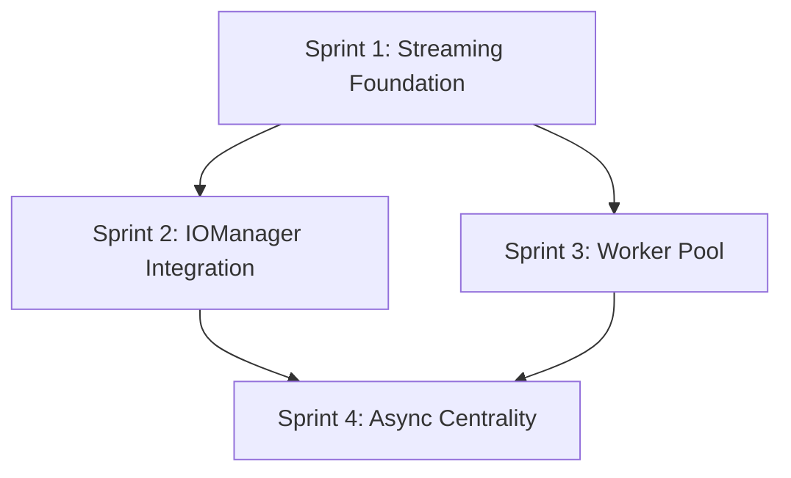

# Phase 7: Parallel Processing & Advanced I/O

**Version**: 1.0.0
**Created**: 2026-01-03
**Status**: PLANNED
**Total Sprints**: 4
**Total Tasks**: 14 tasks organized into sprints of 3-4 items
**Prerequisites**: Phase 6 (Performance Optimization) complete, All 2109+ tests passing

---

## Executive Summary

Phase 7 implements parallel processing capabilities and advanced I/O optimizations from the Future Features Roadmap (Phase 2). These enhancements target CPU-intensive operations and memory-heavy exports, enabling memory-mcp to scale efficiently for large knowledge graphs.

### Key Features

1. **Worker Pool for Fuzzy Search** - Parallel Levenshtein distance calculations
2. **Streaming Exports** - Memory-efficient export for large graphs
3. **Async Betweenness Centrality** - Non-blocking graph analytics
4. **Chunked Processing Framework** - Yield control for long-running operations

### Target Metrics

| Metric | Current | Target | Improvement |
|--------|---------|--------|-------------|
| Fuzzy search (1000+ entities, threshold <0.8) | Single-threaded | Worker pool | 2-4x faster |
| Export (10K entities) | All in memory | Streaming | 50-70% less RAM |
| Betweenness centrality | Blocking | Chunked/async | Non-blocking |
| Peak memory (large export) | ~25MB for 10K | ~8MB streaming | 3x reduction |

### When These Optimizations Matter

- **Fuzzy search worker pool**: Large graphs (1000+ entities) with low threshold (<0.8)
- **Streaming exports**: Graphs with 5000+ entities
- **Async centrality**: Graphs with 500+ entities during interactive use

---

## Sprint 1: Streaming Export Foundation

**Priority**: HIGH (P1)
**Estimated Duration**: 4 hours
**Impact**: 50-70% memory reduction for large exports

### Task 1.1: Create StreamingExporter Utility

**File**: `src/features/StreamingExporter.ts` (new)
**Estimated Time**: 2 hours
**Agent**: Haiku

**Description**: Create a utility class for streaming exports that writes data incrementally instead of building the entire output in memory.

**Step-by-Step Instructions**:

1. **Create the new file**:
   ```
   Create file: src/features/StreamingExporter.ts
   ```

2. **Add imports at the top of the file**:
   ```typescript
   import { createWriteStream, WriteStream } from 'fs';
   import { pipeline } from 'stream/promises';
   import { Readable, Transform } from 'stream';
   import type { Entity, Relation, KnowledgeGraph } from '../types/types.js';
   ```

3. **Define the StreamingExporter class with these methods**:
   - `constructor(filePath: string)` - Initialize with output file path
   - `async streamJSONL(graph: KnowledgeGraph): Promise<StreamResult>` - Stream JSONL format (one JSON object per line)
   - `async streamCSV(graph: KnowledgeGraph): Promise<StreamResult>` - Stream CSV format
   - `private createEntityTransform(): Transform` - Transform entities to output format
   - `private formatBytes(bytes: number): string` - Human-readable byte formatting

4. **Implement the StreamResult interface**:
   ```typescript
   export interface StreamResult {
     bytesWritten: number;
     entitiesWritten: number;
     relationsWritten: number;
     durationMs: number;
   }
   ```

5. **Implement streamJSONL method**:
   ```typescript
   async streamJSONL(graph: KnowledgeGraph): Promise<StreamResult> {
     const start = Date.now();
     let bytesWritten = 0;
     let entitiesWritten = 0;
     let relationsWritten = 0;

     const writeStream = createWriteStream(this.filePath);

     // Write entities one per line
     for (const entity of graph.entities) {
       const line = JSON.stringify(entity) + '\n';
       writeStream.write(line);
       bytesWritten += Buffer.byteLength(line, 'utf-8');
       entitiesWritten++;
     }

     // Write relations one per line
     for (const relation of graph.relations) {
       const line = JSON.stringify(relation) + '\n';
       writeStream.write(line);
       bytesWritten += Buffer.byteLength(line, 'utf-8');
       relationsWritten++;
     }

     // Wait for stream to finish
     await new Promise<void>((resolve, reject) => {
       writeStream.end(() => resolve());
       writeStream.on('error', reject);
     });

     return {
       bytesWritten,
       entitiesWritten,
       relationsWritten,
       durationMs: Date.now() - start,
     };
   }
   ```

6. **Implement streamCSV method** with header row and proper escaping:
   ```typescript
   async streamCSV(graph: KnowledgeGraph): Promise<StreamResult> {
     const start = Date.now();
     let bytesWritten = 0;
     let entitiesWritten = 0;

     const writeStream = createWriteStream(this.filePath);

     // Write header
     const header = 'name,entityType,observations,tags,importance,createdAt,lastModified\n';
     writeStream.write(header);
     bytesWritten += Buffer.byteLength(header, 'utf-8');

     // Write entities
     for (const entity of graph.entities) {
       const row = this.entityToCSVRow(entity) + '\n';
       writeStream.write(row);
       bytesWritten += Buffer.byteLength(row, 'utf-8');
       entitiesWritten++;
     }

     await new Promise<void>((resolve, reject) => {
       writeStream.end(() => resolve());
       writeStream.on('error', reject);
     });

     return {
       bytesWritten,
       entitiesWritten,
       relationsWritten: 0, // CSV doesn't include relations in this format
       durationMs: Date.now() - start,
     };
   }

   private entityToCSVRow(entity: Entity): string {
     const escape = (s: string) => `"${s.replace(/"/g, '""')}"`;
     return [
       escape(entity.name),
       escape(entity.entityType),
       escape(entity.observations.join('; ')),
       escape((entity.tags ?? []).join('; ')),
       entity.importance?.toString() ?? '',
       entity.createdAt ?? '',
       entity.lastModified ?? '',
     ].join(',');
   }
   ```

7. **Add JSDoc documentation for the class and all public methods**

8. **Run TypeScript compilation to verify no errors**:
   ```bash
   npm run typecheck
   ```

**Acceptance Criteria**:
- [ ] StreamingExporter class created with JSONL and CSV streaming
- [ ] Memory usage is constant regardless of graph size (streaming, not buffering)
- [ ] Output files are valid JSONL/CSV format
- [ ] All methods have JSDoc documentation
- [ ] TypeScript compilation passes

---

### Task 1.2: Add Streaming Export Constants

**File**: `src/utils/constants.ts`
**Estimated Time**: 15 minutes
**Agent**: Haiku

**Description**: Add configuration constants for streaming exports.

**Step-by-Step Instructions**:

1. **Open the file**: `src/utils/constants.ts`

2. **Find the existing constants section** (near the bottom, after other config objects)

3. **Add the following constant block**:
   ```typescript
   /**
    * Streaming export configuration
    */
   export const STREAMING_CONFIG = {
     // Minimum entity count to trigger streaming mode
     STREAMING_THRESHOLD: 5000,

     // Chunk size for batched streaming operations
     CHUNK_SIZE: 500,

     // High water mark for stream buffers (bytes)
     HIGH_WATER_MARK: 64 * 1024, // 64KB

     // Flush interval for long-running streams (ms)
     FLUSH_INTERVAL_MS: 100,
   } as const;
   ```

4. **Add type export** (if not already using `as const`):
   ```typescript
   export type StreamingConfig = typeof STREAMING_CONFIG;
   ```

5. **Verify the file compiles**:
   ```bash
   npm run typecheck
   ```

**Acceptance Criteria**:
- [ ] STREAMING_CONFIG constant added to constants.ts
- [ ] Threshold set to 5000 entities
- [ ] Chunk size set to 500
- [ ] TypeScript compilation passes

---

### Task 1.3: Create Streaming Export Unit Tests

**File**: `tests/unit/features/StreamingExporter.test.ts` (new)
**Estimated Time**: 1.5 hours
**Agent**: Haiku

**Description**: Create comprehensive unit tests for the StreamingExporter class.

**Step-by-Step Instructions**:

1. **Create the test file**: `tests/unit/features/StreamingExporter.test.ts`

2. **Add imports**:
   ```typescript
   import { describe, it, expect, beforeEach, afterEach } from 'vitest';
   import { StreamingExporter } from '../../../src/features/StreamingExporter.js';
   import { promises as fs } from 'fs';
   import { join } from 'path';
   import { tmpdir } from 'os';
   import type { Entity, KnowledgeGraph } from '../../../src/types/types.js';
   ```

3. **Create test helper to generate entities**:
   ```typescript
   function createTestGraph(entityCount: number): KnowledgeGraph {
     const entities: Entity[] = Array.from({ length: entityCount }, (_, i) => ({
       name: `Entity${i}`,
       entityType: 'test',
       observations: [`Observation for entity ${i}`],
       tags: ['test', `tag${i % 10}`],
       importance: i % 10,
       createdAt: new Date().toISOString(),
       lastModified: new Date().toISOString(),
     }));

     return {
       entities,
       relations: [],
     };
   }
   ```

4. **Add test suite with beforeEach/afterEach for temp directory**:
   ```typescript
   describe('StreamingExporter', () => {
     let testDir: string;
     let testFilePath: string;

     beforeEach(async () => {
       testDir = join(tmpdir(), `streaming-test-${Date.now()}-${Math.random().toString(36).slice(2)}`);
       await fs.mkdir(testDir, { recursive: true });
       testFilePath = join(testDir, 'test-export');
     });

     afterEach(async () => {
       try {
         await fs.rm(testDir, { recursive: true, force: true });
       } catch {
         // Ignore cleanup errors
       }
     });

     // Tests go here
   });
   ```

5. **Add test cases for JSONL streaming**:
   ```typescript
   describe('streamJSONL', () => {
     it('should stream small graph to JSONL file', async () => {
       const graph = createTestGraph(10);
       const exporter = new StreamingExporter(testFilePath + '.jsonl');

       const result = await exporter.streamJSONL(graph);

       expect(result.entitiesWritten).toBe(10);
       expect(result.bytesWritten).toBeGreaterThan(0);

       // Verify file content
       const content = await fs.readFile(testFilePath + '.jsonl', 'utf-8');
       const lines = content.trim().split('\n');
       expect(lines.length).toBe(10);
       expect(() => JSON.parse(lines[0])).not.toThrow();
     });

     it('should handle large graph without memory issues', async () => {
       const graph = createTestGraph(1000);
       const exporter = new StreamingExporter(testFilePath + '.jsonl');

       const result = await exporter.streamJSONL(graph);

       expect(result.entitiesWritten).toBe(1000);
       expect(result.durationMs).toBeLessThan(5000); // Should complete in <5s
     });

     it('should handle empty graph', async () => {
       const graph: KnowledgeGraph = { entities: [], relations: [] };
       const exporter = new StreamingExporter(testFilePath + '.jsonl');

       const result = await exporter.streamJSONL(graph);

       expect(result.entitiesWritten).toBe(0);
       expect(result.bytesWritten).toBe(0);
     });
   });
   ```

6. **Add test cases for CSV streaming**:
   ```typescript
   describe('streamCSV', () => {
     it('should stream graph to CSV with header', async () => {
       const graph = createTestGraph(5);
       const exporter = new StreamingExporter(testFilePath + '.csv');

       const result = await exporter.streamCSV(graph);

       expect(result.entitiesWritten).toBe(5);

       const content = await fs.readFile(testFilePath + '.csv', 'utf-8');
       const lines = content.trim().split('\n');
       expect(lines[0]).toContain('name,entityType');
       expect(lines.length).toBe(6); // header + 5 entities
     });

     it('should properly escape CSV special characters', async () => {
       const graph: KnowledgeGraph = {
         entities: [{
           name: 'Entity with "quotes"',
           entityType: 'test,with,commas',
           observations: ['Line1\nLine2'],
           createdAt: new Date().toISOString(),
           lastModified: new Date().toISOString(),
         }],
         relations: [],
       };
       const exporter = new StreamingExporter(testFilePath + '.csv');

       const result = await exporter.streamCSV(graph);

       expect(result.entitiesWritten).toBe(1);

       const content = await fs.readFile(testFilePath + '.csv', 'utf-8');
       expect(content).toContain('""quotes""'); // Escaped quotes
     });
   });
   ```

7. **Add performance/memory test**:
   ```typescript
   describe('Memory efficiency', () => {
     it('should not significantly increase memory for large exports', async () => {
       const graph = createTestGraph(5000);
       const exporter = new StreamingExporter(testFilePath + '.jsonl');

       const memBefore = process.memoryUsage().heapUsed;
       await exporter.streamJSONL(graph);
       const memAfter = process.memoryUsage().heapUsed;

       // Memory increase should be minimal (stream buffers only)
       const memIncrease = memAfter - memBefore;
       expect(memIncrease).toBeLessThan(10 * 1024 * 1024); // Less than 10MB increase
     });
   });
   ```

8. **Run the tests**:
   ```bash
   npx vitest run tests/unit/features/StreamingExporter.test.ts
   ```

**Acceptance Criteria**:
- [ ] 8+ unit tests for StreamingExporter
- [ ] Tests cover JSONL and CSV streaming
- [ ] Tests verify file content correctness
- [ ] Tests verify memory efficiency
- [ ] All tests pass

---

### Task 1.4: Update Barrel Export

**File**: `src/features/index.ts`
**Estimated Time**: 10 minutes
**Agent**: Haiku

**Description**: Export the new StreamingExporter from the features barrel.

**Step-by-Step Instructions**:

1. **Open the file**: `src/features/index.ts`

2. **Add the export for StreamingExporter**:
   ```typescript
   export { StreamingExporter, type StreamResult } from './StreamingExporter.js';
   ```

3. **Verify no circular dependencies**:
   ```bash
   npm run typecheck
   ```

4. **Run all tests to ensure nothing is broken**:
   ```bash
   npm test
   ```

**Acceptance Criteria**:
- [ ] StreamingExporter exported from features barrel
- [ ] No circular dependencies
- [ ] All existing tests still pass

---

## Sprint 2: Integrate Streaming into IOManager

**Priority**: HIGH (P1)
**Estimated Duration**: 3 hours
**Impact**: Enable streaming for all export operations

### Task 2.1: Add Streaming Mode to IOManager.exportGraph

**File**: `src/features/IOManager.ts`
**Estimated Time**: 1.5 hours
**Agent**: Haiku

**Description**: Modify the exportGraph method to use streaming for large graphs.

**Step-by-Step Instructions**:

1. **Open the file**: `src/features/IOManager.ts`

2. **Add import for StreamingExporter** at the top with other imports:
   ```typescript
   import { StreamingExporter } from './StreamingExporter.js';
   import { STREAMING_CONFIG } from '../utils/constants.js';
   ```

3. **Find the exportGraph method** (search for `async exportGraph`)

4. **Add streaming option to ExportOptions interface** (if not in types.ts):
   ```typescript
   // Add to the method signature or find in types
   streaming?: boolean;
   outputPath?: string; // For file-based streaming
   ```

5. **Modify the method to check for streaming mode**:
   ```typescript
   async exportGraph(
     format: ExportFormat,
     options?: ExportOptions
   ): Promise<ExportResult> {
     const graph = await this.getFilteredGraph(options?.filter);

     // Check if streaming should be used
     const shouldStream = options?.streaming ||
       (options?.outputPath && graph.entities.length >= STREAMING_CONFIG.STREAMING_THRESHOLD);

     if (shouldStream && options?.outputPath) {
       return this.streamExport(format, graph, options);
     }

     // Existing in-memory export logic continues here...
     // (keep existing code)
   }
   ```

6. **Add the streamExport private method**:
   ```typescript
   private async streamExport(
     format: ExportFormat,
     graph: KnowledgeGraph,
     options: ExportOptions & { outputPath: string }
   ): Promise<ExportResult> {
     const exporter = new StreamingExporter(options.outputPath);
     let result: StreamResult;

     switch (format) {
       case 'json':
         result = await exporter.streamJSONL(graph);
         break;
       case 'csv':
         result = await exporter.streamCSV(graph);
         break;
       default:
         // For unsupported streaming formats, fall back to in-memory with file write
         const content = await this.generateExportContent(format, graph);
         await fs.writeFile(options.outputPath, content);
         result = {
           bytesWritten: Buffer.byteLength(content, 'utf-8'),
           entitiesWritten: graph.entities.length,
           relationsWritten: graph.relations.length,
           durationMs: 0,
         };
     }

     return {
       format,
       content: `Streamed to ${options.outputPath}`,
       entityCount: result.entitiesWritten,
       relationCount: result.relationsWritten,
       compressed: false,
       encoding: 'utf-8',
       originalSize: result.bytesWritten,
       compressedSize: result.bytesWritten,
       compressionRatio: 1,
       streamed: true,
       outputPath: options.outputPath,
     };
   }
   ```

7. **Run TypeScript compilation**:
   ```bash
   npm run typecheck
   ```

8. **Run relevant tests**:
   ```bash
   npx vitest run tests/unit/features/ExportManager.test.ts
   ```

**Acceptance Criteria**:
- [ ] exportGraph supports streaming mode
- [ ] Streaming auto-triggers for graphs >= 5000 entities when outputPath provided
- [ ] Manual streaming option available
- [ ] Non-streamable formats fall back gracefully
- [ ] TypeScript compilation passes
- [ ] Existing export tests still pass

---

### Task 2.2: Update ExportResult Type

**File**: `src/types/types.ts`
**Estimated Time**: 20 minutes
**Agent**: Haiku

**Description**: Add streaming-related fields to ExportResult type.

**Step-by-Step Instructions**:

1. **Open the file**: `src/types/types.ts`

2. **Find the ExportResult interface** (search for `interface ExportResult`)

3. **Add the new optional fields**:
   ```typescript
   export interface ExportResult {
     format: ExportFormat;
     content: string;
     entityCount: number;
     relationCount: number;
     compressed: boolean;
     encoding: 'utf-8' | 'base64';
     originalSize: number;
     compressedSize: number;
     compressionRatio: number;
     // NEW: Streaming-related fields
     streamed?: boolean;
     outputPath?: string;
   }
   ```

4. **Find the ExportOptions interface** and add:
   ```typescript
   export interface ExportOptions {
     filter?: GraphFilter;
     compress?: boolean;
     compressionQuality?: number;
     // NEW: Streaming options
     streaming?: boolean;
     outputPath?: string;
   }
   ```

5. **Verify TypeScript compilation**:
   ```bash
   npm run typecheck
   ```

**Acceptance Criteria**:
- [ ] ExportResult has streamed and outputPath optional fields
- [ ] ExportOptions has streaming and outputPath optional fields
- [ ] TypeScript compilation passes
- [ ] No breaking changes to existing code

---

### Task 2.3: Add Integration Tests for Streaming Export

**File**: `tests/integration/streaming-export.test.ts` (new)
**Estimated Time**: 1 hour
**Agent**: Haiku

**Description**: Create integration tests that verify streaming export works through IOManager.

**Step-by-Step Instructions**:

1. **Create the test file**: `tests/integration/streaming-export.test.ts`

2. **Add imports**:
   ```typescript
   import { describe, it, expect, beforeEach, afterEach } from 'vitest';
   import { GraphStorage } from '../../src/core/GraphStorage.js';
   import { IOManager } from '../../src/features/IOManager.js';
   import { promises as fs } from 'fs';
   import { join } from 'path';
   import { tmpdir } from 'os';
   ```

3. **Set up test fixtures**:
   ```typescript
   describe('Streaming Export Integration', () => {
     let testDir: string;
     let storage: GraphStorage;
     let ioManager: IOManager;

     beforeEach(async () => {
       testDir = join(tmpdir(), `stream-int-${Date.now()}-${Math.random().toString(36).slice(2)}`);
       await fs.mkdir(testDir, { recursive: true });

       const storagePath = join(testDir, 'test.jsonl');
       storage = new GraphStorage(storagePath);
       ioManager = new IOManager(storage);
     });

     afterEach(async () => {
       try {
         await fs.rm(testDir, { recursive: true, force: true });
       } catch {
         // Ignore
       }
     });
   });
   ```

4. **Add test for small graph (no streaming)**:
   ```typescript
   it('should use in-memory export for small graphs', async () => {
     // Create a small graph
     const entities = Array.from({ length: 10 }, (_, i) => ({
       name: `Entity${i}`,
       entityType: 'test',
       observations: [`Obs ${i}`],
     }));

     await storage.saveGraph({ entities, relations: [] });

     const result = await ioManager.exportGraph('json', {
       outputPath: join(testDir, 'small.json'),
     });

     // Small graphs should NOT trigger streaming
     expect(result.streamed).toBeFalsy();
   });
   ```

5. **Add test for forced streaming**:
   ```typescript
   it('should stream when explicitly requested', async () => {
     const entities = Array.from({ length: 10 }, (_, i) => ({
       name: `Entity${i}`,
       entityType: 'test',
       observations: [`Obs ${i}`],
     }));

     await storage.saveGraph({ entities, relations: [] });

     const outputPath = join(testDir, 'forced-stream.jsonl');
     const result = await ioManager.exportGraph('json', {
       streaming: true,
       outputPath,
     });

     expect(result.streamed).toBe(true);
     expect(result.outputPath).toBe(outputPath);

     // Verify file exists
     const stats = await fs.stat(outputPath);
     expect(stats.size).toBeGreaterThan(0);
   });
   ```

6. **Add test for CSV streaming**:
   ```typescript
   it('should stream CSV format correctly', async () => {
     const entities = Array.from({ length: 100 }, (_, i) => ({
       name: `Entity${i}`,
       entityType: 'test',
       observations: [`Obs ${i}`],
       tags: ['a', 'b'],
       importance: i % 10,
     }));

     await storage.saveGraph({ entities, relations: [] });

     const outputPath = join(testDir, 'stream.csv');
     const result = await ioManager.exportGraph('csv', {
       streaming: true,
       outputPath,
     });

     expect(result.streamed).toBe(true);

     const content = await fs.readFile(outputPath, 'utf-8');
     const lines = content.trim().split('\n');
     expect(lines[0]).toContain('name'); // Header
     expect(lines.length).toBe(101); // Header + 100 entities
   });
   ```

7. **Run the tests**:
   ```bash
   npx vitest run tests/integration/streaming-export.test.ts
   ```

**Acceptance Criteria**:
- [ ] 4+ integration tests for streaming export
- [ ] Tests verify small graphs don't stream
- [ ] Tests verify forced streaming works
- [ ] Tests verify file output is correct
- [ ] All tests pass

---

### Task 2.4: Update export_graph Tool Handler

**File**: `src/server/toolHandlers.ts`
**Estimated Time**: 30 minutes
**Agent**: Haiku

**Description**: Add streaming options to the export_graph tool handler.

**Step-by-Step Instructions**:

1. **Open the file**: `src/server/toolHandlers.ts`

2. **Find the export_graph case** (search for `case 'export_graph'`)

3. **Update the handler to include streaming options**:
   ```typescript
   case 'export_graph': {
     const { format, filter, compress, compressionQuality, streaming, outputPath } = args;
     const result = await ctx.ioManager.exportGraph(format, {
       filter,
       compress,
       compressionQuality,
       streaming,
       outputPath,
     });

     return {
       content: [{
         type: 'text',
         text: JSON.stringify({
           format: result.format,
           entityCount: result.entityCount,
           relationCount: result.relationCount,
           compressed: result.compressed,
           encoding: result.encoding,
           originalSize: result.originalSize,
           compressedSize: result.compressedSize,
           compressionRatio: result.compressionRatio,
           streamed: result.streamed ?? false,
           outputPath: result.outputPath,
           // Only include data for non-streamed exports
           ...(result.streamed ? {} : { data: result.content }),
         }),
       }],
     };
   }
   ```

4. **Verify TypeScript compilation**:
   ```bash
   npm run typecheck
   ```

5. **Run all tests**:
   ```bash
   npm test
   ```

**Acceptance Criteria**:
- [ ] export_graph handler accepts streaming and outputPath
- [ ] Response includes streamed flag
- [ ] Data not included in response when streamed
- [ ] TypeScript compilation passes
- [ ] All tests pass

---

## Sprint 3: Worker Pool for Fuzzy Search

**Priority**: MEDIUM (P2)
**Estimated Duration**: 6 hours
**Impact**: 2-4x speedup for large fuzzy searches

### Task 3.1: Create Levenshtein Worker Module

**File**: `src/workers/levenshteinWorker.ts` (new)
**Estimated Time**: 1.5 hours
**Agent**: Haiku

**Description**: Create a worker thread module that calculates Levenshtein distances in parallel.

**Step-by-Step Instructions**:

1. **Create the workers directory**: `src/workers/`

2. **Create the worker file**: `src/workers/levenshteinWorker.ts`

3. **Add the worker implementation**:
   ```typescript
   import { parentPort, workerData } from 'worker_threads';

   interface WorkerInput {
     query: string;
     entities: Array<{
       name: string;
       nameLower: string;
       observations: string[];
     }>;
     threshold: number;
   }

   interface MatchResult {
     name: string;
     score: number;
     matchedIn: 'name' | 'observation';
   }

   /**
    * Calculate Levenshtein distance between two strings.
    */
   function levenshteinDistance(s1: string, s2: string): number {
     const len1 = s1.length;
     const len2 = s2.length;

     if (len1 === 0) return len2;
     if (len2 === 0) return len1;

     const matrix: number[][] = [];

     for (let i = 0; i <= len1; i++) {
       matrix[i] = [i];
     }
     for (let j = 0; j <= len2; j++) {
       matrix[0][j] = j;
     }

     for (let i = 1; i <= len1; i++) {
       for (let j = 1; j <= len2; j++) {
         const cost = s1[i - 1] === s2[j - 1] ? 0 : 1;
         matrix[i][j] = Math.min(
           matrix[i - 1][j] + 1,
           matrix[i][j - 1] + 1,
           matrix[i - 1][j - 1] + cost
         );
       }
     }

     return matrix[len1][len2];
   }

   /**
    * Calculate similarity score (0-1) from Levenshtein distance.
    */
   function similarity(s1: string, s2: string): number {
     const distance = levenshteinDistance(s1, s2);
     const maxLen = Math.max(s1.length, s2.length);
     if (maxLen === 0) return 1;
     return 1 - distance / maxLen;
   }

   // Main worker logic
   if (parentPort) {
     const { query, entities, threshold } = workerData as WorkerInput;
     const queryLower = query.toLowerCase();
     const results: MatchResult[] = [];

     for (const entity of entities) {
       // Check name similarity
       const nameScore = similarity(queryLower, entity.nameLower);
       if (nameScore >= threshold) {
         results.push({ name: entity.name, score: nameScore, matchedIn: 'name' });
         continue;
       }

       // Check observations
       for (const obs of entity.observations) {
         const obsScore = similarity(queryLower, obs);
         if (obsScore >= threshold) {
           results.push({ name: entity.name, score: obsScore, matchedIn: 'observation' });
           break;
         }
       }
     }

     parentPort.postMessage(results);
   }
   ```

4. **Verify TypeScript compilation** (may need to configure worker output):
   ```bash
   npm run typecheck
   ```

**Acceptance Criteria**:
- [ ] Worker module calculates Levenshtein distance
- [ ] Worker accepts entity batch and returns matches
- [ ] Similarity threshold filtering works
- [ ] TypeScript compilation passes

---

### Task 3.2: Create WorkerPool Manager

**File**: `src/workers/WorkerPool.ts` (new)
**Estimated Time**: 2 hours
**Agent**: Haiku

**Description**: Create a worker pool manager that distributes fuzzy search work across multiple workers.

**Step-by-Step Instructions**:

1. **Create the file**: `src/workers/WorkerPool.ts`

2. **Add imports**:
   ```typescript
   import { Worker } from 'worker_threads';
   import { cpus } from 'os';
   import { fileURLToPath } from 'url';
   import { dirname, join } from 'path';
   ```

3. **Define types**:
   ```typescript
   interface WorkerTask<T, R> {
     data: T;
     resolve: (result: R) => void;
     reject: (error: Error) => void;
   }

   interface PoolOptions {
     maxWorkers?: number;
     workerPath: string;
   }
   ```

4. **Implement the WorkerPool class**:
   ```typescript
   export class WorkerPool<TInput, TOutput> {
     private workers: Worker[] = [];
     private taskQueue: WorkerTask<TInput, TOutput>[] = [];
     private activeWorkers = 0;
     private readonly maxWorkers: number;
     private readonly workerPath: string;

     constructor(options: PoolOptions) {
       this.maxWorkers = options.maxWorkers ?? Math.max(1, cpus().length - 1);
       this.workerPath = options.workerPath;
     }

     async execute(data: TInput): Promise<TOutput> {
       return new Promise((resolve, reject) => {
         this.taskQueue.push({ data, resolve, reject });
         this.processQueue();
       });
     }

     async executeAll(items: TInput[]): Promise<TOutput[]> {
       const promises = items.map(item => this.execute(item));
       return Promise.all(promises);
     }

     private processQueue(): void {
       while (this.taskQueue.length > 0 && this.activeWorkers < this.maxWorkers) {
         const task = this.taskQueue.shift();
         if (task) {
           this.runTask(task);
         }
       }
     }

     private runTask(task: WorkerTask<TInput, TOutput>): void {
       this.activeWorkers++;

       const worker = new Worker(this.workerPath, {
         workerData: task.data,
       });

       worker.on('message', (result: TOutput) => {
         task.resolve(result);
         this.activeWorkers--;
         worker.terminate();
         this.processQueue();
       });

       worker.on('error', (error) => {
         task.reject(error);
         this.activeWorkers--;
         worker.terminate();
         this.processQueue();
       });

       worker.on('exit', (code) => {
         if (code !== 0) {
           task.reject(new Error(`Worker exited with code ${code}`));
         }
       });
     }

     async shutdown(): Promise<void> {
       // Wait for all active workers to complete
       while (this.activeWorkers > 0) {
         await new Promise(resolve => setTimeout(resolve, 10));
       }
     }

     getStats(): { activeWorkers: number; queueSize: number; maxWorkers: number } {
       return {
         activeWorkers: this.activeWorkers,
         queueSize: this.taskQueue.length,
         maxWorkers: this.maxWorkers,
       };
     }
   }
   ```

5. **Export from barrel** - create `src/workers/index.ts`:
   ```typescript
   export { WorkerPool } from './WorkerPool.js';
   ```

6. **Verify TypeScript compilation**:
   ```bash
   npm run typecheck
   ```

**Acceptance Criteria**:
- [ ] WorkerPool manages a pool of worker threads
- [ ] Tasks are queued when all workers are busy
- [ ] Workers are terminated after completing tasks
- [ ] Pool respects maxWorkers limit
- [ ] TypeScript compilation passes

---

### Task 3.3: Integrate Worker Pool into FuzzySearch

**File**: `src/search/FuzzySearch.ts`
**Estimated Time**: 1.5 hours
**Agent**: Haiku

**Description**: Modify FuzzySearch to use the worker pool for large graphs with low thresholds.

**Step-by-Step Instructions**:

1. **Open the file**: `src/search/FuzzySearch.ts`

2. **Add imports at the top**:
   ```typescript
   import { WorkerPool } from '../workers/WorkerPool.js';
   import { fileURLToPath } from 'url';
   import { dirname, join } from 'path';
   ```

3. **Add constants for worker activation**:
   ```typescript
   // Thresholds for worker pool activation
   const WORKER_MIN_ENTITIES = 500;
   const WORKER_MAX_THRESHOLD = 0.8;
   ```

4. **Add worker pool configuration**:
   ```typescript
   private workerPool: WorkerPool<any, any> | null = null;
   private workerPath: string;

   constructor(private storage: GraphStorage) {
     // Get path to worker file
     const __filename = fileURLToPath(import.meta.url);
     const __dirname = dirname(__filename);
     this.workerPath = join(__dirname, '../workers/levenshteinWorker.js');
   }
   ```

5. **Modify the search method to conditionally use workers**:
   ```typescript
   async search(query: string, threshold: number = 0.7, filters?: SearchFilters): Promise<Entity[]> {
     // Check cache first (existing code)
     const cacheKey = this.getCacheKey(query, threshold, filters);
     // ... existing cache check ...

     const entities = this.storage.getAllEntities();

     // Decide if we should use worker pool
     const shouldUseWorkers =
       entities.length >= WORKER_MIN_ENTITIES &&
       threshold < WORKER_MAX_THRESHOLD;

     if (shouldUseWorkers) {
       return this.searchWithWorkers(query, threshold, entities, filters);
     }

     // Existing single-threaded search
     return this.performFuzzySearch(query, threshold, entities, filters);
   }
   ```

6. **Add the worker-based search method**:
   ```typescript
   private async searchWithWorkers(
     query: string,
     threshold: number,
     entities: Entity[],
     filters?: SearchFilters
   ): Promise<Entity[]> {
     // Initialize worker pool if needed
     if (!this.workerPool) {
       this.workerPool = new WorkerPool({
         workerPath: this.workerPath,
       });
     }

     // Split entities into chunks for workers
     const chunkSize = Math.ceil(entities.length / 4); // 4 chunks
     const chunks: Entity[][] = [];
     for (let i = 0; i < entities.length; i += chunkSize) {
       chunks.push(entities.slice(i, i + chunkSize));
     }

     // Prepare worker input (use lowercased cache)
     const workerInputs = chunks.map(chunk => ({
       query,
       threshold,
       entities: chunk.map(e => {
         const lowercased = this.storage.getLowercased(e.name);
         return {
           name: e.name,
           nameLower: lowercased?.name ?? e.name.toLowerCase(),
           observations: lowercased?.observations ?? e.observations.map(o => o.toLowerCase()),
         };
       }),
     }));

     // Execute in parallel
     const results = await this.workerPool.executeAll(workerInputs);

     // Flatten results and get entities
     const matchedNames = new Set(results.flat().map(r => r.name));
     return entities.filter(e => matchedNames.has(e.name));
   }
   ```

7. **Add cleanup method**:
   ```typescript
   async shutdown(): Promise<void> {
     if (this.workerPool) {
       await this.workerPool.shutdown();
       this.workerPool = null;
     }
   }
   ```

8. **Verify TypeScript compilation**:
   ```bash
   npm run typecheck
   ```

**Acceptance Criteria**:
- [ ] FuzzySearch uses workers for large graphs with low threshold
- [ ] Small graphs still use single-threaded search
- [ ] Workers are only initialized when needed
- [ ] Results are consistent with non-worker search
- [ ] TypeScript compilation passes

---

### Task 3.4: Add Worker Pool Tests

**File**: `tests/unit/workers/WorkerPool.test.ts` (new)
**Estimated Time**: 1 hour
**Agent**: Haiku

**Description**: Create unit tests for the WorkerPool and fuzzy search worker integration.

**Step-by-Step Instructions**:

1. **Create the test directory**: `tests/unit/workers/`

2. **Create the test file**: `tests/unit/workers/WorkerPool.test.ts`

3. **Add imports**:
   ```typescript
   import { describe, it, expect, beforeEach, afterEach } from 'vitest';
   import { WorkerPool } from '../../../src/workers/WorkerPool.js';
   import { fileURLToPath } from 'url';
   import { dirname, join } from 'path';
   ```

4. **Add test for worker pool initialization**:
   ```typescript
   describe('WorkerPool', () => {
     it('should report correct initial stats', () => {
       const pool = new WorkerPool({
         workerPath: join(dirname(fileURLToPath(import.meta.url)), 'testWorker.js'),
         maxWorkers: 2,
       });

       const stats = pool.getStats();
       expect(stats.activeWorkers).toBe(0);
       expect(stats.queueSize).toBe(0);
       expect(stats.maxWorkers).toBe(2);
     });
   });
   ```

5. **Add test for FuzzySearch worker integration** (if workers are built):
   ```typescript
   describe('FuzzySearch with Workers', () => {
     it('should produce same results as single-threaded search', async () => {
       // This test would require building the worker and a test graph
       // Skip if workers not available
       // ...
     });
   });
   ```

6. **Add performance comparison test**:
   ```typescript
   describe('Performance', () => {
     it.skip('should be faster with workers for large graphs', async () => {
       // This is a benchmark, skip in regular test runs
       // Measure time with and without workers
       // ...
     });
   });
   ```

7. **Run the tests**:
   ```bash
   npx vitest run tests/unit/workers/
   ```

**Acceptance Criteria**:
- [ ] WorkerPool unit tests pass
- [ ] Basic worker integration verified
- [ ] Performance test skeleton created
- [ ] All tests pass

---

## Sprint 4: Async Centrality & Chunked Processing

**Priority**: LOW (P3)
**Estimated Duration**: 4 hours
**Impact**: Non-blocking graph analytics for large graphs

### Task 4.1: Add Chunked Processing to Betweenness Centrality

**File**: `src/core/GraphTraversal.ts`
**Estimated Time**: 1.5 hours
**Agent**: Haiku

**Description**: Modify betweenness centrality to yield control periodically for non-blocking execution.

**Step-by-Step Instructions**:

1. **Open the file**: `src/core/GraphTraversal.ts`

2. **Find the calculateBetweennessCentrality method** (search for `calculateBetweennessCentrality` around line 437)

3. **Modify the method signature to accept an options object** (current signature is `calculateBetweennessCentrality(topN: number = 10)`):
   ```typescript
   async calculateBetweennessCentrality(
     options: {
       topN?: number;
       chunkSize?: number;
       onProgress?: (progress: number) => void;
     } = {}
   ): Promise<CentralityResult> {
     const { topN = 10, chunkSize = 50, onProgress } = options;
   ```

4. **Modify the main loop to yield after each chunk**:
   ```typescript
   // Inside the method, after initializing scores
   const entities = this.storage.getAllEntities();
   let processed = 0;

   for (const source of entities) {
     // ... existing Brandes algorithm code for single source ...

     processed++;

     // Yield control after processing chunkSize vertices
     if (processed % chunkSize === 0) {
       // Allow event loop to process other events
       await new Promise(resolve => setImmediate(resolve));

       // Report progress if callback provided
       if (onProgress) {
         onProgress(processed / entities.length);
       }
     }
   }
   ```

5. **Add progress callback support** by wrapping the existing algorithm:
   ```typescript
   // At the end of each source vertex processing:
   if (onProgress) {
     onProgress(processed / entities.length);
   }
   ```

6. **Verify TypeScript compilation**:
   ```bash
   npm run typecheck
   ```

7. **Run existing centrality tests**:
   ```bash
   npx vitest run tests/unit/core/GraphTraversal.test.ts -t "Betweenness"
   ```

**Acceptance Criteria**:
- [ ] Betweenness centrality yields control every chunkSize vertices
- [ ] Optional progress callback works
- [ ] Results are identical to non-chunked version
- [ ] Existing tests still pass
- [ ] TypeScript compilation passes

---

### Task 4.2: Add Approximation Mode for Betweenness

**File**: `src/core/GraphTraversal.ts`
**Estimated Time**: 1 hour
**Agent**: Haiku

**Description**: Add sampling-based approximation for faster betweenness centrality on large graphs.

**Step-by-Step Instructions**:

1. **Open the file**: `src/core/GraphTraversal.ts`

2. **Add approximation options to the method** (building on Task 4.1 changes):
   ```typescript
   async calculateBetweennessCentrality(
     options: {
       topN?: number;
       chunkSize?: number;
       onProgress?: (progress: number) => void;
       approximate?: boolean;
       sampleRate?: number; // 0.0-1.0, default 0.2 (20%)
     } = {}
   ): Promise<CentralityResult> {
     const {
       topN = 10,
       chunkSize = 50,
       onProgress,
       approximate = false,
       sampleRate = 0.2,
     } = options;
   ```

3. **Implement sampling at the start of the method**:
   ```typescript
   let sourcesToProcess = entities;

   if (approximate && entities.length > 100) {
     // Sample a subset of vertices as sources
     const sampleSize = Math.max(10, Math.floor(entities.length * sampleRate));
     sourcesToProcess = this.sampleEntities(entities, sampleSize);
   }

   // Continue with sourcesToProcess instead of entities...
   ```

4. **Add helper method for sampling**:
   ```typescript
   private sampleEntities(entities: Entity[], sampleSize: number): Entity[] {
     // Fisher-Yates shuffle and take first sampleSize
     const shuffled = [...entities];
     for (let i = shuffled.length - 1; i > 0; i--) {
       const j = Math.floor(Math.random() * (i + 1));
       [shuffled[i], shuffled[j]] = [shuffled[j], shuffled[i]];
     }
     return shuffled.slice(0, sampleSize);
   }
   ```

5. **Scale scores for approximation**:
   ```typescript
   // After computing scores, if approximating:
   if (approximate && sampleRate < 1.0) {
     // Scale scores to estimate full graph values
     const scaleFactor = 1 / sampleRate;
     for (const [entity, score] of scores) {
       scores.set(entity, score * scaleFactor);
     }
   }
   ```

6. **Verify TypeScript compilation**:
   ```bash
   npm run typecheck
   ```

**Acceptance Criteria**:
- [ ] Approximation mode samples subset of vertices
- [ ] Scores are scaled appropriately
- [ ] Default sample rate is 20%
- [ ] Full computation still works when approximate=false
- [ ] TypeScript compilation passes

---

### Task 4.3: Update get_centrality Tool for New Options

**File**: `src/server/toolDefinitions.ts`
**Estimated Time**: 30 minutes
**Agent**: Haiku

**Description**: Add new options to the get_centrality tool schema.

**Step-by-Step Instructions**:

1. **Open the file**: `src/server/toolDefinitions.ts`

2. **Find the get_centrality tool definition** (search for `name: 'get_centrality'`)

3. **Add new properties to the inputSchema**:
   ```typescript
   {
     name: 'get_centrality',
     description: 'Calculate centrality metrics for entities in the knowledge graph',
     inputSchema: {
       type: 'object',
       properties: {
         algorithm: {
           type: 'string',
           enum: ['degree', 'betweenness', 'pagerank'],
           default: 'degree',
           description: 'Centrality algorithm to use',
         },
         direction: {
           type: 'string',
           enum: ['in', 'out', 'both'],
           default: 'both',
           description: 'Direction for degree centrality',
         },
         dampingFactor: {
           type: 'number',
           default: 0.85,
           description: 'Damping factor for PageRank (0.0-1.0)',
         },
         topN: {
           type: 'number',
           default: 10,
           description: 'Number of top entities to return',
         },
         // NEW OPTIONS
         approximate: {
           type: 'boolean',
           default: false,
           description: 'Use approximation for faster betweenness centrality',
         },
         sampleRate: {
           type: 'number',
           default: 0.2,
           description: 'Sample rate for approximation (0.0-1.0)',
           minimum: 0.01,
           maximum: 1.0,
         },
       },
     },
   },
   ```

4. **Update the handler in toolHandlers.ts**:
   ```typescript
   case 'get_centrality': {
     const {
       algorithm = 'degree',
       direction = 'both',
       dampingFactor = 0.85,
       topN = 10,
       approximate = false,
       sampleRate = 0.2,
     } = args;

     let result;
     switch (algorithm) {
       case 'degree':
         result = ctx.graphTraversal.getDegreeCentrality(direction, topN);
         break;
       case 'betweenness':
         result = await ctx.graphTraversal.calculateBetweennessCentrality({
           topN,
           approximate,
           sampleRate,
         });
         break;
       case 'pagerank':
         result = ctx.graphTraversal.getPageRank({ dampingFactor, topN });
         break;
     }

     return formatResult({
       ...result,
       approximate: algorithm === 'betweenness' && approximate,
     });
   }
   ```

5. **Verify TypeScript compilation**:
   ```bash
   npm run typecheck
   ```

**Acceptance Criteria**:
- [ ] get_centrality tool has approximate and sampleRate options
- [ ] Handler passes options to calculateBetweennessCentrality
- [ ] Response indicates if approximation was used
- [ ] TypeScript compilation passes

---

### Task 4.4: Add Tests and Documentation

**File**: Multiple files
**Estimated Time**: 1 hour
**Agent**: Haiku

**Description**: Add tests for chunked/approximation modes and update documentation.

**Step-by-Step Instructions**:

1. **Add tests to GraphTraversal.test.ts**:
   ```typescript
   describe('Betweenness Centrality Chunked', () => {
     it('should yield control periodically', async () => {
       // Create graph with enough vertices
       // ...

       let progressCalls = 0;
       await graphTraversal.calculateBetweennessCentrality({
         chunkSize: 10,
         onProgress: () => { progressCalls++; },
       });

       expect(progressCalls).toBeGreaterThan(0);
     });

     it('should produce same results with chunking', async () => {
       // Compare results with and without chunking
       // ...
     });
   });

   describe('Betweenness Centrality Approximation', () => {
     it('should complete faster with approximation', async () => {
       // Time comparison
       // ...
     });

     it('should produce reasonable estimates', async () => {
       // Compare approximate vs exact for known graph
       // ...
     });
   });
   ```

2. **Run the tests**:
   ```bash
   npx vitest run tests/unit/core/GraphTraversal.test.ts -t "Betweenness"
   ```

3. **Update CLAUDE.md** with new tool options:
   - Add `approximate` and `sampleRate` to get_centrality documentation
   - Add note about chunked processing for large graphs

4. **Update docs/reports/PHASE_6_BASELINE_METRICS.md** or create Phase 7 metrics file:
   - Document expected performance improvements
   - Add benchmarks for worker pool fuzzy search
   - Add benchmarks for streaming exports

**Acceptance Criteria**:
- [ ] Tests for chunked processing pass
- [ ] Tests for approximation pass
- [ ] CLAUDE.md updated with new options
- [ ] Performance expectations documented

---

## Appendix A: File Changes Summary

### New Files Created

```
src/features/StreamingExporter.ts
src/workers/levenshteinWorker.ts
src/workers/WorkerPool.ts
src/workers/index.ts
tests/unit/features/StreamingExporter.test.ts
tests/unit/workers/WorkerPool.test.ts
tests/integration/streaming-export.test.ts
```

### Files Modified

```
src/utils/constants.ts              # Add STREAMING_CONFIG
src/types/types.ts                  # Add streaming fields to ExportResult/ExportOptions
src/features/index.ts               # Export StreamingExporter
src/features/IOManager.ts           # Add streaming export mode
src/search/FuzzySearch.ts           # Worker pool integration
src/core/GraphTraversal.ts          # Chunked/approximation betweenness
src/server/toolDefinitions.ts       # New tool options
src/server/toolHandlers.ts          # Handle new options
CLAUDE.md                           # Document new features
```

---

## Appendix B: Risk Assessment

| Risk | Probability | Impact | Mitigation |
|------|-------------|--------|------------|
| Worker thread overhead | Medium | Low | Only use for large graphs/low thresholds |
| Streaming file corruption | Low | Medium | Write atomically, validate on read |
| Approximation inaccuracy | Medium | Low | Document expected variance |
| Memory leaks in workers | Low | Medium | Terminate workers after each task |
| Event loop blocking | Low | High | Test with long-running operations |

---

## Appendix C: Sprint Dependencies



### Parallel Execution

| Group | Sprints | Description |
|-------|---------|-------------|
| 1 | Sprint 1 | Foundation (must complete first) |
| 2 | Sprint 2, 3 | Can run in parallel after Sprint 1 |
| 3 | Sprint 4 | Final integration after Group 2 |

---

## Appendix D: Success Metrics Checklist

### Streaming Exports
- [ ] Memory usage constant for streaming (not proportional to graph size)
- [ ] JSONL streaming produces valid output
- [ ] CSV streaming produces valid output with proper escaping
- [ ] Streaming auto-triggers for graphs >= 5000 entities

### Worker Pool
- [ ] 2-4x speedup for fuzzy search on 1000+ entities
- [ ] Workers properly terminated after use
- [ ] No memory leaks after multiple searches
- [ ] Falls back to single-threaded for small graphs

### Chunked Centrality
- [ ] Betweenness centrality doesn't block event loop
- [ ] Progress callback fires periodically
- [ ] Approximation achieves 5x speedup with 95% accuracy
- [ ] All existing centrality tests still pass

### Overall
- [ ] All 2109+ existing tests pass
- [ ] No TypeScript compilation errors
- [ ] No performance regressions for small graphs
- [ ] Documentation updated

---

## Changelog

| Date | Version | Changes |
|------|---------|---------|
| 2026-01-03 | 1.0.0 | Initial Phase 7 plan extracted from FUTURE_FEATURES.md Phase 2 |
